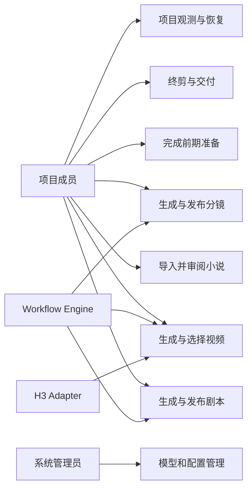

# MJAgent 3.0 用例文档

- 文档编号：MJ3-UC-001
- 版本：0.1.0
- 状态：立项评审稿
- 关联需求：MJ3-SRS-001

## 1. 用例建模约定

每个用例使用稳定编号。`成功保证`表示主流程完成后系统必须成立的事实；异常不得破坏该保证。耗时超过 3 秒或涉及模型/媒体的操作均创建异步 Run，前端通过事件流和查询观察，不用长 HTTP 请求等待。

## 2. 参与者

| 参与者 | 说明 |
|---|---|
| Creator | 编剧、导演、媒体制作等项目成员的统称 |
| Producer | 负责 Production Profile、成本授权和生产推进 |
| Reviewer | 负责剧本、分镜、质量风险和交付门禁 |
| TenantAdmin | 负责成员、租户策略、配额和项目生命周期 |
| PlatformAdmin | 负责平台模型、系统配置、健康和灾备 |
| Operator | 负责队列、供应商和运行故障处理 |
| Text/Image/VLM/Audio Provider | 外部生成或评估服务 |
| H3 Adapter | 黑盒视频生成适配器 |
| Workflow Engine | 持久化编排、计时、重试和人工等待 |

## 3. 总体用例图

## 4. 项目空间与来源用例

### UC-WS-001 创建项目空间

- 参与者：TenantAdmin、Producer
- 前置条件：用户已登录且拥有创建项目权限；租户未超项目/存储配额。
- 触发：用户点击“创建项目空间”。
- 主流程：
  1. 用户填写项目名并选择 Production Profile 模板。
  2. 系统创建上传会话并返回一次性上传凭证。
  3. 用户上传 TXT/EPUB，客户端提交文件哈希。
  4. 系统校验文件、完成上传并生成 `attachment_token`。
  5. 系统展示将创建项目、执行摄入和可能触发后续模型任务的影响。
  6. 用户确认；系统以幂等键创建 Project、SourceDocument、ImportRun。
  7. 导航到来源审阅页，并立即在项目目录中可见。
- 异常/替代：配额不足、文件不合格、上传中断、创建响应丢失；重试必须复用同一导入结果。
- 成功保证：同一 token/幂等键最多创建一个 Project；源文件和摄入报告可追溯。
- 关联需求：FR-WS-001～003、FR-ING-001～004。

### UC-ING-001 摄入 TXT/EPUB

- 参与者：Workflow Engine
- 前置条件：源文件已安全落入隔离区。
- 主流程：识别格式和编码；验证 EPUB 容器与 spine；提取文本；做版式规范化；识别章节；计算稳定 SourceSegment；生成摄入候选和报告。
- 异常：二进制伪装、DRM、外部 URL、Zip Slip、解压异常、控制字符过多、无正文、超限。
- 成功保证：原始文件不可变；任何清洗项有计数；正文不按业务词语删除。

### UC-ING-002 审阅并发布来源权威

- 参与者：编剧/策划、Reviewer
- 前置条件：摄入候选完成。
- 主流程：查看章节、自动切分、重复标题和警告；修正标题/边界但不覆盖原文件；系统生成 SourceRevision；程序检查段落连续和哈希；Reviewer 发布 Source Authority。
- 异常：段落重叠、丢失、引用断裂；系统拒绝发布并定位区间。
- 成功保证：发布证书固定 SourceRevision 和 Segment 哈希。

### UC-ING-003 创建来源修订

- 参与者：编剧/策划
- 前置条件：存在已发布来源。
- 主流程：基于旧版本创建草稿；修改章节边界或正文；运行差异和影响分析；提交审批；发布新 SourceRevision；已有下游按影响分类。
- 成功保证：旧来源和旧交付继续可审计；下游不会被静默覆盖。

## 5. 前期准备用例

### UC-PRE-001 配置 Production Profile

- 参与者：Producer
- 主流程：选择目标平台、画幅、语言、目标集长、质量等级、预算、截止时间、字幕/音频要求和策略；系统校验组合；保存项目版本；后续 Run 冻结快照。
- 异常：超租户额度、模型能力无法满足、配置版本冲突。
- 成功保证：每个有效值能解释来源和版本。

### UC-PRE-002 生成人物与世界观 Bible

- 参与者：编剧/策划、Text Provider、Reviewer
- 前置条件：Source Authority 和 Profile 已发布。
- 主流程：模型提取身份/别名/关系候选；程序绑定来源和稳定 ID；模糊项进入一次 AI 裁决；生成 Bible 候选；程序检查引用、重复身份和来源覆盖；人工编辑；发布 CharacterBible Artifact。
- 异常：证据不足时进入人工，不猜测合并不同实体。
- 成功保证：人物展示名可变，`identity_id`稳定；所有关键事实有 SourceSegment。

### UC-PRE-003 生成场景 Bible 和参考资产

- 参与者：导演/美术、Image Provider、VLM Provider
- 前置条件：Character Bible 已发布；费用报价有效。
- 主流程：生成 Scene Bible；确认场景状态和适用集；生成多视角人物/场景候选；VLM 评估；程序登记 Candidate；人工采用；创建版本化 ReferenceAsset。
- 异常：报价过期、生成失败、评估不可用、候选身份不一致；保留已完成资产并可续跑。
- 成功保证：采用资产与候选、输入和费用均可追溯。

### UC-PRE-004 规划并发布剧集映射

- 参与者：Producer、编剧/策划
- 前置条件：Source Authority 已发布。
- 主流程：选择快速或生产模式；生成 EpisodeSourceMap；程序验证来源覆盖、顺序和重复策略；人工调整 hook/cliffhanger/范围；发布映射。
- 异常：仍有活动下游 Run 时禁止破坏性替换；先展示影响并要求结束或创建新分支。
- 成功保证：每集可定位到精确来源区间；来源范围没有意外遗漏。

## 6. 剧本用例

### UC-SCR-001 生成剧本候选

- 参与者：编剧、Text Provider、Workflow Engine
- 前置条件：EpisodeSourceMap、Bible、Profile 已发布；当前用户有启动权限。
- 主流程：预检并冻结输入；创建 ProductionRun/StageRun；生成叙事蓝图；冻结身份；生成并冻结全局包络；程序规划场次/Sequence/Beat；并行生成场次分片；渐进提交；IR 合并、保真补写和确定性编译。
- 异常：供应商超时按分类恢复；结构错误只修当前分片；输入权威变化则停止发布并等待重新授权。
- 成功保证：任何已通过分片不会因后续失败丢失；候选不是正式剧本。

### UC-SCR-002 验收和局部修复剧本

- 参与者：程序验证器、独立评估模型、编剧
- 主流程：结构/来源/身份/状态/因果/口播门禁；独立叙事审读；Issue 归因；RepairPlanner 选择最小窗口；模型生成 Patch；程序 CAS 应用并全局复验。
- 异常：连续两次无质量增益、问题歧义或预算耗尽时等待人工。
- 成功保证：每个 Patch 有 before/after、Issue、评估和责任人/模型。

### UC-SCR-003 发布剧本

- 参与者：Reviewer
- 前置条件：不可跳过门禁通过；当前候选版本未变化。
- 主流程：Reviewer 查看差异、质量报告和风险；批准；系统在同一事务中发布 Screenplay、S2B、AssetRequirementManifest 和 Certificate；更新只读投影；发出 Outbox 事件。
- 异常：版本冲突、证据过期、上游变化；拒绝并要求刷新。
- 成功保证：四个发布对象引用同一输入 Manifest 和内容哈希。

## 7. 分镜用例

### UC-SBD-001 生成场景导演计划和分镜块

- 参与者：导演/分镜师、Text Provider、Workflow Engine
- 前置条件：正式 S2B 可验证。
- 主流程：程序编译 Narrative Coverage Plan；并行准备资产；按场生成 SceneDirectorPlan；程序验证；生成有界 ScenePack；装配 ShotContract；逐镜/块校验；通过后原子提交并更新 validated prefix。
- 异常：局部块失败只修该块；服务重启从已提交前缀继续。
- 成功保证：正式分镜镜头都能映射到 Beat、来源、义务和状态账本。

### UC-SBD-002 整集验收和冷观众审读

- 参与者：程序验证器、独立审读模型
- 主流程：整集数量、终镜、覆盖、身份、状态、容量、可执行性校验；冷观众从多个先验理解剧情；低置信度问题进入校准；必要时只修影响窗口。
- 成功保证：模型成功不等于分镜发布；审读报告不可伪造为证书。

### UC-SBD-003 确认并发布分镜

- 参与者：Reviewer/导演
- 主流程：人工检查镜头、依赖和风险；批准；系统再次校验并原子发布 Storyboard、B2V、ShotDependencyGraph、Certificate；生产锁定。
- 成功保证：生成台只能消费被确认的 B2V 版本。

## 8. 视频与媒体用例

### UC-VID-001 编译视频执行计划

- 参与者：Producer、Video Plan Compiler
- 前置条件：B2V、DependencyGraph、资产和预算授权有效。
- 主流程：程序匹配 Adapter 能力；构建场景 Anchor Pack；决定依赖、优先级、预演/正式候选数；形成 VideoExecutionPlan；不调用自由关系分析模型。
- 异常：合同冲突时生成诊断，不猜测执行。

### UC-VID-002 执行 FrozenMediaJob

- 参与者：Media Worker、H3 Adapter
- 主流程：准备输入 Bundle；计算幂等键；预留预算；领取租约；提交任务；记录 accepted 状态和 task_id；轮询；下载到暂存区；校验哈希与媒体；登记 Candidate；结算成本。
- 异常：提交响应丢失、轮询超时、Adapter 不可用、下载中断、进程崩溃；恢复时先查询 ProviderOperation。
- 成功保证：相同 operation 不重复计费提交；未完成文件不成为 Artifact。

### UC-VID-003 评估候选并释放依赖

- 参与者：程序验证器、VLM/Audio Evaluator
- 主流程：技术检查；完整片段语义、身份、动作、状态、音频评估；生成 Evaluations；DependencyReleaseGate 根据依赖类型决定 `continuation_source_version`；可同时记录 `coverage_version`。
- 异常：评估不可用时可保留覆盖候选，但不得释放关键真实媒体依赖。

### UC-VID-004 场景级选择最终候选

- 参与者：自动选择器、媒体制作、Reviewer
- 主流程：收集每镜候选；计算内容质量、身份、状态连续、成本和风险；场景级搜索最优组合；关键镜头低置信度时人工选择；写 `final_selected_version`。
- 成功保证：采用依据、替代候选和风险完整记录。

### UC-VID-005 换版与后继重验

- 参与者：媒体制作
- 主流程：选择新候选；系统比较旧/新状态和依赖；直接后继标记 NEEDS_REBIND_CHECK；Impact Analyzer 递归计算；可重绑的只复验，必须重做的创建 RepairPlan。
- 成功保证：任何后继都不会隐藏消费已被替换的媒体版本。

## 9. 回修、交付和反馈用例

### UC-QA-001 提交跨阶段变更申请

- 参与者：任一生产角色
- 主流程：选择 Issue 和目标阶段；系统计算允许修改范围、成本和影响；需要时人工批准；创建目标 Revision；完成后重新校验受影响子图。
- 成功保证：正式上游不被原地覆盖。

### UC-QA-002 自动最小修复

- 参与者：RepairPlanner、程序验证器、模型
- 主流程：根据问题分类和血缘确定起点；估算收益/成本；执行一个结构化 RepairAction；比较前后质量；有效则晋级，无增益则换策略或升级人工。

### UC-FIN-001 生成预览

- 参与者：项目成员
- 前置条件：至少有一个真实可播放镜头。
- 主流程：按当前已选择镜头形成部分时间线；显式标记缺镜、质量风险和水印；生成 Preview Certificate。
- 成功保证：预览不能被 API 或 UI 当作 Deliverable。

### UC-FIN-002 生成并批准商业交付包

- 参与者：终剪程序、Reviewer、Producer
- 前置条件：全部镜头有最终选择；不可跳过门禁通过。
- 主流程：终剪、字幕、音频、响度、导出；整集 QA；构建不可变交付目录与 Manifest；人工审批可接受风险；签发 Delivery Certificate。
- 异常：缺镜、血缘过期、文件错误、来源错位时禁止审批。
- 成功保证：包内文件哈希、Artifact 快照和质量报告一致。

### UC-FIN-003 客户反馈与修订

- 参与者：客户服务、Producer
- 主流程：反馈关联 Delivery Artifact 和时间点/镜头；分类问题；创建 Revision Run；影响分析；重新交付新包；旧包保持不变。

## 10. 观测与系统管理用例

### UC-OBS-001 查看项目生产状态

- 参与者：项目成员、Operator
- 主流程：进入项目观测台；查看 Run/Stage/Attempt、任务、模型调用、Artifact、门禁、成本；从错误追到根因和恢复动作。
- 异常：对象不属于当前项目时统一返回不存在；前端拒绝渲染 scope 不一致响应。

### UC-OBS-002 恢复、取消或重试任务

- 参与者：Producer、Operator
- 主流程：系统显示动作前影响、上游是否已接单和预算状态；用户确认；服务端再次校验范围、状态、版本和幂等；执行动作并记录审计。
- 成功保证：取消不伪造上游退款；重试不重复已接受 operation。

### UC-OBS-003 临时访问原始模型载荷

- 参与者：获授权 Operator
- 主流程：申请短时原始载荷权限并填写排障理由；审批/策略允许；读取指定对象；水印/审计；权限到期。
- 成功保证：密钥永不显示；默认项目成员只看到脱敏内容。

### UC-SYS-001 管理模型 Endpoint 和能力

- 参与者：PlatformAdmin/TenantAdmin
- 主流程：创建 Endpoint；保存 SecretRef；网络安全校验；低成本连通测试；能力探测；Golden Set 验证；激活到指定能力和灰度比例。
- 异常：私有地址只能由已配置私有网络连接器使用，不能从公共探测器直接访问。

### UC-SYS-002 修改并激活配置

- 参与者：PlatformAdmin/TenantAdmin/Producer
- 主流程：创建配置草稿；类型/依赖校验；展示 requested/effective 和影响范围；乐观锁保存；必要审批；原子激活；热更新或标记待重启。
- 成功保证：运行中任务不受影响；失败全部回滚。

### UC-OPS-001 服务重启恢复

- 参与者：Workflow Engine、Operator
- 主流程：选举唯一恢复协调者；扫描活动 Run/Stage/ProviderOperation；过期租约重领；对账供应商；恢复计时器、队列和人工等待；发布恢复报告。
- 成功保证：已发布 Artifact 不回滚；未确认供应商状态不被当作失败重新提交。

### UC-OPS-002 灾难恢复

- 参与者：PlatformAdmin、Operator
- 主流程：选择恢复点；恢复 PostgreSQL、对象存储版本和工作流状态；校验哈希与引用；在隔离环境复验；切换流量；记录演练。
- 成功保证：RPO/RTO 满足合同，恢复后不产生跨租户混淆。

## 11. 通用异常规则

| 异常类型 | 默认动作 |
|---|---|
| 网络/限流 | 有界指数退避、抖动、供应商健康降级 |
| 提交结果不确定 | 进入 RECONCILING，查询原 operation |
| Schema 解析失败 | 结构化修复当前输出，不重跑全部上游 |
| 业务合同失败 | 生成 Issue 和最小 RepairPlan |
| 质量不足 | 候选排序、改变策略/供应商或人工，不伪装成功 |
| 权威版本漂移 | 阻止发布，保留候选，重新授权或新 Run |
| 预算不足 | 暂停新付费操作，可生成明确标记的 Preview |
| 人工等待 | 保持非失败状态，允许超时提醒和转交 |
| 用户取消 | 停止本地调度；记录不可取消的上游操作和预计成本 |

## 12. 用例验收原则

- 每个 P0 用例至少有主流程、幂等、权限、并发、恢复和审计测试。
- 用例中任何“发布、采用、批准、取消、重试、下载原始载荷”动作都必须服务端再校验。
- 用例完成以持久化证据为准，不以页面提示、HTTP 200 或供应商成功为准。
