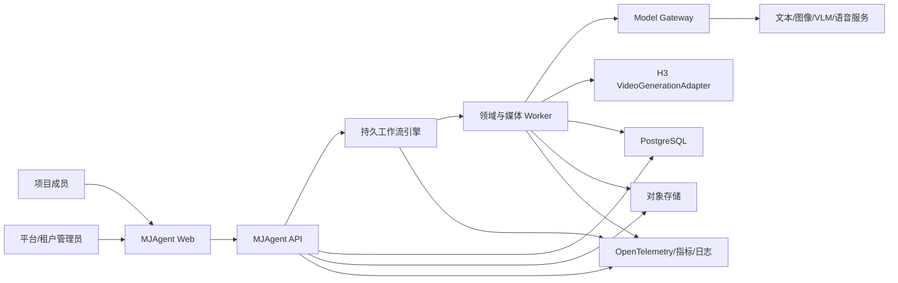
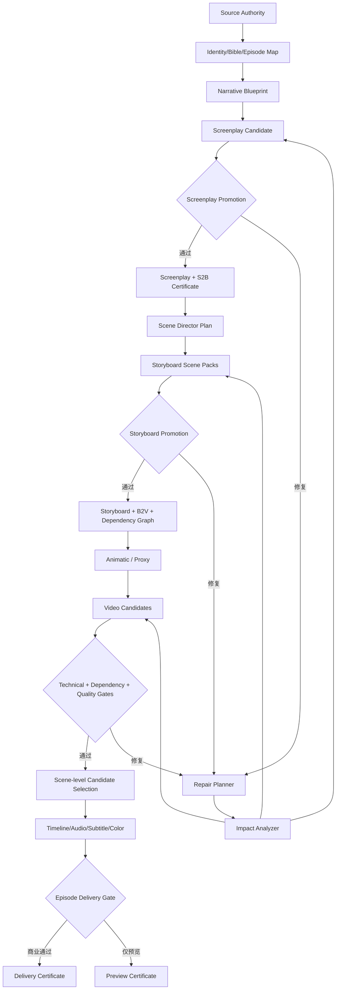
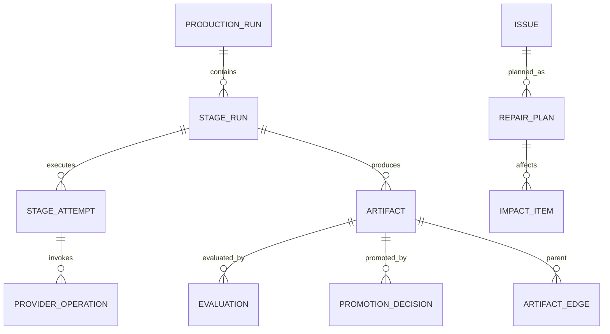
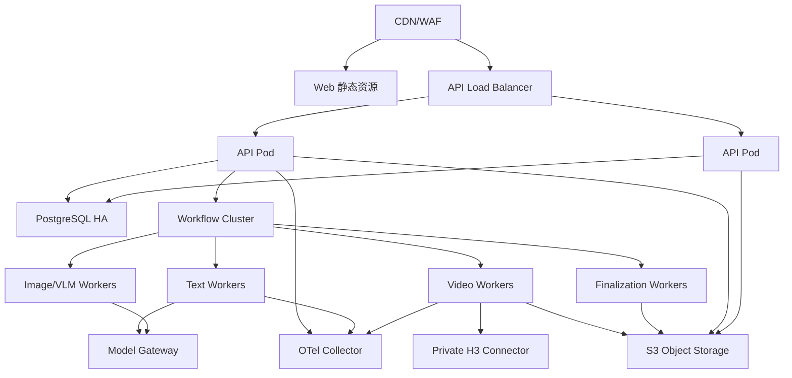

# MJAgent 3.0 架构设计文档

- 文档编号：MJ3-ARCH-001
- 版本：0.1.0
- 状态：立项评审稿
- 关联文档：MJ3-SRS-001、MJ3-DD-001

## 1. 架构目标

MJAgent 3.0 的架构目标是建立一个可商业运营的小说到漫剧生产系统。系统应在模型不稳定、媒体任务昂贵、执行时间长、人工门禁跨天、服务可重启的现实条件下，仍然保证：

- 来源、身份、剧本、分镜、媒体和交付权威不会漂移；
- 已接受的外部付费任务不会因本地超时盲目重复提交；
- 失败可分类、可恢复、可定位到具体 StageAttempt；
- 局部变更只失效真正受影响的下游；
- 预览、质量达标、正式采用和商业交付语义清晰；
- 项目、租户、系统配置和观测数据边界严格；
- 模型、Prompt、合同和质量策略可以灰度升级而不破坏历史证据。

## 2. 约束和架构驱动力

1. 文本/图像/VLM/语音/视频服务都有延迟、限流、异步、偶发错误和能力差异。
2. H3 私有化服务是黑盒，只通过 Adapter 合同交互。
3. 视频任务可能不可取消，创建成功与客户端获知成功不是同一事实。
4. 单集包含几十至上百镜，场景内存在真实媒体依赖，不能全部并发或全部串行。
5. 生成质量无法只依靠程序或单一模型，需要规则、评估模型和人工分层协作。
6. 历史 Artifact 和证书必须在升级后继续可验证。
7. 商业部署需要多租户和权限；私有单节点部署需要使用同一业务语义。

## 3. 系统上下文



## 4. 逻辑分层

### 4.1 体验层

- Workspace Shell：项目目录、切换器、来源与前期准备。
- Episode Production Shell：剧本台、分镜台、生成台、成片台。
- Project Observability Shell：项目内 Run、任务、调用、成本、证据和门禁。
- System Shell：平台健康、模型中心、配置、租户与归属健康。
- UI 只展示服务端范围内的数据，不承担权限和权威判断。

### 4.2 API/BFF 层

- 认证、租户/项目作用域、版本前置条件、幂等和输入 Schema。
- 将用户命令交给应用服务，不复制领域动作。
- 查询使用专用 Projection，避免返回不需要的大字段。
- 异步命令返回 202、Run/Stage 定位和事件订阅地址。

### 4.3 应用与工作流层

- Production Orchestrator：生产图、阶段依赖、预算、截止时间、人工等待。
- Stage Executors：小说摄入、前期、剧本、分镜、视频、终剪。
- Promotion Service：评估证据、门禁、人工决定和证书。
- Repair/Impact Service：问题归因、变更申请和最小失效。
- Config Resolver：四级配置解析和 RunSnapshot。
- Scope Resolver：对象到租户/项目的唯一归属。

### 4.4 领域层

- Source、Identity、Preproduction、Screenplay、Storyboard、Media、Delivery。
- Artifact、Evaluation、Issue、Certificate、Budget 为共享领域能力。
- 领域层不依赖 FastAPI、Temporal、PostgreSQL 或具体模型 SDK。

### 4.5 基础设施层

- PostgreSQL Repository、对象存储、Outbox、事件总线。
- Workflow Engine Adapter、Worker Runtime、Lease/Fencing。
- Model Gateway、H3 Adapter、FFmpeg、ASR、VLM Evaluator。
- OpenTelemetry、Prometheus、日志和审计存储。
- KMS/Secrets Manager、身份提供方和对象签名 URL。

## 5. 统一生产图



生产图是有向无环图。修订不是在原图形成反向边，而是创建新 Revision/Run，并通过 `supersedes` 和 `generated_from` 连接历史版本。

## 6. 权威与编译边界

| 层 | 权威 | 可决定 | 不可决定 |
|---|---|---|---|
| Source | 原始文件和已发布来源修订 | 原文、章节、段落、来源证据 | 改编剧情 |
| Screenplay | Narrative Truth | 人物、事件、因果、对白、观众理解目标 | 景别、运镜、供应商参数 |
| Storyboard | Directorial Truth | 镜头、机位、动作实现、状态、转场、依赖 | 重写剧本事实、H3 接口 |
| Media | Realized Media | 实际像素、声音、观察状态、候选证据 | 静默修改计划状态 |
| Delivery | Published Experience | 最终选择、时间线、字幕、音频、交付风险 | 伪造上游通过 |

跨层只使用版本化编译合同：

```text
Screenplay Artifact --compile--> S2B
Storyboard Artifact --compile--> B2V + ShotDependencyGraph
B2V + AdapterProfile --compile--> VideoExecutionPlan
Video Candidates + Timeline --compile--> DeliveryPackage
```

## 7. 控制面架构

### 7.1 聚合关系



### 7.2 状态分离

- `execution_status`回答“执行器现在在做什么”。
- `quality_status`回答“输出是否满足质量合同”。
- `release_status`回答“输出是否成为下游正式权威”。

Workflow Engine 只驱动执行，不得在 Activity 正常返回时自动假定 Promotion 成功。Promotion 必须读取持久化 Evaluation 和当前输入版本。

### 7.3 一致性策略

- API 接收命令后，在 PostgreSQL 事务内创建 Run/Stage 和 Outbox。
- Dispatcher 消费 Outbox 启动工作流；重复事件通过事件 ID 去重。
- Activity 至少执行一次，业务写入通过幂等键、输入哈希和 fencing token 保护。
- 外部调用先创建 ProviderOperation；操作状态与供应商 task_id 持久化后才释放租约。
- Artifact 文件先进入 staging key，校验后在事务内登记最终 key；孤儿 staging 对象由清理任务回收。
- Projection 是缓存，可从 Artifact/Event 重建；不得反向成为发布依据。

## 8. 模型与媒体架构

### 8.1 Model Gateway

Model Gateway 提供：

- 能力路由：TEXT、STRUCTURED_TEXT、IMAGE、VLM、AUDIO、VIDEO。
- Prompt Registry 和版本快照。
- 供应商健康、限流、熔断、并发和成本策略。
- 请求/响应哈希、脱敏日志、token/费用记账。
- 同一请求的可控缓存；缓存结果仍需过当前合同验证。
- 生成器和评估器角色隔离；关键产物可使用独立评估策略。

模型选择由结构化能力和实时健康决定。身份/来源等业务事实不根据字符串猜测路由。

### 8.2 VideoGenerationAdapter

内部接口保持最小且供应商无关：

```text
validate(FrozenMediaJob) -> ValidationResult
submit(FrozenMediaJob, operation_id) -> SubmitReceipt
get_status(external_task_id) -> ProviderTaskStatus
fetch_result(external_task_id, destination) -> MediaReceipt
cancel(external_task_id) -> CancelResult   # optional capability
```

Adapter 不负责：

- 解释剧本或分镜；
- 选择最终候选；
- 发布 Artifact；
- 决定是否再次付费；
- 修改业务状态账本。

### 8.3 媒体调度

- `ShotDependencyGraph`决定可运行集合。
- 资源调度器同时考虑租户、项目、剧集、供应商、GPU/网络通道和预算。
- 实际媒体依赖只由 `continuation_source_version_id`释放。
- P0 镜头优先并可配置多个候选；P2 镜头默认单候选。
- 低成本预演与正式生成使用不同 StageRun 和 Artifact 类型，防止误用。

## 9. 质量架构

### 9.1 Quality Contract

每个阶段的 QualityContract 定义：维度、适用对象、关键级别、评估器、阈值、是否可人工承担风险、修复策略和证据要求。质量配置版本进入 RunSnapshot。

### 9.2 评估层级

1. 确定性不变量：Schema、ID、来源覆盖、状态、文件、时长、血缘。
2. 模型评估：叙事可理解性、表演、视觉一致、完整片段内容。
3. 程序信号：ASR、口型、响度、相似度、闪烁、跟踪、OCR。
4. 独立裁决：关键对象评估分歧时使用第二评估器或人工。
5. Episode Gate：跨镜连续、节奏、字幕、声音、完整覆盖和交付规格。

### 9.3 质量数据闭环

- Golden Set 保存输入、期望、不良示例和人工标签。
- Prompt/模型/阈值变更先离线评测，再影子运行，再小比例灰度。
- 客户反馈回到具体 Delivery/Shot/Issue，更新评估器校准数据。
- 报表区分首次通过、修复后通过、人工风险接受和最终退回。

## 10. 安全架构

### 10.1 认证与授权

- 支持 OIDC/SAML 或私有化本地 IdP。
- Access Token 短时有效；服务间使用 workload identity。
- 权限决策至少包含 tenant、project、role、action、object state。
- 对象存在但不属于请求范围时返回统一 404，写入安全审计。

### 10.2 数据保护

- S2/S4 内容加密存储；对象使用租户前缀和服务端加密。
- Secret 只保存在 KMS/Secrets Manager，业务库保存 `secret_ref`。
- 原始模型载荷默认不在普通查询返回；短时访问有理由、审批和审计。
- 日志脱敏包括 API Key、Authorization、Token、Prompt/原文策略、本机路径和签名 URL。
- 上传进入隔离区，完成格式和安全检查后才成为 SourceDocument。

### 10.3 网络边界

- 公共模型探测器拒绝内网、环回、链路本地和云元数据地址，并防 DNS 重绑定。
- 私有 H3 由专用 Private Connector 访问，连接目标由管理员预注册，不接受用户任意 URL。
- Worker 采用按能力最小出站网络策略。

## 11. 观测架构

### 11.1 关联标识

```text
request_id
  → trace_id
    → production_run_id
      → stage_run_id
        → attempt_id
          → provider_operation_id
            → external_task_id
```

### 11.2 三种观测面

- 项目生产观测：业务状态、证据、成本、质量和可恢复动作。
- 平台运行观测：服务、队列、数据库、对象存储、供应商和 SLO。
- 安全审计：登录、授权、配置、原始载荷、门禁和高风险动作。

项目观测使用项目路径和服务端 ScopeResolver；系统总览只返回聚合，不返回跨项目原始对象。

### 11.3 存储

- PostgreSQL：可操作的 Run/Stage/Operation/Issue/Audit 元数据。
- OpenTelemetry Collector：Trace/Metric/Log 汇聚。
- Prometheus 或兼容时序库：指标和告警。
- 日志存储：脱敏应用日志，按租户/服务标签和保留期。
- 原始供应商载荷：加密对象存储，短保留期，数据库保存引用。

## 12. 部署架构

### 12.1 商业标准部署



- API 无状态，可水平扩展。
- Worker 按通道单独扩缩容，视频提交、轮询、下载和 Finalize 可分队列。
- PostgreSQL 使用 HA、PITR；Workflow 存储与业务库可独立。
- 对象存储启用版本、生命周期和跨区复制（按合同）。

### 12.2 私有单节点部署

使用 Docker Compose 或单节点 Kubernetes，仍包含 PostgreSQL、S3 兼容对象存储、Workflow Engine、API 和 Worker。允许缩减副本，不允许改成另一套状态语义。SQLite 只用于开发测试和 2.0 数据导入工具。

## 13. 可用性、容量与灾备

- 服务级超时小于阶段级超时；视频轮询使用持久计时器，不占 Worker 线程睡眠。
- 供应商熔断按能力和租户隔离，避免一个模型拖垮全部链路。
- 背压顺序：停止新预演→限制非关键候选→暂停新视频提交→保留轮询/下载/Finalize 通道。
- 预算预留必须在付费提交之前原子完成。
- 建议生产 RPO ≤5 分钟、RTO ≤60 分钟；关键客户可配置更高等级。
- 每季度执行数据库、对象、工作流三者一致恢复演练。

## 14. 关键架构决策（ADR 摘要）

| ADR | 决策 | 理由 |
|---|---|---|
| ADR-001 | PostgreSQL + 对象存储作为商业真相 | 支持并发、事务、PITR、容量和租户隔离 |
| ADR-002 | 持久工作流引擎编排长任务 | 支持重启、计时器、人工等待和有界重试 |
| ADR-003 | Artifact/Evaluation/Promotion 分离 | 防止模型成功或任务完成被误当作发布 |
| ADR-004 | S2B/B2V 是正式跨域合同 | 消除重复理解和权威漂移 |
| ADR-005 | H3 使用最小黑盒 Adapter | 隔离供应商变化，不假设模型内部能力 |
| ADR-006 | 三种视频选择语义 | 防止低质量覆盖候选污染后继和最终交付 |
| ADR-007 | Preview 与 Deliverable 分离 | 在保证可看进度的同时保持商业门禁 |
| ADR-008 | 配置四级解析、Run 冻结快照 | 避免全局设置变更污染运行中任务 |
| ADR-009 | 项目观测与系统空间分离 | 防串项目、最小权限、清晰操作语义 |
| ADR-010 | 影响分析替代全量清理 | 降低成本并保留可复用生产资产 |

## 15. 从 2.0 迁移

1. 先引入 3.0 Artifact/StageRun/Promotion 表，2.0 Supervisor 继续作为执行器并双写。
2. 使用影子 Projection 比较 2.0 UI 状态与 3.0 权威状态，不立即切写路径。
3. 新项目优先使用 Source Authority 和 Production Profile；历史项目生成显式 Migration Artifact。
4. 剧本发布增加 S2B；分镜发布增加 B2V 和依赖图。缺合同的历史版本走兼容编译器并标记来源。
5. 视频先拆分三种选择语义和 Dependency Gate，再引入预演与场景选优。
6. 将交付阻断条件迁入 DeliveryContract；部分拼接保留为 Preview。
7. 观测和系统设置先建立新 API façade，再逐步拆分前端大页面。
8. 完成影子数据一致性、Golden Set、恢复和安全验收后切换默认路径。

任何迁移都不得重算历史证书哈希、覆盖旧 Artifact 或让旧 Worker 获得新发布权。
