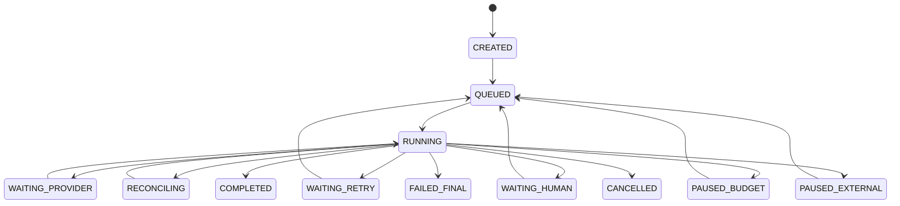

# MJAgent 3.0 详细设计文档

- 文档编号：MJ3-DET-001
- 版本：0.1.0
- 状态：立项评审稿
- 关联文档：MJ3-ARCH-001、MJ3-DD-001

## 1. 代码组织建议

```text
mjagent3/
├── domain/
│   ├── source/ identity/ preproduction/
│   ├── screenplay/ storyboard/ media/ delivery/
│   └── shared/          # artifact, evaluation, issue, money, ids
├── application/
│   ├── commands/ queries/
│   ├── workflows/       # durable workflow definitions
│   ├── promotion/
│   ├── repair/
│   ├── impact/
│   └── policy/
├── infrastructure/
│   ├── persistence/ object_store/ outbox/
│   ├── workflow_runtime/ observability/ security/
│   └── model_gateway/
├── adapters/
│   ├── text/ image/ vlm/ audio/
│   └── video/h3_private/
├── api/
│   ├── v3/ auth/ middleware/ schemas/
│   └── projections/
├── workers/
│   ├── text/ media_submit/ media_poll/ download/ finalize/
│   └── evaluation/ delivery/
└── frontend/
    ├── app/ workspaces/ preproduction/
    ├── screenplay/ storyboard/ generation/ delivery/
    ├── observability/ system/
    └── shared/
```

领域层只定义规则和类型；应用层编排用例；基础设施层实现端口；API 和 Worker 不直接写领域表。

## 2. 通用对象和服务接口

### 2.1 ArtifactService

职责：创建不可变 Artifact、计算规范哈希、登记父血缘、提交文件、标记 superseded/stale、验证历史 Schema。

关键接口：

```python
create_candidate(spec, content, parent_ids, attempt_id) -> Artifact
attach_file(artifact_id, staged_object, checksum) -> Artifact
mark_stale(artifact_ids, reason, impact_run_id)
verify(artifact_id, expected_schema_version=None) -> VerificationResult
lineage(artifact_id, direction, depth) -> ArtifactGraph
```

创建 Candidate 与 Promotion 分开；`create_candidate`永不返回 PUBLISHED。

### 2.2 PromotionService

```python
evaluate_gate(artifact_id, gate_key, quality_contract_id) -> GateAssessment
promote(command: PromotionCommand) -> PromotionDecision
publish_bundle(bundle_spec, evidence_ids, fence_token) -> Certificate
```

`publish_bundle`在一个数据库事务中验证：输入版本、fence token、Evaluation、Issue、人工决定、Artifact 哈希和唯一发布约束。

### 2.3 StageRuntime

```python
ensure_stage(stage_key, input_manifest, contract_version, policy_snapshot) -> StageRun
start_attempt(stage_run_id, lease_owner) -> StageAttempt
checkpoint(attempt_id, key, sequence_no, payload_hash, payload)
complete_attempt(attempt_id, outputs)
fail_attempt(attempt_id, failure_class, retry_hint, error_ref)
```

StageRun 的自然幂等键：

```text
(tenant_id, scope_type, scope_id, stage_key,
 input_manifest_hash, contract_version, policy_snapshot_hash)
```

## 3. 小说摄入详细设计

### 3.1 上传状态机

```text
CREATED → UPLOADING → UPLOADED → QUARANTINED
→ VALIDATED → INGESTING → NEEDS_REVIEW/PUBLISHED
                     ↘ REJECTED
```

- 上传会话声明文件名、MIME、预计大小和 SHA-256。
- 大文件使用分片上传；complete 时校验最终大小和哈希。
- `attachment_token`短时、一次性绑定 tenant/user/file hash，不暴露存储路径。
- 导入幂等记录以 `(tenant_id, attachment_token_hash, command_name)`唯一。

### 3.2 TXT 处理

1. BOM 优先；否则尝试 UTF-8、GB18030、Big5，并记录识别方式。
2. 拒绝 NUL 和异常控制字符比例。
3. 统一换行、Unicode 规范化和纯分隔符；不按词语内容删除。
4. 标题识别产生候选边界；对缺标题文本生成固定大小候选块，但标记 `NEEDS_REVIEW`。
5. 相邻重复标题只在标题身份一致、一侧极短且内容差异足够大时合并候选；保留移除证据。

### 3.3 EPUB 处理

- ZIP 成员数量、单项大小、总解压大小和压缩比限制。
- 规范化内部路径，拒绝绝对路径、`..`、重复成员和加密/DRM。
- 只按 OPF spine 顺序读取本地 HTML 文档；拒绝外部 URL。
- 去除 script/style/nav 等非正文节点；保留标题、段落和换行语义。
- 原 EPUB 保留不变，提取文本成为 SourceRevision Candidate。

### 3.4 来源发布

程序检查：Segment 顺序、偏移、哈希、标题重复、空洞和引用稳定性。自动切分存在时必须有人工决定。发布后生成 `source-authority.v1` Certificate。

## 4. 前期准备详细设计

### 4.1 Identity Resolver

输入：SourceSegments、模型身份候选、现有 IdentityRegistry。

处理顺序：

1. 精确 `identity_id` 或已发布 alias 直接绑定。
2. 依据来源位置、关系和实体证据做结构化匹配。
3. 多个候选都满足时调用一次 AI Adjudicator，输出候选 ID、证据 ID、理由和置信度。
4. 证据不足时返回 `INSUFFICIENT_EVIDENCE`，进入人工，不自动合并。

不得使用角色称谓字符串集合推断身份权威。

### 4.2 Bible Workflow

```text
Freeze Source/Profile
→ Extract Identity Candidates
→ Resolve Identity
→ Generate Character/World Candidate
→ Deterministic Validation
→ Narrative/Style Evaluation
→ Human Edit
→ Publish Bible + Registry Hash
```

场景 Bible 独立 Stage，消费已发布 CharacterBible；场景图生成与 SceneBible 发布解耦，避免图片供应商失败阻止文本权威发布。

### 4.3 费用报价

报价字段：`quote_id, scope_fingerprint, item_count, unit_price, currency, estimated_total, expires_at, policy_version`。任务启动事务验证报价未使用、未过期、输入指纹一致和预算可用，并把 `quote_id`绑定 Run。

### 4.4 Episode Mapping

快速模式程序一章一集；生产模式允许多个 SourceBinding：

```yaml
episode_id: EP003
bindings:
  - segment_id: CH005
    start_offset: 120
    end_offset: 3820
    use: primary
  - segment_id: CH006
    start_offset: 0
    end_offset: 860
    use: cliffhanger
```

Coverage Validator 建立每个来源区间的使用计数。未说明的 gap/overlap 阻断；明确 `intentional_reuse` 才允许钩子回顾。

## 5. 统一生产状态机

### 5.1 执行状态机



`COMPLETED`只表示执行器完成，不自动改变 quality/release。

### 5.2 晋级状态机

```text
UNASSESSED → EVALUATING → PASSED → PROMOTED → PUBLISHED
                     ↘ NEEDS_REPAIR → EVALUATING
                     ↘ WAITING_HUMAN → PASSED/REJECTED
```

Terminal Run 只有在所有必须 Stage 已执行终止、Promotion 决议完成后才写最终业务 Outcome。

### 5.3 所有权与围栏

- `production_runs.active_fence_token`每次接管递增。
- Attempt 创建时复制 token；Checkpoint 可用 attempt token 写入。
- Artifact 发布和 Projection 更新必须验证 token 仍等于 Run 当前 token。
- 仅 lease owner 可续租或释放 Attempt；租约过期不等于外部任务未接单。

## 6. 剧本 Workflow 详细设计

### 6.1 Stage DAG

```text
screenplay.preflight
→ screenplay.blueprint_shards
→ screenplay.blueprint_merge_review
→ screenplay.identity_freeze
→ screenplay.envelope
→ screenplay.scene_plan
→ screenplay.scene_shards[*]
→ screenplay.ir_merge
→ screenplay.fidelity_complete
→ screenplay.deterministic_validate
→ screenplay.independent_review
→ screenplay.repair[*]
→ screenplay.publish_bundle
```

`scene_shards[*]`仅在 envelope Artifact 发布为内部冻结版本后启动。每个 shard 输入包含 envelope hash、scene/sequence/beat plan 和上下文边界。

### 6.2 渐进提交

- 每个 scene shard 成功后创建 Candidate Artifact 和 Checkpoint。
- Merge 读取精确 shard ID 集，不读取“最新”可变数据。
- 失败恢复只补缺 shard；输入哈希不变时复用已完成 shard。
- IR 编译为程序步骤；模型不得直接写 EpisodeScreenplay Projection。

### 6.3 S2B 编译器

编译器从正式 Screenplay IR 提取 Scene/Sequence/Beat、事件、动作、对话、来源、状态和观众知识，生成规范 S2B。编译失败代表剧本合同不完整，不能用自由模型补写 S2B；应返回剧本 Repair Issue。

## 7. 分镜 Workflow 详细设计

### 7.1 SceneDirectorPlan

每场输入包含 S2B scene、空间拓扑、状态、可用资产和前后场边界。模型输出导演逻辑，程序验证 Beat 顺序、镜头预算、轴线和入/出场状态。

### 7.2 ScenePack

- 默认每包不超过 8 镜；超大场景按 Beat 边界拆包。
- 模型输出 Draft；程序补齐稳定 shot_id、引用、容量预算和依赖字段。
- 逐镜验证通过后，在一个事务中写 ScenePack Artifact、Shot Projection、Checkpoint 和 Outbox。
- 后续失败保留已验证前缀，不写半包。

### 7.3 ShotDependencyGraph 编译

对相邻或跨镜依赖生成边：

```yaml
from_shot_id: SH022
to_shot_id: SH023
dependency_type: REALIZED_FRAME_REQUIRED
required_state_fact_ids: [FACT-18, FACT-19]
fallback_strategy: REANCHOR_FROM_SCENE_PACK
```

依赖类型来自正式转场/状态语义。模型可提出建议，但程序根据合同编译并校验无环、引用合法和 fallback 可用性。

### 7.4 B2V 编译器

B2V 只包含模型/供应商无关的导演合同。任何 H3 参数在 VideoExecutionPlan 编译时加入，不能反向写入 B2V。

## 8. 视频 Workflow 详细设计

### 8.1 计划编译

```python
def compile_video_plan(b2v, dependency_graph, assets, adapter_profile, quality_contract):
    verify_hashes_and_authority()
    for scene in topological_scenes():
        anchor_pack = resolve_scene_anchor_pack(scene, assets)
        for shot in scene.shots:
            mode = adapter_profile.compile_input_mode(shot, anchor_pack)
            attempts = quality_contract.candidate_budget(shot.criticality)
            yield ShotExecutionSpec(shot, mode, attempts, dependencies(shot))
```

AdapterProfile 只能在声明能力内编译；合同无法满足时返回 `CAPABILITY_MISMATCH`。

### 8.2 ProviderOperation 生命周期

```text
NOT_STARTED
→ SUBMITTING
→ ACCEPTED(task_id) → POLLING → RESULT_READY → FETCHED
         ↘ REJECTED
SUBMITTING/timeout → UNKNOWN → RECONCILING → ACCEPTED/NOT_FOUND/MANUAL
```

只有确认 `NOT_FOUND` 且策略允许时，才能以新 operation 重提。若供应商不支持幂等/查询，应把 UNKNOWN 升级人工或等待更长对账窗口。

### 8.3 下载与 Finalize

1. 下载到随机 staging object/file。
2. 限制 Content-Length、流式字节数和超时。
3. 校验 MIME、容器签名、ffprobe、时长、分辨率、帧率、音轨。
4. 计算 SHA-256；使用内容寻址或不可变 object key。
5. 创建 VideoCandidate Artifact；提交后删除 staging。
6. 失败文件保留短期隔离证据，不进入候选池。

### 8.4 DependencyReleaseGate

输入：候选技术证据、结构化 VLM/程序评估、B2V ShotContract、依赖边、实际 state_out。

规则：

- 技术失败：拒绝。
- `whole_clip_usable=false`或关键状态未实现：拒绝。
- REALIZED_FRAME_REQUIRED：必须验证身份、场景、关键道具和 required state facts。
- STATE_DEPENDENCY：可用场景锚点重新生成，但必须传递结构化状态。
- SOFT_VISUAL_DEPENDENCY：风险进入排序，不必串行阻断。
- 评估不可用：P0/真实媒体依赖等待复验；普通覆盖候选可登记但不释放。

### 8.5 三种选择

- CoverageSelector：在技术有效候选中选覆盖证据，不代表质量达标。
- ContinuationSelector：只选通过 DependencyReleaseGate 的候选。
- FinalSelector：场景级最优路径或人工决定。

每次选择使用独立 `media_selections`记录：selection_type、candidate_id、decision_id、evidence_set_hash、版本和是否当前。

连续性来源换版时，不直接改写已冻结的 `FrozenMediaJob`。系统把消费旧版本的活动绑定置为 `NEEDS_REBIND_CHECK`，由 Impact Analyzer 判断：语义和实际帧哈希仍满足时创建新绑定并复验；只需换绑时标记 `REUSABLE_WITH_REBIND`；证据不足时保持 `STALE`；合同不满足时为 `INVALID` 并创建新的媒体任务。

### 8.6 场景级候选搜索

候选节点为每镜视频版本，边分数表示相邻连续性。推荐小规模动态规划：

```text
utility(candidate) = content + identity + action + audio - quality_risk - normalized_cost
edge(candidate_i, candidate_j) = state_match + visual_continuity - drift_risk
```

只使用版本化评估特征；权重来自 QualityContract。P0 场景或分数接近时输出 Top-K 给人工，不让算法隐藏不确定性。

## 9. 完整片段 QA

### 9.1 技术 QA

文件存在、大小、容器、可解码、持续时间、分辨率、比例、帧率、音轨、编码规格、黑帧/静音比例。

### 9.2 视觉与时序 QA

- 完整片段可用性、动作起势/过程/收势。
- 角色身份、数量、服装和重要道具。
- 闪烁、形变、重复主体、画面文字/OCR。
- 相机运动和构图是否实现 B2V。
- 计划 state_in/state_out 与实际证据。

### 9.3 音频 QA

- ASR 与 dialogue/narration 对齐。
- 说话人、画内/画外、口型同步。
- 响度、削波、静音、噪声和语言。

模型评估输出时间区间和证据帧，不接受只有自由文本总评的结果作为商业门禁。

## 10. Repair 与 Impact 详细设计

### 10.1 Failure Classifier

先分类 TRANSPORT、PROVIDER_STATE_UNKNOWN、SCHEMA、CONTRACT、QUALITY、AUTHORITY_DRIFT、BUDGET、AUTHORIZATION。外层错误只保存包装关系，根因使用 `cause_error_id`链接。

### 10.2 RepairPlanner

```python
def plan(issue, lineage, quality_contract, budget):
    origin = deterministic_origin(issue, lineage)
    if origin.ambiguous:
        origin = ai_adjudicate(issue, bounded_evidence=lineage.relevant_slice())
    actions = repair_catalog.for_origin(origin)
    actions = [a for a in actions if a.allowed_by_contract and a.cost <= budget]
    return maximize_expected_gain(actions)
```

RepairAction 是类型化命令，如 PATCH_SCENE_SHARD、REGENERATE_SHOT、SWITCH_PROVIDER、REANCHOR_INPUT、SPLIT_SHOT、REQUEST_UPSTREAM_CHANGE；不接受任意代码或任意字段修改。

### 10.3 Impact Analyzer

1. 从 changed Artifact 沿类型化 ArtifactEdge 和 DependencyEdge 遍历。
2. 对每个后继运行兼容性函数，而非统一标记 stale。
3. 内容哈希相同则 VALID；只版本绑定变化则 REUSABLE_WITH_REBIND。
4. 合同义务或状态改变则 STALE/INVALID。
5. 生成 ImpactReport，人工批准后批量 CAS 应用状态。

影响分析必须可重复；相同输入图和策略得到相同结果。

## 11. 终剪与交付详细设计

### 11.1 Timeline 编译

- 输入只使用 `FINAL`媒体选择和正式 Audio/Subtitle Artifact。
- 根据镜头时长、转场和音频对齐生成 Timeline Artifact。
- FFmpeg 使用固定版本和命令 Manifest；输出 report 包含每段实测时长和 fallback。
- 缺镜时只允许生成 Preview Timeline，自动水印并标记 partial。

### 11.2 Delivery Gate

不可跳过检查：正式上游证书、全部镜头、非 stale 选择、文件校验、时间线、字幕/音频硬合同、租户合规策略、Manifest/文件哈希。

业务风险检查：轻微连续性、风格偏差、非关键镜头优化分。授权 Reviewer 可写 `approve_with_risk`，但不改变原 Evaluation。

### 11.3 打包事务

1. 冻结 DeliverySnapshot。
2. 复制/引用不可变对象到 staging package。
3. 生成 Manifest、Quality Report、Known Risks、Reproducibility。
4. 校验每个文件大小和哈希，创建 archive。
5. 创建 DeliveryPackage Artifact 和 file evaluation。
6. 人工批准后签发 Certificate，原子更新当前交付指针。
7. staging 失败不留下“已交付”数据库记录。

## 12. 配置与模型中心详细设计

### 12.1 配置解析

```text
PlatformDefault
  merge TenantPolicy
    merge ProjectProductionProfile
      validate stage contract
        freeze RunPolicySnapshot
```

每个有效值保存 `source_scope/source_version`。项目不能覆盖平台标记为 locked 的安全设置；Tenant 可以限制项目最大值。

### 12.2 配置变更

- Draft 与 Active 分离。
- 保存携带 `expected_version`；冲突返回当前版本和规范化 Diff。
- 激活事务写 ConfigVersion 和 Outbox。
- 热更新失败回滚激活指针；重启项同时保留 requested/effective。
- 模型分配变更只影响 queued-not-started 或新 Run；已创建 Run 使用 Snapshot。

### 12.3 Model Endpoint

Endpoint、Credential、Capability、Model、Assignment 分离。连通测试不把 API Key 写入日志；私有 Endpoint 通过管理员创建的 NetworkConnector 访问。能力探测结果有过期时间，实际任务仍在提交前校验输入合同。

## 13. 作用域与观测详细设计

### 13.1 ScopeResolver

解析来源：对象直接 project_id、episode/shot 关系、run scope、step→run、artifact scope、operation→attempt。若多个权威来源冲突，返回 `CONFLICT`并隔离，不能按优先级任取一个。

### 13.2 Project Observability API

所有查询先解析 scope，再过滤、聚合和分页；详情和动作再次验证。响应回显 `scope`，前端发现路由不一致时丢弃响应并上报。

### 13.3 载荷分级

- 列表：不返回 request/response/prompt。
- 普通详情：返回脱敏摘要、哈希、大小和证据引用。
- Restricted Access：短时 token 读取指定原始对象；仍永不返回密钥。
- 下载生成审计事件，包含理由、对象、操作者和结果。

## 14. 前端详细设计

路由采用判别联合：

```ts
type AppRoute =
  | { scope: 'workspace'; page: 'list' | 'new' }
  | { scope: 'project'; tenantId: string; projectId: string; page: ProjectPage; episodeId?: string }
  | { scope: 'system'; page: 'overview' | 'models' | 'settings' | 'tenants' };
```

- ProjectShell/SystemShell 分离。
- 切项目以 `projectId`作为 React 边界 key，取消旧 AbortController。
- URL 保存对象 ID 和非敏感筛选，不保存 Prompt、错误全文或请求体。
- 长任务由 SSE 更新，断线使用 `Last-Event-ID`恢复；查询接口用于最终对账。
- 未保存草稿在项目切换、路由切换、刷新和关闭时统一保护。

## 15. 关键并发与事务场景

| 场景 | 保护 |
|---|---|
| 用户重复点击开始 | Idempotency-Key + StageRun 唯一约束 |
| 两个 Worker 完成同一 Attempt | lease owner + fence token + CAS |
| 旧剧本 Worker 晚到 | Run fence + expected input manifest |
| 人工重复批准 | artifact version + gate idempotency unique |
| 视频提交响应丢失 | ProviderOperation UNKNOWN → reconcile |
| 换版与后继生成并发 | selection revision + dependency input hash |
| 配置同时编辑 | ConfigVersion optimistic lock |
| 项目删除与任务运行 | deleting 状态、停止新任务、等待/隔离外部 operation |
| 打包文件成功但 DB 失败 | staging 对象 + 可重复 operation id |
| DB 成功但事件未发 | transactional outbox |

## 16. 兼容与降级

- 历史无 S2B/B2V 的 Artifact 使用版本化 LegacyCompiler，输出 `origin=legacy_compiled`，必须过当前验证。
- 无完整视频 QA 时可登记 Coverage，但关键依赖不释放、商业交付不通过。
- 观测事件推送不可用时回退有节制的轮询，不改变业务状态。
- 供应商不可用时可切换兼容 Adapter，但必须创建新 Attempt/Operation 并保留旧证据。
- 任何降级都必须显式写入 Artifact/Evaluation/Report，不能静默。
