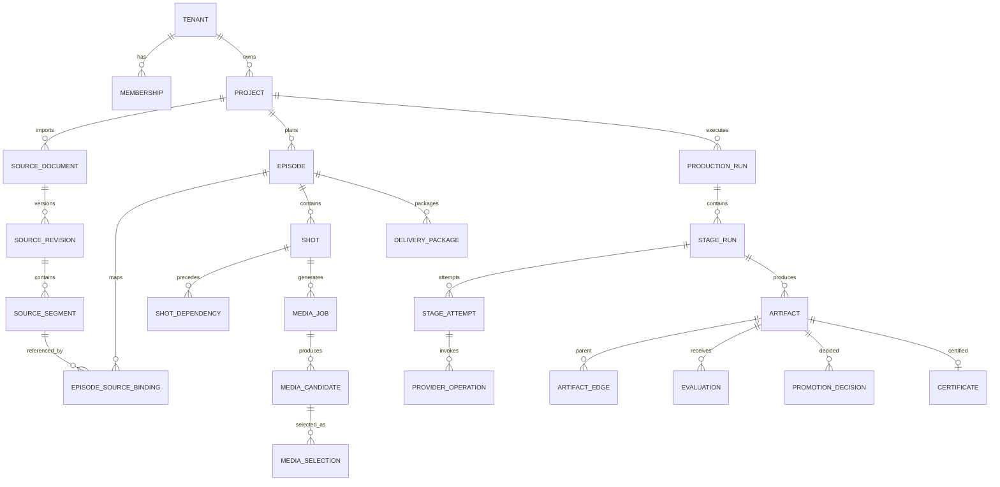

# MJAgent 3.0 数据库设计文档

- 文档编号：MJ3-DB-001
- 版本：0.1.0
- 状态：立项评审稿
- 数据库：PostgreSQL 16+
- 对象存储：S3 Compatible

## 1. 设计目标

- 支持多租户、项目隔离、并发写入、长任务恢复和完整审计。
- 业务元数据、不可变 Artifact、媒体对象和高容量观测数据分层保存。
- 通过唯一约束、外键、检查约束和事务保证核心不变量。
- 支持在线扩展、PITR、分区、归档和非破坏性迁移。
- 历史证书和 Artifact 规范哈希不因应用升级漂移。

SQLite 仅用于本地开发、自动测试和 MJAgent2 数据导入工具，不作为商业生产数据库。

## 2. 数据分层

| 层 | 存储 | 内容 |
|---|---|---|
| 事务业务层 | PostgreSQL | Tenant、Project、Run、Artifact、Gate、预算、配置、审计索引 |
| 大对象层 | S3/MinIO | 原始小说、图片、视频、音频、交付包、加密原始模型载荷 |
| 工作流层 | Workflow Engine Store | Workflow history、durable timer、Activity 状态 |
| 指标/追踪层 | OTel + 时序/日志存储 | Metric、Trace、脱敏日志 |
| 分析层（可选） | Warehouse/ClickHouse | 长周期成本、质量和运营分析 |

数据库只保存 object key、hash、size、media type 和 encryption metadata，不保存视频二进制。

## 3. Schema 划分

| Schema | 表 |
|---|---|
| `iam` | tenants、users、memberships、project_roles |
| `source` | projects、source_documents、source_revisions、source_segments、import_receipts、production_profiles、episodes、episode_source_bindings |
| `production` | production_runs、stage_runs、stage_attempts、checkpoints、provider_operations、outbox_events |
| `evidence` | artifacts、artifact_edges、evaluations、issues、promotion_decisions、certificates |
| `content` | identity_entities、identity_aliases、world_state_facts、audience_knowledge_items、shots、shot_dependencies |
| `media` | media_jobs、media_candidates、media_selections、asset_bindings、delivery_packages |
| `finance` | budget_reservations、cost_ledger_entries |
| `config` | config_definitions、config_versions、config_values、policy_snapshots、model_endpoints、model_capabilities、model_assignments |
| `audit` | audit_events、restricted_access_grants、scope_conflicts |

## 4. 逻辑关系



## 5. 核心表设计

### 5.1 Tenant/Project/Source

```sql
create table iam.tenants (
  id uuid primary key,
  name text not null,
  status text not null check (status in ('active','suspended','deleting','deleted')),
  plan_code text not null,
  created_at timestamptz not null default now()
);

create table source.projects (
  id uuid primary key,
  tenant_id uuid not null references iam.tenants(id),
  name text not null check (char_length(name) between 1 and 120),
  status text not null,
  current_source_revision_id uuid,
  current_profile_id uuid,
  created_by uuid not null,
  created_at timestamptz not null default now(),
  archived_at timestamptz,
  deleted_at timestamptz
);
create index projects_tenant_created_idx
  on source.projects(tenant_id, created_at desc) where deleted_at is null;
```

```sql
create table source.source_documents (
  id uuid primary key,
  tenant_id uuid not null,
  project_id uuid not null references source.projects(id) on delete cascade,
  object_key text not null,
  file_name text not null,
  media_type text not null,
  size_bytes bigint not null check (size_bytes > 0),
  sha256 char(64) not null,
  status text not null,
  created_by uuid not null,
  created_at timestamptz not null default now(),
  unique (tenant_id, project_id, sha256)
);

create table source.source_revisions (
  id uuid primary key,
  tenant_id uuid not null,
  project_id uuid not null references source.projects(id),
  source_document_id uuid not null references source.source_documents(id),
  revision_no integer not null check (revision_no > 0),
  status text not null,
  normalization_report jsonb not null default '{}',
  content_hash char(64) not null,
  certificate_id uuid,
  created_by uuid not null,
  created_at timestamptz not null default now(),
  unique (project_id, revision_no),
  unique (project_id, content_hash)
);

create table source.source_segments (
  id uuid primary key,
  source_revision_id uuid not null references source.source_revisions(id) on delete cascade,
  ordinal integer not null,
  segment_type text not null,
  title text,
  content text not null,
  start_offset integer not null check (start_offset >= 0),
  end_offset integer not null check (end_offset > start_offset),
  content_hash char(64) not null,
  confidence numeric(5,4),
  review_status text not null,
  unique (source_revision_id, ordinal),
  unique (source_revision_id, start_offset, end_offset)
);
```

SourceSegment 内容很大时可拆到对象存储，但数据库必须保留可全文检索的受控投影或专用搜索索引。

### 5.2 ProductionRun/StageRun

```sql
create table production.production_runs (
  id uuid primary key,
  tenant_id uuid not null,
  project_id uuid not null,
  run_type text not null,
  scope_type text not null,
  scope_id uuid not null,
  input_manifest_hash char(64) not null,
  policy_snapshot_id uuid not null,
  execution_status text not null,
  quality_status text not null,
  release_status text not null,
  active_fence_token bigint not null default 1,
  budget_limit_minor bigint,
  spent_minor bigint not null default 0,
  currency char(3) not null default 'CNY',
  deadline_at timestamptz,
  requested_by uuid not null,
  parent_run_id uuid references production.production_runs(id),
  created_at timestamptz not null default now(),
  updated_at timestamptz not null default now(),
  finished_at timestamptz
);
create index production_runs_project_status_idx
  on production.production_runs(tenant_id, project_id, execution_status, updated_at desc);
```

```sql
create table production.stage_runs (
  id uuid primary key,
  tenant_id uuid not null,
  project_id uuid not null,
  production_run_id uuid not null references production.production_runs(id),
  stage_key text not null,
  scope_type text not null,
  scope_id uuid not null,
  input_manifest_hash char(64) not null,
  contract_version text not null,
  policy_snapshot_hash char(64) not null,
  execution_status text not null,
  quality_status text not null,
  promotion_status text not null,
  current_attempt_no integer not null default 0,
  created_at timestamptz not null default now(),
  updated_at timestamptz not null default now(),
  unique (tenant_id, scope_type, scope_id, stage_key,
          input_manifest_hash, contract_version, policy_snapshot_hash)
);

create table production.stage_attempts (
  id uuid primary key,
  stage_run_id uuid not null references production.stage_runs(id),
  attempt_no integer not null,
  lease_owner text,
  lease_expires_at timestamptz,
  fence_token bigint not null,
  status text not null,
  failure_class text,
  error_ref uuid,
  started_at timestamptz,
  finished_at timestamptz,
  unique (stage_run_id, attempt_no)
);
create index stage_attempt_lease_idx
  on production.stage_attempts(status, lease_expires_at)
  where status in ('RUNNING','WAITING_PROVIDER','RECONCILING');
```

### 5.3 ProviderOperation

```sql
create table production.provider_operations (
  id uuid primary key,
  tenant_id uuid not null,
  project_id uuid not null,
  attempt_id uuid not null references production.stage_attempts(id),
  operation_kind text not null,
  provider text not null,
  endpoint_id uuid,
  model_id text,
  request_hash char(64) not null,
  idempotency_key text not null,
  external_task_id text,
  create_state text not null,
  charge_state text not null,
  submitted_at timestamptz,
  last_polled_at timestamptz,
  completed_at timestamptz,
  response_ref text,
  estimated_cost_minor bigint,
  actual_cost_minor bigint,
  created_at timestamptz not null default now(),
  unique (tenant_id, provider, operation_kind, idempotency_key)
);
create unique index provider_external_task_unique
  on production.provider_operations(provider, external_task_id)
  where external_task_id is not null;
create index provider_reconcile_idx
  on production.provider_operations(create_state, last_polled_at)
  where create_state in ('SUBMITTING','UNKNOWN','ACCEPTED');
```

### 5.4 Artifact/Evaluation/Promotion

```sql
create table evidence.artifacts (
  id uuid primary key,
  tenant_id uuid not null,
  project_id uuid not null,
  scope_type text not null,
  scope_id uuid not null,
  artifact_type text not null,
  version integer not null check (version > 0),
  status text not null,
  trust_level smallint not null check (trust_level between 0 and 5),
  schema_version text not null,
  contract_version text,
  content jsonb,
  object_key text,
  content_hash char(64) not null,
  created_by_attempt_id uuid references production.stage_attempts(id),
  created_at timestamptz not null default now(),
  published_at timestamptz,
  superseded_by uuid references evidence.artifacts(id),
  stale_reason text,
  unique (tenant_id, artifact_type, scope_type, scope_id, version),
  unique (tenant_id, artifact_type, scope_type, scope_id, content_hash)
);
create index artifacts_current_idx
  on evidence.artifacts(project_id, artifact_type, scope_type, scope_id, version desc)
  where status in ('CANDIDATE','PROMOTED','PUBLISHED');

create table evidence.artifact_edges (
  parent_artifact_id uuid not null references evidence.artifacts(id),
  child_artifact_id uuid not null references evidence.artifacts(id),
  edge_type text not null,
  metadata jsonb not null default '{}',
  primary key (parent_artifact_id, child_artifact_id, edge_type),
  check (parent_artifact_id <> child_artifact_id)
);
create index artifact_edges_child_idx on evidence.artifact_edges(child_artifact_id);
```

```sql
create table evidence.evaluations (
  id uuid primary key,
  tenant_id uuid not null,
  project_id uuid not null,
  artifact_id uuid not null references evidence.artifacts(id),
  attempt_id uuid references production.stage_attempts(id),
  evaluator_type text not null,
  evaluator_name text not null,
  evaluator_version text not null,
  evaluation_role text not null,
  status text not null,
  score numeric(6,3),
  confidence numeric(5,4),
  dimension_scores jsonb not null default '{}',
  evidence jsonb not null default '{}',
  raw_result_ref text,
  created_at timestamptz not null default now()
);
create index evaluations_artifact_idx on evidence.evaluations(artifact_id, created_at);

create table evidence.promotion_decisions (
  id uuid primary key,
  tenant_id uuid not null,
  project_id uuid not null,
  artifact_id uuid not null references evidence.artifacts(id),
  artifact_version integer not null,
  gate_key text not null,
  decision text not null,
  reason text not null,
  accepted_risk text,
  evidence_set_hash char(64) not null,
  idempotency_key text not null,
  decided_by uuid not null,
  created_at timestamptz not null default now(),
  unique (artifact_id, gate_key, idempotency_key)
);
```

### 5.5 Issue/Repair/Impact

- `issues`：code、category、severity、observed_artifact、probable_origin、confidence、evidence、status。
- `repair_plans`：issue_set_hash、strategy、expected_gain、estimated_cost、status、approved_by。
- `repair_actions`：类型化 action、target artifact/scope、参数 Schema、attempt。
- `change_requests`：source_stage、target_stage、allowed_scope、human_authorization、status。
- `impact_items`：change_request/impact_run、target artifact、disposition、reason、applied_at。

索引以 `(project_id,status,created_at)`和 `probable_origin_artifact_id`为主。

### 5.6 Shot/Media

```sql
create table content.shots (
  id uuid primary key,
  tenant_id uuid not null,
  project_id uuid not null,
  episode_id uuid not null references source.episodes(id),
  storyboard_artifact_id uuid not null references evidence.artifacts(id),
  shot_no integer not null,
  scene_id text not null,
  shot_contract jsonb not null,
  current_selection_revision bigint not null default 0,
  unique (storyboard_artifact_id, shot_no),
  unique (storyboard_artifact_id, id)
);

create table content.shot_dependencies (
  storyboard_artifact_id uuid not null,
  from_shot_id uuid not null references content.shots(id),
  to_shot_id uuid not null references content.shots(id),
  dependency_type text not null,
  required_state_fact_ids jsonb not null default '[]',
  fallback_strategy text,
  primary key (storyboard_artifact_id, from_shot_id, to_shot_id)
);
```

```sql
create table media.media_candidates (
  id uuid primary key,
  tenant_id uuid not null,
  project_id uuid not null,
  shot_id uuid not null references content.shots(id),
  media_job_id uuid not null,
  artifact_id uuid not null unique references evidence.artifacts(id),
  object_key text not null,
  content_hash char(64) not null,
  technical_status text not null,
  realized_state_evidence jsonb not null default '{}',
  created_at timestamptz not null default now()
);

create table media.media_selections (
  id uuid primary key,
  shot_id uuid not null references content.shots(id),
  selection_type text not null check (selection_type in ('COVERAGE','CONTINUATION','FINAL')),
  revision bigint not null,
  candidate_id uuid not null references media.media_candidates(id),
  decision_id uuid references evidence.promotion_decisions(id),
  evidence_set_hash char(64) not null,
  is_current boolean not null default true,
  created_at timestamptz not null default now(),
  unique (shot_id, selection_type, revision)
);
create unique index media_selection_current_unique
  on media.media_selections(shot_id, selection_type) where is_current;
```

更新选择时在同一事务中锁定 Shot、将旧选择 `is_current=false`、写新 revision、增加 `current_selection_revision`并创建 Outbox。

### 5.7 成本账本

金额统一 `amount_minor bigint`和 ISO 4217 `currency`。

```text
RESERVATION_CREATED
RESERVATION_EXTENDED
PROVIDER_ACCEPTED
SETTLED
RELEASED
REFUNDED
ADJUSTMENT
```

账本只追加，不修改历史金额；当前余额由投影计算。ProviderOperation 与 CostLedgerEntry 一对多，支持供应商补账和退款。

## 6. 行级安全与作用域

- 应用连接在每个事务设置 `app.tenant_id`、`app.user_id`。
- 核心租户表启用 PostgreSQL RLS；策略要求 `tenant_id=current_setting('app.tenant_id')::uuid`。
- 服务账号按职责分离：API、Workflow、Media、Migration、ReadOnly Analytics。
- 项目权限在应用层和数据库查询条件双重执行；RLS 负责租户底线。
- ScopeResolver 冲突记录进入 `audit.scope_conflicts`，不修正原始数据。

## 7. Outbox、Inbox 与幂等

```sql
create table production.outbox_events (
  id uuid primary key,
  tenant_id uuid not null,
  aggregate_type text not null,
  aggregate_id uuid not null,
  event_type text not null,
  payload jsonb not null,
  created_at timestamptz not null default now(),
  published_at timestamptz,
  attempt_count integer not null default 0,
  last_error text
);
create index outbox_pending_idx on production.outbox_events(created_at)
  where published_at is null;
```

消费者维护 Inbox 或以事件 ID 唯一约束去重。外部 API 幂等记录保存 request hash；同一 key 不同 payload 返回 409，防止误复用。

## 8. 分区与保留

| 数据 | 分区/保留建议 |
|---|---|
| AuditEvent | 按月分区，在线 1 年，归档按合同 |
| ProviderOperation | 按月或创建时间，业务引用长期保留，原始载荷短保留 |
| Evaluation | 按 project/hash 索引；关键证据随 Artifact 保留 |
| Outbox | 已发布且超过 30 天归档/清理 |
| Checkpoint | Run 完成后保留关键 checkpoint，其余按策略压缩 |
| 原始模型载荷 | S4，默认 7～30 天，租户可配置更短 |
| 媒体 Candidate | 最终采用长期；未采用候选按项目策略 30～180 天 |
| DeliveryPackage | 合同期内不可变保留 |

删除采用 Tombstone→后台依赖检查→对象生命周期清理，不能同步级联删除不可取消操作和审计证据。

## 9. 查询与索引原则

- 所有项目列表索引前缀包含 `tenant_id, project_id`。
- 高频状态查询使用部分索引，避免全表扫描终态数据。
- Artifact 当前版本使用部分唯一索引或 `artifact_heads`投影，不使用 `max(version)`作为并发分配方式。
- 大 JSONB 只对稳定检索字段建立表达式/Gin 索引；常用关联字段必须正规化列。
- 分页使用稳定游标 `(created_at,id)`；深分页不使用大 OFFSET。
- 原文全文检索放专用索引，普通项目详情不加载全文和历史媒体输入。

## 10. 事务边界

| 操作 | 同一事务必须完成 |
|---|---|
| 创建 Run | Run、首批 Stage、预算策略、Outbox |
| 发布产物 | Gate 复验、Promotion、Certificate、Head 指针、Projection、Outbox |
| 视频提交前 | BudgetReservation、ProviderOperation、Attempt 状态 |
| 候选选择 | 旧选择失效、新选择、revision、影响事件 |
| 配置激活 | ConfigVersion 状态、Active 指针、Outbox、审计 |
| 删除项目申请 | Project deleting、停止新 Run、删除任务、审计 |

外部网络调用永远不在数据库事务内执行；使用 ProviderOperation/Outbox 协调。

## 11. 迁移策略

采用 expand-contract：

1. Expand：新增表/列/索引，旧代码继续运行。
2. Dual Write：2.0 和 3.0 模型并行写，记录差异。
3. Backfill：幂等批处理迁移历史数据；未知证据显式标记。
4. Shadow Read：比较 3.0 Projection 与现有 API。
5. Switch：按租户/项目 feature flag 切新读写路径。
6. Contract：至少两个稳定版本后移除旧列；先停止写，再停止读，再归档。

禁止：重算历史 hash、覆盖旧 Artifact、在大表上无保护重写、单事务迁移全部媒体、未验证回滚就删除旧结构。

## 12. 备份与恢复

- PostgreSQL：每日全量备份、连续 WAL、跨故障域副本；定期验证可恢复性。
- 对象存储：版本控制、不可变/对象锁按合同、生命周期和复制。
- Workflow Store：按引擎建议备份，并验证业务数据库引用一致。
- 恢复顺序：身份/租户→业务库→工作流→对象存储校验→Projection 重建→供应商对账→开放流量。
- 恢复后运行 `integrity_audit`：孤儿 Artifact、缺文件、hash 不符、未归属对象、活动 Run/Operation 对账。

## 13. 数据库验收门槛

1. 所有 P0 不变量有数据库约束或明确的事务级验证。
2. 跨租户 ID 猜测无法读写对象。
3. 重复命令、重复事件和重复 Worker 完成均不产生重复发布/计费记录。
4. 1000 万 ProviderOperation/Audit 级别下项目查询满足性能目标。
5. 完成 PITR、对象回滚和工作流恢复演练。
6. 全部迁移有 forward、rollback/roll-forward 和校验脚本。
