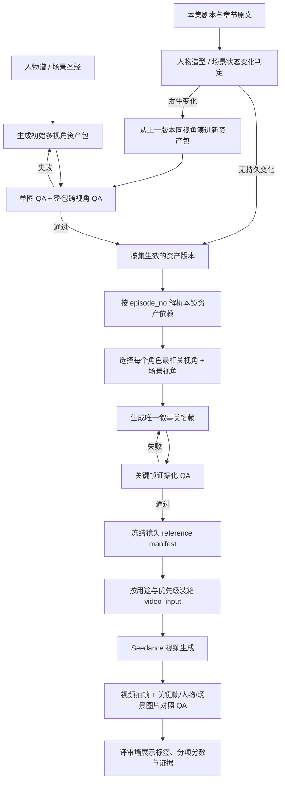

# 人物多视角资产、章节演进与关键帧一致性 QA 改造方案

> 状态：待实施  
> 版本：v1.0  
> 日期：2026-07-26  
> 适用范围：人物谱、场景库、镜头参考图、评审墙、参考图 QA、视频 QA  
> 核心约束：继续使用现有外部 HiAgent / Seedream / Seedance / VLM Token 链路；不引入 LoRA、FaceID、本地训练或新的大型依赖。

## 0. 最终结论

本次改造确定为两大模块，必须成对上线：

1. **前期可演进多视角资产库**：人物谱和场景库不再以“一条版本记录对应一张图”为终点，而是以“按集生效的多视角资产包”为权威真值。人物外观发生章节级变化时，新版本必须整包演进并保留旧版本适用区间。
2. **镜头关键帧与证据化 QA**：每个镜头必须生成一张明确标记的叙事关键帧；关键帧使用本集有效的人物多视角包和场景多视角包生成，并在送入视频模型前，拿这些真实图片做动作、人物比例、脸、衣服、发型和场景一致性 QA。

关键帧在供应商请求中仍使用 `reference_image`，不能改成 `first_frame` / `last_frame`。当前项目已经固定为 `REFERENCE_IMAGE_MODE`，而且代码与网关约束均禁止将首尾帧角色与普通参考图混用。本 PRD 中的“关键帧”是**叙事构图关键帧**，不是供应商协议里的 `first_frame`。

本方案不建议把人物的全部多视角图片直接喂给 Seedance。多视角资产首先服务于关键帧生成和 QA；真正送给视频模型的图片必须经过按角色、用途和风险的装箱，避免平铺参考图引发分身、巨型前景人物和角色绑定混乱。

---

## 1. 当前代码审计结论

### 1.1 已有能力

| 能力 | 当前实现 | 可复用结论 |
|---|---|---|
| 人物按集演进 | `app/portraits.py` 的 `character_portraits`、`portrait_for_episode()`、`bible_for_episode()` | 已有 `ep_start/ep_end` 和 `base_portrait_id`，不需要重做时间轴 |
| 场景按集版本 | `app/scenes.py` 的 `scene_references`、`scene_ref_for_episode()` | 数据表已有分段与 lineage，但当前主要用于初始图和新场景，缺少已有场景状态演进 |
| 镜头参考图集合 | `reference_sets/reference_assets`、`app/media_pipeline/reference_store.py` | 可继续作为镜头级冻结清单和恢复点 |
| 叙事关键帧类型 | `app/video_modes.py` 已有 `plot_key_frame`、`action_key` 等槽位 | 不必另起一条旧式首尾关键帧链路 |
| 参考图一致性 QA | `review_reference_image()`、`review_reference_images_batch()`、`review_reference_consistency()` | 可保留调用入口，但必须改成基于实际资产图的证据化评分 |
| 视频 QA | `app/stages.py::qa_shot()`、`app/media_exec/run_job.py::_maybe_auto_qa()` | 已有动作和人物主项，但目前只有视频抽帧与文字锚点 |
| 评审墙素材画廊 | `frontend/src/pages/WallPage.tsx` | 已能展示、废弃、恢复参考图，只需补类型、用途和 QA 标签 |

### 1.2 造成当前 bad case 的具体缺口

1. `character_portraits` 与 `scene_references` 的一个生效版本都只有一个 `image_path`，无法稳定覆盖侧脸、3/4 面、发型轮廓、全身比例和场景反打方向。
2. 人物漂移重绘只重绘一张图；新造型没有完整多视角包，后续关键帧仍只能从单一正面定妆照推断其他角度。
3. `default_reference_decision()` 默认每镜生成 4 张新参考图；这些镜头级图片成本高、容易近似重复，却没有一个被定义为不可缺失的关键帧。
4. `pack_reference_images_for_seedance()` 主要按总分排序，且默认只偏好 1 张含人物参考图。高分人物定妆照可能挤掉关键帧，关键帧也可能挤掉身份锚点，缺少按用途的确定性优先级。
5. `review_reference_images_batch()` 只接收候选图，不接收人物谱/场景库真值图片；它输出的 `identity_consistency` 和 `scene_consistency` 缺少直接视觉证据。
6. `review_reference_consistency()` 在 VLM 异常或 JSON 解析失败时默认一致性为 1.0，存在“没有完成比对却被当成满分”的错误放行。
7. `_maybe_auto_qa()` 和 `critique_version()` 只把人物文字锚点传给 `qa_shot()`，没有把本集人物图、场景图和已采用关键帧一起传入，因此无法可靠识别换脸、换发型和换装。
8. 人物库图在 `character_reference_assets()` 中被直接赋予 `QA=1.0`，没有把真实的单图与整包 QA 结论带到镜头链路。
9. 评审墙 `refSourceLabel()` 只按 `source` 显示“生成参考图/角色定妆照”，忽略 `type=plot_key_frame`，用户无法知道哪张是关键帧。
10. 当前 QA 把水印放在 `clean_frame` 和部分 hard failure 中；对于人物一致性目标，它占用了错误的注意力和分数预算。

因此，用户提出的方向基本正确，但需要两点修正：

- 当前系统并非完全没有关键帧和人物一致性检查，而是关键帧没有成为必需资产，QA 也没有拿到可靠的图片真值。
- 多视角图不应全部直接传给视频模型。它们首先是生成与 QA 证据；视频输入需要单独选择。

---

## 2. 目标与非目标

### 2.1 P0 目标

- 每个需跨镜头保持一致的人物，在每个生效造型版本下拥有完整多视角人物包。
- 每个入库场景拥有至少两个稳定视角，并能按集选中正确版本。
- 人物章节级外观变化时，新版本多视角包原子生成、原子过审、原子生效；不得出现正面已更新但侧面仍属于旧造型的半成品状态。
- 每个视频镜头拥有且只拥有一个必需的 `narrative_keyframe`。
- 关键帧依赖本集有效的人物/场景资产版本，依赖关系可追溯、可冻结、可判 stale。
- 参考图 QA 以动作、人物比例/肢体、脸、衣服、发型、场景为主，并实际读取人物谱/场景库图片进行对比。
- 视频 QA 同样读取关键帧和本集有效资产图，识别镜头内部及镜头之间的人物漂移。
- 评审墙明确展示“关键帧”“人物参考·视角”“场景参考·视角”“上镜衔接帧”标签和用途。
- 不增加 LoRA、FaceID 或本地训练依赖。

### 2.2 非目标

- 不恢复已废弃的首帧/尾帧视频输入模式。
- 不把所有多视角图无条件发送给 Seedance。
- 不在本期训练角色模型或替换供应商。
- 不用固定 seed 作为一致性主方案。
- 不自动为一次性路人建立多视角包；继续沿用 `character_policy.py` 的功能性路人策略。
- 不因旧项目只有单图而强制删除或重做全部历史视频。

---

## 3. 核心概念

### 3.1 人物造型版本与人物视角图

- **人物身份不变量**：脸部主要特征、骨相、年龄基线、体型基线。章节演进时默认保持。
- **人物造型可变量**：发型、衣服、配饰、年龄阶段、伤势等。
- **人物造型版本**：继续以 `character_portraits` 的按集分段记录表示。
- **人物视角图**：属于某一个造型版本的子资产，不再把一张 `image_path` 当成整个版本。

P0 必需人物视角：

| `view_role` | 内容 | 主要用途 |
|---|---|---|
| `front_full` | 正面全身、中性姿态 | 体型、身高比例、服装全貌、主图兼容 |
| `three_quarter` | 3/4 面半身或全身 | 五官深度、发型轮廓、常规对话机位 |
| `profile` | 标准侧面半身 | 鼻梁/下颌/耳部/侧面发型、侧拍镜头 |

按需视角：

- `back_full`：服装背面、披风、长发背部细节明显时生成。
- `face_closeup`：项目中近景/特写占比高，或人物脸部容易漂移时生成。

### 3.2 场景版本与场景视角图

场景需要拆成：

- **不变几何**：房间/街道结构、门窗方向、标志物、主陈设位置。
- **可变状态**：昼夜、天气、损毁、装饰、临时道具和光照。

P0 必需场景视角：

| `view_role` | 内容 | 主要用途 |
|---|---|---|
| `establishing` | 建立镜头、完整空间关系 | 场景识别和整体布局 |
| `reverse_angle` | 与建立视角相对的反打方向 | 对话、反打和空间方向一致性 |

P1 可增加 `action_zone`，表示最常发生动作的局部区域。场景视角图保持无人，人物只在镜头关键帧中合成。

### 3.3 镜头关键帧

每镜固定一个必需槽位：

```text
slot_key = narrative_keyframe
asset_type = plot_key_frame
required = true
```

关键帧表示本镜最重要、最能约束视频模型的一个动作定格，不承担完整动作过程，也不是首帧/尾帧协议角色。

### 3.4 同一张图的三种用途

镜头参考集中必须把“展示”和“实际喂模型”分开：

- `keyframe_seed`：用于生成关键帧。
- `qa_anchor`：用于与关键帧/视频抽帧比较。
- `video_input`：最终作为 `reference_image` 发送给 Seedance。

一个资产可以有多个用途。不能再把 `selectedForSeedance=false` 等同于“废弃”；它可能是有效的 QA 真值，只是不直接喂视频模型。

---

## 4. 端到端流程



---

## 5. 详细产品与工程要求

### 5.1 初始多视角资产包生成

#### 人物

1. 先生成 `front_full` 主视角；新人物允许纯文生图，已有角色演进必须以上一版本 `front_full` 为身份种子。
2. 主视角单图 QA 通过后，并行生成 `three_quarter`、`profile`。
3. 后续视角使用新 `front_full` 加上一版本同视角作为参考；提示词明确“同一角色、只改变观察角度，不改变脸、发型、服装和体型”。
4. 对每张图做角度与内容 QA，再对整包做跨视角 QA。
5. 必需视角全部通过后，才能将该人物版本标记为 `ready`。

#### 场景

1. 先生成 `establishing`。
2. 再使用同场景建立图生成 `reverse_angle`，提示词强调相同几何、相同标志物、反向机位而非复制原构图。
3. 整包 QA 必须验证门窗、主陈设、光线方向和标志物之间不存在自相矛盾。

#### 成本控制

- 只有会跨镜头复用的人物与场景进入多视角库；一次性路人和一次性过场地点继续走镜头级描述。
- 初始资产是可复用成本；镜头级默认从“生成 4 张新图”收敛为“生成 1 张必需关键帧”。
- 现有项目不一次性全量重做；进入某集生产前，按需补齐本集涉及资产的缺失视角。

### 5.2 章节/剧集演进

扩展 `screen_appearance_changes()` 的返回合同：

```json
{
  "character": "角色A",
  "changed": true,
  "new_appearance": "……",
  "change_dimensions": ["hair", "outfit"],
  "persistence": "persistent",
  "reason": "原文依据",
  "evidence_excerpt": "原文短片段"
}
```

演进规则：

1. `face/body_identity` 默认禁止改变；除非原文明确存在年龄跃迁、变身或身体永久变化。
2. `hair/outfit/accessory/injury/age_stage` 可改变，但必须明确列出改变维度。
3. 持久变化生成新的完整多视角包，`ep_start=本集`；旧包在新包整包 QA 通过后才关闭到 `本集-1`。
4. 临时脏污、淋雨、表情、手持道具、单镜伤势等 `shot_only` 状态不更新人物谱，由关键帧 prompt 表达。
5. 如果变化仅持续一集，P1 支持 `episode` 范围；结束后重新绑定旧资产包，不重复付费生成相同视角。
6. 新包任一必需视角失败时，不得部分生效。相关镜头进入 `waiting_asset_review`，不能静默继续使用错误旧造型。

场景状态变化采用同样原则：永久损毁/重建产生新场景版本；普通昼夜、天气和临时布置优先由关键帧表达，只有复用量足够时才生成新的场景状态包。

### 5.3 镜头资产解析与关键帧生成

在视频任务入队前生成不可变的 `reference_manifest`：

```json
{
  "episode_no": 12,
  "shot_id": "shot_x",
  "characters": [
    {
      "name": "角色A",
      "look_revision_id": "portrait_x",
      "selected_view_ids": ["view_three_quarter_x"],
      "available_view_roles": ["front_full", "three_quarter", "profile"]
    }
  ],
  "scene": {
    "name": "宗门广场",
    "scene_revision_id": "scene_x",
    "selected_view_ids": ["view_establishing_x"]
  },
  "keyframe_slot": "narrative_keyframe",
  "input_fingerprint": "sha256..."
}
```

要求：

- 关键帧必须依赖完整且已过审的多视角包；实际一次生成调用按本镜机位为每个可见人物选择最相关的 1～2 个视角，不盲传全部视角。
- 选择视角时参考 `shot_size`、人物朝向、`first_frame_desc`、`action_desc` 和交互对象。
- 每个可见具名角色至少绑定一个准确人物视角；场景命中场景库时至少绑定一个场景视角。
- 输入超出供应商上限时优先保留：本镜主角、实际露脸者、衣着变化者、场景视角；不能随机截断。
- 关键帧生成后记录全部父资产 ID。任何父资产更新都能判定该关键帧 stale。
- 任务一旦提交付费视频生成，manifest 不再重新解析；避免执行中途人物版本发生变化造成同一镜头输入漂移。

### 5.4 送入 Seedance 的确定性装箱

当前按总分 Top-N 的策略改为“必需用途优先，分数只在同类候选内排序”。

默认优先级：

1. `previous_shot_frame`：仅 `action_continuation` 必需。
2. `narrative_keyframe`：每镜必需，不能被人物定妆照挤掉。
3. `scene`：关键帧环境不充分或 QA 标记场景风险时加入一个最相关视角。
4. `character`：仅当关键帧身份风险较高或实验数据证明能提升时，加入风险最高角色的一个相关视角。
5. `prop/style`：剩余容量内按需加入。

多视角人物图默认用途为 `keyframe_seed + qa_anchor`，不是全部 `video_input`。评审墙可以展示整套证据和实际使用状态。

`reference_gallery_fingerprint` 必须包含以下内容：

- 人物/场景版本 ID；
- 视角资产 ID；
- 关键帧 ID；
- 用途；
- QA 版本与 prompt 版本。

### 5.5 参考图 QA 重构

#### 5.5.1 输入证据

VLM 请求必须带图片顺序清单，禁止只写文字锚点：

```json
{
  "image_manifest": [
    {"index": 1, "role": "candidate_keyframe"},
    {"index": 2, "role": "character_anchor", "entity": "角色A", "view": "three_quarter"},
    {"index": 3, "role": "character_anchor", "entity": "角色A", "view": "front_full"},
    {"index": 4, "role": "scene_anchor", "entity": "宗门广场", "view": "establishing"}
  ]
}
```

每次比较只携带与候选图有关的真值图，避免把无关角色或无关场景混入同一 VLM 请求。

#### 5.5.2 关键帧评分维度

| 维度 | 默认权重 | 说明 |
|---|---:|---|
| `action_match` | 0.25 | 姿态、朝向、手部/道具接触、人物间空间互动 |
| `body_proportion` | 0.20 | 头身比、肢体长度、身体完整性、无异常融合 |
| `face_identity` | 0.20 | 与人物包脸部特征一致；脸不可见时记为 N/A |
| `outfit_match` | 0.15 | 款式、颜色、层次、配饰与本集造型一致 |
| `hair_match` | 0.10 | 发型、长度、发色、刘海和轮廓一致 |
| `scene_match` | 0.10 | 几何、标志物、机位方向、状态和光线合理 |

`overall` 只对适用维度重新归一化计算。不能用“脸没有拍到”自动给低分；应依靠发型、体型和服装等可见证据。

建议默认门禁：

- `overall >= 0.80`；
- `action_match >= 0.70`；
- `body_proportion >= 0.72`；
- 可见时 `face_identity/outfit_match/hair_match >= 0.75`；
- 任何 `wrong_identity`、`duplicate_character`、`severe_anatomy`、`wrong_outfit`、`action_missing` 为 hard failure。

阈值全部配置化，并在真实项目样本上校准；PRD 中数值是首轮默认值，不是不可修改常量。

#### 5.5.3 水印策略

- 从参考图与视频 QA 的主评分维度中移除 `watermark`。
- 水印、Logo、少量无意义文字不再单独造成 hard failure，也不触发付费重抽。
- 只有当它遮挡脸、发型、衣服、手部动作接触区或关键场景标志物时，才按 `subject_occlusion` 在相应主维度扣分。
- 生成提示词仍可保留“无水印/无 Logo”作为低成本美观约束，但 QA 不再围绕它组织评分。

#### 5.5.4 QA 异常语义

- VLM 调用失败、图片缺失、JSON 缺少必需分数时，状态为 `unverified`，不得伪装成 1.0。
- `unverified` 不触发付费视频自动重抽；关键帧阶段优先重试 QA，仍失败则要求人工确认。
- 必需关键帧未验证时默认阻止视频提交。用户人工覆盖必须记录理由。
- 继续保留 `qa_recovered=true`，但它只可展示，不可作为自动花费依据。

### 5.6 视频 QA 重构

`qa_shot()` 增加可选参数：

```python
qa_shot(
    frames_b64,
    ...,
    visual_anchors=[...],
    image_manifest=[...],
)
```

调用方 `_maybe_auto_qa()` 与 `critique_version()` 必须从冻结的 `reference_set_id` 读取：

- 已采用关键帧；
- 本集有效的人物视角图；
- 本集有效的场景视角图；
- 必要时上镜衔接帧。

视频至少抽取首、中、尾三帧；P1 对高风险镜头扩为 0%、25%、50%、75%、95% 五帧。QA 同时判断：

- 与人物/场景真值的一致性；
- 视频内部是否中途换脸、换发型、换装或体型跳变；
- 核心动作是否真正出现；
- 起止状态是否满足连续性合同。

动作、人物比例、脸、衣服、发型仍是主门禁；画面干净度不能把错误人物或错误动作的总分拉高。

### 5.7 评审墙与前期页面

#### 评审墙

图片卡片按 `asset_type + view_role + purpose` 显示：

- `关键帧`；
- `人物参考 · 正面全身`；
- `人物参考 · 3/4 面`；
- `人物参考 · 侧面`；
- `场景参考 · 建立`；
- `场景参考 · 反打`；
- `上镜衔接帧`。

画廊拆成三个区：

1. **视频实际输入**；
2. **关键帧生成 / QA 依据**；
3. **废弃候选**。

关键帧缩略图必须始终显示醒目的“关键帧”角标。详情中展示分项 QA、依赖的人物/场景版本和 stale 状态。

#### 人物谱

- 先按造型版本展示，再在版本内横向展示各视角。
- 显示适用集数、当前版本、变化原因、缺失视角和整包 QA 状态。
- “重新定妆”改为“重新生成当前造型包”；允许只重做某一失败视角，但整包重新 QA 后才能生效。

#### 场景库

- 先按场景版本/状态展示，再显示建立、反打、动作区视角。
- 单图候选与已采用多视角包分开，不能把候选数量等同于有效视角数量。

---

## 6. 数据结构设计

为降低迁移风险，不重命名现有 `character_portraits`、`scene_references`；把它们提升为“版本父记录”，新增子视角表。

### 6.1 新表：`character_portrait_views`

```sql
CREATE TABLE character_portrait_views (
    id TEXT PRIMARY KEY,
    portrait_id TEXT NOT NULL,
    view_role TEXT NOT NULL,
    framing TEXT,
    image_path TEXT,
    prompt TEXT,
    qa_json TEXT,
    artifact_id TEXT,
    base_view_id TEXT,
    status TEXT NOT NULL DEFAULT 'queued',
    selected INTEGER NOT NULL DEFAULT 1,
    input_fingerprint TEXT,
    created_at REAL NOT NULL,
    UNIQUE(portrait_id, view_role),
    FOREIGN KEY(portrait_id) REFERENCES character_portraits(id) ON DELETE CASCADE,
    FOREIGN KEY(base_view_id) REFERENCES character_portrait_views(id)
);
```

`character_portraits.image_path` 暂时保留，始终镜像 `front_full`，兼容 `portrait_for_episode()` 和旧 API。

### 6.2 新表：`scene_reference_views`

```sql
CREATE TABLE scene_reference_views (
    id TEXT PRIMARY KEY,
    scene_reference_id TEXT NOT NULL,
    view_role TEXT NOT NULL,
    camera_axis TEXT,
    image_path TEXT,
    prompt TEXT,
    qa_json TEXT,
    artifact_id TEXT,
    base_view_id TEXT,
    status TEXT NOT NULL DEFAULT 'queued',
    selected INTEGER NOT NULL DEFAULT 1,
    input_fingerprint TEXT,
    created_at REAL NOT NULL,
    UNIQUE(scene_reference_id, view_role),
    FOREIGN KEY(scene_reference_id) REFERENCES scene_references(id) ON DELETE CASCADE,
    FOREIGN KEY(base_view_id) REFERENCES scene_reference_views(id)
);
```

`scene_references.image_path` 暂时保留，镜像 `establishing`。

### 6.3 父表新增字段

`character_portraits`：

- `pack_status`：`generating/qa_pending/ready/failed/legacy_partial`；
- `group_qa_json`；
- `change_json`；
- `input_fingerprint`。

`scene_references`：

- `pack_status`；
- `group_qa_json`；
- `state_canonical`；
- `change_json`；
- `input_fingerprint`。

### 6.4 镜头 `reference_assets` 新增字段

- `entity_type`：`character/scene/shot/continuity`；
- `entity_name`；
- `library_revision_id`；
- `library_view_id`；
- `view_role`；
- `purposes_json`；
- `required`；
- `dependency_manifest_json`。

`selected` 继续兼容 `selectedForSeedance`，只代表 `video_input`，不代表资产是否有效。

---

## 7. 一致性、失效与并发规则

1. 多视角包使用 `input_fingerprint` 幂等恢复；相同人物版本、视角、prompt 和种子不重复付费生成。
2. 新人物/场景版本在临时状态生成；全部必需视角和整包 QA 通过后，用同一事务关闭旧区间并启用新区间。
3. 关键帧记录父资产 ID；父资产被替换时，未提交的视频版本标记 stale 并重建 reference set。
4. 已提交或已生成的付费视频不自动删除、不自动重抽；评审墙显示“参考资产已更新，本版本使用旧资产”，由用户或 Supervisor 决定。
5. reference manifest 冻结后，worker 重启必须复用原 manifest，不重新选择最新人物图。
6. `review_reference_consistency()` 不再 fail-open。QA 不可用与 QA 通过是两个不同状态。
7. 人工恢复低分图片时继续要求覆盖理由，并显示该图是 `video_input` 还是仅 `qa_anchor`。

---

## 8. 代码改造范围

| 文件/模块 | 改造内容 |
|---|---|
| `app/db.py` | 新视角表、父表/`reference_assets` 迁移、索引、完整性检查与旧数据回填 |
| `app/schemas.py` | 人物/场景视角、资产包状态、QA 合同与 manifest 模型 |
| `app/refs.py` | 初始人物多视角包生成；保留单主图兼容入口 |
| `app/portraits.py` | 按集选择整包、整包演进、原子启用、变化维度与持久性判断 |
| `app/scenes.py` | 场景多视角包、按集选择、P1 场景状态演进 |
| `app/video_modes.py` | 必需关键帧、相关视角选择、证据化 QA、用途分离、按角色装箱，移除 QA fail-open |
| `app/media_pipeline/reference_store.py` | 持久化用途、库资产 ID、关键帧依赖和新版 fingerprint |
| `app/media_exec/run_job.py` | 冻结 manifest；参考图 QA 与视频 QA 读取真实视觉锚点 |
| `app/stages.py` | 新 QA schema；动作/比例/脸/服装/发型/场景分项；水印降级 |
| `app/domain/projects.py` | 人物/场景多视角包 API 输出 |
| `app/domain/storyboard_ops.py` | 评审详情输出关键帧、用途、依赖和分项 QA |
| `frontend/src/api.ts` | 新增 view、purpose、revision、keyframe 和 QA 类型 |
| `frontend/src/pages/BiblePage.tsx` | 造型版本内多视角展示 |
| `frontend/src/pages/ScenesPage.tsx` | 场景版本内多视角展示 |
| `frontend/src/pages/WallPage.tsx` | 关键帧标签、三类画廊、QA 分项与依赖信息 |
| `tests/` | 数据迁移、版本选择、整包原子性、关键帧门禁、证据 QA、装箱和 UI 合同测试 |

---

## 9. 实施优先级

### P0：必须实现

1. 新视角子表与旧单图回填。
2. 人物 `front_full/three_quarter/profile` 和场景 `establishing/reverse_angle` 生成及整包 QA。
3. 人物按集演进时完整多视角包原子切换。
4. 每镜一个必需 `narrative_keyframe`，依赖 manifest 冻结。
5. 关键帧真实图片对照 QA；水印移出主评分和 hard failure。
6. 角色化确定性装箱，关键帧不能被分数排序挤掉。
7. 视频 QA 接入关键帧/人物/场景图片证据。
8. 评审墙关键帧和用途标签。
9. QA 异常改为 `unverified`，不得默认满分。

### P1：必要增强

1. 场景永久状态变化的多视角版本演进。
2. 临时一集造型范围和旧资产包无付费复用。
3. 人物谱/场景库完整多视角管理与单视角重做 UI。
4. 高风险视频五帧抽样。
5. 资产更新后的 stale 影响预览和批量修复入口。

### P2：实验项

1. 根据镜头统计自动增加 `face_closeup/back_full/action_zone`。
2. 通过 A/B 数据决定关键帧之外是否再向 Seedance 发送一张人物身份图。
3. 根据人物遮挡、镜头景别和历史漂移分动态调整 QA 阈值。

---

## 10. 迁移与兼容方案

1. 每条旧 `character_portraits` 生成一条 `front_full` 子视角，复用原 `image_path`，父状态记为 `legacy_partial`。
2. 每条旧 `scene_references` 生成一条 `establishing` 子视角，复用原图。
3. 旧项目进入某集视频生产前，先对本集涉及的 `legacy_partial` 资产补齐缺失视角；不全库抢跑。
4. `portrait_for_episode()` 与 `scene_ref_for_episode()` 保持原签名并返回主视角；新增 `portrait_views_for_episode()`、`scene_views_for_episode()` 供新链路使用。
5. 旧 `shot_versions.image_inputs` 继续可读；没有用途字段的图按旧规则映射，`plot_key_frame` 自动映射为 `narrative_keyframe`。
6. 不删除历史文件、不重写历史视频、不修改已采用版本的输入清单。

建议配置开关：

```text
character_multiview_enabled=true
scene_multiview_enabled=true
narrative_keyframe_required=true
visual_evidence_qa_enabled=true
video_visual_anchor_qa_enabled=true
watermark_qa_mode=ignore_unless_occluding
```

---

## 11. 验收标准

### 11.1 功能验收

- 新项目所有入库人物都有 3 个必需视角，所有入库场景都有 2 个必需视角。
- 第 N 集人物换发型/换衣服后，第 N 集及后续镜头读取新包；第 N-1 集仍读取旧包。
- 新人物包任一视角失败时，不发生半包生效。
- 每个进入视频提交阶段的镜头都存在一张已过审且有依赖 manifest 的关键帧。
- 评审墙每张关键帧都有明确标签，用户可区分视频输入、QA 依据和废弃候选。
- 关键帧 QA 请求中实际包含候选图和人物谱/场景库对照图。
- 视频 QA 请求中实际包含视频抽帧和冻结 reference set 中的视觉锚点。
- 小水印不会降低总体分，也不会触发重抽；遮挡人物关键区域时按可见性/对应主项失败。
- VLM 失败或缺字段时状态为 `unverified`，不会自动赋 1.0。

### 11.2 质量指标

在同一批真实项目样本上，与改造前比较：

- 人工标注的换脸/换发型/换装 bad case 率下降至少 50%。
- 人物比例或严重肢体异常的关键帧进入视频模型比例低于 5%。
- 关键帧覆盖率 100%，视觉证据覆盖率 100%。
- 首次视频 QA 通过率不得下降；目标提升至少 15%。
- 视频付费重抽次数下降，新增前期图片成本不得高于节省的视频重抽成本。
- 同一人物跨镜头人工一致性通过率达到 90% 以上。

### 11.3 必需测试

- SQLite 新旧库迁移、重复迁移幂等、外键/唯一约束测试。
- 人物与场景多视角按集选择测试。
- 演进整包 QA 失败不切换版本测试。
- `reference_manifest` 重启后保持不变测试。
- 高分人物图不能挤掉必需关键帧的装箱测试。
- 水印不再作为 hard failure，遮挡仍失败的 QA 测试。
- QA 图片顺序 manifest 与实际传图一致测试。
- `_maybe_auto_qa()` 从冻结 reference set 读取真实图片测试。
- 评审墙关键帧标签、用途分组、废弃/恢复回归测试。
- 大体积 `image_inputs` 不进入列表页响应的现有性能回归测试。

---

## 12. 决策记录

| 决策 | 结论 | 原因 |
|---|---|---|
| 是否引入 LoRA/FaceID | 否 | 项目依赖外部 Token，训练和本地推理会扩大依赖与运维范围 |
| 是否恢复 first/last frame | 否 | 当前参考图模式与供应商约束不允许混用 |
| 是否所有多视角图都喂 Seedance | 否 | 外部接口为平铺参考图，过多人物图会增加分身与绑定歧义 |
| 是否继续每镜默认生成 4 张图 | 否 | 改为 1 张必需关键帧，复用前期资产，按风险追加 |
| 是否完全忽略水印 | 不作为质量主项；遮挡时处理 | 水印本身不是人物一致性问题，但遮挡关键内容仍影响可用性 |
| QA 失败是否默认通过 | 否 | 无证据不能等同满分；改为 `unverified` 和人工覆盖 |
| 人物变化是否只改最新 Bible 字符串 | 否 | 必须生成按集版本的完整多视角包，并冻结镜头依赖 |

本 PRD 的核心不是继续堆更多提示词，而是把“人物/场景版本 → 多视角真值 → 关键帧 → 视频 → QA”变成一条可追溯、可冻结、可复验的视觉证据链。
