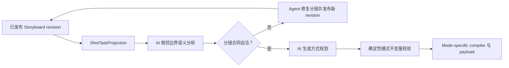

# 全链路叙事连续性与视频衔接泛化整改 PRD

> 版本：v1.3  
> 状态：Proposed  
> 日期：2026-08-04  
> 适用范围：章节原文 → 剧本 → 观众认知导演 → 分镜大纲 → 逐镜脚本 → Seedance 提示词 → 视频候选 → 相邻镜/冷观众 QA → 终剪 → 交付  
> 基准事故：《我欲封天》第 6 集《铜镜的快乐》  
> 规范级别：本 PRD 是“叙事连续性、观众理解、动作去重、关键转折交付、视频生成模式规划、依赖调度、视频边界衔接”的上位规范；与旧 PRD 冲突时，以本 PRD 为准

---

## 0. 执行结论

本次整改不把问题定义为“转场效果不够丰富”，而定义为：**同一个叙事事实没有沿全链路保持唯一身份、唯一动作所有权、单调状态变化、可验证的观众理解和可验证的镜头边界**。

v1.2 新增一条与故事世界状态并行的“观众认知状态链”。旧方案能保证信息被安排进镜头，但不能证明观众注意到、理解并在后续剧情使用前接受了它。因此，关键目标从“镜头中出现过”升级为“目标观众能够仅凭已交付声画形成预期理解”。

v1.3 进一步把视频生成模式与项目真实分镜合同对齐：**生成方式不是第二套导演决策，而是已发布分镜脚本的可审计执行计划**。模式规划必须从同一 `Shot` revision 的起始状态、当前唯一动作、结束状态、机位意图、声画交付和相邻边界关系推导；执行层不得再把 `continuity_mode`、`continuity_from_prev`、场景名相等、动作关键词或题材类别直接映射成供应商输入模式。

第 6 集的重复打坐、灵泉转折过快、铜镜触发缺少独立镜头、鹿爆裂前后状态漂移，均不是某个提示词措辞不佳造成的孤立问题，而是以下链式失效：

1. 剧本主线校验失败后仍以降级结果进入分镜；
2. 分镜把“节拍未交付”统一处理为复制相邻镜并插入；
3. 动作容量依赖固定动词子串，未识别的新表达被低估；
4. 分镜事件 ID 只校验格式，不校验真实引用；
5. 提示词编译器忠实编译了互相矛盾的首尾状态；
6. 单镜 QA 没有获得上一镜视频证据，却尝试判断跨镜重复；
7. 候选预算耗尽后，内容严重不符的视频仍被标记为最终采用；
8. 终剪只应用视觉转场和全片响度处理，无法修复上游因果、动作和局部声音断裂。

整改后的唯一主链路为：


每个下游产物必须引用同一批稳定 ID 和上游版本，不允许重新从散文中猜测“当前在讲什么”。

### 0.1 Seedance 2.0 视频输入实测结论（2026-08-04）

在生成本方案前，已对当前项目实际使用的 HiAgent/Seedance 2.0 通道做最小付费探针。输入取自下载目录 `episode-6-final.mp4`（约 67.4 秒、720×1280、H.264 + AAC），为控制费用只截取前 5 秒；因接口拒绝内嵌视频，最终提交复用了该片段对应的项目第 6 集第 1 镜供应商 Web URL。两份片段抽样比对 `SSIM All=0.956929`，可视为同一素材的高相似来源。

| 探针 | 结果 | 证据与解释 |
|---|---|---|
| `video_url` + `role=reference_video` + data URL | 异步失败 | 创建接口先返回任务，但任务随后报 `InvalidParameter: reference_video must be provided as a web url`；证明不能只看创建 HTTP 200 |
| 相同输入角色 + 供应商 Web URL | 成功 | task `d9onqu475l2qfvl8sig0` 从 `queued → running → succeeded`，服务端耗时约 726 秒 |
| 输出可用性 | 成功 | 生成 5.062 秒、720×1280、H.264 + AAC 视频，说明当前通道确实支持参考视频输入 |
| `return_last_frame=true` | 未生效 | 成功结果没有 `last_frame_url`；当前通道不能依赖该字段串接下一镜，仍需本地抽帧或独立媒体服务 |
| 无缝续写语义 | 未通过生产准入 | 输入尾帧与输出首帧保持人物、服装、场景和画风，但人物朝向/姿态发生跳变，边界帧 `SSIM All=0.521741`；单样本只能证明“参考视频有效”，不能证明“真续写” |

因此当前能力快照应记录为：

```text
supports_reference_video = true
reference_video_requires_web_url = true
supports_true_video_continuation = unverified
supports_return_last_frame = false  # 当前网关/模型组合的实测结果
```

产品上可以开发并保留第三种视频输入模式，但全自动主链路暂不能把它等同于无缝续写。首轮上线应允许它承担运动、镜头、节奏或音频参考；`CONTINUE_PREVIOUS_TAKE` 必须在多样本边界语义回归达到阈值后再灰度启用。

外部依据：[Seedance 2.0 官方能力页](https://www.volcengine.com/activity/seedance2)明确描述多模态图片/视频/音频参考和视频编辑/续写能力；[方舟创建视频生成任务接口](https://api.volcengine.com/api-docs/view?action=CreateContentsGenerationsTasks&serviceCode=ark&version=2024-01-01)提供 `return_last_frame` 与尾帧续接用法。文档说明只作为能力候选，生产准入仍以当前项目的供应商、网关、模型和区域组合的异步实测为准。

---

## 1. 强制原则：禁止白名单式补丁

### 1.1 禁止的实现方式

以下实现不得进入主链路：

- 新增固定动作词表来识别“打坐、发热、爆裂、倒地”等本次事故词语；
- 为某部小说、某一集、某个角色、某个镜号增加 `if/elif` 特判；
- 用有限同义词表解决剧情覆盖、动作重复或状态承接；
- 用正则命中某些中文短语后直接决定拆镜、插镜或转场；
- 把 `SPINE_MISSING` 永久映射成一种修复动作，例如统一 `insert_shot`；
- 把 QA 失败类型映射成固定提示词句子后不断盲抽；
- 仅用镜头编号相邻、场景名相同或共享若干汉字判断连续性；
- 为第 6 集人工维护“不得重复打坐”的静态列表作为正式修复方案。
- 写成 `if new_object: insert_closeup()`、`if new_rule: add_reaction_shot()` 等“内容类别 → 固定镜头模板”；
- 用固定题材、设定或情节类型列表决定观众是否需要铺垫、解释、验证或唤回。

### 1.2 允许且必要的稳定合同

禁止白名单不等于禁止 Schema、枚举或确定性规则。以下属于通用协议，可以保留：

- 产物状态、连续性模式、修复处置、质量等级等有限枚举；
- `event_id/action_id/info_id/entity_id` 的引用完整性；
- 有向无环、唯一所有权、状态前后一致、时长不越界等结构不变量；
- 供应商实际支持的时长、参考图数量和格式能力矩阵；
- 由项目资产生成的角色、道具和场景实体目录；
- 从当前剧本动态生成的“已完成动作”和“未来保留事件”集合；
- 经过语料回归校准的阈值，但必须可配置、可观测、不得绑定具体剧情词。

判断标准：**规则约束的是数据关系与生产能力，而不是枚举某类剧情内容。**

### 1.3 泛化验收原则

任何解决方案必须同时通过：

1. 第 6 集事故回归；
2. 未见过的动作表达；
3. 同义改写；
4. 人物与道具重命名；
5. 不同题材，包括都市、悬疑、修仙和无动作对白场景；
6. 人为注入的事件乱序、状态回退和重复动作。

只修好第 6 集不视为完成。

---

## 2. 目标、非目标与成功标准

### 2.1 产品目标

1. 每个必须交付的剧情转折拥有稳定身份、明确交付方式和可追溯的主要镜头。
2. 同一完成动作默认只由一个镜头主要交付；强调、回忆、平行剪辑必须显式声明叙事意图。
3. 每个镜头的开始、当前变化和结束状态都可结构化比较。
4. 剧本、分镜、提示词、视频观测和终剪使用同一个真相链，不各自重新理解散文。
5. 任何局部修复先在影子计划中完成全图校验，通过后再原子提交。
6. 技术可播放交付与最终质量认证分离：任务可以产出尽力预览，但严重内容错误不能被静默认证为最终成片。
7. 转场、参考图、采样和重试策略由边界合同与风险推导，不由镜号或剧情关键词决定。
8. 每个镜头同时承担可验证的故事世界变化与观众状态变化；信息出现不再自动等同于信息被理解。
9. 新信息是否需要额外镜头，由观众认知缺口、注意竞争、因果依赖和处理时间共同推导，不由“新人物/新道具/新能力”等内容类别决定。

### 2.2 非目标

- 不承诺概率视频模型百分之百复现所有复杂动作；
- 不依赖无限重试获得偶然正确结果；
- 不用叠化、黑场或音效掩盖因果冲突；
- 不要求一次性重写全部现有业务模块；
- 不把 VLM 输出直接当作不可质疑的业务真值；
- 不以增加镜头数量本身作为质量指标。

### 2.3 核心验收指标

| 指标 | 最终模式目标 |
|---|---:|
| `must_keep` 事件结构化交付覆盖率 | 100% |
| 事件/动作/信息 ID 引用合法率 | 100% |
| 未授权的动作重复主要交付 | 0 |
| 相邻镜状态高危回退 | 0 |
| 必须独立交付的关键转折被挤入过载镜头 | 0 |
| 相邻镜边界合同覆盖率 | 100% |
| 相邻镜成对 QA 覆盖率 | 100% |
| 带 `action_missing/wrong_dialogue/state_regression` 的候选被认证为 final-grade | 0 |
| 未经风险确认的 best-effort 被标记为最终成片 | 0 |
| 镜间对白响度偏差 | 建议 ≤ ±2 LU |
| 由白名单或剧集特判驱动的新增修复分支 | 0 |
| 后续事件首次依赖某信息时，冷观众尚未形成目标理解 | 0 |
| 非预期错误因果被冷观众稳定推断 | 0 |
| 关键人物决策缺少可感知的认知或动机桥 | 0 |
| 有意悬念被错误补全，或表达遗漏被误标为悬念 | 0 |
| 新增引导镜头通过删除测试后无认知/情绪/空间价值 | 0 |

---

## 3. 全链路不变量

### 3.1 唯一身份不变量

每个核心对象只创建一次稳定 ID：

- `source_fact_id`：来源事实；
- `event_id`：叙事事件；
- `action_id`：原子动作；
- `info_id`：观众需要获得的信息；
- `turn_id`：关键转折；
- `entity_id`：人物、道具、地点或其他实体；
- `shot_id`：镜头任务；
- `boundary_id`：两个镜头之间的边界；
- `audience_state_id`：某个已交付时间点的观众认知状态；
- `experience_intent_id`：某个节拍预期造成的观众体验变化；
- `assimilation_task_id`：必须在截止事件前完成的观众理解任务；
- `cognitive_gap_id`：预期理解与当前可得证据之间的缺口；
- `bridge_plan_id`：弥合认知缺口的最小呈现方案。

下游只允许引用这些 ID，不允许生成同名但不同格式的新 ID。格式正确不代表引用正确；必须校验目标对象存在、版本兼容且属于当前集。

### 3.2 因果顺序不变量

事件必须形成有向无环图：

```text
precondition facts + causal_parent_ids
    -> trigger/action
    -> effects
    -> resulting facts
```

分镜顺序必须是事件图的合法拓扑排序。局部修复不得把事件插到其前置事件之前，也不得把结果镜放到触发镜之前。

### 3.3 唯一交付不变量

- `event_id/action_id/info_id/turn_id` 必须各有一个 `primary_delivery_shot_id`；
- 同一 ID 出现在其他镜头时只能是 `supporting_evidence`；
- 若需要有意重复，必须创建 `repetition_intent`，说明功能、视角差异和新增状态；
- 没有新增信息、情绪或状态的重复，不得以“强调”为由通过。

### 3.4 状态单调不变量

同一时间线内，已完成动作不能无原因回到未开始状态。合法回退必须有显式事件，例如回忆、梦境、重置、倒带或跨时间跳转，并创建新的时间域。

### 3.5 边界不变量

相邻镜头必须满足：

```text
previous.observed_state_out
    --boundary_contract-->
next.planned_state_in
```

允许变化必须能追溯到：当前镜头动作、明确场景切换、时间跳跃、机位变化或可见/不可见范围变化。其余变化均为连续性风险。

### 3.6 能力不变量

镜头任务的最小动作时间、口播时间、文字阅读时间和剪辑 handle 总和不得超过供应商视频时长。容量判断不能通过“识别到几个动词”代替。

### 3.7 证据不变量

- 计划状态与视频实际状态分开保存；
- 后续镜头优先继承已采用视频的 `observed_state_out`；
- VLM 无法确认时保存 `unknown + confidence`，不得默认满分或默认通过；
- 所有自动采用、修复和降级都必须带证据与原因。

### 3.8 版本与失效不变量

每个产物记录：

```text
artifact_revision
input_artifact_ids
input_revision_hashes
compiler_version
model/provider_version
created_at
```

上游事件、动作所有权或状态合同改变后，所有依赖的分镜、提示词、关键帧、视频、边界 QA 和终剪计划必须自动标记 `stale`，不得继续混用。

### 3.9 观众认知不变量

故事事实成立不等于角色知道，也不等于观众已经理解。系统必须分开维护：

```text
StoryTruthGraph       世界实际发生了什么
CharacterBeliefGraph 每个角色相信、怀疑或误解什么
AudienceBeliefGraph  观众根据已交付声画能够相信、怀疑或误解什么
```

每个被后续事件依赖的观众命题都必须满足：

```text
prior audience state
    + actually presented audiovisual evidence
    + permitted inference path
    -> intended audience state
```

强制规则：

- 观众理解只能来自此前实际交付的声画证据，不能偷读剧本答案；
- 目标命题在首次成为后续因果前置之前，必须达到规定理解置信度；
- 人物决策必须能追溯到该人物可获得的感知、判断和目标变化，不能让角色读取上帝视角；
- 若创作意图是悬念，系统至少要让观众形成正确问题，不要求提前得到答案；
- 一个镜头“出现了某物”但没有足够显著性、可读时间或因果连接，不算完成认知交付；
- 有意重复只有在新增观众认知、确定性、情绪或预期时成立；
- 新增引导镜头若不能改变观众状态、情绪压力、空间/时间理解或活跃问题，应被删除或合并。

---

## 4. 统一领域模型

### 4.1 来源事实 `SourceFact`

```json
{
  "source_fact_id": "SF-...",
  "source_span": {
    "chapter_id": "...",
    "start": 0,
    "end": 0
  },
  "canonical_statement": "来源事实的最小命题",
  "entities": ["entity_id"],
  "confidence": 1.0,
  "adaptation_policy": "must_preserve | may_compress | may_omit",
  "provenance": "source_text"
}
```

`canonical_statement` 由模型抽取，但必须保留原文定位供核验。后续覆盖校验使用稳定 ID，不以逐字匹配为主判据。

### 4.2 通用状态事实 `StateFact`

状态不使用按题材维护的字段白名单，采用可扩展事实图：

```json
{
  "fact_id": "F-...",
  "subject_id": "entity_id",
  "predicate_id": "project_canonical_predicate_id",
  "value": {
    "kind": "entity_ref | scalar | text | spatial | boolean",
    "data": "..."
  },
  "time_scope": "timeline_id@logical_time",
  "visibility": "visible | offscreen | unknown",
  "confidence": 0.96,
  "provenance": "screenplay | planner | observed_video"
}
```

`predicate_id` 在项目内通过语义归一和等价聚类形成，例如模型可以提出新的谓词；系统不要求其命中全局固定词表。核心逻辑只比较同一谓词的值、增删和来源。

### 4.3 叙事事件 `NarrativeEvent`

```json
{
  "event_id": "E-...",
  "source_fact_ids": ["SF-..."],
  "causal_parent_ids": ["E-..."],
  "preconditions": ["F-..."],
  "trigger_action_ids": ["A-..."],
  "effects_add": ["F-..."],
  "effects_remove": ["F-..."],
  "audience_information_ids": ["I-..."],
  "salience": 0.0,
  "irreversibility": 0.0,
  "downstream_dependency_count": 0,
  "must_keep": true,
  "primary_delivery_shot_id": null
}
```

关键转折不是由“发现、死亡、爆炸、发热”等关键词判断，而由以下通用特征推导：

- 是否引入新的因果分支；
- 是否改变多个后续事件的前置条件；
- 是否产生高显著度的新信息；
- 是否形成不可逆或代价较高的状态变化；
- 是否改变人物目标、决策或观众预期；
- 是否需要独立反应时间才能被理解。

模型给出特征与理由，确定性代码校验图结构和数值范围。达到配置阈值或被剧本标记 `must_have_own_shot` 时，分镜规划器必须分配独立主要交付空间。

### 4.4 原子动作 `AtomicAction`

```json
{
  "action_id": "A-...",
  "actor_ids": ["entity_id"],
  "target_ids": ["entity_id"],
  "semantic_intent": "自然语言动作命题",
  "precondition_facts": ["F-..."],
  "effects_add": ["F-..."],
  "effects_remove": ["F-..."],
  "completion_condition": "可观察的完成条件",
  "temporal_phases": [
    {
      "phase_id": "A-.../P1",
      "start_condition": "...",
      "end_condition": "...",
      "estimated_min_s": 1.2
    }
  ],
  "splittable_boundaries": ["A-.../P1"],
  "primary_delivery_shot_id": null
}
```

动作容量由“状态转换阶段 + 最短可读时间 + 供应商能力画像”计算，不由固定动词数量计算。新动作只要能写出前置、效果和完成条件，就能进入同一套流程。

### 4.5 信息交付 `InformationDelivery`

```json
{
  "info_id": "I-...",
  "event_id": "E-...",
  "content": "观众必须理解的信息",
  "required_channel": "visual | dialogue | narration | sound | text | mixed",
  "primary_delivery_shot_id": null,
  "supporting_shot_ids": [],
  "reinforcement_intent": null
}
```

`mixed` 不等于允许重复。视觉、声音或文字必须各自承担不同的信息子任务，或提供明确的强化必要性。

### 4.6 镜头任务 `ShotTask`

```json
{
  "shot_id": "SH-...",
  "sequence_index": 1,
  "event_ids": ["E-..."],
  "primary_action_id": "A-...",
  "supporting_action_ids": [],
  "delivery_info_ids": ["I-..."],
  "turn_ids": [],
  "planned_state_in": ["F-..."],
  "planned_delta_add": ["F-..."],
  "planned_delta_remove": ["F-..."],
  "planned_state_out": ["F-..."],
  "completed_before_action_ids": ["A-..."],
  "reserved_future_event_ids": ["E-..."],
  "duration_s": 5,
  "continuity_relation": "...",
  "risk_profile": {},
  "source_revision_hash": "..."
}
```

自然语言 `action_desc/state_in/state_out` 继续用于人审和视频提示，但必须由上述结构渲染，并能反向核对，不再作为唯一真相。

#### 4.6.1 与当前项目真实 `Shot` 的投影关系

当前代码尚未原生存储完整 `ShotTask`，真实生产输入由 `shots` 表基础列和 `shot_contract_json` 共同组成。整改不得绕开它们另建一份与分镜台无关的 AI 文档，而应先生成版本化 `ShotTaskProjection`：

| 规划语义 | 当前真实字段 | v1.3 使用方式 |
|---|---|---|
| 镜头身份与版本 | `shots.id`、`shot_no`、`storyboard_artifact_id`、已发布分镜 fingerprint | 决定计划归属和 stale；镜号只用于排序，不参与模式判断 |
| 事件与信息所有权 | `story_event_id`、`spine_beat_ids`、`key_line_ids`、`information_ids`、`reinforcement_info_ids` | 校验当前镜唯一交付什么、前序已完成什么、未来必须保留什么 |
| 当前镜头起点 | `state_in`、`first_frame_desc`、`continuity_state_in` | 三者必须语义一致；结构化状态是比较底座，自然语言用于生成与人审 |
| 当前唯一变化 | `primary_action`、`action_desc`、`emotion_beat` | `primary_action` 是所有权；`action_desc` 只能展开同一动作路径，不能暗藏第二镜 |
| 当前镜头终点 | `state_out`、`last_frame_desc`、`continuity_state_out` | 作为视频完成条件、尾帧生成目标和下一边界计划输入 |
| 人物与资产 | `characters_visible`、`continuity_state_*` 中人物/道具 revision、`reference_roles` | 生成身份/场景/道具素材清单；不得从动作词猜需要什么资产 |
| 摄影与空间 | `shot_size`、`camera_move`、`camera_angle`、`spatial_anchor`、场景 revision/axis/landmarks | 判断是否需要重新构图、保持轴线或继承运动轨迹 |
| 声画交付 | `audio_timeline`、`required_text`、`ExperienceIntent/EvidenceContract` | 约束可读时长、口型、文字和观众注意焦点，模式不能破坏交付 |
| 旧连续性字段 | `continuity_mode`、`continuity_from_prev` | 仅作为待核对的导演声明/兼容字段；不得直接决定生成模式或依赖 |

投影必须保存每个来源字段的 fingerprint。AI 只读当前已发布 revision；生成台临时修改、旧版本 meta 或上一轮视频任务里的副本均不能成为规划真相源。

如果 `state_in/primary_action/state_out` 只是由旧兼容逻辑从 `first_frame_desc/action_desc/last_frame_desc` 回填，必须带 `provenance=legacy_inferred`，不能伪装成已确认结构合同。全自动 Agent 可在付费生成前完成语义补全与整集校验；补全失败输出 `CONTRACT_INCOMPLETE` 并阻断相关镜头，不得回退到关键词规则。

### 4.7 边界合同 `BoundaryContract`

```json
{
  "boundary_id": "B-SH1-SH2",
  "previous_shot_id": "SH1",
  "next_shot_id": "SH2",
  "narrative_relation": "continuation | consequence | reaction | reveal | time_jump | location_change | parallel",
  "required_invariants": ["F-..."],
  "allowed_deltas": ["F-..."],
  "forbidden_replay_action_ids": ["A-..."],
  "handoff_action_phase": null,
  "screen_direction_contract": {},
  "audio_bridge_contract": {},
  "edit_intent": {},
  "risk_profile": {}
}
```

`narrative_relation` 是剪辑语法枚举，不是剧情白名单。具体人物、动作和道具均来自当前事件图。

#### 4.7.1 分镜边界意图 `ShotBoundaryIntent`

当前 `continuity_mode` 只有一个标签，无法同时表达“是否同一时间”“是否同一动作”“是否有意切机位”“是否需要继承完整运动轨迹”。因此每个非首镜必须新增结构化边界意图，作为 `BoundaryContract` 的分镜侧投影：

```json
{
  "from_shot_id": "shot_prev",
  "to_shot_id": "shot_current",
  "temporal_relation": "continuous | elapsed | jump | new_domain | unknown",
  "spatial_relation": "same_space | adjacent_space | new_space | unknown",
  "edit_relation": "continuous_take | match_action_cut | angle_cut | reaction_cut | reverse_angle | insert_cut | scene_cut | montage | unknown",
  "action_relation": "same_action_next_phase | new_action | result_of_previous | observes_previous | none | unknown",
  "state_handoff": "exact | semantic | reset",
  "trajectory_dependency": "none | subject_motion | object_motion | camera_motion | combined",
  "required_state_fact_ids": ["F-*"],
  "allowed_delta_fact_ids": ["F-*"],
  "previous_action_completed": true,
  "current_action_phase_id": "AP-*",
  "evidence": [
    {"source": "previous.state_out", "fact_ids": ["F-*"], "field_fingerprint": "..."},
    {"source": "current.state_in", "fact_ids": ["F-*"], "field_fingerprint": "..."}
  ],
  "confidence": 0.0,
  "unknown_dimensions": []
}
```

这些枚举描述镜头关系，不枚举剧情内容。AI 基于整集事件图和相邻分镜提出关系；确定性校验器只检查引用、状态差分、动作阶段、时间拓扑和字段证据是否自洽。`scene_name` 相同只能证明资产身份可能相同，不能证明是连续 take；出现“打、跑、抓”等字词也不能证明轨迹必须继承。

### 4.8 观众状态 `AudienceStateSnapshot`

`AudienceStateSnapshot` 不是故事真值的副本，而是“只观看到当前时间点的普通观众可能形成的认知”。

```json
{
  "audience_state_id": "AS-...",
  "after_shot_id": "SH-...",
  "beliefs": [
    {
      "proposition_id": "P-...",
      "stance": "believed | suspected | rejected | unknown",
      "confidence": 0.0,
      "evidence_ids": ["EV-..."]
    }
  ],
  "recognized_entity_ids": ["entity_id"],
  "causal_hypotheses": [],
  "character_goal_hypotheses": {},
  "spatial_model": {},
  "temporal_model": {},
  "active_question_ids": [],
  "working_memory": [
    {
      "proposition_id": "P-...",
      "retention_confidence": 0.0
    }
  ],
  "attention_residue_ids": [],
  "affective_state": {},
  "intentionally_withheld_proposition_ids": [],
  "provenance": "planned | blind_storyboard | blind_video | human_panel"
}
```

角色信念图使用相同的 proposition/evidence 结构，但按 `character_id` 隔离。角色只有在可见、可听或被明确告知后才能更新信念；观众可以比角色知道得多，也可以比角色知道得少。

### 4.9 观众体验意图 `ExperienceIntent`

```json
{
  "experience_intent_id": "XI-...",
  "event_ids": ["E-..."],
  "audience_state_in_id": "AS-...",
  "attention_target_ids": ["entity_id | proposition_id"],
  "target_belief_deltas": [
    {
      "proposition_id": "P-...",
      "target_stance": "believed | suspected | rejected | unknown",
      "target_confidence": 0.0
    }
  ],
  "target_character_goal_inferences": [],
  "target_spatial_temporal_delta": {},
  "target_affective_delta": {},
  "questions_to_open": [],
  "questions_to_close": [],
  "withheld_proposition_ids": [],
  "forbidden_misconceptions": [],
  "assimilation_deadline_event_id": "E-...",
  "minimum_processing_s": 0.0,
  "cut_motivation": "AI 对本次切换为何发生的自由文本解释"
}
```

AI 根据事件图和导演意图生成目标变化；确定性代码只校验引用、截止事件顺序、证据来源和时间容量。系统不为“新人物、新物件、新规则”等类别维护不同逻辑。

### 4.10 认知吸收任务与证据合同

任何此前不能从观众状态推出、但即将被后续剧情依赖的命题，动态生成 `AssimilationTask`：

```json
{
  "assimilation_task_id": "AT-...",
  "target_proposition_id": "P-...",
  "prior_audience_state_id": "AS-...",
  "required_prior_proposition_ids": [],
  "downstream_dependency_event_ids": ["E-..."],
  "target_confidence": 0.0,
  "deadline_event_id": "E-...",
  "evidence_contracts": [
    {
      "evidence_id": "EV-...",
      "source_shot_ids": ["SH-..."],
      "observable_claim": "观众实际能够看到或听到的证据",
      "salience_requirement": 0.0,
      "minimum_visible_or_audible_s": 0.0,
      "competing_attention_ids": [],
      "observed_delivery_confidence": null
    }
  ]
}
```

若现有镜头无法完成任务，AI 导演生成多个 `CognitiveBridgePlan` 候选：可以重构原镜、减少并行动作、改变构图与声画焦点、延长可读时间、提前埋设证据、增加桥接节拍或在后续使用前唤回。候选必须描述预期认知增量和成本，由盲观众反事实测试选择最小充分方案；禁止“诊断码 → 唯一镜头模板”。

### 4.11 场景戏剧合同 `SceneDramaticContract`

单镜连续不代表整场戏成立。每场需要结构化保存：

```json
{
  "scene_id": "SC-...",
  "point_of_view_contract": {},
  "audience_state_in_id": "AS-...",
  "character_goal_state_in": {},
  "obstacle_and_pressure": {},
  "decision_event_ids": [],
  "turn_event_ids": [],
  "spatial_orientation_contract": {},
  "temporal_orientation_contract": {},
  "open_question_ids": [],
  "audience_state_out_target": {},
  "character_goal_state_out": {},
  "exit_condition": {}
}
```

人物重要行动必须能沿“获得感知证据 → 形成判断 → 目标或情绪变化 → 做出选择 → 行动”追溯。步骤可以在同一镜头内完成，但不能只在剧本解释中存在。

---

## 5. 全链路生产要求

## 5.1 原文与剧本阶段

### 5.1.1 先建图，后写散文剧本

剧本阶段必须按顺序产出：

1. 来源事实；
2. 实体归一；
3. 事件因果图；
4. 角色信念图与人物决策链；
5. 原子动作及状态效果；
6. 信息交付、关键转折与场景戏剧合同；
7. 观众体验意图和认知吸收截止点；
8. 面向创作者阅读的完整剧本。

完整剧本是事件图的可读表达，不是下游重新抽取事实的唯一输入。

### 5.1.2 剧本交付校验

必须检查：

- 每个 `must_keep event` 是否有可拍的动作或声音交付方案；
- 每个事件的前置事实是否由来源、上集状态或更早事件提供；
- 每个效果是否至少改变一项状态或观众信息；
- 关键转折是否有独立交付要求；
- 全文是否包含未绑定事件 ID 的新剧情；
- 删除或合并是否保留因果链；
- 重要人物行动是否由该人物可获得的感知、判断和目标变化支撑；
- 需要观众理解的命题是否在首次被剧情依赖之前设置吸收截止点；
- 有意隐藏的信息、开放问题和期望观众产生的疑问是否明确。

语义模型负责发现“散文段落可能在表达哪个事件”，但最终通过条件是稳定 ID 绑定和事件图完整，不是字面相似度达到某个分数。

### 5.1.3 失败语义

- `draft`：可保存未完成草稿，但所有 blocker 显示并禁止进入付费视频阶段；
- `final`：存在未解决的必须事件、因果断裂、人物动机断裂、未绑定转折或关键认知任务没有截止点时，不发布为可执行剧本；
- 禁止重试耗尽后静默发布“当前最好剧本”给分镜。

## 5.2 分镜规划阶段

### 5.2.1 分镜是约束图划分问题

规划器需要把事件图划分为一组可生成镜头，并同时满足：

- 事件拓扑顺序；
- 每个主要动作唯一所有权；
- 关键转折独立可读；
- 动作、口播、文字和剪辑 handle 容量；
- 观众注意、推断和情绪处理容量；
- 状态链连续；
- 相邻构图和节奏具有剪辑动机；
- 供应商能力边界。

不得先按文本长度切段，再尝试补状态。

### 5.2.2 动作容量算法

单镜预计占用：

```text
required_duration
= Σ temporal_phase.estimated_min_s
+ spoken_duration
+ required_reading_duration
+ reaction_readability_duration
+ attention_switch_and_inference_duration
+ incoming_handle
+ outgoing_handle
```

其中：

- 动作阶段由模型根据前置、效果和完成条件提议；
- 代码校验阶段顺序、效果是否重复、最短时长是否为非负；
- 最短时长由历史生成样本按动作复杂度、主体数量、交互对象和相机运动动态校准；
- 无历史的新动作使用保守能力先验和不确定性余量，不回退到动作词表。
- 认知处理时长由本镜新增命题、推断距离、注意竞争、既有铺垫和目标观众盲测结果校准，不写死为“某类信息固定需要几秒”。

若超出供应商能力：优先在 `splittable_boundaries` 上语义拆镜；不可拆时调整表达方式或标记需要人工决策，不能简单扩写提示词。

### 5.2.3 关键转折独立镜头

以下判据基于结构特征而非剧情词：

- 当前事件是多个后续事件的共同前置；
- 当前效果改变角色目标或行动选择；
- 当前事件引入此前未知的实体能力或因果规则；
- 当前状态变化不可逆或高代价；
- 当前信息若与其他动作同时发生会无法被看清；
- 当前事件需要人物反应建立观众理解。

规划器输出 `standalone_reason`。若仍合并，必须证明容量、构图和信息可读性均通过。

### 5.2.4 AI 观众意图导演

规划分镜前，AI 导演必须同时读取故事真值图、角色信念图、上一节拍观众状态和当前场景戏剧合同，输出：

1. 本段希望观众首先注意什么；
2. 看完后应相信、怀疑、拒绝或仍不知道什么；
3. 应理解哪个人物目标、判断或关系变化；
4. 应形成或关闭哪些问题；
5. 应感受到怎样的情绪压力变化；
6. 哪些信息必须故意保留；
7. 这些认知变化最迟应在哪个后续事件前完成。

“新事物注入”不通过内容类别识别，而通过图差分识别：凡是当前 `AudienceBeliefGraph` 尚不能推出、但即将成为后续事件前置条件的命题，均产生候选 `AssimilationTask`。认知风险至少综合：

- 该命题与既有观众认知的距离；
- 需要跨越的推断边数量；
- 与既有预期是否冲突；
- 有多少后续事件依赖它；
- 当前镜头内是否有动作、对白、特效或其他信息竞争注意；
- 证据在画面中的可辨度与持续时间；
- 从首次交付到正式使用之间的信息干扰与记忆衰减；
- 创作意图要求理解、怀疑还是暂不解释。

这些特征由 AI 提议、由图关系和实际声画证据校验；不得为人物、道具、能力、地点、规则等类别分别写分支。

### 5.2.5 最小充分的认知桥接

当目标观众状态无法从现有分镜可靠推出时，AI 至少提出多个方案，并通过反事实冷观众测试选择改动最小者。可改变的是镜头任务的通用组成，不是剧情类型模板，例如：

- 重构原镜的调度、构图和注意焦点；
- 减少同时发生的动作或对白；
- 增加证据的可见/可听时长；
- 把必要铺垫提前到自然位置；
- 增加具有独立认知增量的桥接节拍；
- 在关键使用前唤回早先证据；
- 让结果、人物接收或后续验证补足因果链。

是否形成独立镜头由容量与认知效果决定。系统不得把以下过程写成固定六镜模板，但必须验证所选组合是否足够：

```text
建立必要上下文
→ 引导注意
→ 提供可观察证据
→ 给观众或人物处理时间
→ 展示后果
→ 必要时验证或唤回
```

防止过度补镜：

- **缺口测试**：只有目标观众状态与当前证据之间不存在可靠推断路径时，才需要桥接；
- **删除测试**：虚拟删除候选镜头，如果盲观众对因果、目标、空间、情绪或活跃问题的理解没有显著下降，则合并或删除；
- **边际增益测试**：补镜后的理解增益必须大于由时长、节奏中断和生成风险带来的代价；
- **最小充分原则**：优先修正现有镜头，只有镜内注意或时间容量不足时才增加镜头。

### 5.2.6 其他大众观看门槛

分镜规划不能只检查新信息，还必须对以下通用认知关系做整场审计：

- **人物动机**：感知、判断、目标变化、选择和行动能否被观众连接；
- **场景戏剧推进**：入场目标、阻力、压力变化、转折和离场新局面是否成立；
- **空间与时间定向**：观众是否知道当前地点、时间、人物相对位置和行动方向；
- **视点一致性**：观众获得的信息是否符合当前叙事视点与戏剧反讽意图；
- **情绪与表演连续性**：事件强度、人物反应、关系压力和动作节奏是否连续；
- **铺垫与兑现**：关键命题在使用前是否仍保有足够记忆置信度；
- **有意留白**：观众是否清楚“应该疑惑什么”，而不是无方向地困惑；
- **视觉层级**：当前主要注意目标是否被其他声画事件抢夺；
- **节奏与消化空间**：高负荷节拍之间是否有足够处理时间；
- **剪切动机**：每次切镜是否改变信息、注意、情绪、视点、空间或时间理解。

这些是跨题材的观众状态维度。具体应补什么、是否补镜、补在何处由 AI 基于当前三张图推导，不把维度展开成内容白名单。

### 5.2.7 动作重复检测

检测分两层：

1. **确定性层**：同一 `action_id` 被多个镜头主要拥有，且无 `repetition_intent`，直接 blocker；
2. **语义审计层**：不同 ID 的动作若 actor、target、前置、效果、完成条件高度等价，标记为疑似重复，由模型给出等价关系证据，再由状态差分决定合并、改为不同阶段或保留。

禁止仅以文字相似、共享动词或共享场景判断动作重复。若重复动作把观众从“猜测”推进到“确认”、从“局部个案”推进到“可复用规则”，或完成必要记忆唤回，则可以保留，但 `repetition_intent` 必须绑定非空的观众状态增量；同样动作、同样结果、同样理解不得保留。

### 5.2.8 分镜全图校验

分镜大纲进入逐镜生成前必须验证：

- ID 引用完整；
- 事件顺序为合法拓扑序；
- 必须事件和信息覆盖 100%；
- 主要动作所有权唯一；
- 关键转折独立要求满足；
- 所有 `AssimilationTask` 在截止事件前有证据合同；
- 冷观众能够从计划声画推出目标命题，且没有稳定形成被禁止的错误因果；
- 人物决策链、场景戏剧合同和视点合同完整；
- 认知负荷、注意竞争和处理时间通过；
- 有意留白的目标问题清楚，保留信息没有提前泄漏；
- 新增引导镜头通过缺口测试、删除测试和边际增益测试；
- 每镜 `state_in + delta = state_out`；
- 相邻状态无无因回退；
- 所有边界合同可构建；
- 时长容量通过；
- 最后一镜完成本集承诺且没有抢演下集。

## 5.3 局部修复阶段

### 5.3.1 先诊断，后选择修复算子

统一诊断结果：

```text
BEAT_UNASSIGNED
BEAT_UNDERDELIVERED
EVENT_ORDER_INVALID
ACTION_OWNERSHIP_CONFLICT
SHOT_CAPACITY_EXCEEDED
STATE_REGRESSION
BOUNDARY_CONTRACT_BROKEN
PROMPT_CONTRACT_BROKEN
OBSERVED_VIDEO_MISMATCH
AUDIENCE_ASSIMILATION_GAP
ATTENTION_COLLISION
CHARACTER_MOTIVATION_GAP
SPATIOTEMPORAL_ORIENTATION_GAP
INTENDED_AMBIGUITY_BROKEN
SETUP_PAYOFF_MEMORY_GAP
CUT_MOTIVATION_MISSING
OVEREXPLANATION_REDUNDANCY
```

诊断码只描述问题，不永久绑定某个修复动作。修复规划器根据事件图位置、已有所有权、状态依赖和成本选择：

```text
rewrite_shot
split_shot
merge_shots
move_delivery_owner
insert_missing_event_shot
remove_duplicate_shot
reorder_window
recompile_prompt
regenerate_candidate
repair_edit_boundary
replan_cognitive_bridge
retarget_attention
redistribute_evidence
restore_or_defer_assimilation
remove_redundant_bridge
```

稳定枚举是通用修复语言，不是剧情白名单。

观众认知类诊断同样不能绑定唯一修复。AI 必须在“改现镜、减负荷、调整顺序、延长可读时间、重分配证据、增加/删除桥接节拍、修改声音或保持有意留白”等候选中比较，并以冷观众反事实结果选择最小改动。

### 5.3.2 插镜的前置条件

只有同时满足以下条件才允许插镜：

1. 事件确实没有主要交付镜头；
2. 不能通过拆分过载镜头或转移所有权解决；
3. 插入位置位于所有因果父事件之后、所有依赖子事件之前；
4. 插入后状态链、声音容量和边界合同全部通过；
5. 不复制相邻镜头已完成的动作和 `state_out`。

### 5.3.3 欠交付的修复

事件已有主要镜头但内容不足时：

- 优先重写该镜的动作或交付方式；
- 镜头过载时在动作阶段边界拆镜；
- 原镜的 `state_out` 必须改为拆分后的中间状态；
- 新镜从该中间状态继续；
- 已完成动作集合必须重新计算；
- 不允许复制原镜并仅改写标题。

### 5.3.4 影子计划和原子提交

任何结构修复先产生 `candidate_plan`：

1. 在候选图上应用 patch；
2. 重跑当前窗口校验；
3. 重跑整集引用、拓扑、覆盖、状态和边界校验；
4. 计算失效范围和预计重生成成本；
5. 全部通过后一次性提交；
6. 未通过则丢弃候选，不污染正式 checkpoint。

## 5.4 逐镜脚本与提示词编译

### 5.4.1 上下文切片

编译器只接收当前镜头的闭包：

- 当前 `ShotTask`；
- 当前可见人物、道具和场景资产；
- 上一镜实际或计划尾状态中仍需保持的事实；
- 当前唯一状态增量；
- 已完成动作 ID；
- 下一镜保留事件 ID；
- 当前边界合同；
- 当前 `ExperienceIntent`、目标观众认知增量与证据合同；
- 当前供应商能力合同。

禁止注入完整章节、完整剧本、完整上一镜动作、完整未来剧情或与当前镜头无关的道具。

### 5.4.2 提示词合同

```text
[FORMAT AND DURATION]
{format_contract}

[PREVIOUS OBSERVED END]
{rendered_inherited_facts}

[CURRENT START]
{rendered_state_in}

[ONLY NEW DELTA]
{rendered_primary_action_and_effect}

[CURRENT END]
{rendered_state_out}

[ALREADY COMPLETED — FORBIDDEN TO REPLAY]
{rendered_completed_action_ids}

[RESERVED FOR LATER — FORBIDDEN TO PREEMPT]
{rendered_reserved_event_ids}

[CAMERA AND SPATIAL CONTRACT]
{camera_contract}

[AUDIENCE EXPERIENCE CONTRACT]
{attention_targets, target_belief_deltas, evidence_salience_and_processing_time}

[AUDIO TIMELINE]
{audio_contract}

[REFERENCE ROLES]
{reference_role_mapping}
```

“禁止重演”和“禁止抢演”从当前事件图动态渲染，不维护人工剧情词列表。

### 5.4.3 编译前门禁

- 提示词引用的实体都在当前可见/可听集合；
- 当前动作的前置事实与 `state_in` 一致；
- 当前效果与 `state_out` 一致；
- 已完成动作没有再次成为当前主要动作；
- 未来事件没有进入当前可见效果；
- 音频各段结束时间不超过镜头时长；
- 提示词必需块没有因长度被截断；
- 景别能覆盖动作主体、关键对象和信息结果；
- 目标观众需要获得的证据在构图、声画焦点和持续时间上可读，且没有被更强注意竞争遮蔽；
- 参考图角色与连续性关系一致。

任一 blocker 失败时禁止提交付费视频生成。

## 5.5 参考素材与视频生成

### 5.5.1 产品决策：取消无条件全并行，不取消安全并行

视频生成改为“**整集语义规划一次 + 每镜提交前按实际结果校正 + 依赖图调度**”：

1. 第一镜没有前序视频边界，默认使用 `REFERENCE_IMAGE_MODE`；
2. 分镜确认后，系统从同一已发布 storyboard revision 投影本集全部 `ShotTaskProjection`；AI 一次读取这些投影、相邻镜边界合同和资产合同，为第 2 镜至末镜生成带版本的 `EpisodeVideoPlan`；
3. AI 不是逐镜只看两段散文临时猜测，而是同时看整集事件拓扑、上一镜、当前镜和必要的下一镜保留事件；
4. 调度器只串行化真实有素材依赖的镜头。无依赖的参考图镜头仍可并行，不能把“取消全并行”误做成“整集全部串行”；
5. 上一镜采用视频产生后，reconciler 用 `observed_state_out` 校正下一镜的计划。实际结果与原计划一致时直接执行；不一致时只重规划受影响的后代子图；
6. AI 输出语义决策，确定性代码校验供应商能力、依赖是否可达、素材是否齐备和模式参数互斥。AI 不得绕过校验器直接提交付费任务。


### 5.5.2 三种生成模式的准确语义

主链路必须支持三种模式，但不得把它们简化为“换场景 / 同场景 / 打斗”三类剧情词规则。

| 模式 | 输入合同 | 最适合解决的问题 | 不应使用的情况 |
|---|---|---|---|
| `REFERENCE_IMAGE_MODE` | 人物、场景、道具等参考图 | 新场景/新时间域；同场景内有意换机位、反打、反应、插入特写；希望重新构图而非继承上一镜像素 | 要求上一镜未完成动作无缝接续，或首尾状态必须精确落点 |
| `FIRST_LAST_FRAME_MODE` | 起始关键帧 + 结束关键帧 | 在一个镜头内从确定状态 A 演进到确定状态 B；道具交接、姿态变化、空间落点等首尾状态都重要 | 中间动作路径极复杂且供应商容易僵硬；起止帧本身未经一致性校验 |
| `VIDEO_INPUT_MODE` | 上一镜采用视频或经过裁剪的视频片段 | 同一连续时空、同一未完成动作/运镜需要延续；或显式参考运动、镜头语言、节奏、音频 | 只因“同场景”或“有打斗”就使用；有意换机位、反打、结果到反应、时间跳跃 |

`VIDEO_INPUT_MODE` 必须再声明 `video_input_intent`：

```text
CONTINUE_PREVIOUS_TAKE
MOTION_REFERENCE
CAMERA_REFERENCE
RHYTHM_REFERENCE
AUDIO_REFERENCE
```

其中只有 `CONTINUE_PREVIOUS_TAKE` 表达跨镜连续性。若供应商仅支持“参考视频”而不保证“续写上一视频”，系统必须把能力标为 `reference_video=true, true_video_continuation=false`，不得把普通参考能力宣传成无缝续写。

用户提出的经验分类需要如下修正：

- “场景不同用参考图”通常成立，但时间、人物状态和叙事意图也必须一起判断；
- “同场景剧情推进用首尾帧”范围过宽。同场景的反打、反应、插入特写通常是有意剪切，参考图重构图更合理；只有起止状态都需要被钉住时才优先首尾帧；
- “同场景打斗用视频输入”不成立。打斗可能由多个有意剪切组成；只有同一未完成动作或同一连续运镜跨边界延续时才使用上一段视频。动作复杂但边界不连续时，可将视频作为 `MOTION_REFERENCE`，不能据此继承剧情状态。

### 5.5.3 AI 模式决策合同

AI 按关系和风险决策，不按剧情关键词决策。至少评估：

AI 输入必须来自同一 checkpoint，并包含：整集分镜的结构化摘要和事件拓扑、由真实 `Shot + shot_contract_json` 生成的上一镜与当前镜完整 `ShotTaskProjection`、必要的下一镜保留事件、相邻 `BoundaryContract/ShotBoundaryIntent`、当前 `AudienceStateSnapshot/ExperienceIntent/EvidenceContract`、人物/场景/道具当前 revision、供应商能力快照、成本/时延预算。模型可读整集以理解全局，但只能为当前镜引用当前闭包内资产；禁止把整集散文原样塞入每一个视频 prompt。

第一镜由校验器强制为 `REFERENCE_IMAGE_MODE`。第 2 镜起 AI 可输出三种模式；若输出缺字段、非法依赖、循环依赖、互斥素材组合或能力不支持，计划整体不生效，进入结构化修复，不允许执行层私自猜一个默认值。

```text
temporal_relation       same_moment | elapsed | jump | new_domain
spatial_relation        same_space | adjacent_space | new_space | unknown
edit_relation           continuous_take | match_cut | angle_cut | reaction_cut |
                        reverse_angle | insert_cut | montage | scene_cut
action_relation         continues_same_action | starts_new_action |
                        shows_result | observes_result | no_action
state_dependency        none | start_only | start_and_end | full_trajectory
motion_dependency       none | pose | trajectory | camera | rhythm | audio
continuity_risk         identity | prop | spatial | pose | action | camera | audio
experience_dependency   none | attention_anchor | reveal_timing |
                        comprehension_hold | intentional_disorientation
```

通用决策优先级：

1. 新时间域、新地点或需要显式重新建立构图：`REFERENCE_IMAGE_MODE`；
2. 同一连续时空且同一未完成动作/运镜跨镜延续：优先 `VIDEO_INPUT_MODE + CONTINUE_PREVIOUS_TAKE`，但仅在能力探针已验证真续写语义时启用；
3. 当前镜头必须从确定状态 A 到确定状态 B，且无需继承完整运动轨迹：`FIRST_LAST_FRAME_MODE`；
4. 同场景但属于反打、反应、插入特写或新动作：默认 `REFERENCE_IMAGE_MODE`，必要时让上一镜尾帧作为关键帧生成阶段的状态证据，而非视频起始帧；
5. 复杂运动只提高 `MOTION_REFERENCE` 的候选权重，不自动决定视频输入；
6. 证据不足时输出 `confidence` 和 `unknown_dimensions`。不得用低置信度静默选择高依赖、高成本模式。

模式还必须满足观众体验合同：例如首次揭示需要稳定的注意锚点和足够处理时间时，不得仅为像素连续而沿用遮挡主体的上一镜运镜；有意迷惑必须来自 `ExperienceIntent`，不能由生成漂移偶然制造。世界状态连续、观众认知不可读时，仍判为失败。

模式计划最小 Schema：

```json
{
  "episode_video_plan_id": "evp_*",
  "plan_revision": 1,
  "shot_id": "shot_*",
  "shot_projection_fingerprint": "...",
  "boundary_intent_id": "boundary_*",
  "current_action_phase_id": "AP-*",
  "mode": "REFERENCE_IMAGE_MODE | FIRST_LAST_FRAME_MODE | VIDEO_INPUT_MODE",
  "video_input_intent": null,
  "depends_on_shot_id": null,
  "relations": {
    "temporal": "same_moment",
    "spatial": "same_space",
    "edit": "reaction_cut",
    "action": "observes_result"
  },
  "state_dependency": "start_only",
  "motion_dependency": "none",
  "experience_intent_id": "XI-*",
  "evidence_contract_ids": [],
  "required_assets": [],
  "boundary_policy": {},
  "reason_codes": [],
  "confidence": 0.0,
  "unknown_dimensions": [],
  "fallback_order": [],
  "capability_snapshot_id": "cap_*",
  "input_revision_fingerprints": {}
}
```

`reason_codes` 只能表达 `SCENE_DOMAIN_CHANGED`、`CONTINUOUS_ACTION_TRAJECTORY_REQUIRED`、`EXACT_END_STATE_REQUIRED` 等通用关系，不得出现角色名、场景名、动作词、镜号或剧集编号。

#### 5.5.3.1 两道规划：先校验分镜语义，再选择生成方式

AI 不能在原始分镜文本上直接输出模式，必须按以下顺序产生两个独立、可审计的结构化结果：

1. **Storyboard semantic pass**：将当前真实 `Shot` 投影成 `ShotTaskProjection`，为每个相邻边界生成 `ShotBoundaryIntent`；检查一镜一主动作、起点/终点、动作阶段、摄影意图、观众交付和相邻状态是否自洽；
2. **Generation planning pass**：只对语义校验通过的镜头，结合能力、质量风险、时延和成本选择生成模式，输出 `ShotGenerationPlan`；
3. `continuity_mode` 与新边界分析一致时只保留为兼容展示；不一致时产生 `BOUNDARY_INTENT_CONFLICT`，由 Agent 修改并重新发布分镜合同，不能由执行层选择相信其中一个；
4. `action_desc` 展开出多个彼此可独立完成的状态变化、首尾帧跨越多个动作阶段或观众证据容量不足时，产生 `SHOT_CONTRACT_OVERLOADED`，回分镜拆分/重写；不得用视频输入、延长提示词或多抽候选掩盖；
5. 缺少结构字段时，Agent 可依据当前镜头、相邻镜和整集事件图补全，但补全必须带字段级 evidence 与 confidence，并重跑整集校验；不得调用动词表、正则词组、场景名或题材标签补默认值。



这两道工作可以由同一个模型调用批量完成，但产物、Schema、错误类型和重试边界必须分开，防止模型为了给出一个模式而忽略分镜自身矛盾。

#### 5.5.3.2 模式候选不变量，而非一对一映射表

同一个合法分镜可能有多个可用模式，AI 负责在候选中权衡；确定性代码只负责排除违反合同的候选：

| 候选 | 必须满足的通用不变量 | 说明 |
|---|---|---|
| `REFERENCE_IMAGE_MODE` | 当前镜允许重新构图；所有必须继承的世界状态均能由结构化事实与参考资产表达；不存在必须继承的未完成运动轨迹 | 新场景、反打、反应、插入、普通同场新动作都可能满足，但不能仅按这些标签直接选中 |
| `FIRST_LAST_FRAME_MODE` | 当前 `state_in ↔ first_frame_desc`、`state_out ↔ last_frame_desc` 一致；两帧属于当前镜同一可执行动作路径；关键帧身份/场景/道具 QA 通过 | 起点和终点是当前镜的合同，不等于默认复制上一镜尾帧 |
| `VIDEO_INPUT_MODE + CONTINUE_PREVIOUS_TAKE` | `edit_relation=continuous_take`；上一镜动作未完成；当前为同一 `action_id` 的下一 `action_phase_id`；上一镜实际尾状态与当前起点 exact match；确需继承主体/物体/相机轨迹；真续写能力已验证 | 任一条件为 unknown 都不得进入该高依赖模式 |
| `VIDEO_INPUT_MODE + 其他 reference intent` | 当前镜明确需要运动、镜头、节奏或音频参考；被引用视频的内容角色和当前剧情状态分离；能力支持 | 只表示参考，不建立相邻镜依赖，也不能宣称无缝接镜 |

这些不变量是多字段关系约束，不是 `continuity_mode → mode` 映射。满足不变量后，AI 再根据预期连续性收益、身份漂移风险、观众交付风险、关键路径时延和成本排序；必须保存未选候选及排除原因，便于校准。

#### 5.5.3.3 分镜字段到提示词与供应商 payload 的唯一映射

三种模式必须执行**同一个镜头语义**，只改变控制素材：

| 内容 | 唯一来源 | 参考图模式 | 首尾帧模式 | 视频输入模式 |
|---|---|---|---|---|
| 本镜开始状态 | 当前 `state_in + continuity_state_in + first_frame_desc` | 编入 prompt/QA，不作为强制供应商首帧 | 生成或绑定 `first_frame` | 与上一视频真实尾状态核对后编入续写合同 |
| 本镜唯一动作 | 当前 `primary_action_id/primary_action + action_desc` | 编入 prompt | 原样编入 prompt | 只编当前未完成动作的下一阶段；禁止再次注入上一镜完整动作 |
| 本镜结束状态 | 当前 `state_out + continuity_state_out + last_frame_desc` | 编入 prompt/QA | 生成 `last_frame` | 编入完成条件，结果视频结束后观测 |
| 人物/场景/道具身份 | 当前结构状态中的 revision 与资产角色 | 直接作为 reference images | 用于首尾关键帧生成和关键帧 QA；供应商互斥时不与首尾帧混装 | 用于输入视频准入与结果 QA，不擅自混装供应商不支持的角色 |
| 摄影意图 | 当前 `shot_size/camera_move/camera_angle/spatial_anchor` | 允许按本镜重构图 | 两张关键帧必须属于该摄影合同 | 续写时必须与上一镜轨迹兼容；参考意图时只模仿声明维度 |
| 声音/文字/观众证据 | 当前 `audio_timeline/required_text/ExperienceIntent` | 三种模式使用完全相同的交付合同 | 三种模式使用完全相同的交付合同 | 三种模式使用完全相同的交付合同 |

首尾帧来源再细分为：

- `CURRENT_PLANNED_FIRST_FRAME`：由当前 `first_frame_desc + continuity_state_in` 生成，是默认来源；
- `PREVIOUS_OBSERVED_TAIL`：只有边界要求 exact handoff，且上一镜真实尾帧通过当前起点一致性 QA 后，才能替代当前计划首帧；
- `CURRENT_PLANNED_LAST_FRAME`：始终由当前 `last_frame_desc + continuity_state_out` 生成，不能拿下一镜脚本反向污染当前镜；
- 上一镜尾帧与当前 `first_frame_desc` 不一致时，先判定分镜边界或实际视频偏差，不能简单覆盖当前分镜文本。

最终编译器的函数边界应为：

```text
compile_video_request(
  published_shot_projection,
  validated_boundary_intent,
  validated_generation_plan,
  resolved_mode_assets,
  provider_capability_snapshot
) -> prompt + payload + input_manifest + fingerprints
```

不得再由编译器内部调用 `derive_continuity_mode()`、接触动作词表、场景名相等判断或任务 meta 默认值来重新导演。Prompt、素材清单、provider payload 和 QA expectation 必须引用同一个 `shot_projection_fingerprint` 与 `plan_revision`。

#### 5.5.3.4 当前真实分镜的对齐回归

以下只用来证明新合同能发现现有数据问题，不得写成镜号或剧情专用分支：

| 当前样本 | 现状 | v1.3 应有行为 |
|---|---|---|
| 第 6 集镜 2→3 | 镜 3 标为 `action_continuation`，但镜 2 已完成“取出并确认物品”，镜 3 开始“挥出玉简并开门”；且两镜对白/手部状态需要核对 | AI 判断是否为新动作和有意切镜；若不是同一未完成动作，不允许仅凭旧标签输入上一视频；手部状态矛盾先修分镜 |
| 第 6 集镜 3→4 | 镜 4 同时包含按门、开门、灵泉显现、坐下和吐纳等多阶段变化 | 先报 `SHOT_CONTRACT_OVERLOADED` 并回分镜拆分/重写；三种视频模式均不得直接提交 |
| 第 6 集镜 8→9 | 镜 9 标为 `action_continuation`，但当前描述包含发现目标、跃起抓取、道具发光、目标挣扎和人物反应 | 从事件/动作阶段重建所有权；若跨越多个可独立状态，先拆镜，禁止用“打斗/复杂动作”触发视频输入 |
| 第 6 集镜 9→10 | 上一镜尾状态与下一镜首状态可能形成精确的“仍抓持目标”交接 | AI 可将首尾帧和真续写列为候选；当前真续写能力未验证时，生产计划选通过关键帧 QA 的首尾帧或合法重构图，并记录被排除候选 |
| 第 6 集镜 12→13 | 镜 13 标为 `action_continuation`，但主要交付已从结果动作切到人物确认/反应 | 边界语义决定是否有意切镜；旧枚举不建立上一视频依赖 |

回归断言是“字段关系相同时得到同一结论”。把人物、道具、动作、场景和镜号全部重命名后，模式候选及 blocker 必须保持等价。

### 5.5.4 参考素材与边界素材路由

参考素材按合同角色装箱：

```text
identity_reference
scene_reference
prop_reference
start_state_reference
end_state_reference
spatial_reference
motion_reference
camera_reference
previous_adopted_video
```

路由规则：

- `REFERENCE_IMAGE_MODE` 接收身份/场景/道具等参考图；上一镜尾帧可作为状态证据，但不伪装成强起始帧；
- `FIRST_LAST_FRAME_MODE` 的默认首帧由当前 `state_in/first_frame_desc` 生成；只有 exact handoff 边界且上一镜真实尾帧通过起点一致性 QA 时，才绑定该真实尾帧。尾帧由当前 `state_out/last_frame_desc` 生成。若供应商的视频阶段不允许参考图与首尾帧混用，身份、场景、道具约束必须前移到关键帧生成与 QA 阶段；
- `VIDEO_INPUT_MODE + CONTINUE_PREVIOUS_TAKE` 只引用**已采用**的直接上游视频 revision，不引用尚未选择的候选，也不引用含多镜拼接的整集成片；其他 reference intent 只能引用已登记角色和来源的批准视频资产，不能借参考视频暗中继承剧情状态；
- 同一 `action_id` 的未完成阶段跨镜延续时，尾帧或上一镜视频可成为强输入；同场换景别、反应、反打、插入特写时，它们只作为状态证据；
- 时间或地点切换不继承场景像素，只继承仍有效的实体事实。

由于当前供应商已明确拒绝 data URL 形式的 `reference_video`，新增 `ProviderMediaPublicationService`：

1. 优先复用仍有效的供应商源视频 Web URL；
2. 否则把受控的本地/内部视频发布到项目自有对象存储，生成有足够 TTL 的签名 URL；
3. 保存 `sha256`、来源 revision、MIME、时长、尺寸、URL 到期时间和访问域；
4. 提交前做 HEAD/范围读取验证，确保供应商可访问；
5. 禁止为绕过限制上传到匿名第三方公共文件站。

### 5.5.5 供应商能力探针与模式准入

能力不能写死在模型名白名单里。系统按供应商、模型、区域和接口版本保存版本化能力快照：

```text
supports_reference_image
supports_first_frame
supports_last_frame
supports_first_last_pair
supports_reference_video
supports_true_video_continuation
supports_return_last_frame
supports_data_url_by_media_type
requires_web_url_by_media_type
mutually_exclusive_input_roles
duration_limits
size_limits
format_limits
probe_time + probe_evidence
```

准入要求：

- AI 只能在当前 `capability_snapshot_id` 支持的模式中规划；
- adapter 先做本地静态校验，再提交最小异步探针确认服务端真实接受，而不是只以创建任务 HTTP 200 为成功；
- 能力缺失时必须写入 `degraded_from_mode`、`degraded_to_mode` 和 `degraded_reason`，不允许静默改回参考图；
- `supports_reference_video=true` 不等于 `supports_true_video_continuation=true`；后者必须通过语义回归视频验证；
- 能力变化只失效尚未提交的相关节点，不篡改已有任务的历史快照。

### 5.5.6 依赖图调度

每个镜头生成节点的就绪条件由 `required_assets` 和 `depends_on_shot_id` 推导：

- `REFERENCE_IMAGE_MODE`：所需参考图已通过 QA，即可就绪；
- `FIRST_LAST_FRAME_MODE`：首帧、尾帧及两者一致性 QA 通过后就绪；若首帧来自上一镜实际尾帧，则等待上一镜采用；
- `VIDEO_INPUT_MODE`：上一镜采用视频、可访问 Web URL 和能力探针均通过后就绪；
- 任何模式若只依赖静态资产，不因镜号靠后而被强制等待；
- 同一个上游节点可以解锁多个后代，调度器受项目、集、供应商并发和成本预算共同限流。

示例：镜 2 延续镜 1，镜 3 是独立插入特写，镜 4 延续镜 2。合法执行是镜 1 与镜 3 并行，镜 2 等镜 1，镜 4 等镜 2；不是 1→2→3→4 全串行，也不是四镜全并行。

`idempotency_key` 至少包含：

```text
shot_revision
plan_revision
generation_mode
video_input_intent
input_asset_fingerprints
upstream_adopted_revision
provider_capability_snapshot
prompt_revision
```

这样切换模式或上游采用版本后不会误命中旧任务缓存。

### 5.5.7 两阶段规划与实际结果校正

整集规划解决全局一致性，JIT 校正解决概率模型的实际偏差：

1. **Plan phase**：付费生成前产出整集 `EpisodeVideoPlan`，校验拓扑、模式、预计关键路径、成本和回退链；
2. **Reconcile phase**：上一镜候选被采用后提取真实尾状态，与下一镜 `planned_state_in` 比较；
3. 差异在合同容许范围内，绑定真实素材并执行原计划；
4. 差异可由关键帧重建消化，只重建边界资产；
5. 差异改变动作阶段、人物/道具状态或空间关系，重规划受影响后代子图；
6. 上游采用版本变化时，所有消费旧 revision 的下游任务标为 stale；正在供应商侧不可取消的任务可继续回收结果，但不得自动采用。

### 5.5.8 生成结果观测

每个视频候选生成后提取：

- `observed_state_in`；
- `observed_action_phases`；
- `observed_state_out`；
- 实际台词与声音身份；
- 可见人物、道具、数量和空间关系；
- 意外动作、前序重演和未来抢演；
- 时间稳定性、连续运动轨迹和置信度；
- 实际使用的模式、输入素材指纹、供应商 task ID 与能力快照。

观测事实使用 `provenance=observed_video`，不得覆盖计划事实；采用后由 reconciler 决定是否接受偏差、重生或使后续镜头失效。

### 5.5.9 模式失败与通用回退

回退依据缺失能力或合同风险，不依据剧情词：

| 失败 | 处置 |
|---|---|
| 视频输入接口不支持或 URL 不可达 | 阻止付费提交；优先发布可访问 URL后重试，仍失败则按边界合同回退首尾帧或参考图 |
| 普通参考视频可用但真续写未验证 | 仅允许 `MOTION/CAMERA/RHYTHM/AUDIO_REFERENCE` 实验流量；连续接镜回退首尾帧 |
| 上一镜视频未采用 | `VIDEO_INPUT_MODE` 保持 waiting，不使用临时候选偷跑 |
| 首尾帧互相矛盾 | 回到关键帧生成/QA，不提交视频任务 |
| 上一镜真实尾状态偏离计划 | JIT 重规划后代子图，不静默沿用旧输入 |
| 高依赖模式超出时延预算 | 由规划器基于同一边界合同选择可解释的降级，并展示质量与时延影响 |
| 供应商异步失败 | 记录实际错误码与能力证据；有限重试后执行计划内 fallback，不循环盲抽 |

每个镜头必须有有限长度的 `fallback_order`、最大尝试次数、成本上限和超时。预算耗尽时可产出 best-effort 预览，但不能伪装成 final-grade。

### 5.5.10 时延与成本策略

截至 2026-08-04，本地历史库有 228 个成功视频任务，任务端到端平均约 11.5 分钟；现有 11 集平均约 13.9 镜。若把整集机械改成全串行，单次生成的理论均值已约 160 分钟（约 2.7 小时），算上关键帧、QA 和重试后确实可能达到数小时。本次 Web URL 视频输入探针单个 5 秒任务也耗时约 12.1 分钟。因此不采用“全部串行换一致性”的方案。

优化原则：

1. 以 DAG **关键路径长度**而不是总镜头数决定等待时间；
2. 整集 AI 规划、静态参考图检查、可预生成的结束关键帧、提示词编译可提前批量并行；
3. 新场景、反打、插入特写等无上游真实素材依赖的参考图镜头可并行生成；
4. 只有强依赖上一镜实际视频/尾帧的连续链串行；
5. 对长连续链，规划阶段应主动评估是否可以在合法剪辑点切断像素依赖，改用参考图重构图；不能为了速度虚构剪辑点，也不能为了连续性无脑串完整集；
6. 模式规划输出 `estimated_latency_ms`、`estimated_cost`、`critical_path_group`，让系统在质量、时延和预算之间做显式决策；
7. 时延预算只能改变允许的 fallback，不得改变叙事事实和质量标签。

## 5.6 视频 QA 与候选择优

### 5.6.1 镜内 QA

采样数量由风险画像推导：

- 风险来自主体数量、交互复杂度、道具状态变化、文字窗口、动作阶段数量和历史失败率；
- 低风险镜可稀疏采样；高风险镜必须覆盖每个动作阶段及首尾；
- 不为某类动作维护专用采样白名单。

### 5.6.2 相邻镜成对 QA

每个边界至少提供：

- 上一镜尾部多个时点；
- 下一镜头部多个时点；
- `BoundaryContract`；
- 两镜计划状态和视频观测状态；
- 必要的人物、道具和场景真值。

必须输出：

```json
{
  "previous_action_completed": true,
  "next_replays_completed_action": false,
  "handoff_condition_satisfied": true,
  "state_regressions": [],
  "identity_deltas": [],
  "prop_deltas": [],
  "spatial_deltas": [],
  "audio_discontinuity": {},
  "confidence": 0.0,
  "evidence_frames": []
}
```

`no_story_repeat` 等字段缺失时必须为 `unknown`，不能默认 `true`。

### 5.6.3 冷观众反事实 QA

对存在 `ExperienceIntent`、认知吸收截止点或高风险模式切换的边界，增加不看原文、剧本、提示词、资产标签和预期答案的盲测。输入只包含观众此时实际看过的声画，输出 `BlindAudienceObservation`：

```json
{
  "after_shot_id": "SH-*",
  "recognized_entities": [],
  "inferred_propositions": [],
  "causal_hypotheses": [],
  "character_goal_hypotheses": [],
  "spatial_temporal_model": {},
  "attention_targets": [],
  "uncertainties": [],
  "evidence_time_ranges": [],
  "confidence": 0.0
}
```

评估器再把盲测结果与目标 `AudienceStateSnapshot` 比较。关键命题未理解、错误因果稳定形成、首次揭示被模式继承造成的构图/运动遮蔽，均回到责任镜的构图、时长、模式或证据合同修复。不得在盲测提示中泄露目标命题，也不得为某类剧情维护固定提问列表。

为避免同一个模型拿着自己的答案自证正确，执行角色必须隔离：

1. **意图导演**读取剧本与三张图，只产出目标观众状态和允许留白；
2. **冷观众**只按顺序观看实际可见声画，不读取目标答案、未来剧情或资产标签；
3. **证据比较器**在冷观众完成后才读取两侧结果，判断命题是否被按时理解，并定位支持它的实际时间段。

高重要度认知任务至少使用多个不同随机种子或观众先验进行盲测，关注低分位结果和推断方差，不能只用平均分。最终视频采用后必须重新运行；分镜文字或提示词阶段通过不能代替成片通过。阈值由跨题材真人一次观看测试校准，不按剧情类型维护。

### 5.6.4 流程完成与质量认证分离

新增两个正交状态：

```text
pipeline_status: running | completed | failed_technical
quality_status: unverified | draft | best_effort | final_grade
```

- 技术可播放但内容不合格的视频可以保存、预览和进入 `best_effort` 合成；
- `action_missing/wrong_dialogue/state_regression/unauthorized_replay`，以及截止点前未吸收的关键命题、稳定错误因果或人物动机断裂，不得进入 `final_grade`；
- 预算耗尽时停止烧钱，选择当前最好候选供预览，但不能改变其质量事实；
- 用户可以显式接受残余风险，将其作为人工确认版交付；系统必须记录接受人、时间和风险清单；
- 不再用“强制采用”同时表达“流水线完成”和“质量通过”。

### 5.6.5 重试策略

重试参数由“合同差异”生成：

- 身份偏差：调整身份参考权重或简化同框主体；
- 首状态偏差：重建起始关键帧或修正参考角色；
- 动作过载：回退分镜拆分，不继续堆负面提示词；
- 动作重演：检查动作所有权、上下文切片和尾帧路由；
- 道具偏差：核对实体 revision、状态事实和参考装箱；
- 对白偏差：核对音频合同、容量和说话人；
- 边界偏差：优先重做责任侧镜头，不盲目重抽两侧。
- 认知欠交付：比较多个桥接方案，优先重构现镜；只有注意或时间容量不足时才增加镜头；
- 认知过度解释：恢复 `withheld_proposition_ids`，删除无新增观众状态的解释或确认镜；
- 铺垫遗忘：依据工作记忆置信度与正式使用距离，在自然位置唤回证据，不机械复述原信息。

这些是合同维度的通用修复，不包含具体剧情词。

## 5.7 终剪与声音

### 5.7.1 转场由边界语义推导

```text
BoundaryContract + observed video handles
    -> TransitionContract
```

通用规则：

- 动作阶段连续：动作切或匹配切；
- 结果到反应：硬切或声音先行；
- 明确时间跳跃：短叠化或黑场；
- 地点变化：场景建立或显式空间过渡；
- 插入细节：硬切进入，再回到已验证的空间状态；
- 状态矛盾或动作重复：不得用转场效果掩盖，必须回上游修复或标记风险。

转场时长根据源素材可用 handle、运动速度、音频边界和观众处理时间计算，不绑定固定镜号。每个切点还必须有 `cut_motivation`：切镜至少改变注意目标、信息、情绪、视点、空间或时间理解之一；没有变化且删除后理解不受损的切镜应合并。

### 5.7.2 声音连续性

终剪前对每镜分别分析：

- 对白响度；
- 环境底噪与频谱；
- 峰值与动态范围；
- 切点前后静音或突变；
- 相邻场景是否应保持同一环境声床。

处理顺序：

1. 片段级对白/环境声平衡；
2. 相邻镜 J/L cut 或短交叉淡化；
3. 场景级环境声连续；
4. 全片响度归一；
5. 最终限幅。

只做全片一次响度归一不能替代片段级处理。

## 5.8 交付

交付包必须包含：

- 视频文件；
- `pipeline_status` 与 `quality_status`；
- 使用的剧本、分镜、提示词、视频和终剪 revision；
- 未解决风险及所在时间段；
- 被用户显式接受的风险；
- stale 检查结果；
- 相邻镜边界 QA 汇总；
- 观众认知吸收、错误因果、人物目标、时空定向和有意悬念报告；
- 冷观众低分位结果、跨观众推断方差及真人校准版本；
- 音频连续性报告。

只有全部 final-grade 门禁通过，或用户明确接受残余风险，才允许 UI 使用“最终成片”标签。

---

## 6. 第 6 集整改示例

本节只用于说明架构如何处理事故，不得转成剧集专用代码。

### 6.1 当前结构问题

| 区段 | 当前问题 | 图模型诊断 |
|---|---|---|
| 现镜 1–2 | 已到洞府后又补“逃离广场” | `EVENT_ORDER_INVALID` |
| 现镜 4–5 | 两镜都主要交付整夜修炼 | `ACTION_OWNERSHIP_CONFLICT` + `STATE_REGRESSION` |
| 灵泉出现 | 揭示、反应、决定和修炼挤在一镜 | `SHOT_CAPACITY_EXCEEDED` + 关键转折欠交付 |
| 铜镜发热 | 法宝启动因果藏在抓鸡动作里 | `BEAT_UNDERDELIVERED` |
| 鹿实验 | 接近、举镜、爆裂、倒地、反应同镜 | `SHOT_CAPACITY_EXCEEDED` |
| 鹿实验后镜 | 鹿生死和位置漂移 | `BOUNDARY_CONTRACT_BROKEN` |

### 6.2 建议的叙事所有权

1. 若“逃离广场”属于必须事件，必须放在到达洞府之前独立交付；若不准备展示，应从本集必须事件中删除，不能在后面补镜。
2. 灵泉揭示拥有一个主要镜头；人物反应和决定拥有下一个状态变化。
3. 整夜修炼只由一个动作任务主要交付，其前置是人物已经坐定，效果是时间推进和修为变化。
4. 铜镜与灵石共同触发必须作为可读的因果变化；抓鸡不是触发动作的替代品。
5. 山鸡爆裂和人物确认铜镜异常分别承担结果与认知变化。
6. 鹿实验拆成触发、结果和确认，镜头数量由容量结果决定，不写死为某个数量。

### 6.3 推荐镜头语义序列

```text
离开前一地点（若必须）
→ 到达洞府
→ 检查随身物品
→ 进入洞府
→ 灵泉揭示
→ 孟浩反应并决定修炼
→ 整夜修炼
→ 醒来并离开
→ 林中收纳铜镜与灵石
→ 抓住山鸡
→ 铜镜触发的可见细节
→ 山鸡爆裂与震惊
→ 决定再次验证
→ 对鹿触发
→ 鹿爆裂
→ 确认法宝能力并形成结尾钩子
```

实际镜头数由动作容量和对白时长求解。该序列表达事件拓扑，不是固定分镜白名单。

### 6.4 第 6 集观众认知合同示例

灵泉段落的目标不是“画面里有灵泉”，而是让观众依次能够推出：内室中出现异常、异常来源是灵泉、孟浩识别其价值、修炼决定因此产生。建立空间、视线/声音引导、揭示、人物接收和决定可以按容量合并，但不能与整夜时间跳跃同时挤在一个 5 秒镜头内。

铜镜段落在第一次异常后，目标观众状态应是“铜镜与灵石可能导致山鸡异变”，而不是立即百分之百知道完整规则。后续对鹿实验把人物和观众从假设推进到确认，因此属于有认知增量的验证性重复，不得被动作去重误删。

推荐认知路径：

```text
先让观众看清铜镜与灵石的空间关联
→ 异常声画把注意引向它们
→ 孟浩感知异常
→ 山鸡结果形成因果候选
→ 人物反应与回看建立假设
→ 主动对鹿验证
→ 第二结果提高规则置信度
→ 人物确认并形成后续目标
```

这不是强制八镜模板。AI 导演必须分别证明现有镜头方案能完成哪些观众状态变化，只有无法完成的部分才通过重构、延时或增镜补足。

---

## 7. 数据、接口与模块落点

### 7.1 数据存储

建议新增或版本化：

```text
narrative_graphs
narrative_events
atomic_actions
state_facts
information_deliveries
shot_tasks
boundary_contracts
shot_task_projections
shot_boundary_intents
video_observations
boundary_qa_results
transition_contracts
artifact_dependencies
quality_certifications
episode_video_plans
shot_generation_plans
shot_generation_plan_candidates
boundary_assets
provider_capability_snapshots
provider_media_publications
story_truth_graphs
character_belief_snapshots
audience_state_snapshots
experience_intents
assimilation_tasks
evidence_contracts
cognitive_bridge_plans
scene_dramatic_contracts
blind_audience_observations
```

若继续使用 JSON 列，必须有独立 Schema 版本、索引字段和迁移工具；核心引用不得只藏在不可查询的散文里。

模式计划不能只塞进现有 `shot_versions.image_inputs` 或任务 `meta`。`shot_task_projections` 保存真实分镜 revision 的只读执行投影；`shot_boundary_intents` 保存相邻镜语义；`shot_generation_plans` 至少需要可查询的 `shot_projection_fingerprint`、`boundary_intent_id`、`planned_mode`、`actual_mode`、`video_input_intent`、`depends_on_shot_id`、`plan_revision`、`capability_snapshot_id`、`degraded_reason` 和输入素材指纹；`shot_generation_plan_candidates` 保存合法候选、排除原因和权衡分。任务记录只引用这些 revision，不复制一份可漂移的散文判断。

### 7.2 API

建议提供：

```text
GET  /episodes/{id}/narrative-graph
POST /episodes/{id}/narrative-graph/validate
GET  /episodes/{id}/delivery-ledger
GET  /episodes/{id}/state-chain
POST /episodes/{id}/storyboard/repair-plan
POST /episodes/{id}/storyboard/repair-plan/{plan_id}/commit
GET  /episodes/{id}/boundaries
POST /boundaries/{id}/qa
GET  /episodes/{id}/quality-certification
POST /episodes/{id}/accept-residual-risks
POST /episodes/{id}/video-plan
GET  /episodes/{id}/video-plan
GET  /episodes/{id}/video-plan/projections
GET  /episodes/{id}/video-plan/candidates
POST /episodes/{id}/video-plan/analyze-boundaries
POST /episodes/{id}/video-plan/validate
POST /episodes/{id}/video-plan/reconcile
GET  /video-capabilities/{provider}/{model}
POST /video-capabilities/{provider}/{model}/probe
POST /provider-media-publications
GET  /episodes/{id}/audience-state
POST /episodes/{id}/audience-state/validate
POST /episodes/{id}/cold-audience-qa
POST /episodes/{id}/cognitive-gap/analyze
POST /episodes/{id}/cognitive-bridge-plan
POST /episodes/{id}/cognitive-bridge-plan/{plan_id}/counterfactual-test
```

`POST /episodes/{id}/video-plan` 默认由 AI 规划三种模式；人工覆盖是可审计的运维能力，不是全自动主流程。单镜生成接口不得自行另做一套模式判断，必须引用当前有效计划，或在显式 `replan_scope=shot_and_descendants` 后生成新 revision。

### 7.3 现有代码优先落点

| 模块 | 改造重点 |
|---|---|
| `app/schemas.py` | 为真实 `Shot` 增加可版本化的 action ID/phase 与 `ShotBoundaryIntent` Schema；`continuity_mode` 降为兼容展示字段 |
| `app/continuity.py` | 用状态事实差分、动作 ID/phase 和边界意图替代固定动词、接触词组、对白动作正则与 `continuity_mode` 派生；引用必须校验目录成员资格 |
| `app/validators.py` | 统一全图不变量、事件所有权、拓扑、容量、状态和边界门禁 |
| `app/repair_router.py` | issue 与修复算子解耦；删除 `SPINE_MISSING -> insert_shot` 固定映射 |
| `app/storyboard_supervisor.py` | 影子图修复、拓扑定位、原子提交和依赖失效 |
| `app/storyboard_workspace.py` | 把观众认知意图、证据合同与 ShotTask 一起版本化，不留在不可执行散文中 |
| `app/domain/storyboard_ops.py` | 规划、修复、发布时校验世界状态链、观众认知链和边界意图；发布后生成只读 `ShotTaskProjection` 与 fingerprint |
| `app/renderability.py` | 容量模型同时考虑动作、对白、证据显著性、注意竞争和认知处理时间 |
| `app/compiler.py` | 改为接收已验证 projection/plan/assets 的 mode-specific compiler；删除内部 `derive_continuity_mode()` 和关键词重新导演；动态渲染已完成和未来保留 ID |
| `app/stages.py` | 分镜生成直接产出 action phase 与边界意图；删除“场景相同/动作词命中 → 连续性模式”的散文规则；QA 输入真实相邻视频与边界合同，缺失证据不默认通过 |
| `app/evidence/media.py` | 把候选择优与 final-grade 认证拆开 |
| `app/evidence/audience.py`（新增） | 生成不泄题的冷观众观察并与目标 AudienceStateSnapshot 分离评估 |
| `app/audience_director.py`（新增） | 维护三张图，生成 ExperienceIntent/AssimilationTask，并比较最小充分桥接候选 |
| `app/audience_state.py`（新增） | 只依据已交付证据推进观众状态、记忆置信度、开放问题和有意留白 |
| `app/final_edit.py` | 从 BoundaryContract 生成转场；状态矛盾不靠特效掩盖 |
| `app/delivery.py` | 分离 pipeline/quality 状态，输出 revision、stale 和风险清单 |
| `app/video_mode_planner.py`（新增） | 批量执行 semantic pass 与 generation planning pass，保存所有候选和字段级证据；不承载供应商调用 |
| `app/video_modes.py` | 扩展为三种类型化输入合同和素材解析；删除仅允许参考图、静默归一回参考图及根据旧连续性标签选模式的硬锁 |
| `app/hiagent.py` | 按能力快照组装 reference image、first/last frame、reference video payload；保留供应商 task 证据 |
| `app/media_exec/enqueue.py` | 从 `ShotGenerationPlan` 构建依赖 DAG，不再只对某一个 continuity 枚举做特例串联 |
| `app/media_exec/run_job.py` | 执行 planned/actual mode，禁止任务启动时强制改回参考图；采用后触发 observed-state reconcile |
| `app/media_exec/scheduler.py` | 基于就绪条件和资源限流调度安全并行，支持 stale、恢复和幂等 |
| `app/domain/video_ops.py` | 集级生成先建计划再入队；单镜生成复用同一计划协议 |
| `app/capabilities/inputs.py` | 将供应商静态声明升级为经探针验证、带版本的能力快照 |
| `frontend/src/api.ts` | 增加计划、能力、实际模式和降级原因的数据结构/API |
| `frontend/src/pages/WallPage.tsx` | 默认展示 AI 计划；人工覆盖可选且必须显示依赖与代价 |
| `frontend/src/pages/MonitorPage.tsx` | 展示 planned/actual mode、等待原因、关键路径、stale 和降级状态 |

### 7.4 生成台与监控台体验

点击“生成本集视频”后的默认流程：

1. 校验分镜 checkpoint 和资产 revision；
2. AI 生成整集模式计划；
3. UI 展示预计模式分布、依赖关键路径、预计时长/成本和 unknown 风险；
4. 无 blocker 时自动开始，无需用户逐镜选择；
5. 运行中每镜展示 `planned_mode → actual_mode`、等待的上游镜头/素材、尝试次数、fallback 和 stale 原因；
6. 高风险或能力不确定项可在项目策略中选择“阻断等待人工”或“按计划降级”，但默认策略必须统一、可版本化，不能在前端写剧情特判；
7. 人工覆盖模式仅用于调试和运营，应触发新计划 revision、重新校验后代依赖并记录操作者，不能直接改正在执行的任务 meta。

每镜模式卡必须同时展示：`上一镜 state_out → ShotBoundaryIntent → 当前 state_in / primary_action / state_out → planned mode`，并可展开到字段来源与 fingerprint。若模式解释无法引用这些真实分镜字段，UI 显示“计划未对齐分镜”并阻断提交，而不是只展示一段 AI 理由。

单镜重做也先运行局部 replan，影响范围为该镜及其消费该镜实际边界素材的后代；不相关并行分支不失效。

### 7.5 与旧 PRD 的关系

| 文档 | 继续有效 | 被本 PRD 替代 |
|---|---|---|
| `PRD/剧本分镜与Seedance视频连续性整改方案.md` | 连续性字段、资产角色化、分镜到提示词的一致性目标 | 固定参考图模式、仅用上一镜尾帧做普通参考的单一路径 |
| `PRD/人物多视角资产与关键帧一致性QA改造方案.md` | 人物多视角资产、关键帧生成与 QA | 禁止恢复首尾帧模式的限制；新链路按能力快照和边界合同启用 |
| `PRD/视频生成流水线调度与阶段可视化整改方案.md` | 阶段状态、限流、恢复、可视化 | 无条件批量并行；就绪条件升级为模式计划依赖 DAG |

旧文档无需删除；实现时通过本 PRD 的版本化合同解释冲突，不在各旧模块分别再打一层兼容补丁。

以下旧规则被本 PRD 明确替代：

- 固定动作词表作为动作容量主判据；
- 主线缺失统一插镜；
- 仅按 ID 格式而不校验真实引用；
- 单镜 QA 在没有邻镜证据时判断剧情重复；
- 预算耗尽后把当前最好候选同时视作最终质量通过；
- 终剪边界问题全部非阻断且不影响质量标签。
- 所有镜头固定使用参考图模式；
- 仅按 `action_continuation` 特判上一镜依赖，其余镜头无条件并行；
- 任务执行前把未知或新增模式静默改回参考图；
- 用 continuity 枚举到生成模式的一对一硬编码替代整集语义规划。

仍保留：真实视频优先、有限预算、资产版本、结构化人物/场景/道具状态、确定性文字、参考素材角色化装箱和可播放预览。

---

## 8. 迁移策略

### 8.1 旧数据只读迁移

旧集首次进入新链路时：

1. 从剧本和分镜抽取候选事件、动作、信息和状态；
2. 生成 `legacy_inference` 图，不直接宣称已验证；
3. 对所有 ID 做实体和引用归一；
4. 运行全图校验；
5. 将歧义标记为 `needs_review`；
6. 只有校验通过后才允许重新编译或生成 final-grade 视频。

不得批量静默修改旧分镜文本。

### 8.2 双写与灰度

- 第一阶段：旧字段照常读写，同时生成新图用于影子校验；
- 第二阶段：新图成为剧本和分镜真相源，旧字段由新图渲染；
- 第三阶段：视频、QA、终剪全面读取新合同；
- 灰度期间记录新旧判断差异，不因新模型单次判断直接删除资产。

### 8.3 回滚

回滚只切换读取路径，不删除新表和证据。所有生成请求保留输入 revision，确保能复现当时决策。

### 8.4 视频模式灰度顺序

1. **Shadow**：AI 只生成模式计划，不改变现有提交；统计与人工判断、相邻镜 QA 的差异；
2. **Capability gate**：上线异步能力探针、Web URL 发布服务和三种 payload adapter，但默认不启用真续写；
3. **Reference + first/last**：AI 在参考图与首尾帧间自动规划，DAG 调度正式替换无条件全并行；
4. **Reference-video experiment**：视频输入仅用于 `MOTION/CAMERA/RHYTHM/AUDIO_REFERENCE` 小流量，建立多题材语义回归；
5. **Continuation canary**：只有真续写边界通过率、身份保持率、任务成功率、成本和关键路径时延均达标后，才对 `CONTINUE_PREVIOUS_TAKE` 小流量启用；
6. **Full auto**：默认由 AI 计划，确定性校验器守门，实际结果触发 JIT reconcile；人工仅处理 unknown、高风险或显式覆盖。

回滚粒度按模式与能力快照控制。视频输入异常时可关闭该能力，但不得恢复“执行层把所有模式静默强制改为参考图”的旧行为；系统必须生成新的降级计划 revision 并保留原因。

---

## 9. 观测与审计

每集至少输出以下指标：

```text
event_coverage_rate
unbound_reference_count
event_order_violation_count
duplicate_primary_action_count
state_regression_count
standalone_turn_violation_count
shot_capacity_violation_count
boundary_contract_count
boundary_pair_qa_coverage
unauthorized_replay_count
future_preemption_count
best_effort_shot_count
final_grade_shot_count
stale_artifact_count
per_shot_loudness
boundary_loudness_delta
planned_mode_distribution
actual_mode_distribution
mode_degradation_rate
mode_plan_reconcile_rate
dependency_wait_duration
episode_critical_path_duration
safe_parallelism_ratio
provider_capability_probe_pass_rate
reference_video_semantic_continuation_pass_rate
experience_intent_coverage_rate
evidence_contract_delivery_pass_rate
cold_audience_target_belief_rate
cold_audience_false_causal_inference_rate
character_goal_readability_rate
spatial_temporal_orientation_rate
intentional_ambiguity_fidelity_rate
premature_reveal_rate
attention_collision_rate
audience_processing_debt
cold_audience_inference_variance
cognitive_bridge_marginal_gain
ineffective_bridge_shot_rate
blind_ai_human_comprehension_correlation
```

每次修复记录：

- 问题证据；
- 选择的修复算子及备选方案；
- 修改前后事件图差异；
- 受影响产物；
- 预计与实际生成成本；
- 全图校验结果；
- 是否包含人工风险接受。

---

## 10. 测试方案

### 10.1 单元测试

建议新增：

```text
tests/test_narrative_graph_invariants.py
tests/test_story_event_referential_integrity.py
tests/test_action_ownership.py
tests/test_state_delta_chain.py
tests/test_semantic_shot_capacity.py
tests/test_storyboard_graph_repair.py
tests/test_prompt_context_slice.py
tests/test_observed_state_reconciliation.py
tests/test_boundary_pair_story_qa.py
tests/test_quality_certification.py
tests/test_audio_boundary_normalization.py
tests/test_video_mode_planner.py
tests/test_video_mode_contracts.py
tests/test_video_dependency_dag.py
tests/test_video_plan_reconcile.py
tests/test_provider_video_capabilities.py
tests/test_provider_media_publication.py
tests/test_video_mode_idempotency.py
tests/test_shot_task_projection.py
tests/test_shot_boundary_intent.py
tests/test_storyboard_video_plan_alignment.py
tests/test_video_prompt_payload_alignment.py
tests/test_no_keyword_video_mode_selection.py
tests/test_audience_state_chain.py
tests/test_experience_intent_contract.py
tests/test_cold_audience_qa.py
tests/test_video_mode_audience_evidence.py
```

必须覆盖：

1. 事件 ID 格式合法但不属于本集时失败；
2. 同一动作被两镜主要拥有时失败；
3. 有意重复但没有新状态或新信息时失败；
4. 未见过的动作表述仍能依靠前置、效果和阶段被正确拆分；
5. 同义改写不改变动作所有权和覆盖结果；
6. 人物、道具和地点重命名不改变规划结论；
7. 事件乱序能被拓扑校验发现；
8. 欠交付修复修改原窗口，不机械追加重复镜；
9. 插镜只能位于因果父子事件之间；
10. 上游 revision 变化使下游 prompt/video/edit 自动 stale；
11. QA 缺少邻镜证据时输出 unknown；
12. 低分可播放候选可以成为 best-effort，但不能自动成为 final-grade；
13. 片段级响度归一后边界变化处于目标范围；
14. 第一镜始终生成合法参考图模式计划；
15. 同场景反打、反应和插入特写不会仅因场景相同被误选为首尾帧或视频输入；
16. 同一未完成动作跨镜时，只有能力快照验证后才可选真续写视频输入；
17. 参考视频只支持运动参考时不会被误报为真续写；
18. 上游采用 revision 改变会使所有消费旧视频/尾帧的后代 stale；
19. 无依赖参考图节点可越过等待节点安全并行；
20. 任务异步失败会更新能力证据并执行有限回退，不把创建 HTTP 200 当成成功；
21. 模式切换没有破坏目标证据的构图显著性、可听/可见时间和认知截止点；
22. 冷观众 QA 不获得剧本、提示词、目标命题或资产标签，仍能区分目标理解与错误因果；
23. 同一事实分别设置为“现在理解”“现在只怀疑”“暂时不可知道”时，系统产生不同的目标观众状态而不是固定补镜；
24. 已经足够清楚的新命题不会因其陌生而自动增加镜头；
25. 删除证据、缩短停留或加入竞争对白后，认知缺口能够被发现；
26. 无认知增量的解释/确认镜通过删除测试并被合并或删除；
27. 相似动作在第二次承担假设验证时被允许，在观众状态无变化时被拦截；
28. 角色不知道、观众知道的戏剧反讽不会被误修成双方同步；
29. 多个冷观众先验的低分位未达标时，平均高分不能让 final-grade 通过；
30. 冷观众比较器能把结论定位到实际视频时间段，而不是引用目标答案；
31. `continuity_mode=action_continuation` 本身不能创建上一视频依赖；只有已验证的边界意图和生成计划可以；
32. 修改当前镜 `state_in/primary_action/state_out/first_frame_desc/last_frame_desc` 任一语义字段都会使旧 projection、prompt、payload 与后代依赖 stale；
33. 参考图、首尾帧和视频输入三种 payload 的 prompt 都交付同一个 current action ID/phase，不会因模式不同重写剧情；
34. 首尾帧模式默认使用当前计划首帧；仅 exact handoff + 实际尾帧 QA 通过时使用上一镜尾帧；
35. 分镜合同过载、边界字段冲突或 unknown 不会被静默降级成参考图，而是进入 Agent 合同修复；
36. 同一场景中改变 `edit_relation` 或动作完成状态会改变合法模式候选，证明模式不由场景名决定。

### 10.2 属性测试

自动生成随机事件 DAG、状态事实和镜头划分，验证：

- 任意合法规划都保持拓扑序；
- 任意局部 patch 提交后仍满足全图不变量；
- 删除、插入、拆分和合并不会产生悬空引用；
- 相同动作在不同自然语言改写下得到相同所有权结论；
- 完全不同的动作但共享少量字词不会被误判为重复；
- 仅改变实体名、题材、动作措辞或镜号，不改变关系图时，模式计划保持等价；
- 仅改变场景名字符串但保持同一空间关系时，不误判为换场；
- 将同一动作改为有意 angle cut 后，计划允许从视频输入切换为参考图，证明决策依赖关系而非动作词；
- 只增删“打斗、追逐、抓取、反应”等词而不改变 action ID/phase 与边界事实时，合法候选集不变；
- 只篡改旧 `continuity_mode` 而不改变证据时，新计划保持原语义并报字段冲突，不跟随旧标签改模式；
- 将 `state_handoff` 从 exact 改为 semantic、或将未完成动作改为已完成时，候选集按关系变化，证明系统真正读取分镜逻辑；
- 三种模式编译出的事件 ID、动作 ID/phase、信息 ID、对白和目标终态完全相同，仅输入素材角色和控制说明不同。

### 10.3 变形测试

对同一用例执行：

- 同义改写；
- 语序调整；
- 实体重命名；
- 题材替换；
- 把常见动作换成虚构动作；
- 把一个动作拆为两阶段或把两阶段合并。
- 把常见动作词替换成没有词表命中的虚构动作，但保持相同前置、阶段和效果；
- 保持分镜文字不变，只改变 `edit_relation`、动作完成状态或轨迹依赖；
- 把同一新命题分别设为悬念、惊奇和直接理解目标；
- 遮挡证据、缩短可读时长或加入声画注意竞争；
- 删除铺垫、延长铺垫到兑现的间隔并增加中间信息负荷；
- 保留完全相同的故事动作但改变其观众认知功能；
- 用一个此前不存在的虚构实体、规则和关系替换原内容。

除明确改变状态图的操作外，系统结论必须保持一致。这是防止白名单回归的核心测试。

### 10.4 架构测试

- 连续性主判据不得依赖 `ACTION_VERBS`、剧情关键字数组或剧集 ID 条件分支；
- 修复路由不得存在 `issue_code -> 唯一结构修复` 的永久映射；
- 任何 final-grade 判定必须能追溯到完整合同与证据；
- VLM 输出不得直接覆盖计划数据；
- 语义模型失败时必须显式 unknown/blocked，不得回退字面白名单继续判定；
- `continuity_mode` 不得通过永久一对一映射直接决定生成模式；
- `REFERENCE_IMAGE_MODE` 不得作为异常分支的静默兜底；
- 供应商 payload adapter 不得接受能力快照禁止的输入角色组合；
- DAG 就绪条件必须来自素材依赖，不能以镜号全串行或全并行替代。
- 模式规划主链路不得调用固定动作词表、接触词组、对白动作正则或 `derive_continuity_mode()`；
- mode-specific compiler 不得自行读取散文 `source_excerpt`、猜测新连续性关系或覆盖已验证的 `ShotGenerationPlan`；
- provider payload、prompt、QA expectation 必须拥有相同 `shot_projection_fingerprint`、`boundary_intent_id` 和 `plan_revision`；
- 观众认知主判据不得依赖“人物/道具/能力/规则”等内容类别白名单；
- `AudienceBeliefGraph` 不得由故事真值直接复制，必须只使用已交付证据；
- `CognitiveGap` 不得永久映射到唯一镜头或提示词修复；
- 冷观众执行上下文不得包含 `ExperienceIntent` 目标答案或未来内容。

### 10.5 黄金回归集

- 《我欲封天》第 6 集：重复修炼、灵泉揭示、铜镜触发、鹿实验和音频边界；
- 既有第 2 集：人物、道具、文字和门被踹开的状态链；
- 至少一集纯对白戏；
- 至少一集多场景追逐；
- 至少一集含回忆或梦境，验证合法时间域切换；
- 至少一集全新题材和新动作表达。

---

## 11. 上线优先级

### P0：阻止结构性重复进入付费生成

1. 落地稳定事件/动作/信息 ID 和真实引用校验；
2. 删除 `SPINE_MISSING -> insert_shot` 固定修复；
3. 建立主要动作唯一所有权与事件拓扑门禁；
4. 用状态差分和动作阶段替代固定动词计数；
5. 欠交付采用窗口重写/语义拆分，结构修复通过全图校验后原子提交；
6. 编译器加入动态“已完成/当前变化/未来保留”合同；
7. 上游改变后确定性失效所有下游产物；
8. 建立 StoryTruth/CharacterBelief/AudienceBelief 三张图，禁止从世界真值直接复制观众认知；
9. 为所有被后续剧情依赖的关键命题建立 `AssimilationTask`、证据合同和截止事件；
10. 建立人物“感知 → 判断 → 目标变化 → 选择 → 行动”门禁；
11. 通过图差分识别认知注入，落实缺口测试、删除测试和最小充分桥接，禁止内容类别模板。

### P1：让真实视频参与连续性闭环

1. 保存视频首尾与动作阶段实际观测；
2. 落地相邻镜成对 QA；
3. `no_story_repeat` 等缺失证据不默认通过；
4. 按合同差异定向重试；
5. 分离 best-effort 选择与 final-grade 认证；
6. 落地 `EpisodeVideoPlan`、三种模式 adapter、能力快照和模式校验；
7. 先上线参考图 + 首尾帧的 AI 规划，再在语义探针通过后灰度视频输入；
8. 将无条件全并行替换为依赖 DAG 安全并行；
9. 上线隔离的意图导演、冷观众和证据比较器，最终视频按多个观众先验的低分位验证；
10. 认知欠交付按合同差异定向修复，优先重构现镜，容量不足才增镜；
11. 将关键命题未按时理解、稳定错误因果和人物动机断裂纳入 final-grade 门禁；
12. 对第 6 集和多题材样本跑 A/B。

### P2：改善剪辑与声音体感

1. 从边界合同生成转场合同；
2. 根据动作速度和素材 handle 选择实际切点；
3. 片段级响度、场景环境声床和 J/L cut；
4. 成片台展示边界风险、质量等级与可重做责任镜；
5. 用历史结果持续校准动作容量和风险模型；
6. 建立场景级空间、时间、视点、情绪与铺垫—兑现记忆模型；
7. 用真人一次观看理解测试校准 AI 冷观众，并持续监控二者相关性与观众间方差。

---

## 12. Definition of Done

满足以下全部条件才视为本整改完成：

- [ ] 剧本、分镜、提示词、视频观测和终剪引用同一批稳定事件/动作/信息 ID；
- [ ] ID 校验包含真实成员资格和 revision，不只校验格式；
- [ ] 事件图拓扑、动作唯一所有权和状态单调性成为生成前硬门禁；
- [ ] 关键转折是否独立交付由因果、显著度、可逆性和容量推导；
- [ ] StoryTruthGraph、CharacterBeliefGraph 与 AudienceBeliefGraph 分离，角色和观众都不能读取不可得信息；
- [ ] 所有被后续事件依赖的关键命题均有 ExperienceIntent、AssimilationTask、证据合同和截止事件；
- [ ] 新信息是否需要额外镜头由认知缺口、注意竞争、因果依赖和处理时间推导，不由内容类别决定；
- [ ] 人物重要决策存在观众可感知的感知、判断、目标变化和选择链；
- [ ] 引导镜头通过缺口测试、删除测试与边际增益测试，无功能补镜为 0；
- [ ] 动作容量不再由固定中文动词表主导；
- [ ] 主线欠交付不会自动复制相邻镜插入；
- [ ] 所有结构修复在影子图完成并通过整集校验后原子提交；
- [ ] Prompt 只含当前闭包，并动态携带已完成动作和未来保留事件；
- [ ] 每个关键 ExperienceIntent、AudienceStateSnapshot 与 EvidenceContract 引用同一事件/分镜 checkpoint；
- [ ] 视频模式与提示词编译均保持目标证据显著性和处理时间，像素连续不能凌驾于观众可理解性；
- [ ] 相邻镜成对 QA 使用真实视频头尾证据；
- [ ] 冷观众 QA 在后续事件首次依赖关键命题前验证目标理解，且不向评估输入泄题；
- [ ] 冷观众使用隔离角色、多个观众先验和低分位门禁，结果可定位到实际声画时间段；
- [ ] 有意悬念能维持目标未知状态，表达遗漏不能借“悬念”通过；
- [ ] 具有新认知功能的验证性重复不会被误删，无认知增量的重复不会通过；
- [ ] 计划状态与视频观测状态分离且可 reconcile；
- [ ] 第一镜固定参考图，第 2 镜起均有 AI 生成、确定性校验的版本化模式计划；
- [ ] 三种模式均有独立输入合同、payload adapter、幂等键、QA 与有限回退路径；
- [ ] 视频输入的“参考能力”和“真续写能力”分别探针、分别准入；
- [ ] 调度器按真实素材依赖构建 DAG，有依赖串行、无依赖安全并行；
- [ ] planned mode、actual mode、降级原因、等待依赖和能力快照全程可追溯；
- [ ] 上游采用 revision 变化会确定性失效消费旧边界素材的后代；
- [ ] best-effort 可继续交付，但不会被静默标记为 final-grade；
- [ ] 转场不能掩盖重复动作、状态回退或因果冲突；
- [ ] 音频在片段、边界、场景和全片四个层级处理；
- [ ] 第 6 集黄金回归通过；
- [ ] 同义改写、实体重命名、新题材和虚构动作的变形测试通过；
- [ ] 代码审查确认没有新增剧情词白名单、镜号特判或单问题单补丁分支。

完成 P0 后，系统应首先做到“不再从结构上制造重复和乱序”；完成 P1 后，真实视频结果进入连续性闭环；完成 P2 后，转场和声音成为叙事衔接的执行层，而不是遮掩上游错误的装饰层。
