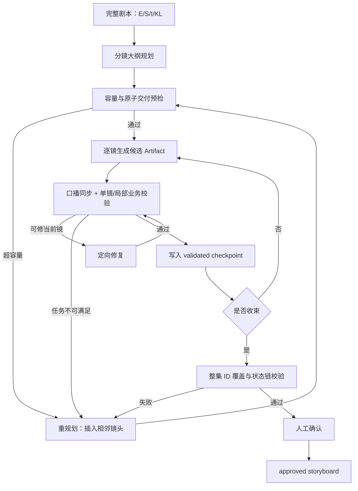

# 分镜 VAL-422 一致性与主线覆盖修复方案

> 状态：Proposed  
> 日期：2026-07-25  
> 适用范围：剧本 → 分镜大纲 → 逐镜生成 → 人工编辑 → 分镜确认  
> 关联事故：`VAL-422 · ERR-20260725-0e03d1`

## 1. 背景

第 1 集《陨落的天才》在确认分镜时同时出现以下错误：

1. 第 9 镜口播 37 字，超过 10 秒上限 36 字；
2. 同一口播超限被两个校验入口重复报告；
3. 系统判定关键台词“二儿相信，你会重新站起来，取回属于你的荣耀与尊严”丢失；
4. 系统判定“甲三七段测验力，成为新焦点，与甲一形成对比”丢失；
5. 系统判定 S04、S07 两条 `must_keep` 主线节拍未覆盖。

复盘数据库、候选 Artifact、逐镜修复记录和最终分镜后确认：这不是单一的模型漏写问题，而是规划、数据合同、校验和持久化四层同时失配。

### 1.1 事故事实

- 第 9 镜大纲要求同镜承载三段语义：甲一自嘲、二儿“放下/拿起”、二儿“重新站起来”。
- 模型首轮输出实际口播 65 字；修复轮压缩到 37 字，仍比 10 秒硬上限多 1 字。
- 第 9 镜候选中的 `audio_timeline` 已含“相信你会重新站起来，取回荣耀与尊严”，但后续部分编辑保存后，`dialogues` 与 `source_excerpt` 变成另一版本，三个字段发生分叉。
- 第 5、6 镜已经通过可见动作表达 S04；第 9、10 镜已经表达 S07，但现有二元字组匹配得分分别为 0.216、0.333，未达到 0.34 阈值。
- 第 9、10 镜均以 `WARNING_CANDIDATE / stalled` 结束，但仍进入主分镜表；人工编辑保存又只做 Schema 校验，未做业务硬校验，却生成了 `human passed / T4` 证据。
- 最终确认门第一次同时读取全量镜头并执行整集主线校验，因此一次暴露全部残余问题。

## 2. 根因

### R1：口播存在多个真相源

当前链路同时保存：

- `dialogues`：角色、台词、情绪、delivery；
- `audio_timeline`：起止时间、类型、说话人、台词、口型同步；
- `source_excerpt`：原文审计证据。

但不同模块读取口径不同：

- 口播字数优先读取 `audio_timeline`；
- 关键台词覆盖读取 `dialogues + action_desc + source_excerpt`；
- `ensure_audio_timeline` 只补空字段，不校验或修复已存在的字段分叉。

结果是同一镜头可以被同时判定为“有 37 字口播”和“关键台词不存在”。

### R2：大纲容量规划与逐镜修复权限冲突

大纲允许把超过单镜最大口播容量的多个必保留台词分给同一镜。逐镜修复提示虽然建议“拆镜”，但当前任务合同只允许返回一个固定 `shot_no`，不能修改大纲或插入相邻镜头。

这会形成不可满足合同：

```text
必须保留全部关键台词
AND 只能输出当前一镜
AND 当前镜头最长 10 秒 / 最多 36 字
AND 必保留台词总量 > 36 字
```

模型只能删关键内容或继续超限，两者都会失败。

### R3：主线覆盖使用字面相似度代替结构化交付

现有主线校验把 `who + does + turn` 拼成文本，再以二元字组覆盖率判断。该方法存在三类误判：

1. 同义表达误判，例如“人群赞叹、甲一低头不语”没有逐字出现“成为新焦点、形成对比”；
2. 跨镜拆分误判，例如 S04 的“测出七段”和“望向甲一后不过去”分别落在第 5、6 镜；
3. 抽象 `turn` 拉低得分，例如“新天才崛起、旧天才被弃”属于导演/剧情解释，不一定逐字进入 `action_desc`。

报错文案声称“每条 spine 至少落地一镜”，实际算法却没有基于 `spine_beat_id` 建立镜头归属，也没有验证相邻镜头共同交付。

### R4：失败候选先落库，业务校验后置

逐镜 AgentLoop 允许 `allow_warning_candidate=True`。候选退出后，流程先写入 `shots`，再检查 `residual_errors`。因此带 blocker 的候选也可能成为后续镜头上下文。

人工编辑入口只运行 Schema 校验，不运行：

- 单镜口播容量；
- `dialogues/audio_timeline` 一致性；
- 当前镜头的大纲 covers；
- 相邻状态链；
- 最终镜的整集主线覆盖。

编辑保存随后直接写入 `human passed / hard_gate_passed / T4`，导致“人改过”被错误等同于“业务规则已通过”。

### R5：同一规则重复注册

`validate_storyboard` 既调用 `speech_capacity_errors`，又在内部重新执行一次相同的字数判断，造成同一根因输出两条不同文案。

## 3. 产品目标

### 3.1 P0 目标

1. 同一镜头只有一套有效口播内容，所有字数、关键台词、编译和 UI 使用同一口径。
2. 超过 10 秒容量的必保留内容必须在大纲或自动重规划阶段拆镜，不进入无法完成的逐镜修复循环。
3. `must_keep` 覆盖以稳定 ID 和交付台账为主，不再以全局字面相似度作为主判据。
4. 任何带 blocker 的候选不得进入已通过 checkpoint，不得被后续镜头视为已确认上下文。
5. 人工编辑必须重新通过确定性业务校验；“人工修改”不能单独满足 hard gate。
6. 同一规则、同一主体只展示一条诊断。

### 3.2 P1 目标

1. 支持在逐镜修复中返回 `NEEDS_REPLAN`，由系统自动插入相邻镜头并重排后续 `shot_no`。
2. 为旧分镜提供口播冲突检测、人工选择和安全迁移能力。
3. UI 能区分“草稿候选”“结构通过”“业务通过”“人工确认”。
4. 监控确认门才首次发现的缺陷比例，推动校验前移。

### 3.3 非目标

- 不降低 10 秒 36 字的当前口播容量标准；
- 不通过删除 `must_keep` 台词或剧情规避错误；
- 不将所有同义词硬编码进关键词表；
- 不引入新的通用工作流框架；
- 不在本方案中改造 TTS、字幕或视频模型能力。

## 4. 核心设计

## 4.1 统一有效口播合同

新增领域函数，所有模块必须调用，不得各自拼装台词：

```python
effective_spoken_segments(shot) -> list[SpokenSegment]
synchronize_spoken_contract(shot, changed_fields, voice_bible=None) -> SyncResult
validate_spoken_contract(shot) -> list[Issue]
```

建议结构：

```python
class SpokenSegment(BaseModel):
    speaker_id: str
    text: str
    delivery: Literal["spoken_dialogue", "offscreen_voice"]
    emotion: str
    start_s: float | None = None
    end_s: float | None = None
    lip_sync: bool = True
    voice_canonical: str = ""
```

### 4.1.1 同步规则

保留现有数据库字段以减少迁移范围，但建立以下铁律：

| 输入场景 | 处理规则 |
|---|---|
| LLM 同时返回 `dialogues` 与 `audio_timeline` | 逐段校验说话人、文本、delivery、顺序一致；不一致即 blocker，不静默选一边 |
| 人工只修改 `dialogues` | 以修改后的 `dialogues` 重建 `audio_timeline` |
| 人工只修改 `audio_timeline` | 从真实口播轨派生 `dialogues` |
| 人工同时修改两者 | 必须完全一致，否则 422 并返回具体差异 |
| 旧数据仅有 `dialogues` | 构建 `audio_timeline` |
| 旧数据仅有 `audio_timeline` | 派生 `dialogues` |
| 旧数据两者冲突 | 标记 `SPOKEN_CONTRACT_CONFLICT`，禁止确认，不静默覆盖 |

### 4.1.2 统一读取规则

以下功能全部改读 `effective_spoken_segments`：

- `spoken_chars_from_shot`；
- 关键台词覆盖；
- 声轨统计；
- `audio_cast`；
- Seedance prompt 编译；
- UI 台词预览；
- 人工确认门。

`source_excerpt` 只作为来源审计证据，不能再作为“关键台词已经实际说出”的通过依据。关键台词必须出现在有效口播段中；剧情点可以由有效口播段或可见动作交付。

### 4.1.3 一致性 Issue

新增稳定错误码：

- `SPOKEN_CONTRACT_CONFLICT`：两个字段文本或顺序不一致；
- `SPOKEN_TIMELINE_OVERLAP`：时间段非法重叠；
- `SPOKEN_TIMELINE_OUT_OF_RANGE`：时间超出 `duration_s`；
- `SPOKEN_CAPACITY_EXCEEDED`：纯文字超过对应时长上限。

Issue 必须包含：`shot_no`、两侧差异、实际字数、容量、建议动作。

## 4.2 在大纲阶段执行口播容量预检

每条关键台词生成稳定 `key_line_id`，例如 `KL01`。大纲不再只把台词散文写入 `covers`，而是明确分配：

```json
{
  "shot_no": 9,
  "spine_beat_ids": ["S07"],
  "key_line_ids": ["KL03", "KL04"],
  "information_ids": [],
  "duration_s": 10
}
```

大纲校验器在进入逐镜生成前计算：

```text
required_spoken_chars = Σ content_char_count(key_line.text)
capacity = max_spoken_chars_for_duration(duration_s)
```

若 `required_spoken_chars > capacity`：

1. 先尝试把非逐字必保留台词改为经剧本批准的 `adapted_line`；
2. 若仍超限，按说话人、动作节拍和句意边界拆成相邻镜头；
3. 重新分配 `key_line_ids`、`spine_beat_ids`、状态链和后续 `shot_no`；
4. 拆分完成后重新运行整份大纲校验；
5. 未通过容量预检的大纲不得持久化为可执行大纲。

### 4.2.1 本事故的目标拆分

推荐改为两镜：

```text
镜 9：甲一自嘲回应；二儿引用“放下/拿起”的核心短句。
镜 10：二儿完整说出“相信你会重新站起来……”关键台词。
镜 11：甲一转身离场；二儿追上并肩而行。
```

“放下/拿起”若属于 `key_lines`，允许使用剧本阶段显式批准的短版，不能由逐镜模型临时删除关键语义。

## 4.3 逐镜修复支持重规划，而不是强压当前镜

逐镜校验返回结果增加：

```python
class ShotValidationOutcome(BaseModel):
    issues: list[Issue]
    disposition: Literal[
        "PASS",
        "REPAIR_CURRENT_SHOT",
        "NEEDS_REPLAN",
        "NEEDS_HUMAN"
    ]
```

判定规则：

- 结构字段缺失、轻微超纲描写：`REPAIR_CURRENT_SHOT`；
- 必保留台词最小集合超过 10 秒容量：`NEEDS_REPLAN`；
- 连续两轮仍为同一不可满足约束：`NEEDS_REPLAN`，不再继续压缩；
- 旧数据字段冲突且无法判断用户意图：`NEEDS_HUMAN`；
- 所有 blocker 清零：`PASS`。

`NEEDS_REPLAN` 由大纲重规划器处理，逐镜模型不得自行返回多个镜头，也不得删除关键内容。

## 4.4 用结构化交付替代字面主线匹配

### 4.4.1 分离三个 ID 空间

当前 `story_event_id` 中出现 S07/S08，而剧本事件使用 E1/E5，含义混用。改为：

```json
{
  "story_event_id": "E5",
  "spine_beat_ids": ["S07"],
  "information_ids": ["I5.1", "I5.2"]
}
```

- `E*`：剧本事件；
- `S*`：主线节拍；
- `I*`：观众信息交付原子；
- `KL*`：关键台词。

禁止把任一 ID 写进错误类型字段。

### 4.4.2 信息台账必须原子化

禁止一个 `information_ledger` 项同时包含多个可独立拆镜的动作。例如：

```text
错误：I3 = 甲三测出七段收获追捧，望向甲一后转身不再看
```

应拆成：

```text
I3.1 = 甲三测出测验力七段
I3.2 = 人群追捧赞叹甲三
I3.3 = 甲三望向甲一后选择不过去
I3.4 = 甲一仍独自在后排，形成处境反差
```

每个原子必须声明交付方式：

```python
delivery_owner: Literal[
    "visual_action",
    "spoken_dialogue",
    "required_text"
]
```

### 4.4.3 主线通过条件

一条 `must_keep` spine 通过，当且仅当：

1. 至少一个镜头声明对应 `spine_beat_id`；
2. 该 spine 绑定的全部必需 `information_ids/key_line_ids` 已由一个或多个相邻镜头交付；
3. 每个镜头本地交付校验通过；
4. 状态链顺序满足事件因果顺序。

允许 S04 分布在第 5、6 镜，允许 S07 分布在第 9、10 镜；不再要求复合 beat 的所有动作逐字挤进一个 `action_desc`。

### 4.4.4 文本匹配的降级定位

二元字组匹配只用于：

- 旧数据缺少稳定 ID；
- 检测模型声称交付但正文完全无证据；
- 给人工复核提供风险提示。

它不得单独产生 `must_keep missing` blocker。旧数据匹配低于阈值时输出 `LEGACY_COVERAGE_UNCERTAIN`，要求补 ID 或人工复核。

## 4.5 调整候选持久化与状态机

### 4.5.1 新状态语义

```text
candidate       模型输出，尚未通过确定性校验
needs_revision  存在 blocker，可在 UI 查看但不能成为后续上下文
validated       确定性单镜/局部业务校验通过
approved        整集业务校验通过并经人工确认
```

### 4.5.2 持久化规则

- 逐镜模型输出先写 Evidence Artifact，不直接写主 `shots`；
- 只有 `PASS` 才写入或替换主 `shots` checkpoint；
- `WARNING_CANDIDATE` 只允许包含 warning，不允许包含 blocker；
- blocker 候选保留为 `needs_revision` Artifact，UI 可展示和修复；
- 后续镜头上下文只读取 `validated/approved` checkpoint；
- 不得先 `_insert_storyboard_shot` 再判断 residual。

### 4.5.3 AgentLoop 规则

- `allow_warning_candidate=True` 只接受 severity=`warning`；
- 任一 severity=`blocker` 时 `hard_gate_passed=false`；
- 相同 blocker 连续两轮无可行修复时返回 `NEEDS_REPLAN`；
- 退出原因、残余 Issue、候选 Artifact ID 必须持久化，但不得伪装成已通过镜头。

## 4.6 人工编辑必须重新通过业务校验

`PUT /shots/{shot_id}` 保存流程调整为：

1. 合并 Patch；
2. Schema 校验；
3. 执行 `synchronize_spoken_contract`；
4. 单镜硬校验；
5. 大纲 covers / ID 交付校验；
6. 前后相邻镜头状态链校验；
7. 若编辑的是最终镜或当前集已经收束，执行整集主线校验；
8. 通过后写主表与 `validated` Artifact；
9. 失败则返回 422，保留用户草稿但不覆盖已通过 checkpoint。

“人工编辑”只记录来源：

```json
{
  "evaluator_type": "human",
  "decision": "authored_or_reviewed",
  "hard_gate_passed": false
}
```

只有确定性 Evaluation 通过后，Artifact 才能标为 `validated`。只有整集确认成功后，人工 `approve` 才能将整集 Artifact 提升为 `approved/T4`。

## 4.7 统一 Issue 与去重

每条规则使用稳定 `rule_id`：

- `SHOT.SPOKEN.CAPACITY`
- `SHOT.SPOKEN.COHERENCE`
- `SHOT.OUTLINE.DELIVERY`
- `EPISODE.KEY_LINE.COVERAGE`
- `EPISODE.SPINE.COVERAGE`

去重键：

```text
(rule_id, episode_id, shot_no or spine_beat_id, normalized_evidence)
```

`speech_capacity_errors` 成为口播容量的唯一实现；删除 `validate_storyboard` 内重复计算。UI 对同一去重键只显示一条主错误，可在详情中展示来自哪些门禁。

## 5. 新流程



## 6. 兼容与迁移

### 6.1 旧数据读取

加载旧 Shot 时运行只读审计：

1. 比较 `dialogues` 与真实口播 timeline；
2. 相同则标记 `spoken_contract_status=coherent`；
3. 仅一侧存在则构建缺失侧，生成迁移预览；
4. 两侧冲突则标记 `conflict`，不得自动确认；
5. 已有付费视频的镜头不得静默修改口播，必须人工选择“以已生成视频时间线为准”或“以分镜台词为准并使视频失效”。

### 6.2 旧 ID

- `story_event_id` 若值为 `S*`，迁移到 `spine_beat_ids`；
- 根据 screenplay `events` 和 outline 上下文回填真正的 `E*`；
- 无法确定时置空并标记 `legacy_unvalidated=true`；
- 不通过猜测把多个事件合并成一个 ID。

### 6.3 本事故数据修复

对 `ep_23517af4b5a8`：

1. 将第 9 镜标记为 `SPOKEN_CONTRACT_CONFLICT`；
2. 以剧本 `key_lines` 和用户确认版本重建有效口播段；
3. 将当前第 9 镜拆成两镜，原第 10 镜顺延；
4. 为第 5、6 镜回填 `spine_beat_ids=[S04]` 和原子信息 ID；
5. 为新的对话镜与离场镜回填 `S07/S08`、`E5`；
6. 全集重新运行单镜容量、状态链、key line、spine 和确认门；
7. 不复用旧的错误 T4 checkpoint 作为“已通过”证据。

## 7. 接口与模型调整

### 7.1 Schema

`Shot` / `StoryboardOutlineShot` 增加：

```python
spine_beat_ids: list[str] = []
key_line_ids: list[str] = []
information_ids: list[str] = []
spoken_contract_status: Literal["coherent", "conflict", "legacy"] = "legacy"
```

继续兼容现有 `new_information_ids` 一个版本周期，但内部立即归一到 `information_ids`。

### 7.2 编辑接口

编辑失败响应示例：

```json
{
  "code": "SPOKEN_CONTRACT_CONFLICT",
  "category": "validation",
  "issues": [
    {
      "rule_id": "SHOT.SPOKEN.COHERENCE",
      "shot_no": 9,
      "dialogues_text": "……",
      "timeline_text": "……",
      "repair_options": [
        "rebuild_timeline_from_dialogues",
        "rebuild_dialogues_from_timeline"
      ]
    }
  ]
}
```

### 7.3 逐镜生成接口

内部结果允许：

```json
{
  "disposition": "NEEDS_REPLAN",
  "reason": "required_spoken_chars_exceed_max_capacity",
  "shot_no": 9,
  "required_chars": 65,
  "max_chars": 36,
  "movable_key_line_ids": ["KL04", "KL05"]
}
```

## 8. 验收标准

### 8.1 口播一致性

- 任一保存成功的镜头，`dialogues` 与 `audio_timeline` 的真实口播段在说话人、文本、顺序、delivery 上 100% 一致。
- 字数校验、关键台词校验、prompt 编译读取相同的有效口播段。
- 本事故第 9 镜不得再出现“容量从 timeline 统计、丢词从 dialogues 统计”的矛盾诊断。
- 同一镜头同一口播容量问题只报告一次。

### 8.2 大纲与重规划

- 任一大纲镜头的必保留口播最小集合不得超过该镜 `duration_s` 容量。
- 超过 10 秒最大容量时，系统必须在逐镜生成前拆镜。
- 逐镜模型不得因“当前只输出一镜”而被要求执行无法完成的拆镜动作。
- 本事故 65 字任务自动重规划后，每镜均不超过 36 字且全部关键台词仍被交付。

### 8.3 主线覆盖

- S04 分布在两个相邻镜头时可通过，不要求逐字出现“新焦点/形成对比”。
- S07 的“自嘲回应”和“转身离场”分布在相邻镜头时可通过。
- 任一 spine 缺少一个必需信息原子时必须失败，并精确指出缺少的 `information_id`，不得只返回整句模糊文本。
- `story_event_id` 不得再保存 `S*`；S/E/I/KL 四类 ID 不混用。

### 8.4 候选与人工编辑

- 带 blocker 的 Artifact 不得进入主 `shots` validated checkpoint。
- 后续镜头不得读取 blocker 候选作为“已通过镜头”。
- 人工编辑造成口播字段冲突时保存失败或进入独立草稿，不覆盖已通过版本。
- 人工编辑证据不能单独设置 `hard_gate_passed=true`。
- 最终确认门不再首次发现本可在大纲或单镜阶段发现的口播容量/字段一致性问题。

## 9. 测试方案

### 9.1 单元测试

1. `audio_timeline` 与 `dialogues` 相同：一致性通过。
2. timeline 有关键台词、dialogues 缺失：返回 `SPOKEN_CONTRACT_CONFLICT`，不再分别得出两个互相矛盾的业务结论。
3. 人工只编辑 dialogues：timeline 被确定性重建。
4. 人工同时提交冲突的两字段：422。
5. 37 字 / 10 秒：只返回一个 `SHOT.SPOKEN.CAPACITY`。
6. 36 字 / 10 秒：通过。
7. 关键台词只存在于 `source_excerpt`：不算真实交付。
8. S04 的信息原子分布在第 5、6 镜：通过。
9. S04 缺少“望向后不过去”原子：精确失败。
10. S07 分布在第 9、10 镜：通过。
11. `story_event_id=S07`：Schema/业务校验失败并提示应写入 `spine_beat_ids`。

### 9.2 集成测试

1. 大纲将 65 字关键口播分给一个 10 秒镜头：规划器自动拆镜后才进入逐镜生成。
2. AgentLoop 连续两轮仍超容量：返回 `NEEDS_REPLAN`，主 `shots` 不新增失败镜头。
3. 人工编辑有效镜头后破坏台词一致性：主 checkpoint 保持旧版本，草稿可恢复。
4. 最终确认第 1 集：不出现重复容量错误，不误报 S04/S07，真实缺失仍能拦截。
5. 已有视频镜头发生口播冲突：要求用户选择基准，并正确使受影响媒体失效。

### 9.3 回归样本

- 固定 `ep_23517af4b5a8` 为 golden case；
- 增加同义表达样本：追捧/赞叹、不过去/转身不再看、离场/向广场外走；
- 增加一条 spine 跨 2~3 镜交付样本；
- 增加关键台词精简版经剧本批准、未经批准两组样本。

## 10. 可观测性

新增指标：

| 指标 | 目标 |
|---|---:|
| `spoken_contract_conflict_total` | 新生成数据为 0 |
| `blocker_candidate_persisted_total` | 0 |
| `confirm_first_seen_capacity_error_total` | 0 |
| `confirm_first_seen_spoken_conflict_total` | 0 |
| `storyboard_replan_due_to_capacity_total` | 可观测，不设为 0 |
| `spine_coverage_legacy_fallback_total` | 随迁移逐步下降 |
| 重复 Issue 比例 | 0% |

每次 `NEEDS_REPLAN` 记录：episode、shot、required chars、capacity、key line IDs、重规划前后镜头数，不记录未脱敏外部凭据。

## 11. 实施拆分

### P0-1：统一口播合同

- 实现 `effective_spoken_segments`；
- 实现双向同步与冲突校验；
- 字数、关键台词、声轨、编译统一调用；
- 删除重复口播容量实现。

### P0-2：保存与候选门禁

- 调整逐镜持久化顺序；
- blocker candidate 不进入主 checkpoint；
- `edit_shot` 增加业务校验；
- 人工证据与 hard gate 解耦。

### P0-3：容量预检与重规划

- key line 稳定 ID；
- 大纲容量预检；
- `NEEDS_REPLAN` 结果；
- 相邻镜头插入与状态链重排。

### P0-4：结构化主线覆盖

- 分离 E/S/I/KL ID；
- 信息台账原子化；
- spine 跨镜聚合校验；
- 二元字组降级为 legacy fallback。

### P1：迁移、UI 与监控

- 旧口播冲突修复 UI；
- 候选/待修改/已验证/已确认状态展示；
- 旧 ID 迁移工具；
- 指标和 golden 回归报表。

## 12. 发布策略

1. 先以 feature flag 启用口播一致性审计，只记录不阻断；
2. 修复当前 golden case 与现有冲突数据；
3. 对新生成镜头启用强制一致性和候选门禁；
4. 启用大纲容量预检与 `NEEDS_REPLAN`；
5. 启用结构化 spine hard gate；
6. 最后关闭旧二元字组 blocker，仅保留 legacy warning；
7. 连续 50 集无新数据冲突、无 blocker 候选落库后移除 feature flag。

## 13. 完成定义

本方案完成必须同时满足：

- 当前事故集可在不删除主线内容的情况下通过确认；
- 第 9 镜超容量被重规划解决，而不是通过调高上限或吞台词解决；
- S04/S07 使用结构化交付正确通过；
- 故意删除任一关键台词或信息原子仍能稳定失败；
- 人工编辑不能制造已标 T4 但业务不合法的镜头；
- 所有新增与回归测试通过；
- 确认门不再输出重复口播错误；
- 监控能够追踪重规划、字段冲突和 legacy fallback。
