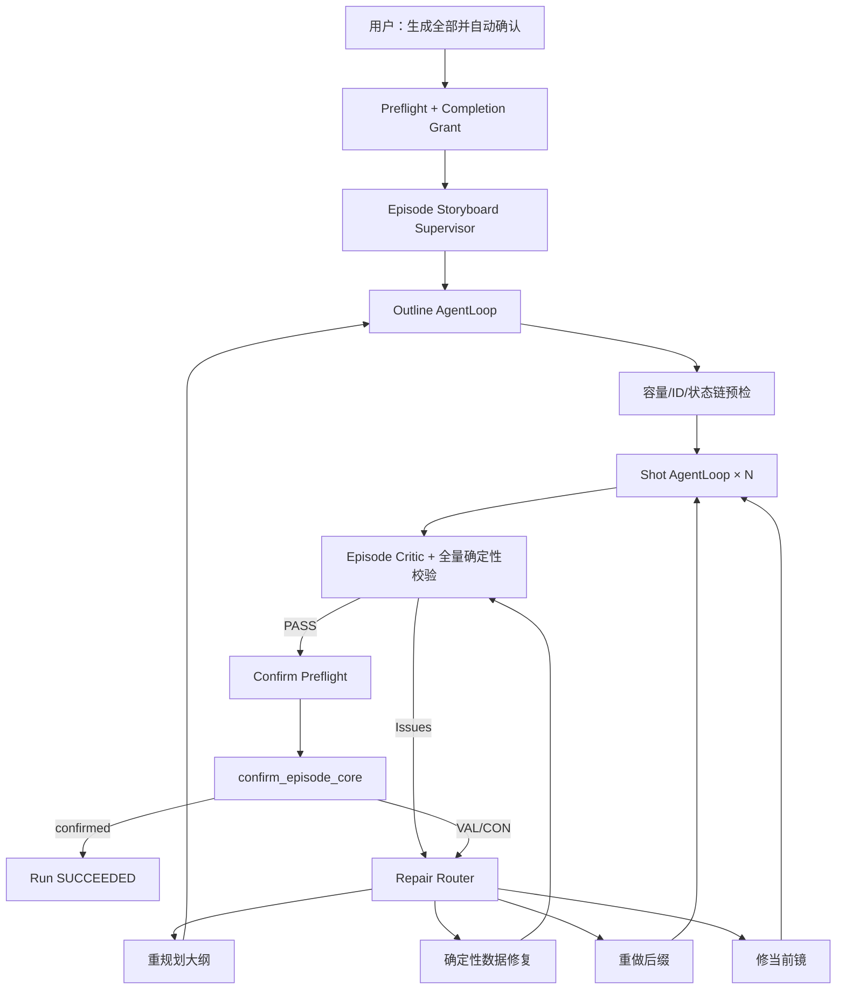

# 分镜全集 Supervisor AgentLoop 与自动确认方案

> 状态：Proposed  
> 日期：2026-07-25  
> 目标：一次启动，自动生成整集分镜；失败后自动诊断、修复、重规划、续跑，直到全量校验通过并自动确认分镜  
> 前置方案：[分镜 VAL-422 一致性与主线覆盖修复方案](./分镜VAL-422一致性与主线覆盖修复方案.md)

## 1. 结论

可以将“生成所有分镜”改造成一个集级、持久化、可恢复的 Supervisor AgentLoop。

本方案不是把现有单镜 AgentLoop 的重试次数设得更大，而是在它外层增加一个“以整集通过并确认”为唯一成功条件的 Supervisor：

```text
集级 Supervisor AgentLoop
├─ 大纲 AgentLoop
├─ 单镜 AgentLoop × N
├─ 整集 Critic / 确定性校验
├─ Repair Router（决定修当前镜、重做后缀、重规划大纲）
├─ Checkpoint / 服务重启恢复
└─ Confirm Gate（全量通过后自动确认）
```

用户选择“生成全部并自动确认”后，正常的内容或校验失败不再把任务结束为 `PARTIAL/scripted with error`。Supervisor 会读取结构化 Issue，选择最小修复范围并继续运行。只有以下情况暂停：

- 用户主动取消；
- 上游剧本/人物谱发生外部修改，原授权指纹失效；
- Provider 长时间不可用，进入可自动恢复的 `PAUSED_EXTERNAL`；
- 预算或运维熔断；
- 发现无法在分镜层安全解决的上游矛盾，需要用户决定是否修改剧本。

成功的唯一业务定义：

```text
整集 Storyboard Artifact 全量 hard gate 通过
AND confirm_episode_core 幂等执行成功
AND episode.status == confirmed
```

## 2. 当前问题

### 2.1 已有 AgentLoop 只覆盖单个生成阶段

当前大纲和每个镜头分别使用 `AgentLoop`，能够进行有限轮定向修复，但 `_storyboard_task` 本身仍是普通过程循环。单镜循环退出后，外层流程主要做三件事：

1. 保存候选镜头；
2. 根据 residual 决定继续或停止；
3. 以 `scripted + script_error` 或 `PARTIAL` 结束。

因此，系统拥有“局部修复器”，但没有一个持续负责“整集最终跑通”的 Agent。

### 2.2 单镜失败无法升级为跨镜修复

口播容量、主线覆盖、状态链等问题经常需要：

- 插入相邻镜头；
- 移动关键台词；
- 重排大纲；
- 从第 N 镜重做后缀；
- 修复前一镜的 `state_out` 与后一镜的 `state_in`。

当前单镜 AgentLoop 只能输出固定 `shot_no`，无法修改大纲和已通过前缀，所以会在不可满足任务上反复压缩或停滞。

### 2.3 整集问题发现太晚

关键台词、spine、剧情点和最终收束主要在末镜或确认门检查。此前每镜都可能局部合法，但整集仍不完整。外层没有把确认失败重新转成 Repair Plan，而是直接向用户返回 `VAL-422`。

### 2.4 恢复语义是“续跑下一镜”，不是“恢复整集目标”

现有 `resume_storyboard` 从最后一个已保存 checkpoint 继续。如果错误位于第 5 镜，而当前已生成到第 10 镜，只从第 11 镜继续无法解决问题，还可能制造计划外补镜。

### 2.5 确认门默认要求人工再次点击

`storyboard.confirm` 当前属于高风险命令，原因是确认后会解锁付费视频阶段。即使所有分镜已通过，现有生成任务也不会自动调用确认门。

## 3. 产品目标

### 3.1 P0 目标

1. 用户一次启动即可无人值守完成“整集生成 → 自动修复 → 全量校验 → 自动确认”。
2. 正常业务校验失败不得结束任务；必须转为结构化修复动作并继续。
3. 单镜修复失败能够升级为重做后缀或重规划大纲。
4. 每个已通过镜头和每轮整集状态均有持久化 checkpoint，服务重启后自动恢复。
5. 自动确认只能发生在全量 hard gate 通过之后。
6. 自动确认是幂等的，不重复写 Gate、不重复失效 Artifact、不启动付费视频。
7. 默认人工确认模式保持不变；自动确认必须由用户在启动时显式授权。

### 3.2 P1 目标

1. UI 显示 Supervisor 当前状态、修复层级、问题清单、已验证前缀与预计剩余工作。
2. 支持暂停、继续、取消和切换为人工处理。
3. 支持从最小失效边界重做，不因一个后段错误重生成全部镜头。
4. 对重复失败执行策略升级和熔断，避免无意义死循环。
5. 支持批量剧集以独立 Supervisor 并发运行。

### 3.3 非目标

- 自动确认后不自动生成关键帧或视频；
- 不自动修改人物谱、小说原文或已确认剧本；
- 不以无限高频重试实现“直到成功”；
- 不允许带 blocker 的 warning candidate 被当作已通过镜头；
- 不用一个超长 LLM 调用一次生成整集最终分镜；
- 不绕过 `confirm_episode_core` 的确定性校验。

## 4. 用户模式与授权

## 4.1 两种完成模式

“生成所有分镜”提供两种明确模式：

| 模式 | 行为 | 完成状态 |
|---|---|---|
| 生成并等待确认 | 自动生成和修复整集，跑通后停在分镜台 | `scripted_ready` |
| 生成并自动确认 | 自动生成和修复整集，跑通后调用确认门 | `confirmed` |

默认仍为“生成并等待确认”。用户必须主动选择“生成并自动确认”。

## 4.2 一次性前置授权

选择自动确认时，启动前展示：

- 剧集名称和 episode ID；
- 当前剧本 Artifact 版本；
- 将自动修改/重排的范围仅限本集分镜；
- 确认后将解锁付费视频能力；
- 本任务不会自动提交任何付费视频生成；
- 取消入口和任务运行状态。

用户点击启动即签发一次性 `StoryboardCompletionGrant`：

```python
class StoryboardCompletionGrant(BaseModel):
    grant_id: str
    episode_id: str
    project_id: str
    screenplay_artifact_id: str
    bible_artifact_id: str | None
    permission: Literal["storyboard.generate_and_confirm"]
    issued_by: str
    issued_at: float
    expires_at: float
    consumed_at: float | None = None
    revoked_at: float | None = None
```

授权允许 Supervisor 在预期输入版本范围内产生任意数量的分镜修订，并在全量通过后确认一次。它不授权：

- 修改剧本或人物谱；
- 生成付费视频；
- 确认其他剧集；
- 在上游版本改变后继续确认。

## 4.3 授权失效

以下情况自动确认授权失效并进入 `WAITING_AUTHORIZATION`：

- `screenplay_artifact_id` 改变；
- `bible_artifact_id` 改变且影响本集角色/场景；
- 用户撤销授权；
- 用户在运行期间手动编辑已验证前缀，且编辑不属于当前 run；
- 授权过期。

Supervisor 自己生成的大纲和镜头版本变化不使授权失效。

## 5. 总体架构



## 5.1 分层职责

### 集级 Supervisor

负责：

- 维护最终目标和运行状态；
- 调用大纲、单镜和整集 Critic；
- 读取结构化 Issue 并选择 Repair Strategy；
- 计算最小失效边界；
- 持久化 supervisor checkpoint；
- 管理重试、暂停、恢复和取消；
- 通过后执行自动确认。

Supervisor 不直接创作分镜正文。

### 大纲 AgentLoop

负责：

- 规划全局节奏和状态链；
- 分配 E/S/I/KL ID；
- 执行口播容量预检；
- 按 Repair Plan 插入、合并或移动镜头任务；
- 输出可执行大纲 Artifact。

### 单镜 AgentLoop

负责：

- 在固定大纲任务内生成或修复单镜；
- 通过单镜结构、渲染性、口播和局部 covers 校验；
- 只在 hard gate 通过后提交 validated checkpoint。

### Episode Critic

由确定性校验为主、模型语义审阅为辅：

- 全量 key line、spine、information ledger；
- 相邻状态链和最终收束；
- 口播合同一致性；
- 重复剧情、计划外镜头、drop list；
- 总时长与镜头节奏；
- 是否具备确认条件。

模型 Critic 只能产生 warning 或结构化修复建议，不能覆盖确定性 hard gate。

### Repair Router

将 Issue 映射为确定性的修复范围和策略，避免让 LLM 自由决定是否重做全片。

## 6. Supervisor 状态机

```text
CREATED
  → PREFLIGHT
  → PLANNING_OUTLINE
  → VALIDATING_OUTLINE
  → GENERATING_SHOTS
  → VALIDATING_EPISODE
  → REPAIRING
  → PREPARING_CONFIRM
  → CONFIRMING
  → SUCCEEDED

任意活动状态可转：
  → WAITING_RETRY
  → PAUSED_EXTERNAL
  → PAUSED_BUDGET
  → WAITING_AUTHORIZATION
  → WAITING_HUMAN
  → CANCELLED
```

### 6.1 成功状态

只有以下两种成功结果：

- `SUCCEEDED_READY_FOR_CONFIRM`：用户选择人工确认；
- `SUCCEEDED_CONFIRMED`：用户选择自动确认且确认成功。

不得再把含 blocker 的分镜任务结束为“部分成功”。候选可以保留，但 run 仍是 `REPAIRING/WAITING_*`。

### 6.2 暂停不是失败

Provider 故障、服务重启、预算熔断和授权失效均进入可恢复状态，不把业务目标标记为失败。恢复后从最近 Supervisor Checkpoint 继续。

## 7. Supervisor Checkpoint

复用现有 `workflow_runs / step_runs / artifacts / evaluations / run_events`，新增 Artifact 类型：

```text
storyboard_supervisor_checkpoint
```

内容：

```json
{
  "episode_id": "ep_x",
  "goal": "generate_and_confirm",
  "phase": "GENERATING_SHOTS",
  "repair_epoch": 2,
  "outline_artifact_id": "art_outline_v3",
  "validated_shot_artifact_ids": ["art_s1", "art_s2"],
  "validated_prefix_end": 2,
  "next_shot_no": 3,
  "expected_total": 11,
  "coverage": {
    "spine": ["S01", "S02"],
    "information": ["I1", "I2"],
    "key_lines": ["KL01"]
  },
  "pending_issue_ids": [],
  "issue_fingerprint_counts": {},
  "completion_grant_id": "grant_x",
  "input_versions": {
    "screenplay_artifact_id": "art_screenplay",
    "bible_artifact_id": "art_bible"
  }
}
```

### 7.1 写 checkpoint 的时机

- 大纲通过后；
- 每个镜头 validated 后；
- Episode Critic 完成后；
- Repair Plan 确定后；
- 进入任一 WAITING/PAUSED 状态前；
- 自动确认前后。

### 7.2 恢复原则

恢复时不能只看数据库里最后一个 `shot_no`，而要读取最新 Supervisor Checkpoint：

1. 校验上游 Artifact 版本；
2. 验证 checkpoint 引用的镜头 Artifact 仍为 active/validated；
3. 重建覆盖台账；
4. 从 `phase + validated_prefix_end + Repair Plan` 恢复；
5. 不重复提交已成功的镜头；
6. 若上次停在 `CONFIRMING`，先幂等查询当前 episode 状态，再决定补执行还是直接成功。

## 8. 主循环

伪代码：

```python
async def run_storyboard_supervisor(ctx):
    while not ctx.cancelled:
        assert_input_versions(ctx)

        if ctx.needs_outline:
            ctx.outline = await run_outline_loop(ctx)
            validate_executable_outline(ctx.outline)
            checkpoint(ctx)

        while ctx.has_unvalidated_shot_tasks:
            task = ctx.next_shot_task()
            outcome = await run_shot_loop(task, ctx.validated_context)

            if outcome.disposition == "PASS":
                commit_validated_shot(outcome)
                ctx.advance()
                checkpoint(ctx)
                continue

            plan = repair_router.route(outcome.issues, ctx)
            apply_repair_plan(plan, ctx)
            checkpoint(ctx)
            break

        if ctx.has_unvalidated_shot_tasks:
            continue

        issues = validate_full_episode(ctx)
        if issues:
            plan = repair_router.route(issues, ctx)
            apply_repair_plan(plan, ctx)
            checkpoint(ctx)
            continue

        if ctx.completion_mode == "ready_for_confirm":
            return succeed_ready(ctx)

        confirm_outcome = confirm_idempotently(ctx)
        if confirm_outcome.passed:
            return succeed_confirmed(ctx)

        plan = repair_router.route(confirm_outcome.issues, ctx)
        apply_repair_plan(plan, ctx)
        checkpoint(ctx)
```

关键要求：确认门返回的 `VAL-422` 必须被解析成标准 Issue，重新进入 Repair Router，而不是结束任务。

## 9. Repair Router

## 9.1 修复层级

从最小改动到最大改动逐级升级：

| 层级 | 策略 | 典型问题 | 失效范围 |
|---|---|---|---|
| L0 | 确定性归一 | transition、timeline 派生、去重、合法默认值 | 当前镜 |
| L1 | 修当前镜 | Schema、超纲细节、局部 covers、轻微口播超限 | 当前镜 |
| L2 | 修相邻窗口 | 状态链、台词分担、跨镜重复 | `N-1..N+1` |
| L3 | 重做后缀 | 前缀正确但后续节奏/覆盖失败 | 从最早错误镜到末镜 |
| L4 | 重规划大纲 | 容量不可满足、spine 分配错误、计划镜头不足 | 大纲 + 受影响后缀 |
| L5 | 等待上游决策 | 剧本互相矛盾、人物谱缺关键角色 | 不自动越权修改 |

### 9.1.1 最早失效边界

Repair Router 必须计算 `invalidation_frontier`：

```text
min(
  Issue 指向的 shot_no,
  被移动 key line 当前所属 shot_no,
  状态链第一个不一致位置,
  大纲结构发生变化的第一个位置
)
```

只保留 frontier 之前仍通过且输入未改变的 validated prefix。frontier 及其后续镜头转为 superseded/stale，由 Supervisor 重做。

## 9.2 Issue 路由表

| Issue code | 首选策略 | 升级条件 |
|---|---|---|
| `JSON/SCHEMA_INVALID` | L1 当前镜 repair | 两轮仍无法解析 → 换 provider/PAUSED_EXTERNAL |
| `SPOKEN_CAPACITY_EXCEEDED` | 若可删非关键口水话则 L1；否则 L2/L4 拆镜 | 必保留最小集合仍超限 |
| `SPOKEN_CONTRACT_CONFLICT` | L0 同步；意图不明确则 WAITING_HUMAN | 已有付费媒体或两侧均人工修改 |
| `SHOT_OUTLINE_COVERAGE` | L1 当前镜 | covers 本身不可单镜完成 → L4 |
| `STATE_CHAIN_INVALID` | L2 修相邻窗口 | 状态变化来自大纲错误 → L4 |
| `KEY_LINE_MISSING` | L2 移入邻镜 | 无合法容量 → L4 |
| `SPINE_MISSING` | L3 后缀补齐 | spine 未分配/容量不足 → L4 |
| `DROP_LIST_REINTRODUCED` | L1 删除当前镜支线 | 多镜扩散 → L3 |
| `PLAN_EXHAUSTED_NOT_FINAL` | L4 重规划收束 | 上游无真实结尾 → L5 |
| `PROVIDER_UNAVAILABLE` | WAITING_RETRY/PAUSED_EXTERNAL | 达到运维熔断阈值 |
| `UPSTREAM_VERSION_CHANGED` | WAITING_AUTHORIZATION | 新授权后重新规划或计算 frontier |

## 9.3 防止死循环

“直到跑通”表示目标持久存在，不表示单进程无限高速循环。

### 内循环必须有界

- 大纲一次 AgentLoop 最多 4 轮；
- 单镜一次 AgentLoop 最多 4 轮；
- 相同 Issue fingerprint 连续 2 轮视为 stalled；
- stalled 不返回 warning 通过，必须升级修复层级。

### 外循环按 repair epoch 运行

建议每次激活最多 6 个 repair epoch：

1. 当前镜修复；
2. 相邻窗口修复；
3. 后缀重做；
4. 大纲局部重规划；
5. 大纲整版重规划；
6. 更换策略/模型后最后一轮。

仍未通过时：

- Provider/基础设施原因 → `PAUSED_EXTERNAL`，按退避自动唤醒；
- 上游业务矛盾 → `WAITING_HUMAN`；
- 不得保存为“已完成但有 warning”；
- 用户可点击“继续自动修复”开启新激活周期，但保留全部历史和 fingerprint。

## 10. 大纲与单镜子循环调整

## 10.1 大纲必须可执行

大纲通过条件不再只是 JSON 合法和镜头数合理，还必须包括：

- 所有 must_keep spine 有 `spine_beat_ids` 分配；
- 所有关键台词有 `key_line_ids` 分配；
- 所有信息原子有唯一首交付镜头；
- 每镜必保留口播不超过其最大容量；
- 相邻 `state_out → state_in` 可承接；
- 最后一镜落到真实结尾；
- 不包含 drop list；
- E/S/I/KL ID 不混用。

不可执行大纲不得进入单镜循环。

## 10.2 单镜 warning 不得污染 checkpoint

- `allow_warning_candidate=True` 只能接受非 blocker warning；
- blocker candidate 仅保存为 candidate Artifact；
- 主 `shots` 只保存 validated checkpoint；
- 后续镜头只读取 validated prefix；
- 单镜返回 `NEEDS_REPLAN` 时由 Supervisor 接管，不能在当前镜继续压缩。

## 10.3 已通过前缀不可无故重写

除非 Repair Plan 的 frontier 落入前缀，否则已通过镜头内容哈希保持不变。模型 prompt 只接收最后必要承接镜、覆盖台账和当前任务，不把整份已通过分镜全部交给模型重写。

## 11. 整集 Critic 与确认闭环

## 11.1 确认前评估

Supervisor 自己先运行与 `confirm_episode_core` 完全同源的纯校验函数：

```python
evaluate_storyboard_for_confirmation(
    episode,
    storyboard,
    screenplay,
    bible,
) -> ConfirmationEvaluation
```

该函数不得写数据库。`confirm_episode_core` 复用同一函数，避免“Supervisor 认为通过、确认门又用另一套规则失败”。

## 11.2 自动确认步骤

1. 验证 Completion Grant；
2. 获取当前 screenplay/bible/storyboard Artifact IDs；
3. 执行只读 confirm evaluation；
4. 生成最终 storyboard Artifact；
5. 以 `idempotency_key = episode_id + storyboard_artifact_hash` 调用内部确认命令；
6. 事务内再次验证 Artifact hash 未变化；
7. 写 Gate Decision、`episode.status=confirmed`；
8. 消耗 Completion Grant；
9. 记录 `AUTO_CONFIRMED_BY_SUPERVISOR` 事件；
10. Supervisor run 标记 `SUCCEEDED_CONFIRMED`。

## 11.3 确认失败不是终止

若确认返回：

- `VAL-422`：转换为 Issue，进入 Repair Router；
- `CON-409`：重新读取版本；若是内部并发则按新 frontier 修复，若是外部编辑则等待授权；
- 技术异常：进入 `WAITING_RETRY/PAUSED_EXTERNAL`；
- 已是 `confirmed` 且 Artifact hash 相同：视为幂等成功；
- 已是 `confirmed` 但 hash 不同：停止并告警，禁止覆盖。

## 11.4 不自动进入付费生成

自动确认只改变分镜 Gate 状态。参考图、关键帧、视频、成片仍需独立命令和独立预算授权。UI 文案必须明确：

```text
分镜已自动确认，已具备生成视频条件；尚未产生视频费用。
```

## 12. API 与能力目录

## 12.1 扩展生成输入

```python
class StoryboardGenerateInput(StandardCommandInput):
    episode_id: str
    mode: Literal["fresh", "resume"] = "fresh"
    completion_mode: Literal[
        "ready_for_manual_confirm",
        "auto_confirm"
    ] = "ready_for_manual_confirm"
    completion_grant_id: str | None = None
```

### REST

```http
POST /api/episodes/{episode_id}/storyboard
```

```json
{
  "mode": "fresh",
  "completion_mode": "auto_confirm",
  "approval_token": "...",
  "idempotency_key": "..."
}
```

### 返回

```json
{
  "status": "accepted",
  "run_id": "run_x",
  "goal": "generate_and_confirm",
  "resource_uri": "manju://runs/run_x"
}
```

## 12.2 风险等级

- `ready_for_manual_confirm`：沿用生成分镜风险等级；
- `auto_confirm`：启动命令按 R3 预检并要求一次明确确认；
- Supervisor 内部最终确认使用该 grant，不再二次弹窗；
- grant 不能被其他命令复用。

## 12.3 控制命令

复用 `run.control`：

- `pause`：完成当前安全步骤后暂停；
- `resume`：从 Supervisor Checkpoint 恢复；
- `cancel`：撤销 grant，保留已验证 checkpoint；
- `retry_now`：跳过当前外部退避；
- `handoff_to_human`：停止自动修复，保留问题与候选。

## 13. 数据模型

优先复用现有表，新增最小字段：

### `episodes`

```text
active_storyboard_run_id TEXT NULL
storyboard_completion_mode TEXT NOT NULL DEFAULT 'ready_for_manual_confirm'
```

### `workflow_runs.policy_snapshot_json`

记录：

```json
{
  "supervisor": true,
  "completion_mode": "auto_confirm",
  "max_inner_iterations": 4,
  "max_repair_epochs_per_activation": 6,
  "checkpoint": "supervisor_and_per_shot",
  "blocker_warning_candidate_allowed": false
}
```

### Artifact 类型

- `storyboard_outline`；
- `storyboard_shot`；
- `storyboard_repair_plan`；
- `storyboard_supervisor_checkpoint`；
- `storyboard_episode_candidate`；
- `storyboard_episode_approved`。

### 授权存储

可复用 `agent_approvals/gate_decisions`，若字段不足再新增 `completion_grants`。授权 token 只保存哈希，不保存明文。

## 14. UI

## 14.1 启动入口

分镜台主按钮改为分裂按钮：

```text
[生成全部分镜 ▾]
  - 生成并等待我确认
  - 生成完成后自动确认
```

选择自动确认后显示一次影响说明。

## 14.2 运行面板

展示：

- 当前阶段：大纲 / 第 N 镜 / 整集检查 / 修复 / 确认；
- 已验证镜头：`8 / 11`；
- 当前 repair epoch；
- 当前策略：修第 9 镜 / 从第 9 镜重做 / 重规划大纲；
- 最近 Issue；
- 自动确认授权状态；
- 暂停、取消、转人工按钮。

示例：

```text
第 1 集 · 自动完成并确认
状态：正在重规划（第 2 个修复周期）
原因：第 9 镜必保留台词超过 10 秒容量
动作：拆分第 9 镜，原收束镜顺延
已验证：1–8 镜
```

## 14.3 完成状态

```text
✓ 全部 11 镜已通过确定性校验
✓ 主线/关键台词/状态链完整
✓ 分镜已自动确认
尚未产生视频费用
```

## 15. 并发与一致性

1. 同一 episode 同时只能有一个 active Supervisor run；
2. `fresh/resume` 使用幂等键防止重复点击；
3. 每次提交镜头校验 expected parent Artifact；
4. 外部人工编辑会产生版本冲突，不允许 Supervisor 静默覆盖；
5. 大纲重规划用事务写新版本并标记旧后缀 stale；
6. 自动确认事务再次检查最终 Artifact hash；
7. 服务重启后只恢复未被新 run 接管的 `PAUSED_EXTERNAL` run；
8. 用户取消的 run 永不自动恢复。

## 16. 可观测性

新增事件：

- `STORYBOARD_SUPERVISOR_STARTED`
- `OUTLINE_VALIDATED`
- `SHOT_CHECKPOINT_VALIDATED`
- `EPISODE_VALIDATION_FAILED`
- `REPAIR_PLAN_SELECTED`
- `SUFFIX_INVALIDATED`
- `OUTLINE_REPLANNED`
- `AUTO_CONFIRM_STARTED`
- `AUTO_CONFIRM_REJECTED`
- `AUTO_CONFIRM_SUCCEEDED`
- `SUPERVISOR_PAUSED`

指标：

| 指标 | 目标 |
|---|---:|
| 自动完成并确认成功率 | ≥ 95%（有效上游输入） |
| 确认门首次发现的新 Issue | 0 |
| blocker candidate 进入 validated checkpoint | 0 |
| 服务重启后可恢复率 | 100% |
| 重复确认 Gate | 0 |
| 无进展重复 repair 比例 | 0 |
| 平均重做镜头数 / Issue | 持续下降 |
| 人工介入率 | ≤ 5%（不含上游真实矛盾） |

每个 Repair Plan 记录：Issue codes、fingerprint、修复层级、frontier、失效 Artifact、前后质量分和消耗轮次。

## 17. 验收标准

### 17.1 正常完成

- 用户选择“生成完成后自动确认”后无需再次点击确认；
- 所有镜头、整集校验和 `confirm_episode_core` 通过；
- episode 最终为 `confirmed`；
- run 最终为 `SUCCEEDED_CONFIRMED`；
- 不自动创建任何视频任务。

### 17.2 自动修复

- 单镜 JSON/Schema 失败可自动修复并继续下一镜；
- 口播容量不可单镜满足时自动拆镜并重排后续任务；
- 中段状态链错误从最早错误位置重做，不在结尾新增幻觉镜；
- 关键台词或 spine 缺失时能选择相邻修复、后缀重做或大纲重规划；
- 确认门返回 VAL-422 后任务回到 REPAIRING，而不是结束为 PARTIAL。

### 17.3 Checkpoint 与恢复

- 每个 validated shot 都有 Artifact 和 Evaluation；
- 服务在任意镜头或确认前重启后能恢复；
- 已通过前缀内容哈希不变；
- 停在确认步骤重启不会产生重复 Gate。

### 17.4 安全与授权

- 未选择自动确认时不得自动确认；
- grant 失效后不得确认；
- 上游 Artifact 被外部修改时进入 WAITING_AUTHORIZATION；
- 自动确认不会启动付费视频；
- 用户取消后不再自动唤醒。

### 17.5 防死循环

- 同一 Issue fingerprint 不得在同一修复层级无限重复；
- stalled 必须升级层级或暂停；
- Provider 故障采用退避，不高频空转；
- 业务不可满足时进入 WAITING_HUMAN，不伪造成功。

## 18. 测试计划

### 18.1 单元测试

1. Repair Router 对每类 Issue 返回正确层级和 frontier；
2. 相同 fingerprint 两轮后升级策略；
3. completion grant 只能用于指定 episode；
4. screenplay Artifact 改变后 grant 失效；
5. blocker warning candidate 不可提交 validated；
6. confirm 幂等键相同时只生成一个 Gate；
7. episode 已 confirmed 且 hash 相同视为成功；
8. episode 已 confirmed 但 hash 不同拒绝覆盖。

### 18.2 集成测试

1. 10 镜正常生成，全量通过，自动确认；
2. 第 4 镜 Schema 失败两轮，修复后继续到确认；
3. 第 9 镜 65 字超容量，Supervisor 重规划为 11 镜并确认；
4. S04 跨第 5、6 镜交付，整集 Critic 正确通过；
5. 故意删除关键台词，Repair Router 修相邻窗口后通过；
6. 第 8 镜状态链失败，从第 7/8 镜窗口修复，不重做 1–6；
7. 确认门注入一次 VAL-422，任务修复后再次确认成功；
8. Provider 中断，run 进入 PAUSED_EXTERNAL，恢复后继续；
9. 服务在第 6 镜后重启，从 checkpoint 生成第 7 镜；
10. 服务在 CONFIRMING 时重启，不重复确认；
11. 用户运行中编辑第 3 镜，Supervisor 检测冲突并等待授权；
12. 用户取消，validated checkpoint 保留且任务不再恢复。

### 18.3 Golden Case

固定当前《陨落的天才》第 1 集作为首个 golden：

- 触发第 9 镜容量重规划；
- 保留全部 key lines；
- S04/S07 跨镜覆盖通过；
- 不出现重复口播错误；
- 自动确认成功；
- 不生成付费视频。

## 19. 实施顺序

### P0-0：先完成 VAL-422 数据合同修复

必须先落实关联 PRD 的以下能力：

- 统一有效口播合同；
- blocker candidate 不进入 validated checkpoint；
- E/S/I/KL 结构化覆盖；
- 大纲容量预检与 `NEEDS_REPLAN`；
- 人工编辑重新运行业务校验；
- Issue 稳定编码和去重。

否则 Supervisor 只会自动重复现有误判。

### P0-1：集级 Supervisor 骨架

- 新增 Supervisor 状态机与 checkpoint Artifact；
- 将现有大纲/单镜函数封装为子步骤；
- 将 `_storyboard_task` 改为 Supervisor 驱动；
- run 不再以普通 residual 结束 PARTIAL。

### P0-2：Repair Router 与最小失效边界

- 标准 Issue → Repair Strategy；
- 当前镜、相邻窗口、后缀、大纲四级修复；
- validated prefix 复用；
- stalled 策略升级。

### P0-3：整集 Critic 与确认闭环

- 提取只读 `evaluate_storyboard_for_confirmation`；
- confirm 错误结构化回流；
- 自动确认幂等事务；
- 完成状态和 Gate 事件。

### P0-4：前置授权

- completion mode；
- grant 签发、校验、消费和撤销；
- 自动确认仍不触发付费生成；
- 能力目录风险和 preflight 更新。

### P1：UI、恢复与监控

- 分裂按钮和影响说明；
- Supervisor 运行面板；
- 服务重启恢复；
- pause/resume/cancel/handoff；
- 指标、事件和 golden 报表。

## 20. 涉及模块

| 模块 | 改造重点 |
|---|---|
| `app/domain/storyboard_ops.py` | 用 Supervisor 替换普通外层过程循环；持久化 checkpoint；恢复与 suffix invalidation |
| `app/stages.py` | 子循环返回结构化 disposition；支持大纲重规划输入 |
| `app/loops/` | 保留有界内循环；补 severity-aware warning 和 supervisor orchestration |
| `app/validators.py` | 标准 Issue、整集只读评估、结构化覆盖 |
| `app/continuity.py` | 统一口播合同和状态链证据 |
| `app/domain/video_ops.py` | `confirm_episode_core` 复用只读评估并支持幂等确认 |
| `app/orchestration/` | Supervisor phase、checkpoint、PAUSED/WAITING 恢复 |
| `app/evidence/` | 新 Artifact 类型、frontier lineage、确认 Gate 幂等 |
| `app/capabilities/` | completion mode、R3 preflight、grant 和 control commands |
| `frontend/` | 自动确认入口、运行面板、授权与完成状态 |
| `tests/` | Supervisor、Repair Router、恢复、确认幂等、golden E2E |

## 21. 完成定义

本方案完成必须同时满足：

1. “生成全部分镜”确实由集级 Supervisor AgentLoop 驱动；
2. 大纲和单镜 AgentLoop 成为受 Supervisor 管理的子循环；
3. 任一正常业务校验失败都会进入自动修复，而不是结束任务；
4. 跨镜问题能够重做相邻窗口、后缀或大纲；
5. 服务重启后从 Supervisor Checkpoint 自动恢复；
6. 整集通过前绝不确认；
7. 用户显式选择自动确认后，整集通过即自动确认，无需二次点击；
8. 自动确认不触发付费视频；
9. 不存在 blocker warning candidate 污染后续上下文；
10. 当前 VAL-422 golden case 能自动拆镜、修复、跑通并确认；
11. 全部单元、集成、恢复和 E2E 测试通过；
12. 默认人工确认路径行为保持兼容。
