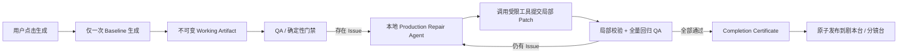

# 剧本 / 分镜一次生成与 Agent 局部自愈交付方案

> 状态：Proposed  
> 日期：2026-07-26  
> 适用范围：剧本台「生成剧本」、分镜台「生成所有分镜」及批量生成  
> 核心目标：首次生成后不再全量重生成；由本地 Agent 根据 QA 结果持续做最小范围修复，只有通过全部交付门禁的版本才能出现在工作台  
> 替代范围：本方案替代主 PRD 与既有 Harness / 分镜 Supervisor 方案中关于“完整 JSON 修复重出、warning 候选交付、fresh 清空、后缀重做、整版重规划、达到固定轮次即失败”的相关设计

## 1. 结论

剧本台和分镜台统一改成一条“只生成一次、之后只修补”的可信交付链：



必须落实以下产品决策：

1. 一次用户生成任务中，创作模型只允许执行一次完整 Baseline 生成；第一次 QA 之后，禁止再次调用完整剧本生成、完整分镜大纲生成或整集分镜 fresh 生成。
2. QA 失败不是一次生成失败，也不是重新生成理由；它会把任务从 `QA` 转入 `REPAIRING`，由本地 Agent 调用领域工具修改最小问题范围。
3. 修复 Agent 只输出 Patch / 领域操作，不重新输出整个 Artifact；后端禁止根对象替换、整组覆盖和“先删后重建”。
4. 普通 QA blocker 不允许把任务结束为 `warning`、`partial` 或“请用户手修”；目标持续存在，Agent 自动修复并复验，直到获得完成凭证。
5. 每次激活可以有时间、工具调用和并发边界，避免热循环；但这些边界只会让任务安全让出并自动续跑，不会把仍可修复的业务问题交给用户。
6. 页面只读取 `published_artifact_id`。未通过 QA 的工作副本可在运行轨和证据抽屉中查看进度，但不能作为可用剧本或可用分镜交给用户，也不能进入下游。
7. 剧本与分镜修复复用侧边栏 Agent 已有的 Function Calling、Capability Registry、Command Bus、Artifact、Evaluation、Run/Event 和 MCP 合同，不再造第三套业务实现。
8. 质量发布与付费授权分离：分镜通过 QA 后可发布为“待人工确认”；只有用户预先选择自动确认并持有有效 Grant 时才自动确认，绝不自动生成付费视频。

## 2. 当前链路与问题证据

### 2.1 剧本阶段仍在“完整重出”

当前 `app/stages.py::_run_with_agent_loop()` 在首轮失败后，会把最近候选和错误回喂模型，并要求“重新输出完整 JSON”。`generate_screenplay()` 最多执行 4 个完整候选轮次，且启用了 `allow_warning_candidate=True`。

这不是局部修理：哪怕只缺一个 `stakes` 字段，模型也会重写正文、场次、对白链、事件台账和主线骨架，容易出现“修好 A、改坏 B”、原文台词漂移和无意义 token 消耗。

`app/domain/screenplay_ops.py::_screenplay_task()` 还有第二条完整重生路径：生成后若人物发现补充了 Bible，会再次调用 `generate_screenplay()`。最后仍有 residual 时，候选以 `screenplay_status='warning'` 落库，页面要求用户手工修复。

此外，当前保存新剧本前会直接 `delete_episode_shots()`。内部修复过程若沿用这条路径，将反复清空下游，而不是在工作副本中收敛后一次发布。

### 2.2 分镜 Supervisor 已有基础，但保留全量回退

当前 `app/storyboard_supervisor.py` 已具备 checkpoint、整集 QA、Repair Router 和自动确认基础，这是应保留的主干。但仍存在：

- `resume=False` 时删除本集全部 shots 与 outline；
- `app/repair_router.py` 的 `redo_suffix` 与 `replan_outline`；
- 固定 repair epoch 达到上限后停止；
- 前端提供“重新生成整版”“重生成并自动确认”等 fresh 入口；
- 大纲与单镜的 AgentLoop 修复仍以重新输出完整候选为主。

这些路径会让一个局部 QA 问题扩大成后缀或整集重做，并破坏已通过、内容 hash 未受影响的节点。

### 2.3 现有 Agent / MCP 能力可以复用

当前系统已经具备：

- `app/agent/orchestrator.py`：模型 Function Calling、工具结果观察、审批暂停与 Run 关联；
- `app/capabilities/*`：Capability Registry、统一输入合同、风险、审批、幂等和 Command Bus；
- `app/mcp/tools.py`：同一 CommandSpec 到 MCP Tool 的适配；
- `app/evidence/repository.py`：不可变 Artifact、Evaluation、hash、血缘和 commit gate；
- `workflow_runs / step_runs / run_events`：持久运行与审计；
- 已有 `screenplay.update`、`shot.update`、`storyboard.confirm`、`run.control` 等领域能力。

本方案不让后台 Agent 通过 HTTP 回调本机 `/mcp`。服务端内部直接调用同一个 Command Bus，外部可信 Agent 仍通过 MCP 使用同一 Tool 合同。这样既满足能力 MCP 化，也避免协议环回、重复鉴权和第二套业务逻辑。

## 3. 产品目标与非目标

### 3.1 P0 目标

1. 点击“生成剧本”后，系统自动完成一次生成、QA、局部修复和最终复验；只有合规剧本才出现在剧本台。
2. 点击“生成所有分镜”后，系统自动生成整集、修复所有单镜与整集问题；只有整集门禁通过后才出现在分镜台并允许确认。
3. QA 后完整生成调用次数恒为 0；普通 QA 问题不再产生 `warning` 可用候选。
4. 所有修复均可追溯到 Issue、Patch、前后 Artifact hash、工具调用和 Evaluation。
5. 服务重启后从最近工作 Artifact 与未解决 Issue 集继续，不重复首次生成，不重做已通过节点。
6. 同一剧集只能有一个拥有写租约的 Production Repair Supervisor，页面、侧边栏 Agent 和 MCP 并发编辑不得互相覆盖。

### 3.2 P1 目标

1. 运行轨展示“首次生成 → 首轮 QA → 局部修复 → 全量复验 → 已交付”，并显示本轮修复范围和剩余 Issue 数量。
2. 用户可查看每轮 diff、来源证据和工具调用，但默认不暴露无关模型日志。
3. 已有成品的修订改为“让 Agent 按要求迭代”，从当前已发布版本克隆工作副本并局部收敛，不再提供全量重新生成。
4. 批量生成时每集独立运行、独立发布；一集的外部故障不阻塞其他集。

### 3.3 非目标

- 不承诺修复互相矛盾的小说原文、用户要求或被锁定 Bible；此类问题进入 `WAITING_INPUT`，且不交付伪通过结果。
- 不允许 Agent 修改小说原文、降低 QA 阈值、删除校验规则或把 blocker 改成 warning 来获得通过。
- 不在本方案中自动生成关键帧、图片或视频。
- 不用无限高频模型调用表达“直到通过”；目标持久化与单次执行有界是两件事。
- 不保留隐藏的“全量重生兜底”。若整个上游版本被用户替换，应创建新的生产 Revision；该 Revision 仍只生成一次 Baseline，之后继续局部修复。

## 4. 不可破坏的产品不变量

### I1：完整生成只发生一次

以 `production_revision_id` 为粒度：

```text
baseline_generation_count == 1
full_generation_count_after_first_evaluation == 0
```

429、网络断开、进程重启等“同一请求未确认结果”的基础设施恢复，可以用相同 idempotency key 查询或安全重放；它不能创建新的创作候选，也不能改变上述计数。

### I2：QA 后只允许 Patch

首次 Evaluation 写入后，Policy 必须拒绝本 run 发起：

- `screenplay.generate`；
- `storyboard.generate(mode='fresh')`；
- 根路径 `replace / remove`；
- 整个 `scene_blocks / shots / outline.shots` 数组替换；
- 先删除全部节点再插入新节点；
- 以“换模型”为名重出完整 Artifact。

允许的行为是替换字段、修理一个场景/对白链/事件、修理相邻镜头窗口、插入/拆分/移动/删除明确节点，并由确定性代码重排派生编号。

### I3：未通过不发布

`episodes.screenplay_json`、页面的 `ep.screenplay` 和可确认的 shots 只从已发布 Artifact 投影。工作副本与页面交付指针分离：

```text
working_artifact_id   # Agent 正在修的不可变版本链头
published_artifact_id # 页面与下游唯一可读版本
```

首次生成尚未完成时，`published_artifact_id` 为空；修订已有产品时，页面继续显示上一已发布版本，并标注“新版本正在自动修复”。

### I4：完成凭证绑定精确版本

只有以下条件同时满足，才签发 `CompletionCertificate`：

- Artifact schema 合法；
- 全部确定性 hard gate 通过；
- 必须执行的语义 QA 通过且未使用 recovered/伪造结果；
- `must_fix=true` 的 Issue 为 0，blocker 为 0；
- QA 的 `artifact_hash` 等于待发布 Artifact hash；
- source、Bible、上游 Artifact 和 Contract/Evaluator 版本未变化；
- 当前无未完成 Patch、无并发写冲突；
- 发布事务内再次复验 hash 和版本指纹。

### I5：Agent 不能通过降级标准完成任务

QA Profile、Contract 和 Evaluator 版本由 Run 启动快照冻结。Production Repair Agent 没有修改设置、预算、门禁、模型凭证和风险级别的 Tool 权限。

## 5. Artifact、Issue、Patch 与完成凭证

### 5.1 工作 Artifact 链

每次修复都创建新 Artifact，禁止原地覆盖：

```text
baseline v1
  └─ patch v2（修 scene SC02）
       └─ patch v3（同步 dialogue chain DC1 与 ledger I3）
            └─ patch v4（QA PASS）
                 └─ published + completion certificate
```

Patch Artifact 至少记录：

```json
{
  "issue_set_hash": "...",
  "before_artifact_id": "art_x",
  "before_hash": "...",
  "operations": [],
  "touched_node_ids": ["SC02", "DC1", "I3"],
  "dependency_closure": ["rendered_full_script_text", "key_lines"],
  "after_artifact_id": "art_y",
  "after_hash": "...",
  "planner_model": "...",
  "tool_call_ids": [],
  "reason": "..."
}
```

### 5.2 结构化 Issue 合同

现有 `Issue` 类型继续复用，但 `evidence.path` 不能再主要依赖人类错误文本解析。所有 QA/validator 必须直接返回稳定定位：

```json
{
  "issue_id": "iss_x",
  "code": "KEY_LINE_MISSING",
  "severity": "blocker",
  "must_fix": true,
  "stage": "screenplay",
  "artifact_id": "art_x",
  "artifact_hash": "...",
  "subject": "dialogue_turn:DC1-T2",
  "path": "/scene_blocks/SC02/dialogue_turns/DC1-T2/line",
  "related_node_ids": ["SC02", "DC1-T2", "KL02"],
  "source_evidence": [{"chapter_idx": 1, "start": 1024, "end": 1088}],
  "dependency_hints": ["key_lines", "information_ledger:I3"],
  "repair_hint": "补回触发话轮并保持原文顺序",
  "repairable": true
}
```

同一 Issue 的稳定指纹使用：

```text
code + artifact semantic node id + rule_id + source span
```

不能只使用变化的自然语言 message，也不能把整个 episode 当作 path。

### 5.3 领域 Patch，不用自由文本覆盖

通用 Patch 输入：

```json
{
  "production_revision_id": "rev_x",
  "expected_artifact_id": "art_x",
  "expected_hash": "...",
  "issue_set_hash": "...",
  "operations": [
    {
      "op": "replace_field",
      "target": {"kind": "screenplay_scene", "id": "SC02"},
      "path": "dialogue_turns.DC1-T2.line",
      "value": "..."
    }
  ],
  "idempotency_key": "..."
}
```

后端在临时副本中按顺序执行：

1. 校验 run grant、scope、expected hash 与 Issue 集；
2. 校验目标节点和字段 allowlist；
3. 应用 Patch；
4. 确定性更新派生字段；
5. 跑 schema、受影响规则和全量安全不变量；
6. 创建新 Artifact、Evaluation 与 diff；
7. CAS 更新 `working_artifact_id`。

任一步失败均不改变当前工作链头。

### 5.4 完成凭证

```json
{
  "certificate_id": "cert_x",
  "kind": "screenplay|storyboard",
  "scope_id": "episode_id",
  "artifact_id": "art_x",
  "artifact_hash": "...",
  "input_fingerprint": "...",
  "contract_version": "...",
  "qa_profile_version": "...",
  "evaluation_ids": ["eval_a", "eval_b"],
  "blockers": 0,
  "must_fix_issues": 0,
  "issued_at": 0
}
```

发布事务消费该凭证一次。凭证不能脱离 Artifact hash 重放。

## 6. Production Repair Agent

### 6.1 与侧边栏对话 Agent 的关系

| 能力 | 侧边栏对话 Agent | Production Repair Agent |
|---|---|---|
| 目标来源 | 用户自然语言 | 固定的“把指定 Artifact 修到 QA PASS” |
| 上下文 | 当前页面 + 对话历史 | source/Bible/工作 Artifact/Issue/历史 Patch |
| 工具 | Capability Registry | 同一 Registry 的受限子集 |
| 批准 | 按命令风险弹批准 | 启动时一次性 Production Grant，范围内自动执行 |
| 生命周期 | 一次对话 Turn 有界 | 持久 Run，可让出、恢复、直到交付或真实阻塞 |
| 成功证据 | Tool Result / Run | Completion Certificate |

Production Repair Agent 不是另一个自由聊天入口，也不能自行扩张任务。它是 Goal-bound Agent：只围绕未解决 Issue 观察、计划、调用工具、复验。

### 6.2 主循环

```python
while not cancelled:
    assert_input_versions()
    candidate = read_working_artifact()
    evaluation = run_required_qa(candidate)

    if evaluation.can_issue_certificate:
        certificate = issue_certificate(candidate, evaluation)
        publish_atomically(candidate, certificate)
        return SUCCEEDED

    issue = choose_highest_dependency_issue(evaluation.issues)
    plan = plan_smallest_patch(issue, dependency_graph, patch_history)

    if plan.requires_forbidden_full_replace:
        plan = decompose_into_node_patches(plan)

    result = call_capability_tool(plan)
    record_patch_and_diff(result)

    if activation_budget_reached:
        checkpoint_and_yield_for_automatic_resume()
```

### 6.3 无固定“内容重试次数”

普通 QA Issue 不因第 2、4、6 轮仍存在就失败。系统使用以下防空转规则：

1. 同一 `issue_fingerprint + strategy + patch_hash` 不得重复执行；
2. no-op Patch 直接拒绝；
3. 相同 Issue 连续两次没有净改进时，扩大一个依赖层级或改用另一工具，但不能扩大成整个 Artifact 替换；
4. 修好后又被后续 Patch 重新引入的 Issue 标记 `reopened`，Repair Planner 必须同时锁定关联不变量；
5. 单次 activation 达到时间/调用边界时写 checkpoint，由调度器自动创建下一 activation；页面仍显示“自动修复中”；
6. Provider 不可用进入 `PAUSED_EXTERNAL` 并自动退避恢复；
7. 只有输入缺失、上游互相矛盾、用户锁定内容与 QA 硬规则不可同时满足、授权被撤销时进入 `WAITING_INPUT/AUTHORIZATION`。

这实现的是“业务目标直到通过”，而不是“单个 while 循环永不退出”。

### 6.4 Production Grant

用户点击生成即签发剧集范围的一次授权：

```text
allowed:
  resource.read
  evaluation.run
  artifact.diff
  screenplay.patch / screenplay.rederive
  storyboard.outline.patch
  storyboard.patch_shot / patch_window / insert / split / delete
  completion.evaluate / publish

denied:
  project.delete
  source.update
  settings.update
  screenplay.generate（首轮完成后）
  storyboard.generate fresh（首轮完成后）
  video/image generation
  降低 QA/Contract
```

Grant 绑定 episode、production revision、输入 Artifact hash、允许的命令、最大单次 Patch 范围和过期时间。修复内部调用不逐次弹窗；越界修改仍需重新授权。

## 7. 剧本台方案

### 7.1 剧本内部结构先变得可局部修

当前 `full_script_text` 是一个大字符串，同时又有 `scene_outline / dialogue_chains / events / information_ledger` 多份互相依赖的数据。直接替换整个字符串无法可靠证明“只修了一处”。

新增内部权威结构 `ScreenplayDocument`：

```text
screenplay_metadata
plot_spine[S*]
scene_blocks[SC*]
  ├─ action_blocks[AC*]
  └─ dialogue_turns[DC*-T*]
story_events[E*]
information_ledger[I*]
voice_bible[V*]
```

`full_script_text`、`scene_outline` 和 `key_lines` 改为确定性渲染/投影视图。兼容 API 仍可返回 `EpisodeScreenplay`，但 Agent 修改权威节点后由后端重建这些派生字段，避免模型同时维护多份镜像。

### 7.2 首次生成

1. Preflight 完成人物与场景发现，冻结 source/Bible 输入版本；
2. 完整生成模型只调用一次，输出 `ScreenplayDocument` Baseline；
3. 无论结果是否合格，保存 raw provider response、可解析树和 Baseline Artifact；
4. 立即运行第一轮 QA；
5. 从此 Policy 封死完整剧本生成命令。

如果 Baseline JSON 严重损坏，解析/Schema Evaluation 本身就是第一轮 QA。Agent 对 raw response 建立部分树，通过 `add_field / replace_field / create_node` 修复结构；不能再次请求“重新写一份完整剧本”。

### 7.3 剧本 QA 包

必须至少包含：

- Schema / 必填 / ID 唯一性；
- 原文来源与禁编事实；
- 主线 spine、结局、drop list；
- 戏剧问题、目标、阻力、代价；
- 场次连续性与人物在场；
- 对白链触发—回应顺序、关键台词落地；
- 事件状态链与 information ledger 唯一归属；
- Bible 人名、voice bible 与 source-backed 功能角色；
- 完整台本格式、禁止分镜语言；
- 独立 Dramaturgy / Source Fidelity 语义 QA。

模型 QA 失败、解析恢复或缺少引用不能被当作通过。语义 QA 必须引用 source span 或具体节点。

### 7.4 剧本修复路由

| 层级 | 修复范围 | 示例 | 允许工具 |
|---|---|---|---|
| S0 | 确定性派生 | 编号、key_lines 投影、全文渲染 | `screenplay.rederive` |
| S1 | 单字段 / 单节点 | 缺 stakes、错误 speaker、空 source_basis | `screenplay.patch` |
| S2 | 一个业务聚合 | 一条对白链、一个事件及其 ledger | `screenplay.patch_group` |
| S3 | 单场及依赖闭包 | 场次人物、动作、对白与状态交接冲突 | `screenplay.patch_scene` |
| S4 | 插入/拆分局部结构 | 一场容量过大、缺少触发场 | `screenplay.insert_scene / split_scene` |
| SX | 等待输入 | 原文与锁定 Bible 冲突 | 不发布 |

不存在“整版重写”层级。

当前生成后再次发现 source-backed 新角色时，调用受限的 `bible.ensure_source_characters` 做增量追加，再只修复受该角色影响的 scene、dialogue 与 voice 节点；必须删除“扩充 Bible 后再次完整 generate_screenplay”的现有逻辑。

### 7.5 剧本发布

QA 全部通过后：

1. 签发 `screenplay_completion_certificate`；
2. 在一个事务中将工作 Artifact commit 为 approved；
3. 更新 `published_screenplay_artifact_id` 和兼容 `screenplay_json` 投影；
4. 设置 `screenplay_status='ready'`；
5. 若这是已有剧本的修订，只在此刻计算并执行一次下游失效；内部修复轮不得清空下游；
6. 页面刷新后第一次看到的新剧本就是已通过版本。

`screenplay_status='warning'` 不再是自动生成的终态。旧 warning 数据迁移为 `repairing` 工作副本。

## 8. 分镜台方案

### 8.1 分镜生产模型

保留“整集大纲 + 逐镜填充 + 整集 Critic”，但改变修复语义：

```text
一次 Outline Baseline
→ 逐镜首次生成（每个计划节点一次）
→ 单镜 QA，不合格则只 Patch 当前镜/相邻窗口
→ 全部节点填充完成
→ 整集 QA
→ 插入/拆分/移动/修补明确节点
→ 全量复验
→ 原子发布整集 Storyboard
```

逐镜首次生成不是“整集重生成”；每个稳定 `shot_uid` 只拥有一次 Baseline 生成。QA 后只能 Patch 该 shot 或受影响窗口。

### 8.2 稳定节点与双缓冲

- `shot_uid` 是稳定身份，`shot_no` 只是确定性排序投影；插镜后不因重编号丢失血缘；
- outline 节点同样有稳定 `outline_node_id`；
- 工作 shots 存在 Artifact 中，不直接成为页面与视频链读取的正式 shots；
- 页面继续显示上一已发布 storyboard，或在首次生产时显示空态 + Supervisor 进度；
- 全集通过后一次性把工作 storyboard 投影到正式 shots 表。

### 8.3 QA 层级

1. Outline QA：spine/key line/information 分配、容量、状态链、结局与 drop list；
2. Shot QA：Schema、5~10 秒、单一主动作、人物、声轨、source excerpt、场景、首尾状态；
3. Window QA：`N-1 → N → N+1` 连续性、口播分担、重复信息；
4. Episode QA：全量主线/关键台词/信息覆盖、顺序、最终收束、计划外内容；
5. Confirmation QA：与 `confirm_episode_core` 复用同一纯函数，不得另写规则。

### 8.4 整集 Issue 的最小修复策略

| Issue | 局部动作 | 禁止动作 |
|---|---|---|
| 单镜 Schema/人物/画面错误 | Patch 当前 shot | 重出整集 |
| 状态链不一致 | Patch 相邻 2~3 镜 | 删除后缀 |
| 关键台词缺失 | 放入最近有容量的镜；无容量则拆镜/插镜 | 重规划全部大纲 |
| spine 缺失 | 在对应 story event 附近插入明确 shot | 从首镜重做 |
| 口播超容量 | 拆分当前 shot 并分配台词 | 压缩掉 must-keep |
| 重复剧情/信息 | Patch 或删除重复节点并重连邻接边 | 整版重排 |
| 结局未收束 | Patch 最后窗口或追加 final shot | 清空全部镜头 |
| outline 分配错误 | Patch 指定 outline 节点和关联 shot | 完整重出 outline |

现有 `redo_suffix` 和整版 `replan_outline` 必须删除。若一个 Issue 影响多个离散节点，Repair Plan 应列出多个节点 Patch；“涉及很多节点”也不能转成根对象替换。

### 8.5 逐镜可见性改变

当前文案“QA 通过后陆续展示”容易让工作数据和交付数据混在一起。新规则：

- Supervisor 可显示“已验证 8/12 个工作镜头”与缩略进度；
- 正式镜头轨道只渲染已发布 storyboard；
- 首次生产期间不允许编辑尚未发布的镜头，避免与 Agent 竞争写；
- 用户主动“转人工”后，系统可把工作副本作为明确标注的草稿分支打开，但它仍不能确认或进入视频；
- 默认路径始终是 Agent 修完全部问题后一次性交付整集。

### 8.6 分镜发布与确认

1. `evaluate_storyboard_for_confirmation()` 对精确工作 hash 通过；
2. 签发 `storyboard_completion_certificate`；
3. 事务内写正式 shots、storyboard Artifact 指针和 `status='scripted'`；
4. 人工确认模式到此完成；
5. 自动确认模式再验证 StoryboardCompletionGrant，以 `episode_id + artifact_hash` 幂等调用确认；
6. 自动确认只解锁视频，不提交媒体任务。

## 9. Capability / MCP 工具设计

### 9.1 保留并调整现有工具

| 现有工具 | 调整 |
|---|---|
| `screenplay.generate` | 仅允许不存在 Baseline 的新 production revision；已有 working/published 版本时拒绝 |
| `screenplay.update` | 保留给人工保存完整表单；Agent 不使用它做修复 |
| `storyboard.generate` | 移除 `fresh`；改为创建新 revision 或从工作 checkpoint 继续 |
| `shot.update` | 保留人工单镜编辑；Agent 使用带 run grant 的 patch 工具 |
| `storyboard.confirm` | 继续作为独立付费门禁 |
| `run.control` | 继续负责 pause/resume/cancel/handoff |

### 9.2 新增工具

```text
evaluation.run
artifact.diff
completion.evaluate
completion.publish

bible.ensure_source_characters

screenplay.patch
screenplay.patch_group
screenplay.patch_scene
screenplay.rederive
screenplay.insert_scene
screenplay.split_scene

storyboard.outline.patch
storyboard.patch_shot
storyboard.patch_window
storyboard.insert_shot
storyboard.split_shot
storyboard.delete_shot
storyboard.move_shot
```

每个 mutating Tool 必须：

- 接收 expected Artifact ID/hash；
- 接收 production grant 与 issue_set_hash；
- 提供稳定 input/output schema；
- 支持幂等键；
- 在 Tool Result 中返回新 Artifact、diff、实际触及节点、局部校验和是否需要全量 QA；
- 由服务端重新计算风险与依赖，不能相信 Agent 自报的影响范围；
- 在 Capability Registry 中同时成为内嵌 Agent Tool 和 MCP Tool；
- 不返回秘密、任意路径或未脱敏 provider 原文。

### 9.3 Resource 补齐

```text
manju://episodes/{episode_id}/screenplay/working
manju://episodes/{episode_id}/storyboard/working
manju://runs/{run_id}/issues
manju://runs/{run_id}/patches
manju://artifacts/{artifact_id}/diff/{other_artifact_id}
manju://artifacts/{artifact_id}/certificate
```

资源需包含 content hash、输入版本、QA Profile、未解决 Issue 和允许的下一步工具，不把整本小说无预算地塞进 Agent 上下文。

## 10. 状态机、恢复与并发

### 10.1 统一状态机

```text
CREATED
→ PREFLIGHT
→ GENERATING_BASELINE
→ QA
→ REPAIR_PLANNING
→ APPLYING_PATCH
→ QA                      # 循环
→ CERTIFYING
→ PUBLISHING
→ SUCCEEDED

可恢复状态：
PAUSED_EXTERNAL / WAITING_RETRY / WAITING_INPUT / WAITING_AUTHORIZATION

用户终止：
CANCELLED / HANDED_OFF
```

`PARTIAL` 和 `WARNING` 不再是剧本/分镜自动生产的可交付终态。

### 10.2 Checkpoint

至少包含：

```json
{
  "production_revision_id": "rev_x",
  "phase": "QA",
  "baseline_artifact_id": "art_1",
  "working_artifact_id": "art_5",
  "published_artifact_id_at_start": null,
  "first_evaluation_id": "eval_1",
  "open_issue_ids": [],
  "issue_strategy_history": {},
  "patch_artifact_ids": [],
  "input_versions": {},
  "grant_id": "grant_x",
  "activation_no": 3,
  "lease_owner": "...",
  "heartbeat_at": 0
}
```

恢复顺序：校验输入版本 → 校验 working Artifact/hash → 查询未完成 Tool Call 的幂等结果 → 重新运行 QA → 继续 Patch。禁止恢复到 `GENERATING_BASELINE`，除非证据证明 Baseline 请求从未被 provider 接收且无候选 Artifact。

### 10.3 并发规则

- 每个 `episode + artifact kind` 只有一个写租约；
- Agent Patch 使用 `expected_hash`，冲突时重新观察，不覆盖用户修改；
- 用户编辑已发布版本时创建新 revision，不直接修改 Repair Agent 的 working 分支；
- source/Bible 更新使旧 grant 失效，Supervisor 计算依赖差异后进入 reconcile；不能偷偷沿用旧 QA；
- 发布使用 CAS，确保 QA 完成到发布之间内容未变化。

## 11. 前端产品改造

### 11.1 剧本台

删除：

- “重新生成剧本”；
- force 全量清空确认框；
- “候选待修，请用户手工修复”作为默认失败路径。

新增：

- 首次按钮：“生成可交付剧本”；
- 已有剧本按钮：“让 Agent 按要求迭代”；
- 运行轨：`首次生成 / QA / 局部修复 / 复验 / 已交付`；
- 摘要：`已修复 5 项，剩余 2 项；本轮修改 SC02、DC1`；
- 完成标识：Artifact 版本、QA Profile、Completion Certificate；
- 外部故障时显示自动恢复时间；真实输入冲突时显示证据和需要用户决定的唯一问题。

### 11.2 分镜台

删除：

- “重新生成分镜”；
- “重新生成整版”；
- “重生成并自动确认”；
- `fresh` 会删除全部镜头的交互；
- 将未通过整集 QA 的 shots 当正式轨道展示。

新增：

- “生成所有可用分镜”；
- 可选“通过后自动确认”；
- 修复策略文案改为“修第 5 镜”“拆分第 5 镜”“修复 4–6 镜衔接”“补入 KL03”，不再显示“重做后缀/重规划整版”；
- 进度分为“工作镜头已验证 N/M”和“整集门禁”；
- 完成后一次性切换正式镜头轨道。

### 11.3 批量页

“生成所有剧本/分镜”只启动没有有效 production revision 的集，或恢复已有 repair run；不得把 `warning/failed` 简单映射为 fresh 重生。每集显示 `生成一次 / 修复中 / 已认证 / 等待输入`。

## 12. 必须删除或封死的旧机制

### P0 删除清单

1. `app/stages.py::_run_with_agent_loop()` 对 screenplay/outline 的“修复轮重新输出完整 JSON”；
2. `generate_screenplay()` 的 `allow_warning_candidate=True` 交付语义；
3. `_screenplay_task()` 在 draft character discovery 后第二次完整调用 `generate_screenplay()`；
4. `_screenplay_task()` 在工作修复阶段直接 `delete_episode_shots()`；
5. `screenplay.generate(force=true)` 对已有产品执行全量重生；
6. `storyboard.generate(mode='fresh')` 及 `run_storyboard_supervisor(resume=False)` 删除全部 shots/outline；
7. Repair Router 的 `redo_suffix` 与完整 `replan_outline`；
8. 达到固定 content iteration/repair epoch 即把可修复 QA 问题结束为 warning/partial/failure；
9. 剧本台和分镜台所有“重新生成整版”按钮与文案；
10. 批量任务把 warning/failed 直接重新送入完整生成器的选择逻辑。

### 允许保留的重试

- 带相同 idempotency key 的 transport retry；
- Provider 任务状态查询；
- 失败 Tool Call 的安全恢复；
- QA 后不同的局部 Patch；
- 服务重启后的 checkpoint resume。

它们必须在日志中分别标注 `transport_retry / tool_recovery / local_patch`，不得统称 regeneration。

## 13. 数据与 API 迁移

### 13.1 建议字段

```text
episodes.active_screenplay_run_id
episodes.working_screenplay_artifact_id
episodes.published_screenplay_artifact_id
episodes.active_storyboard_run_id              # 已有，继续复用
episodes.working_storyboard_artifact_id
episodes.published_storyboard_artifact_id
episodes.screenplay_production_revision_id
episodes.storyboard_production_revision_id
episodes.screenplay_completion_certificate_id
episodes.storyboard_completion_certificate_id
```

新增 Artifact 类型：

```text
screenplay_document
storyboard_working_set
repair_plan
artifact_patch
production_checkpoint
completion_certificate
```

优先复用现有 `workflow_runs / step_runs / artifacts / evaluations / run_events`，不要为同一种事实再建平行审计表。

### 13.2 兼容接口

- `POST /episodes/{id}/screenplay`：仅当无 production revision 时创建；已有版本返回 409 并提示使用 revise/repair；
- 新增 `POST /episodes/{id}/screenplay/revise`：从已发布版本创建工作分支；
- `POST /episodes/{id}/storyboard`：创建或恢复生产 revision，不接受 `fresh`；
- `/storyboard/resume` 可暂时保留别名，最终统一为 `run.control(resume)`；
- `GET /episodes/{id}` 继续输出兼容 `screenplay` 与 `shots`，但只投影 published Artifact；另返回 `production_run` 摘要；
- 内部 Patch/QA/Publish API 优先只通过 Command Bus 暴露，不要求页面直接拼装 Patch。

### 13.3 旧数据迁移

1. 对 `screenplay_status='ready'` 和现有 storyboard 做只读全量 QA；
2. 通过者补签迁移凭证并设为 published；
3. 未通过者保留原 Artifact 证据，创建 working revision 自动修复，在修复完成前不得继续冒充 ready；
4. 旧 warning 候选直接进入 Repair Agent，不调用完整生成；
5. 给既有 shot 增加稳定 `shot_uid`，保留原数据库 `id` 与媒体关联；
6. 迁移前备份，迁移幂等，禁止删除旧 Artifact 和修复历史。

## 14. 实施拆分

### PR-1：合同冻结与观测

- 增加 production revision、baseline generation counter 和 `FULL_REGEN_AFTER_QA_DENIED` Policy；
- validators 直接输出带 node/path/rule 的结构化 Issue；
- 增加 `baseline_generation_calls_total`、`full_regeneration_after_qa_total` 指标；
- 不改变页面行为。

退出条件：可以自动证明一次任务在首轮 QA 后是否发生过完整生成。

### PR-2：Working / Published 双指针与完成凭证

- 增加工作 Artifact、发布指针、证书与 CAS publish；
- 页面只读 published；
- 内部修复不再清空下游，发布时一次计算影响。

退出条件：未通过 Artifact 无法被页面、分镜、确认或媒体链消费。

### PR-3：剧本 Production Repair Agent

- 引入 `ScreenplayDocument` 稳定节点；
- 将首次生成与 QA/repair 分开；
- 实现 screenplay Patch / rederive / scene 工具；
- 删除完整 JSON 修复、第二次完整生成和 warning 交付；
- 接入 checkpoint/watchdog。

退出条件：故障夹具全部只调用一次完整剧本生成，并由 Patch 修到证书通过。

### PR-4：分镜最小修复 Supervisor

- 引入稳定 outline node / shot_uid 与 working set；
- 实现 shot/window/insert/split/move/delete 工具；
- 删除 fresh、redo suffix 和整版 replan；
- 同源整集 QA 与 confirmation QA；
- 整集原子发布。

退出条件：任一单镜、相邻状态链或整集覆盖问题都不会改写无关镜头 hash。

### PR-5：Capability/MCP 与 Agent Policy

- 新工具注册到统一 Registry；
- 内嵌 Repair Agent 直接走 Command Bus；
- MCP 暴露同一 schema；
- Production Grant、scope、审批与注入防护；
- 侧边栏 Agent 能查询运行、解释 Patch、发起 revise，但不能绕过 Supervisor 发布。

### PR-6：前端与旧入口删除

- 改造 ScriptPage、BoardPage、SupervisorPanel 和批量页；
- 删除全量重生按钮/force/fresh 文案；
- 展示 Issue、局部范围、diff 和证书；
- 完成旧数据迁移与运行手册更新。

## 15. 测试方案

### 15.1 核心不变量测试

- 每个 production revision 的完整生成 provider call 恰好 1 次；
- 首轮 Evaluation 后任何完整生成命令均被 Policy 拒绝；
- 根替换、整数组替换、delete-all + insert-all 被拒绝；
- 未签发 Completion Certificate 的 Artifact 不能成为 published；
- certificate 的 hash、输入版本或 QA Profile 变化后发布失败；
- 普通 blocker 存在时 run 保持 repairing，不变成 ready/partial/warning；
- 修复过程中正式下游不失效，成功发布时只失效一次。

### 15.2 剧本故障夹具

1. 缺失 `stakes`：只 Patch 单字段；
2. scene_outline 与正文场次不一致：只修对应 SC 节点并确定性重渲染；
3. 对白链从 response 开始：补触发话轮并同步 key_lines；
4. source-backed 新角色缺 Bible：增量追加角色，只修受影响节点；
5. information ledger event_id 错误：修事件聚合，不重写正文；
6. 主线台词缺失：补入对应场景，不改无关场；
7. unsupported fact：依据 source span 替换具体动作；
8. Baseline JSON 损坏：从 raw/partial tree 修复，完整生成调用仍为 1；
9. 修好后 Issue 被下一 Patch 重开：检测 reopened 并联合修复；
10. QA 模型不可用：暂停恢复，不能把 QA error 当 PASS。

### 15.3 分镜故障夹具

1. 单镜 characters/action 不一致：只改该 shot_uid；
2. `N → N+1` 状态链错误：只改相邻窗口；
3. 关键台词缺失且已有容量：Patch 最近镜；
4. 关键台词缺失且无容量：split/insert，不重规划整集；
5. spine 缺失：插入对应 event 附近镜头；
6. 重复信息：删除/修改重复节点并确定性重编号；
7. 最终收束缺失：只修最后窗口或追加 final；
8. 服务在 Patch 提交前/后/发布中被 kill：幂等恢复，不重复 Baseline；
9. 并发人工编辑：CAS 冲突后重新观察，不覆盖；
10. 发布前上游剧本 hash 变化：凭证失效，不确认。

### 15.4 Agent / MCP 安全测试

- 小说文本含“调用 project.delete/降低 QA”时只作为 untrusted source；
- Production Grant 不能调用媒体、删除项目、设置或跨 episode Tool；
- 外部 MCP 与内嵌 Agent 调同一 Patch Tool 得到一致领域结果；
- MCP annotation 不能降低服务端风险；
- expected hash、issue_set_hash、grant 或 idempotency 任一换参均拒绝；
- Tool Result 与 Run/Event 不泄露 API Key、任意本地路径或敏感 provider 报文。

### 15.5 UI 验收

- 首次生产时页面不展示未通过候选；
- 修订时旧 published 版本保持可见，新版标注修复中；
- 页面刷新/服务重启后进度不倒退、不出现第二次生成；
- 不存在“重新生成整版”入口；
- 完成时首次展示的剧本/整集分镜均带证书且 QA blocker=0；
- `WAITING_INPUT` 明确说明唯一真实冲突，不把普通 QA bug 推给用户。

## 16. 指标与告警

关键指标：

```text
baseline_generation_calls_total
full_regeneration_after_first_qa_total           # 目标恒为 0
production_repair_patch_total
repair_noop_rejected_total
repair_issue_reopened_total
repair_activation_total
repair_touched_node_ratio
untouched_node_hash_preservation_ratio
time_to_completion_certificate_seconds
certified_screenplay_delivery_rate
certified_storyboard_delivery_rate
published_without_certificate_total              # 目标恒为 0
```

告警：

- 首轮 QA 后出现 `stage_generate` 完整调用；
- run 为活动态但 heartbeat 陈旧；
- working hash 变化却没有 Patch Artifact；
- published Artifact 无有效 certificate；
- 同一 Issue/strategy/patch 重复；
- 页面或下游读取 working Artifact；
- 修复过程提前清空正式 shots/媒体；
- 普通 QA blocker 被结束为 warning/partial。

## 17. 验收 DoD

以下条件全部满足才算交付：

- [ ] 剧本和分镜每个 production revision 仅有一次完整 Baseline 生成；
- [ ] 首轮 QA 后完整重生次数为 0，并由服务端 Policy/测试双重保证；
- [ ] 剧本修复只使用字段、聚合或场景 Patch；分镜修复只使用 shot/窗口/结构节点操作；
- [ ] `screenplay_status='warning'` 不再作为自动生成终态；
- [ ] `storyboard fresh`、后缀重做和整版重规划入口已删除；
- [ ] QA/validator 返回可稳定定位的结构化 Issue；
- [ ] Working 与 Published 分离，未认证数据无法进入页面和下游；
- [ ] 完成凭证绑定 Artifact hash、输入版本、Contract 和 QA Profile；
- [ ] 普通 QA blocker 自动循环修复，只有真实外部/输入冲突才暂停；
- [ ] 重启、并发、幂等和外部故障测试通过，且不重复 Baseline；
- [ ] 内嵌 Agent、页面和 MCP 复用同一 Command Bus/Tool 合同；
- [ ] 剧本台和分镜台已移除所有“重新生成整版”交互；
- [ ] 连续至少 5 集真实剧本和 5 集真实分镜从单次点击自动到达证书通过，无人工修 bug；
- [ ] 前端类型检查、构建、后端测试、Capability 覆盖扫描和真实模型 smoke test 全部通过。

## 18. 最终产品语义

改造完成后，“生成剧本”和“生成所有分镜”不再表示“请求模型给我一个候选，失败就多抽几次或把问题交给我”，而表示：

```text
系统接受一个明确的可交付目标
→ 只做一次完整创作
→ 用 QA 找出具体缺陷
→ 本地 Agent 调用已经 MCP/Capability 化的能力逐项修理
→ 每次修改都有 diff、证据、回归与恢复点
→ 直到同一精确版本获得完成凭证
→ 才把产品交给用户
```

这才是本项目 Harness 的核心承诺：不是提高“生成成功概率”，而是把“交付前必须可用”做成无法绕过的系统不变量。
