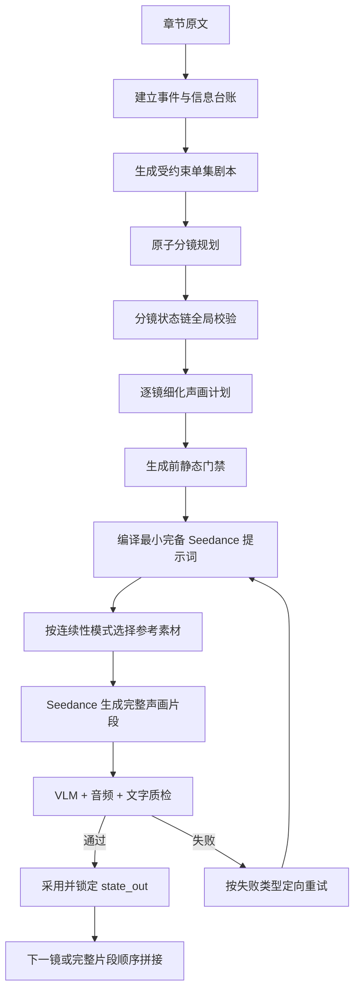

# 剧本、分镜与 Seedance 视频连续性整改方案

> 状态：Implemented（P0/P1 已落地：连续性字段、编译门禁、前端最小展示与回归测试；P2 体验优化另排）  
> 版本：v1.0  
> 日期：2026-07-25  
> 适用项目：MJAgent2 / 案头助手  
> 核心约束：项目不具备人工或程序化后期能力。成片中的表演、对白、旁白、环境声和必要画面文字均由 Seedance 在单条视频内直接生成；系统只允许按顺序拼接完整视频片段，不依赖配音、字幕叠加、补帧、裁切或声画修复。

---

## 1. 文档目的

本 PRD 用于解决当前章节转视频流程中的两类核心业务问题：

1. 相邻片段彼此割裂，人物位置、动作状态、镜头意图和声音缺少可靠承接。
2. 同一剧情、台词、人物动作或转场信息在多个片段中重复出现，导致叙事拖沓和生成成本上升。

整改不以“把每条视频统一拉长到 15 秒”为目标，而是建立一套从剧本信息分配、分镜状态机、Seedance 提示词编译、参考图选择到视频验收的完整生产协议。基本原则为：

- 一个镜头只承担一个主要动作、一个情绪变化和一组明确的新信息。
- 每条视频必须是无需后期即可直接拼接的完整成片单元。
- 上一镜只把“结束状态”交给下一镜，不把整段剧情重新讲一遍。
- 只有真正的连续动作才使用上一镜尾帧；同场景换角度、反应镜头和插入镜头不得误用尾帧。
- 章节原文只作为上游改编证据，不直接发送给 Seedance。
- 每项剧情信息默认只能交付一次；需要强调时必须显式标记为“有意重复”。

---

## 2. 现状流程与结论

### 2.1 当前主流程

当前项目大致执行以下链路：


目前采用“先生成全局分镜，再逐镜细化”的方向本身是正确的，比让大模型直接读取整章后一次性输出全部最终分镜更适合生产系统。原因是它允许做信息覆盖检查、逐镜状态校验、失败重试和成本控制。

真正的问题不在于是否要保留流程，而在于中间数据缺少强约束：全局故事信息、当前镜头任务、上一镜状态、下一镜预告和原文章节同时进入提示词，模型自然容易重复剧情；与此同时，系统又把“同场景”误当成“连续动作”，进一步放大视觉重复。

因此，本方案选择：**保留分阶段架构，重构各阶段的数据契约与责任边界；不采用“整章直出最终分镜”替换现有流程。**

两种方案的判断如下：

| 方案 | 局部观感 | 全局正确性 | 可追溯/可重试 | 结论 |
|---|---|---|---|---|
| 大模型直接读整章并一次输出最终分镜 | 容易获得较自然的文字表达和镜头灵感 | 容易漏情节、重复信息、擅自补写，长上下文下难保证逐镜状态 | 很弱，无法准确判断错误来自剧本、拆镜还是提示词 | 只作为创意参考或基准对照，不作为生产主链路 |
| 当前“剧本 → 大纲 → 逐镜 → 编译”流程 | 目前因契约松散而出现机械感 | 具备做覆盖、去重和连续性控制的结构基础 | 较强，可在具体阶段阻断和定向重试 | 保留架构，按本 PRD 重构 |

可从“整章直出分镜”方案中吸收的不是端到端生成方式，而是以下镜头表达特征：

- 以约 5 秒原子动作作为常用基本单位，而非默认把所有内容扩到 15 秒。
- 每镜明确一个动作、一个情绪变化和一个新信息目的。
- 明确首状态、动作过程和尾状态，避免纯文学描述。
- 把连续性写成可见的人物位置、朝向、手势、道具和光线，而不是抽象的“自然承接”。
- 提示词直接描述可拍内容，不把剧情分析、创作理由和整章摘要交给视频模型。

不能吸收的前提包括外部配音、字幕后加、裁切可用片段和用后期掩盖转场。上述能力本项目均不存在，因此必须由 Seedance 在每条视频中一次完成。

### 2.2 已确认的问题证据

以当前《斗破苍穹》第 1 集为样本：

- 共 24 个镜头，均为 5 秒，总时长 120 秒。
- 分镜规则评分和人工门禁可以达到 100，但已采用视频的平均质量分约为 0.379，中位数约为 0.2；17/24 低于 0.5。
- 已累计生成约 89 个视频版本，记录成本约 ¥244，说明当前门禁分数无法代表最终视频的可用性。
- 多个 5 秒镜头包含叫名、走出人群、接近石碑、伸手、闭眼、石碑亮起、结果揭示、人物反应等多步动作，远超单镜头可稳定完成的动作容量。
- 原文结尾之后又生成了“戒指发光/药老暗示”等内容，而集级钩子字段实际为空，属于系统为了满足钩子形式而主动补写剧情。

### 2.3 根因总结

| 根因 | 当前表现 | 业务后果 |
|---|---|---|
| 没有剧情信息唯一归属 | 原文、剧本、全局大纲和历史镜头内容反复进入当前镜头 | 同一剧情被多镜重复交付 |
| 以文本长度拆分分镜 | 大纲先粗分，再按对白或描述长度自动拆段 | 拆出的镜头没有独立动作状态，只是在复述同一事件 |
| 同场景等同连续动作 | `continuity_from_prev = same_scene` | 换角度、反应镜头也强制引用上一镜尾帧，人物和构图被拖入下一镜 |
| 上一镜上下文取错 | 最终提示词使用上一镜 `action_desc`，而非结束状态 | 下一镜会从上一镜动作开头重新演一遍 |
| 当前首尾状态未进入提示词 | 只有泛化连续性规则，没有精确 `state_in/state_out` | Seedance 不知道该从哪里开始、在哪里结束 |
| 原文章节进入视频提示词 | Seedance 同时看到当前动作和更大段剧情 | 模型自行补演前后事件，形成重复和多动作拥挤 |
| 转场双向描述 | 当前镜头既描述离场，又描述下一场开场 | 当前镜头抢演下一镜内容，下一镜再次重复 |
| 声音模型过于粗糙 | 仅区分对白与旁白，画外角色常被改成通用旁白 | 声音身份不一致，剧情语义改变 |
| 文字规则自相矛盾 | 全局负面词禁止文字，但动作又要求石碑显示结果 | Seedance 随机选择遵守其中一条，出现乱码或缺字 |
| 任意声音密度指标 | 约 75% 镜头被要求有声音 | 安静反应镜头被塞入无必要台词，信息重复 |
| 提示词超载 | 动作、原文、前镜、后镜、锚点和通用规则挤在长度上限内 | 关键指令被截断，模型注意力分散 |

---

## 3. 产品边界

### 3.1 本期范围

- 章节到单集剧本的信息拆解与去重。
- 剧本到原子分镜的规划方式。
- 分镜逐镜细化的数据结构和校验规则。
- Seedance 最终提示词的完整编译协议。
- 角色、场景、当前首帧、当前尾帧和上一镜尾帧的参考角色分配。
- 无后期条件下的对白、旁白、画外音、环境声和必要画面文字生成规范。
- 生成前静态门禁、生成后视频质检、候选采用和失败重试策略。
- 面向运营/审核人员的最小可见信息与人工干预点。

### 3.2 明确不做

- 不引入外部 TTS、人工配音或口型后处理。
- 不引入字幕渲染、文字叠加、剪辑裁切、变速、转场合成或音轨混合。
- 不假设可以只保留视频中间的“可用几秒”；每个 Seedance 输出必须整条可用。
- 不以切换视频供应商作为本次整改方案。
- 不在本期重做完整 UI，仅增加支撑审核和诊断所需的最小展示。
- 不允许系统擅自扩写原文之外的下一集钩子；改编新增内容必须有明确授权。

---

## 4. 目标与成功标准

### 4.1 业务目标

1. 让连续片段在人物状态、空间关系、动作起止和声音身份上可理解地承接。
2. 消除未经授权的剧情重复、动作重演和下一镜抢演。
3. 让每个视频片段在无后期条件下具备完整、可直接采用的声画结构。
4. 降低无效重试与候选生成数量，让自动门禁分数与最终可用性一致。

### 4.2 上线验收指标

| 指标 | 目标 |
|---|---:|
| 原文必要剧情信息覆盖率 | 100% |
| 未标记的剧情信息重复交付率 | 0% |
| 当前镜头泄漏未来剧情的比例 | 0% |
| 相邻镜头 `state_out → state_in` 校验通过率 | 100% |
| 最终 Seedance 提示词包含原文章节/全局大纲的比例 | 0% |
| 非 `action_continuation` 镜头使用上一镜尾帧的比例 | 0% |
| 必要对白/旁白/画外音一次性分配覆盖率 | 100% |
| 跨视频未说完的句子 | 0 条 |
| 需要文字时提示词出现“全面禁止文字”的冲突 | 0 条 |
| 视频中非剧情要求的重复人物/重复动作/重复台词 | 0 次 |
| 样本集视频动作符合度 | ≥ 0.70 |
| 样本集相邻镜头连续性评分 | ≥ 0.75 |
| 首轮候选直接可用率 | 第一阶段 ≥ 60%，稳定期 ≥ 75% |

首轮基准测试使用现有《斗破苍穹》第 1 集。旧版 24 镜结果作为对照组，必须保留同一章节、同一模型版本和可比生成参数。

---

## 5. 新业务流程



核心变化是增加三层业务控制：

1. **信息台账**控制“讲什么、由谁讲、只能讲几次”。
2. **状态链**控制“上一镜停在哪里、下一镜从哪里开始”。
3. **最终提示词协议**控制“Seedance 只看到当前必须生成的内容”。

---

## 6. 需求一：剧本阶段建立信息唯一归属

### 6.1 事件台账

章节解析后，先产出结构化 `story_events`，每个事件必须有稳定 ID：

```json
{
  "event_id": "E07",
  "source_span": "chapter_1:paragraph_18-21",
  "source_fact": "测试员喊出萧炎的名字，广场安静下来",
  "state_in": "人群仍在议论上一位测试者",
  "trigger": "测试员点名萧炎",
  "visible_change": "人群停止议论并转向萧炎",
  "state_out": "萧炎成为所有人的视线焦点",
  "must_keep": true,
  "adaptation_addition": false
}
```

要求：

- 一个事件必须描述状态变化，不能只是原文摘要。
- 没有可见或可听变化的内容不得独立占用视频镜头。
- 原文没有的事件默认不得创建；确需新增时标记 `adaptation_addition=true`，记录新增理由并等待人工确认。
- 当集级 `hook/cliffhanger` 为空时，不得为了满足模板强行发明新钩子。

### 6.2 信息交付台账

每项观众必须获得的信息生成唯一 `info_id`，并指定唯一主交付渠道：

```json
{
  "info_id": "I12",
  "event_id": "E07",
  "content": "下一个测试者是萧炎",
  "delivery_owner": "offscreen_voice",
  "speaker_id": "tester_01",
  "exact_text": "下一个，萧炎。",
  "reinforcement_allowed": false,
  "status": "unassigned"
}
```

`delivery_owner` 允许值：

- `visual_action`：通过动作或表情交付。
- `spoken_dialogue`：画面内角色说话并对口型。
- `offscreen_voice`：已知角色画外发声，不要求口型。
- `narration`：真正的叙述者发声。
- `on_screen_text`：必须由画面文字交付。
- `ambient_sound`：通过明确声音事件交付。

默认规则：

- 每个 `info_id` 只能被一个镜头主交付一次。
- 视觉与声音同时表达同一信息时，必须注明 `reinforcement_allowed=true` 及必要性；否则视为重复。
- 已交付信息只以 ID 进入后续上下文，不再把完整内容重复提供给大模型。
- 未交付信息可进入规划上下文，但不得进入非所属镜头的 Seedance 提示词。

### 6.3 剧本输出契约

单集剧本必须同时输出：

- `episode_premise`：一句话本集目标。
- `events[]`：按因果顺序排列的事件状态链。
- `information_ledger[]`：所有必要信息及交付方式。
- `voice_bible`：角色声音身份。
- `scene_bible`：场景不变量。
- `approved_adaptations[]`：经授权的新增内容。
- `forbidden_additions[]`：不得提前出现的人物、能力、道具或剧情。

不再把散文式完整剧本直接作为后续所有步骤的公共上下文。完整剧本用于人审和追溯；下游只接收结构化事件、当前任务和必要局部文本。

---

## 7. 需求二：从“文本拆段”改为“原子分镜规划”

### 7.1 原子镜头定义

一个镜头必须满足：

- 只有一个主要可见动作。
- 只有一个主要情绪变化。
- 只承担一组紧密相关的新信息。
- 5 秒镜头通常不超过 2 个顺序动作节拍；第二节拍只能是第一个动作的自然结果。
- 镜头能明确写出唯一的 `state_in` 和 `state_out`。
- 对白必须能在该镜头内自然说完，并预留起音和收音时间。

以下不是合格的 5 秒动作：

> 被叫名后从人群跑出，走向石碑，伸手触碰，闭眼，石碑亮起，结果出现，人群惊叹，她露出笑容。

它至少包含“出列”“触碑”“结果显现”“人物/人群反应”四个独立镜头任务。

### 7.2 分镜时长不是固定值

默认以 5 秒为基础生产单位，但不以“所有镜头必须 5 秒”为目标。时长由动作和声音容量决定：

| 镜头类型 | 建议时长 | 约束 |
|---|---:|---|
| 单一表情/反应 | 3–5 秒 | 无长对白 |
| 单一动作 | 4–6 秒 | 动作必须在片段内完成 |
| 一句短对白 | 5–8 秒 | 一个主要说话人，整句说完 |
| 必要文字展示 | 4–6 秒 | 画面稳定、文字短、无竞争动作 |
| 复杂事件 | 禁止直接加长解决 | 优先拆成有状态承接的多个原子镜头 |

使用 10 或 15 秒并不能自动消除 AI 味。只有当一个连续表演确实无法切分且 Seedance 的稳定生成能力允许时，才可提高时长。

### 7.3 分镜大纲一次规划完成

废除“先产出粗分镜，再按描述/对白长度机械拆分”的业务策略。新的大纲规划器必须同时考虑：

- 事件状态变化。
- 新信息归属。
- 对白实际语速与停顿。
- 必要文字的独立展示时间。
- 人物进入、离开、转身、触碰等动作容量。
- 连续动作与剪辑切换的区别。

大纲生成后只允许因校验失败做“语义拆镜”，不能按字符数插入“自动拆分自第 X 镜”的无状态片段。

### 7.4 分镜数据结构

```json
{
  "shot_no": 11,
  "story_event_id": "E07",
  "purpose": "测试员点名，萧炎成为焦点",
  "new_information_ids": ["I12"],
  "state_in": "广场仍有低声议论，萧炎站在人群后方",
  "primary_action": "画外测试员点名后，人群安静并同时转头看向萧炎",
  "emotion_beat": "嘈杂转为压迫性的安静",
  "state_out": "人群视线集中在仍站原地的萧炎身上",
  "continuity_mode": "reaction_cut",
  "scene_setting": "斗气测试广场",
  "characters_visible": ["xiao_yan", "crowd_group"],
  "audio_cast": ["tester_01", "crowd_group"],
  "duration_s": 5,
  "shot_size": "中远景",
  "camera_move": "缓慢推近萧炎",
  "audio_timeline": [
    {
      "start_s": 0.3,
      "end_s": 1.8,
      "type": "offscreen_voice",
      "speaker_id": "tester_01",
      "text": "下一个，萧炎。",
      "lip_sync": false,
      "emotion": "公事公办"
    },
    {
      "start_s": 1.8,
      "end_s": 5.0,
      "type": "ambient_sound",
      "text": "议论声迅速消失，只剩广场风声"
    }
  ],
  "required_text": null,
  "reference_roles": ["scene_reference", "xiao_yan_identity"],
  "do_not_repeat": ["萧媚测试结果", "再次点名萧炎", "萧炎已经走向石碑"],
  "risk_tags": ["crowd_consistency", "offscreen_voice"],
  "is_final": false
}
```

### 7.5 逐镜生成上下文

逐镜细化模型只接收四类信息：

1. 当前镜头的结构化任务。
2. 上一镜最终 `state_out`。
3. 已交付信息 ID 和简短的“禁止重复”列表。
4. 仍待交付信息 ID，仅用于防止越界，不提供完整未来情节。

不得再次注入完整章节、完整剧本、全部关键情节文本或完整详细分镜大纲。

---

## 8. 需求三：建立明确的镜头连续性模式

删除“同场景即连续”的布尔推断，使用以下枚举：

| `continuity_mode` | 用途 | 是否使用上一镜尾帧 | 起始状态规则 |
|---|---|---:|---|
| `action_continuation` | 同一人物同一动作跨镜延续 | 是 | 当前 `state_in` 必须等于上一镜实际尾帧状态 |
| `same_scene_cut` | 同场景内换景别/换构图 | 否 | 使用场景与角色标准参考，建立新构图 |
| `reaction_cut` | 切到另一人物或人群反应 | 否 | 从反应者未完成反应前的状态开始 |
| `reverse_angle` | 正反打 | 否 | 固定轴线和空间方位，独立建立角度 |
| `insert_detail` | 道具、手部、文字等特写 | 否 | 使用道具/局部参考，不继承上一镜完整构图 |
| `scene_change` | 时间或地点改变 | 否 | 新场景稳定开场，不继承上一镜环境 |

规则：

- `same_scene` 只决定场景资产复用，不决定动作连续。
- 只有 `action_continuation` 可以把上一镜已采用视频的干净尾帧传给 Seedance。
- 尾帧不是普通风格参考，必须在提示词中明确声明“这是 0 秒起始状态”。
- 若上一镜实际输出与计划 `state_out` 不一致，必须先更新实际状态或重生上一镜，不能把错误状态继续传递。
- 反应镜头不得继承上一镜主体人物的尾帧，否则容易生成重复人物、双人重影或上一动作重演。

---

## 9. 需求四：无后期条件下的声音生产协议

### 9.1 声音身份模型

角色档案增加 `voice_canonical`：

```json
{
  "speaker_id": "tester_01",
  "voice_canonical": "成年男性，中低音，吐字清楚，语速平稳，公事公办，不带旁白腔",
  "language": "普通话",
  "role_type": "functional_character"
}
```

必须区分：

- `characters_visible`：画面中出现的人物。
- `audio_cast`：本镜头会发声的人物。

画外测试员仍然是测试员本人，不得因为没有出现在画面中就被转换成通用旁白。`offscreen_voice` 必须保留角色声音锚点且关闭口型要求。

### 9.2 单镜头音频时间线

每个镜头必须有 `audio_timeline`，明确：

- 发声起止时间。
- 声音类型与说话人 ID。
- 必须逐字生成的短句。
- 情绪、音量与是否对口型。
- 环境声开始和结束状态。

约束：

- 一条视频优先只有一个主要说话人。
- 一句话不得跨两个独立 Seedance 视频。
- 片段不得依赖跨镜声音桥、后期叠音或音量淡化才能成立。
- 对白必须在片段结束前说完，结尾可保留约 0.2–0.4 秒自然环境声，但不能依赖后期裁切。
- 反应镜头允许只有环境声；不再追求“75% 镜头必须有对白/旁白”。
- 群体声音应写成短促、可生成的具体行为，例如“人群同时倒吸一口气”，不得写成多句不可辨识的群口台词。
- 语速超限时必须拆镜或缩短台词，不能把剧情台词静默改写成视觉动作。

### 9.3 语速门禁

中文对白以自然普通话约 3.0–4.0 字/秒估算，并至少保留 0.5 秒动作/呼吸空间。门禁公式：

```text
可用说话时长 = 镜头时长 - 起音留白 - 收音留白 - 必要动作占用
台词字数 / 可用说话时长 <= 4.0
```

超过上限时按顺序处理：

1. 删除不影响剧情的口语赘词。
2. 改为更短但语义等价的台词。
3. 拆成两个具有不同状态变化的镜头。
4. 若无法拆分，阻止生成并要求人工调整。

---

## 10. 需求五：无后期条件下的画面文字协议

全局“禁止任何文字”的规则改为条件策略。

### 10.1 不需要文字的镜头

当 `required_text=null`：

- 禁止字幕、标牌、界面、浮水印、随机汉字、英文和乱码。
- 提示词可使用统一负面约束：`画面中不出现任何文字、字幕、标志或水印`。

### 10.2 必须出现文字的镜头

当 `required_text` 非空：

```json
{
  "surface": "魔石碑正面",
  "exact_text": "斗之气，三段",
  "appear_start_s": 1.5,
  "stable_until_s": 5.0,
  "style": "石碑内部发出冷白色清晰汉字",
  "allow_other_text": false
}
```

规则：

- 只允许出现 `exact_text`，禁止任何其他文字。
- 文字镜头采用稳定正面或近正面构图，避免旋转、遮挡和高速运镜。
- 同一镜头不安排长对白、复杂人物动作或大量人群运动。
- 文字必须短；超出 Seedance 稳定能力时，改用角色读出结果作为主交付方式，文字只作为允许的视觉强化，而不是要求模型生成长文本。
- 文字错误、乱码或缺字属于硬失败，不能自动采用。

---

## 11. 需求六：重写 Seedance 最终提示词编译器

### 11.1 编译原则

最终提示词只保留当前视频生成所必需的已决信息，采用固定顺序：

1. 格式与时长。
2. 参考素材角色映射。
3. 精确起始状态。
4. 唯一主要动作。
5. 精确结束状态。
6. 镜头语言。
7. 声音时间线。
8. 必要文字策略。
9. 少量一致性锚点。
10. 针对当前风险的负面约束。

禁止进入最终提示词：

- 原文章节或原文摘录。
- 完整剧本。
- 全局分镜大纲。
- 上一镜完整 `action_desc`。
- 下一镜剧情或下一场详细内容。
- 与当前镜头无关的人物、台词和事件。
- 为填充模板而产生的通用剧情总结。

### 11.2 完整提示词模板

```text
[FORMAT]
生成 {duration_s} 秒、{aspect_ratio}、{visual_style} 的完整可直接采用视频。不得依赖后期裁切、配音、字幕叠加或音效补充。

[REFERENCE ROLES]
{reference_role_mapping}
只按上述角色使用参考素材；不得把参考图中的构图、额外人物或上一镜主体复制到当前镜头。

[START STATE | 0.0s]
{state_in}

[ONE CURRENT ACTION]
{primary_action}
只完成这一项主要动作，不重演前序剧情，不提前表演下一镜内容。

[END STATE | {duration_s}s]
{state_out}
最后状态稳定、清楚、可作为下一镜的叙事依据。

[CAMERA]
{shot_size}；{camera_angle}；{camera_move}。保持空间轴线和人物方位：{spatial_anchor}。

[AUDIO TIMELINE]
{audio_timeline_compiled}
所有对白和必要声音必须由本条视频直接生成并在片段结束前完整结束；只生成指定说话人和指定台词。

[ON-SCREEN TEXT]
{text_policy_compiled}

[CONSISTENCY]
{character_identity_anchor}
{scene_anchor}
{prop_anchor}

[DO NOT]
{targeted_negative_constraints}
```

### 11.3 连续动作专用参考声明

仅当 `continuity_mode=action_continuation` 时增加：

```text
参考图 A 是上一镜真实结束帧，也是本视频 0.0 秒的强制起始状态。
保持其中人物数量、身份、服装、位置、朝向、手势、道具状态和光线；从该状态继续当前动作，不重复上一镜已经完成的动作。
```

其他模式禁止使用上述声明，也禁止传入上一镜尾帧。

### 11.4 同场景切镜专用声明

`same_scene_cut/reaction_cut/reverse_angle/insert_detail` 使用：

```text
场景参考仅用于建筑、材质、光线和色调一致；当前镜头需要重新构图。
人物参考仅用于身份和服装一致，不复制参考图中的姿势与画面布局。
```

### 11.5 提示词长度策略

当前配置存在约 1500 字符限制。新的编译器不得通过尾部截断关键字段来适配限制。

优先级：

1. `START STATE / ONE CURRENT ACTION / END STATE`
2. `AUDIO TIMELINE / ON-SCREEN TEXT`
3. 参考素材角色映射。
4. 人物、场景和道具必要锚点。
5. 当前风险负面词。

若必填内容仍超过限制，说明镜头任务过载，必须回到分镜阶段拆分。通用风格词和重复锚点可以压缩，但不得截断台词、文字、首尾状态或否定条件。

---

## 12. 需求七：转场归属与可直接拼接规范

### 12.1 同场景镜头

- 默认使用硬切，不让 Seedance 在片段内部生成“切到下一镜”的剪辑。
- 当前片段完成自己的动作并稳定结束；下一个片段从自己的起始状态开始。
- 不描述下一镜的镜头景别、人物动作或对白。

### 12.2 跨场景镜头

转场只能由一侧拥有，禁止前后两条视频都生成同一转场。默认策略：

- 上一镜只生成可自然结束的视觉出口，例如人物遮挡镜头、画面进入暗部或强光占满画面。
- 下一镜从新场景稳定画面开始。
- 不生成需要后期叠化或声音延续才能成立的转场。

### 12.3 完整片段可用性

每个片段必须：

- 开头无无意义等待或重复铺垫。
- 中间只执行当前主要动作。
- 对白、画外音和文字在片段内完成。
- 结尾没有抢演下一镜剧情。
- 全长可直接顺序拼接，不依赖裁掉开头或结尾。

---

## 13. 需求八：参考素材路由

参考素材必须带有明确角色，而不是作为一组无差别图片发送：

| 参考角色 | 内容 | 使用条件 |
|---|---|---|
| `start_state_reference` | 上一镜实际尾帧 | 仅 `action_continuation` |
| `scene_reference` | 无叙事动作的场景标准图 | 所有同场景镜头按需使用 |
| `character_identity` | 单人身份/服装标准图 | 当前可见角色 |
| `prop_reference` | 关键道具标准图 | 道具外观必须一致时 |
| `text_surface_reference` | 承载文字的物体正面 | 必要文字镜头 |

路由规则：

- 不可见角色不得仅因在上一镜出现就进入当前参考素材。
- 人群反应镜头不得携带上一镜主角的尾帧。
- 参考图数量超过供应商稳定容量时，优先级依次为：起始状态、当前主体身份、场景、关键道具。
- 每张参考图的用途必须写进提示词，避免 Seedance 把人物身份图当构图模板。

---

## 14. 需求九：生成前门禁与生成后验收

### 14.1 生成前静态门禁

任何一项失败都不得提交 Seedance：

- `new_information_ids` 已在前镜交付且没有有意强化标记。
- `state_in` 与上一镜计划/实际 `state_out` 矛盾。
- 5 秒镜头包含超过两个顺序动作节拍。
- 台词无法在镜头内自然说完。
- 同一镜头有多个主要说话人且彼此抢占时间。
- `continuity_mode` 与参考图路由不一致。
- `required_text` 与负面文字规则冲突。
- 提示词包含原文、完整前镜动作或未来剧情。
- 关键提示词字段被长度截断。
- 需要后期能力才能成立。

### 14.2 生成后机器验收

对每个候选片段至少检查：

- 0–1 秒是否符合 `state_in`。
- 唯一主要动作是否完成，是否额外表演前后剧情。
- 最后 0.5 秒是否符合 `state_out`。
- 人物数量、身份、服装、位置和道具是否正确。
- 是否出现人物复制、肢体异常、动作回放或循环。
- 指定说话人、台词内容、声音身份和口型要求是否正确。
- 是否出现未指定对白或通用旁白替代角色声音。
- 必要文字是否准确；无文字镜头是否出现乱码、字幕或水印。
- 片段是否整条可用，不需要裁切。

### 14.3 采用规则

- 硬失败项：剧情重复/泄漏、说错台词、必要文字错误、人物复制、状态起止错误、片段需要裁切。出现任一项不可采用。
- 软评分低于阈值的候选不可因“当前最好”而自动采用。
- 重试必须绑定失败类型，只调整相关字段，避免每次完全重写提示词。
- 连续失败 2 次后回退到分镜任务检查；连续失败 3 次后停止烧钱并进入人工处理队列。
- 一旦采用，记录视频实际 `observed_state_out`，后续镜头以实际状态为准。

### 14.4 失败类型与修正方式

| 失败类型 | 优先修正 |
|---|---|
| 重演上一镜 | 删除上一镜动作上下文；核对是否误用尾帧；强化“已完成动作不得重复” |
| 抢演下一镜 | 删除所有未来情节/转场描述；收窄 `state_out` |
| 多动作未完成 | 回退拆镜，不继续堆叠提示词 |
| 人物复制 | 移除不该出现的参考图；写明精确人数和可见角色 |
| 声音身份错误 | 强化 `speaker_id + voice_canonical + on_screen/lip_sync` |
| 台词没说完 | 缩短台词或增加合理时长；不得后期补音 |
| 文字错误 | 独立文字镜头、稳定构图、缩短文字；仍失败则改用角色读出 |
| 连续性差 | 核对状态链；仅连续动作使用真实尾帧 |

---

## 15. 典型镜头整改示例

### 15.1 原问题镜头

当前类似镜头把以下内容塞入 5 秒：

> 测试员叫到萧炎，人群安静；萧炎从人群中走出并自我介绍，走到石碑前，袖口滑落，伸手触摸石碑。

问题包括：多个动作阶段、画外音与角色对白竞争、空间位移过长、下一镜动作已被提前执行。

### 15.2 调整后的原子分镜

| 镜头 | 时长 | 新信息 | 主要动作 | 声音 | 结束状态 | 连续性 |
|---|---:|---|---|---|---|---|
| A | 5 秒 | 测试员点名萧炎 | 人群由议论转为安静并看向萧炎 | 画外测试员：“下一个，萧炎。” | 萧炎仍站在人群中，成为视线焦点 | `reaction_cut` |
| B | 5 秒 | 萧炎接受测试 | 萧炎从人群中走出，在通道口站定 | 脚步声、低环境声；无台词 | 萧炎已离开人群，正面朝向石碑 | `same_scene_cut` |
| C | 5 秒 | 萧炎开始测试 | 萧炎走完最后两步，将右手平稳贴上石碑 | 环境声；可有短促呼吸声 | 右掌已经贴住石碑，石碑尚未显示结果 | `action_continuation` 或独立侧面切镜，依具体构图决定 |
| D | 5 秒 | 测试结果 | 石碑从暗到亮，稳定显示指定结果 | 低沉能量声；必要时画外测试员读出结果 | 文字稳定可读，萧炎的手仍贴在石碑上 | `insert_detail` |
| E | 4 秒 | 人群态度变化 | 切到人群露出轻蔑或窃笑 | 短促窃笑声，不重复读结果 | 人群反应完成 | `reaction_cut` |

这里不是把同一内容重复五次，而是让五个镜头分别拥有不同的状态变化和信息归属。

### 15.3 Seedance 完整提示词示例：镜头 A

```text
[FORMAT]
生成 5 秒、16:9、写实国风玄幻动画的完整可直接采用视频。所有声音由本条视频直接生成，不依赖后期配音、字幕、裁切或音效补充。

[REFERENCE ROLES]
参考图 A 只用于萧炎的脸、发型和黑色服装身份；参考图 B 只用于斗气测试广场的石质建筑、日间光线和色调。重新建立当前中远景构图，不复制参考图中的姿势或额外人物。

[START STATE | 0.0s]
斗气测试广场上，人群正在低声议论。萧炎站在人群后方，身体静止，尚未迈步，周围人的视线分散。

[ONE CURRENT ACTION]
画外测试员点名后，议论声立刻停止，周围人依次转头看向萧炎；萧炎只轻微抬眼，不走出人群。只完成这一个由嘈杂转为全场注视的变化，不再次介绍前一位测试者，也不让萧炎提前走向石碑。

[END STATE | 5.0s]
人群已经安静并把视线集中在萧炎身上；萧炎仍站在原位，表情克制，石碑没有发光。

[CAMERA]
中远景，略低机位，从人群肩部间缓慢推近萧炎。保持萧炎在人群后方中央，测试石碑位于远处画面右侧。

[AUDIO TIMELINE]
0.0–0.3 秒：低声人群议论和广场风声。
0.3–1.8 秒：测试员在画外用成年男性中低音、平稳公事公办的普通话说：“下一个，萧炎。”测试员不在画面中，不做口型。
1.8–5.0 秒：议论声迅速消失，只保留轻微风声和衣料转动声。不得出现旁白或其他台词。

[ON-SCREEN TEXT]
画面中不出现任何文字、字幕、标志或水印。

[CONSISTENCY]
萧炎保持少年男性、清瘦脸型、黑发和黑色服装；广场材质、天气和光向与场景参考一致。

[DO NOT]
不要重复点名；不要让萧炎行走、触碰石碑或说话；石碑不要发光；不要出现前一位测试结果；不要复制萧炎；不要出现镜头内测试员；不要生成字幕、乱码或水印。
```

---

## 16. 最小 UI 与审核能力

分镜详情页增加以下只读/可编辑信息：

- 当前所属 `event_id` 和 `new_information_ids`。
- “已交付 / 当前交付 / 待交付”三栏信息台账。
- `state_in → primary_action → state_out` 三段式预览。
- `continuity_mode` 和实际使用的参考素材角色。
- `characters_visible` 与 `audio_cast` 分开显示。
- 最终 Seedance 提示词预览，并高亮来源不合法内容。
- 生成前门禁失败原因。
- 视频候选的失败类型、分项评分和 `observed_state_out`。

人工审核必须能进行以下最小操作：

- 调整某项信息的交付镜头。
- 标记一次重复为“有意强化”。
- 修改连续性模式。
- 修改准确台词或必要文字。
- 拒绝未经授权的改编新增内容。
- 将失败镜头退回“拆镜”，而不只是继续生成候选。

---

## 17. 数据与兼容策略

### 17.1 新增/调整字段

建议在现有 episode/storyboard JSON 或数据库结构中增加：

- `story_events`
- `information_ledger`
- `voice_bible`
- `approved_adaptations`
- `story_event_id`
- `new_information_ids`
- `state_in`
- `state_out`
- `observed_state_out`
- `continuity_mode`
- `characters_visible`
- `audio_cast`
- `audio_timeline`
- `required_text`
- `reference_roles`
- `do_not_repeat`
- `risk_tags`
- `prompt_contract_version`

### 17.2 旧数据处理

- 旧字段 `continuity_from_prev` 不可直接映射为 `action_continuation`。
- 可以根据旧数据生成待审核草稿，但不得自动复用旧尾帧路由结论。
- 已有分镜若缺少事件归属、状态链和音频时间线，应标记为 `legacy_unvalidated`。
- 旧项目要获得新流程效果，必须至少重新执行“事件台账 → 原子分镜规划 → 提示词编译”；不建议只重编旧分镜提示词。
- 已生成视频可保留作为历史候选和 A/B 对照，不强制删除。

---

## 18. 实施阶段与优先级

### P0：先阻断重复与错误承接

1. 最终提示词移除原文章节、完整上一镜动作和下一镜详细剧情。
2. 使用当前 `state_in/primary_action/state_out` 编译提示词。
3. 引入 `continuity_mode`，仅连续动作传上一镜尾帧。
4. 条件化处理画面文字，不再同时“要求文字”和“禁止文字”。
5. 声音模型区分画内对白、角色画外音和真正旁白。
6. 禁止低于硬门槛的视频候选自动采用。

P0 完成即可显著降低剧情重演、人物复制和片段抢演。

### P1：重构上游剧本与分镜规划

1. 建立事件/信息台账和授权改编机制。
2. 用状态变化一次性规划原子分镜，移除按文本长度自动拆镜。
3. 建立已交付/当前/待交付上下文隔离。
4. 增加音频时间线、声音档案和对话容量门禁。
5. 写入实际 `observed_state_out` 并用于后续承接。

### P2：质量与成本闭环

1. 增加针对首帧、动作、尾帧、音频、文字和重复剧情的分项检测。
2. 按失败类型定向重试。
3. 建立旧流程/新流程 A/B 报表。
4. 根据不同 Seedance 模型版本积累镜头类型成功率，形成风险预算。

---

## 19. 测试方案

### 19.1 单元测试

- 5 秒多动作描述必须被拒绝，而不是仅检查是否存在两个动词。
- `same_scene_cut/reaction_cut/reverse_angle/insert_detail/scene_change` 不得选用上一镜尾帧。
- 编译结果不得包含 `source_excerpt`、上一镜完整动作或下一镜剧情。
- `required_text=null` 时禁止所有文字；非空时只允许准确指定文字。
- 画外角色必须保留 `speaker_id`，不得转成通用旁白。
- 台词超出时长容量时必须失败。
- 重复使用已交付 `info_id` 且未标记强化时必须失败。
- 必填提示词段落不得被字符上限截断。

### 19.2 集成测试

- 用同一事件连续生成 `reaction_cut → same_scene_cut → action_continuation → insert_detail`，验证参考素材路由。
- 生成包含画内对白、角色画外音、环境声、必要文字的完整镜头序列。
- 模拟上一镜实际尾帧偏离计划，验证后续镜头被阻断或重新编译。
- 模拟连续失败，验证第三次不再自动烧钱并进入人工队列。

### 19.3 回归样本

至少覆盖：

- 《斗破苍穹》第 1 集全部现有镜头。
- 同场景多人反应与正反打。
- 人物从走动到触碰道具的连续动作。
- 角色画外点名与画内人物反应。
- 石碑/榜单等必要中文文字。
- 跨场景但无后期转场能力的片段拼接。

对照输出应记录：分镜数、总生成次数、总成本、首轮可用率、剧情重复次数、人物复制次数、声音错误次数、文字错误次数和连续性评分。

---

## 20. 风险与取舍

| 风险 | 取舍/应对 |
|---|---|
| 原子分镜增加镜头数 | 以“每镜成功率、重试次数和总成本”衡量，而不是只看镜头数；失败少的短镜可能更便宜 |
| Seedance 对中文文字仍不稳定 | 必要文字尽量短且独立成镜；同时允许角色准确读出作为信息主通道 |
| 独立生成的声音一致性有限 | 每镜重复简短声音锚点；角色画外音也保持同一 `speaker_id`，避免通用旁白替代 |
| 尾帧连续会积累模型误差 | 仅真实连续动作使用尾帧；采用后记录实际状态，偏差过大时阻断传播 |
| 结构化约束可能降低创意 | 创意放在剧本/大纲阶段；进入生产镜头后优先可控和可验收 |
| 镜头变短导致节奏碎 | 通过事件级节奏和景别变化组织剪辑；不是所有内容都强制 5 秒，必要对白镜头可合理延长 |

---

## 21. 对现有项目的落点

实施时重点涉及以下模块：

| 模块 | 主要整改 |
|---|---|
| `app/planning.py` | 集级事件、钩子与授权改编规则；空钩子不得触发剧情发明 |
| `app/stages.py` | 剧本输出契约、事件/信息台账、原子分镜规划、逐镜上下文隔离 |
| `app/validators.py` | 动作容量、信息去重、状态链、音频时长、文字条件和连续性模式门禁 |
| `app/compiler.py` | 新 Seedance 提示词协议；移除原文、前镜完整动作和未来剧情；条件化文字规则 |
| `app/video_modes.py` | 根据 `continuity_mode` 选择参考图；上一镜尾帧只服务连续动作 |
| `app/media_exec/enqueue.py` | 传递上一镜实际 `observed_state_out/last_frame_desc`，不再传上一镜 `action_desc` |
| 视频 QA/采用逻辑 | 分项检测、硬失败阻断、定向重试和实际尾状态记录 |
| 分镜审核 UI | 信息台账、状态链、连续性模式、音频时间线、参考角色和最终提示词预览 |

落实本 PRD 时，还应同步更新项目的提示词规范文档和对应单元/集成测试，避免实现与规范再次分叉。

---

## 22. Definition of Done

本整改只有同时满足以下条件才算完成：

- 新项目从章节开始即可生成事件台账、信息台账和声音档案。
- 分镜大纲按状态变化一次规划完成，不再靠文本长度二次拆分。
- 所有镜头均有精确首状态、单一主要动作、尾状态和连续性模式。
- 所有必要声音和文字均由 Seedance 在对应完整视频内生成，且不依赖后期。
- 最终提示词不包含原文章节、完整历史动作或未来剧情。
- 只有真实连续动作会使用上一镜实际尾帧。
- 生成前能够阻止重复信息、多动作过载、音频超时和文字冲突。
- 生成后能够识别剧情重演、抢演、人物复制、声音错误、文字错误和状态不一致。
- 现有《斗破苍穹》第 1 集完成新旧流程 A/B，对照达到第 4.2 节验收标准。
- 低质量候选不再因规则分高或“候选中最好”而自动进入成片。
