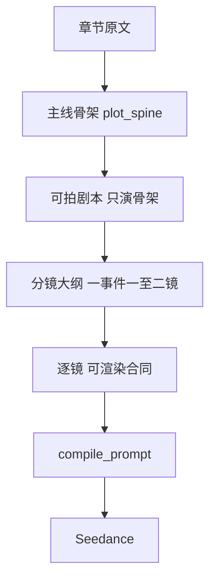

# 剧本分镜主线压缩与视频能力适配方案

> 状态：P0+P1+P2 Implemented（合同/校验/默认5s+>5审核/金样打分/剧本台 spine·drop 可见）  
> 版本：v1.0  
> 日期：2026-07-25  
> 适用项目：MJAgent2 / 案头助手  
> 关联文档：  
> - 《剧本、分镜与 Seedance 视频连续性整改方案》（连续性 / 一镜一主动作 / 禁止原文进 Seedance — **保留**）  
> - [`docs/PROMPT_SPEC.md`](../docs/PROMPT_SPEC.md)（实施阶段同步改写合同）  
> 核心目标：把剧本与分镜的成功标准从「忠实还原小说细节」改为「可拍、可生成、可观看的主线节拍」，使文案适配当代视频生成模型能力边界，避免超纲细节导致成片无观赏价值。

---

## 0. 执行结论

当前剧本 / 分镜链路被「防丢失」合同系统性推向细粒度：人物谱台词几乎全量入库、关键剧情点强制全覆盖、`action_desc` 鼓励写细、动作容量超限强制拆镜。结果是 **文案校验通过、成片不可看**——单镜动作超纲、微细节 Seedance 画不稳、镜头碎成 5 秒空转。

本方案确立新宪法 **Renderability First（可渲染优先）**：

1. **每章只保主线**：改变局势的事件必须留下；支线、气氛戏、装饰性对白进入 `drop_list` 并允许永久删除。
2. **结局大体一致**：`must_keep_ending` 锁定本章收束；禁止为模板钩子擅自扩写下一集剧情。
3. **绝对不抠细节**：剧本与分镜禁止微表情、手指、衣褶、材质、复杂道具交互、同镜多节拍等超纲描写。
4. **镜头有软预算**：目标约 8~16 镜 / 集；超限进入 repair，优先合并 / 删支线，禁止继续拆碎。
5. **校验拦超纲，不拦「空泛」**：废止「写细更好」；新增「细节超纲」「主线断裂」类门禁。

实施默认决策（避免悬空选项）：

| 决策点 | 默认 |
|---|---|
| PlotSpine 是否独立 LLM 阶段 | **否**。在 `generate_screenplay` 同一次输出中先写 `plot_spine`，再写正文；少一次往返，符合 P6 |
| 单集镜头预算 | **软预算 8~16**；情密章可上浮至 20，超过必须 repair |
| `source_excerpt` | **保留审计**；允许相邻镜共享同一主线段落；废除「必须推进到下一段原文」 |
| 与连续性 PRD | `state_in/out`、一镜一主动作、禁止原文进 Seedance **保留**；「写细更好 / 全覆盖不得删戏」**废止** |
| 与旧「防丢失」合同 | `key_lines` 全量人物谱台词 **废止**；改为主线台词上限 |

---

## 1. 文档目的

解决两类业务问题：

1. **剧本 / 分镜过度忠于小说散文细节**，产出当代视频模型无法稳定渲染的动作与画面指示，成片无观赏意义。
2. **校验器与提示词互相加压**，把「不丢细节」误当成质量，导致镜头数膨胀、成本上升、主线反而被淹没。

本方案不以「提示词写短一点」为目标，而是改写产品合同、数据契约与校验器优先级。

---

## 2. 现状与冲突清单

### 2.1 主流程（保留架构）



仍保留「剧本 → 大纲 → 逐镜 → 编译」分阶段架构（与连续性 PRD 一致）。变化在于：**中间契约从「全量防丢失」改为「主线骨架 + 可渲染预算」**。

### 2.2 与「减细节、只留主线」直接冲突的压力点

| 压力源 | 文件锚点 | 强制什么 | 业务后果 |
|---|---|---|---|
| 人物谱台词全量进 `key_lines` | `app/stages.py` `generate_screenplay`；`app/validators.py` `validate_screenplay` | 「谱内台词很多也要逐条列入并写回」 | 台词膨胀 → 拆镜膨胀 |
| `MIN_KEY_LINES/POINTS ≥ 3` + 分镜全覆盖 | `validators.py`；`validate_storyboard_preserves_key_content`；大纲 covers 分配 | 清单必须贯穿剧本→大纲→逐镜 | 无法合法删支线 |
| `information_ledger` / `events` 非空 + 原子拆法 | `stages.py` prompt；`validators.py`；`continuity.py` | 信息拆成可交付原子 | 间接逼更多镜 |
| `action_desc` 字数与节拍下限 | `ACTION_DESC_HARD_MIN=40`、目标 70 字；`VIDEO_SEGMENT_MIN_BEATS=2` | 过短 / 少节拍拒绝 | 鼓励堆细节 |
| 「写细更好」与入离场调度长文 | `stages.py` `_storyboard_output_contract` | 例：攥衣角、眼泪砸落… | 超纲描写进入 Seedance |
| 「镜头数无上限 / 不得合并删戏」 | 大纲与逐镜 prompt；`_maybe_split_outline_covers` | 不同节拍必须拆；自动插入大纲节拍 | 5s 微镜爆炸 |
| 动作容量强制拆镜 | `continuity.py` `action_capacity_errors` | 多顺序动词 → 拆镜 | 主线事件被切碎 |
| 相邻 `source_excerpt` 不得雷同 | `stages.py` ~872 | 每镜必须推进原文证据 | 绑定「跟原文走」逼碎镜 |

### 2.3 根因一句话

系统把 **文本覆盖率** 当成质量，而视频模型的真实瓶颈是 **单镜可渲染容量**。在模型画不稳手指与微表情的前提下，继续要求「完整演绎原文细节」必然产出无观赏价值的成片。

---

## 3. 产品边界

### 3.1 本期范围（P0~P2）

- 剧本阶段引入 `plot_spine` 合同，并改写 `key_lines` / `key_plot_points` 语义。
- 分镜大纲与逐镜改写为「主线事件驱动 + 可渲染合同」。
- 校验器：删除 / 降级细节密度门禁；新增超纲细节与镜头软预算门禁。
- 提示词与 `docs/PROMPT_SPEC.md` 同步改写。
- 金样回归：同一章节新旧合同成片对照。
- P2：剧本台 / 分镜台最小展示 `plot_spine` 与 `drop_list`（人工可确认删戏）。

### 3.2 明确不做

- 不切换视频供应商、不引入后期剪辑 / TTS / 字幕补救来「救」超纲文案。
- 不恢复「人物谱角色原文台词全量入库」。
- 不新增独立 LLM 阶段专门跑 PlotSpine（避免多一次失败面与上下文漂移）。
- 不以 synopsis 替代章节原文作为主线证据；原文仍是 spine 的唯一事实源，但 **只抽取主线**。
- 不废除连续性字段（`state_in/out`、`continuity_mode`）与「禁止原文进 Seedance」。
- 不在本期重做整套 UI；仅 P2 增加 spine / drop 的最小可见性。

### 3.3 与关联 PRD 的优先级

当本方案与《连续性整改方案》冲突时：

| 条款类型 | 谁优先 |
|---|---|
| 一镜一主动作、`state_in/out`、禁止原文进 Seedance、非连续动作勿用尾帧 | 连续性 PRD |
| 「原文必要剧情信息覆盖率 100%」「必要对白一次性全部分配」若被解释为全量细节 | **本方案覆盖**：改为「主线 spine 覆盖率 100%」 |
| 「写细更好」、全量 `key_lines`、不得删戏、无镜数上限 | **本方案废止** |

---

## 4. 目标与成功标准

### 4.1 业务目标

1. 观众能在成片中追到「本章发生了什么、如何收束」，而非看一堆失败的细节表演。
2. 单镜指示落在 Seedance 稳定能力内：少角色、单动作、短对白、大形体可读。
3. 单集镜头数可控，成本与观赏节奏同步改善。
4. 人工审剧本时一眼看到「保留了什么、丢掉了什么」，避免静默丢主线。

### 4.2 验收 DoD（替代纯文本覆盖率崇拜）

| 指标 | 目标 | 测量 |
|---|---:|---|
| 单集镜头数 | 落在 8~16（情密章 ≤20） | 自动统计 |
| `plot_spine.spine_beats` 条数 | 5~12 | Schema |
| `key_lines` 条数 | ≤6，且每条映射某 spine beat | Schema + 校验 |
| 主线 spine 覆盖率（分镜落地） | 100%（每条 spine 至少 1 镜） | 自动 |
| `drop_list` 中内容再次出现在分镜 | 0 | 自动抽检 |
| 结局与 `must_keep_ending` 一致 | 人工抽检通过 ≥90% | 5 集样本 |
| 超纲细节词命中（见 §6 词表） | 剧本 / 分镜 / 最终 prompt 均为 0 | 自动 |
| 样本集首轮视频「可看」（主线可读、无严重动作崩坏） | ≥60%（稳定期 ≥75%） | 人工 + 可选 VLM |
| 旧合同对照组镜数 | 新合同镜数 ≤ 旧合同的 70% | 同章对照 |

首轮金样：现有《斗破苍穹》第 1 集；旧版 24 镜结果作对照，保留同章、同模型版本。

---

## 5. 新数据合同

### 5.1 PlotSpine（嵌入剧本输出，非独立阶段）

`EpisodeScreenplay` 新增（或并列）字段 `plot_spine`：

```json
{
  "plot_spine": {
    "episode_premise": "一句话：本集主角要什么、碰到什么阻力",
    "spine_beats": [
      {
        "beat_id": "S01",
        "who": "萧炎",
        "does": "被点名出列走向石碑",
        "turn": "全场目光集中到他身上",
        "must_keep": true
      }
    ],
    "must_keep_ending": "测试结果公布后的当场收束（与原文本章结局同向，不提前下一章钩子）",
    "drop_list": [
      "广场上无关路人起哄的多轮对话",
      "服饰/站位的散文级描写"
    ]
  }
}
```

硬规则：

1. `spine_beats`：**5~12 条**。每条必须是「谁做了什么 → 局势变化」；禁止气氛、心理分析、纯景物。
2. `must_keep`：默认全部 `true`；仅当某 beat 为可选过渡时可 `false`，但总数仍须保证主线因果不断。
3. `must_keep_ending`：必填；禁止为空时发明下一集剧情。
4. `drop_list`：至少列出 2 条「本章有但本集不拍」的内容，迫使模型显式取舍（避免口头说压缩、实际仍全写）。
5. 校验顺序：**先过 spine，再过正文**。正文场次 / 台词不得引入 spine 与 `drop_list` 之外的新主线事件。

### 5.2 剧本合同改写

| 字段 / 规则 | 旧 | 新 |
|---|---|---|
| `key_lines` | 人物谱台词尽量全收，3~8+ 可膨胀 | **主线台词 ≤6**；每条必须服务某 `beat_id`；允许口语压缩，不要求逐字还原小说 |
| `key_plot_points` | 3~8「绝不能丢」且易与细节绑定 | **与 `spine_beats` 对齐（4~8）**；内容 = 局势变化，不是动作微描写 |
| `full_script_text` | 偏台本细写、偏长 | **只演 spine**：场次 3~5；对白服务冲突；禁止舞台指示级细节 |
| `events` / `information_ledger` | 强制非空、原子拆细 | **ledger 条数 ≤ spine 条数 × 2**；只登记主线信息；禁止为气氛声拆 info |
| 舞台指示 | 鼓励可见动作表情道具 | **只写大形体可读动作**（走、停、伸手、转身、开口）；禁止见 §6 |

剧本层职责不变：「小说 → 可拍的戏」；改变的是 **可拍的粒度 = 视频模型粒度**，不是话剧排练粒度。

### 5.3 分镜合同改写

| 项 | 新合同 |
|---|---|
| 规划单位 | 1 条 `must_keep` spine ≈ **1~2 镜**（需要反应镜时最多 +1，计入预算） |
| 单集镜数 | 软预算 **8~16**（上限告警 20）；超限 repair：合并反应镜 / 删除 `must_keep=false` / 压缩对白 |
| `action_desc` | 目标 **25~55 字**；硬下限降至约 18 字；**单主动作**；禁止「写细更好」 |
| 动作节拍 | 废除「至少 2 个动作片段」硬门槛；5~6s 镜允许 1 个主动作 + 可选自然收势 |
| 景别 / 运镜 | 默认中景或近景 + 固定 / 轻推；禁止同镜要求复杂运镜组合 |
| 出场角色 | 单镜画面角色 **≤3**（含路人剪影）；开口说话 **≤2** |
| 声轨 | 只保留 spine 需要的对白 / 一句内心 OS / 必要旁白；废除「任意声音密度」类软指标 |
| `source_excerpt` | 仍必填作审计；**允许相邻镜共享同一主线段落**；废除「必须推进到下一段原文」 |
| 大纲 covers | 只覆盖 spine / key_plot_points；**禁止**为 `drop_list` 内容自动插镜 |

### 5.4 与编译层的边界

- `compile_prompt` 继续只吃分镜字段 + 圣经锚点；**不注入** `source_excerpt` / 原文（连续性 PRD 已落地，保持）。
- 若分镜仍含超纲词，编译前 `sanitize` 可做一次剥离，但 **根治在上游合同**，不依赖编译器捂嘴。

---

## 6. Seedance 能力边界（硬约束，写入生成 prompt）

### 6.1 稳定可做（优先使用）

- 1~2 个主体的大形体动作：走、停、转身、伸手、后退、抬头、开口说话。
- 单句短对白（口播预算内说完）。
- 明确的情绪大方向：怒 / 惊 / 冷 / 喜（用姿态与语气，不靠眉眼微颤）。
- 简单道具接触：抬手触石碑、握住剑柄（一次接触，不要连续玩道具）。
- 固定或轻微推拉的单一运镜。

### 6.2 不稳定 / 禁止写入剧本与分镜（超纲）

| 类别 | 示例（禁止） |
|---|---|
| 微表情 / 微动作 | 眉梢挑起、泪珠滑落、嘴角抽搐、攥紧衣角到指节发白 |
| 手部精细 | 复杂指法、数指、精细翻书页、连续手势语 |
| 材质与服饰 | 绣纹、布料光泽、每片甲片、妆造特写堆砌 |
| 群戏调度 | 同镜多人轮流说话、复杂走位穿插、观众席逐个反应 |
| 同镜多节拍 | 「出列→触碑→亮光→读数→哄笑→微笑」塞进一条 |
| 小字 / 复杂屏幕 UI | 大段碑文、手机聊天长截图（必要文字须极短且独占一镜） |
| 抽象文学 | 「命运的齿轮」「心湖涟漪」等不可拍比喻 |

### 6.3 超纲词表（校验用，实施时落代码）

初始黑名单（可配置扩展）：`微微`、`轻轻颤抖`、`泪`（作特写指令时）、`指节`、`衣角`、`发丝`、`瞳孔`、`嘴角`、`绣`、`纹理`、`逐个`、`同时说道`、`分屏`、`闪回`。

命中策略：剧本 `full_script_text` / 分镜 `action_desc` / `first_frame_desc` / `last_frame_desc` / 最终 Seedance prompt — **命中则校验失败并回喂修复**（修复方向是删细节，不是改写得更细）。

---

## 7. 校验器改写表

| 旧规则 | 处置 | 新规则 |
|---|---|---|
| 人物谱原文台词必须进 `key_lines` | **删除** | `key_lines ≤6` 且映射 `beat_id` |
| `MIN_KEY_LINES/POINTS ≥ 3` 且分镜全覆盖细节 | **改写** | 覆盖对象改为 `spine_beats(must_keep=true)` |
| `ACTION_DESC_HARD_MIN=40`、目标 70、「写细更好」 | **下调 / 删除文案** | 硬下限 ≈18；目标 25~55；禁止堆细节 |
| `VIDEO_SEGMENT_MIN_BEATS=2` | **删除** | 允许单主动作镜 |
| 镜头数无上限、不得合并删戏 | **废止** | 软预算 8~16；超限 repair 合并 / 删 `drop` |
| 大纲自动拆 covers / 双声轨强制插镜 | **降级** | 仅当同一 spine 内口播或动作确实不可同镜时才拆，且计入预算 |
| 相邻 `source_excerpt` 不得雷同 | **废止** | 允许共享主线段落证据 |
| `information_ledger` 非空即可无限细 | **加帽** | 条数 ≤ `len(spine_beats)*2` |
| （无）超纲词检测 | **新增** | §6.3 词表 |
| （无）spine 先行校验 | **新增** | 无合法 `plot_spine` 则整集剧本失败 |
| （无）`drop_list` 回流检测 | **新增** | drop 内容再现则失败 |
| 连续性 `state_in/out`、一镜一主动作 | **保留** | 与本方案一致 |
| 禁止原文进 Seedance | **保留** | 不变 |

修复回路原则（P5）：错误必须具体到字段；修复提示明确写「删除超纲细节 / 合并镜头 / 回到 spine」，禁止「补充更多可见细节」类旧话术。

---

## 8. 提示词改写要点（实施时改 `app/stages.py` + PROMPT_SPEC）

### 8.1 剧本 `generate_screenplay`

前置声明（写入 system / 任务头）：

> 你在为 AI 视频短剧写「可渲染剧本」，不是写话剧精排场刊。当代视频模型画不稳微表情、复杂手指与群戏。只抽取本章主线骨架并扩写；显式列出不拍的内容；结局与原文本章同向即可。

输出顺序要求：先 `plot_spine`，再场次与 `full_script_text`，再精简 `key_lines` / `key_plot_points`。

删除或改写旧句：

- 「人物谱角色台词不允许只挑金句，很多也要逐条列入」→ 「只保留推动 spine 的台词，总数 ≤6」
- 「绝不能丢的态度/情绪锋芒」→ 「绝不能丢的是局势变化；情绪用大姿态表达」

### 8.2 分镜大纲 / 逐镜

- 「完整覆盖剧本、不得遗漏、不得合并删戏」→ 「完整覆盖 `plot_spine.must_keep`；`drop_list` 禁止拍；超预算必须合并」
- 「action_desc 写细更好」→ 「25~55 字单主动作；禁止超纲词表」
- 注入 §6 能力边界表（短版）。
- 保留：声轨来自已确认剧本、`source_excerpt` 不进 Seedance、连续性模式枚举。

### 8.3 通用 system 前缀微调

在「专业编剧与分镜师」后追加一句：

> 你的观众看的是 AI 生成视频，不是摄影机实拍；请为模型能力写作，不为文学完整度炫技。

---

## 9. 分阶段落地

### P0（合同落地，必须先做）

1. Schema：`plot_spine` 字段进入剧本模型。
2. `generate_screenplay` prompt + `validate_screenplay` 按 §5 / §7 改写。
3. 大纲 / 逐镜 prompt + 相关 validator / continuity 软预算与超纲检测。
4. 同步 `docs/PROMPT_SPEC.md` §C0/C/C1 相关段落。
5. 单测：spine 校验、key_lines 上限、超纲词、镜数软预算、drop 回流。

### P1（金样与对照）

1. 同章（《斗破》第 1 集）新旧合同各跑一轮到分镜确认。
2. 抽样生成视频，按 §4.2 打分。
3. 若镜数仍 >20 或可看率 <60%，回调：收紧 spine 上限或加强超纲词，不恢复全量 key_lines。

### P2（最小可见性）

1. 剧本台展示 `spine_beats` / `must_keep_ending` / `drop_list`。
2. 允许人工勾选「恢复一条 drop」（显式授权后再进分镜），默认关闭。
3. 监制房调用日志标注合同版本（`renderability_v1`），便于对照。

---

## 10. 代码锚点（实施清单）

| 模块 | 路径 | 改动摘要 |
|---|---|---|
| 剧本生成 | `app/stages.py` → `generate_screenplay` | 嵌入 spine；改 key 清单语义；注入能力边界 |
| 分镜大纲 / 逐镜 | `app/stages.py` → `generate_storyboard_outline` / `generate_storyboard_next_shot` | 主线驱动；删「写细」「不得删戏」；软预算 |
| 校验 | `app/validators.py` | 删全量台词；改字数/节拍；增 spine / 超纲 / drop |
| 连续性与拆镜 | `app/continuity.py` | 拆镜与预算协同；避免自动碎镜 |
| 领域任务 | `app/domain/screenplay_ops.py` / `storyboard_ops.py` | 透传新字段；保存再校验 |
| 编译消毒 | `app/compiler.py` | 可复用超纲词剥离作第二道闸（非根治） |
| 规范文档 | `docs/PROMPT_SPEC.md` | 与本 PRD 对齐 |
| 测试 | `tests/test_*screenplay*` / `*storyboard*` / 新增 renderability 用例 | 锁合同 |

---

## 11. 风险与对策

| 风险 | 对策 |
|---|---|
| 压缩过猛，主线被误丢 | `must_keep` spine 100% 覆盖校验 + 人工看 spine 列表（P2） |
| 模型仍爱写细 | 超纲词硬拒绝 + repair 明确「只删不补细」 |
| 与旧连续性验收「信息覆盖率 100%」指标冲突 | 本方案重定义覆盖对象为 spine；更新连续性 PRD 验收表交叉引用 |
| 情密章 16 镜装不下 | 允许上浮至 20；仍超则强制升 `drop_list`，禁止无上限拆镜 |
| 用户主观觉得「不够还原」 | 产品说明：目标是可看漫剧，不是有声连环画式原文搬演 |

---

## 12. 非目标重申

- ❌ 用更长视频、更多参考图、更多重试掩盖超纲文案  
- ❌ 恢复全量原文台词 / 全量细节覆盖作为质量KPI  
- ❌ 为压缩而引入新框架或重写整条媒体流水线  
- ❌ 在 Seedance prompt 里塞原文「兜底」  

---

## 13. 一句话验收

若同一章产出的分镜在 **8~16 镜**内讲完 spine、最终视频里观众能追到主线与同向结局，且提示词中 **无超纲细节**——本方案即达成；若文案覆盖率很高但成片不可看——本方案视为失败，即使 Schema 全绿。
