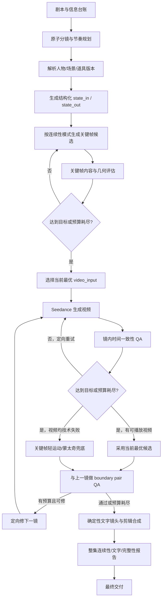

# 漫剧成片质量、镜头连续性与文字画面整改 PRD

> 文档编号：PRD-FINAL-QUALITY-001  
> 版本：v1.3  
> 日期：2026-08-03  
> 状态：P0 已落地，P1 部分已落地  
> 样本：`/Users/bytedance/Downloads/episode-2-final.mp4`  
> 对应生产记录：《我欲封天》第 2 集，`episode_id=ep_f75e4207849d`  
> 关联文档：[剧本分镜与 Seedance 视频连续性整改方案](./剧本分镜与Seedance视频连续性整改方案.md)、[人物多视角资产与关键帧一致性 QA 改造方案](./人物多视角资产与关键帧一致性QA改造方案.md)、[QA 只评分与偶然错误拦截改造 PRD](./QA只评分与偶然错误拦截改造PRD.md)

---

## 0. 最终结论

本产品的最高优先级不是拿到满分素材，而是**每次任务都能自动、完整、按时交付一条可播放成片**。当前生成模型对复杂人物表演、跨镜道具状态和精确中文的实际完成度可能只有目标的 40%–50%，产品不能假设通过 QA 就一定能得到“合格解”，也不能让 QA 成为任务中断器。

因此，当前“技术可用即保留、候选耗尽后选最高分”的方向应继续保留。需要改进的是：系统目前通常每镜只生成 1 个视频，没有充分使用有限重试、定向修复、候选择优和确定性后期来抬高这个“最终最高分”，同时技术失败后的重试与恢复不够稳定。

本次样本中，系统已经在关键帧或视频 QA 阶段识别出错人、错字、人物分身、比例异常、动作缺失和首尾状态不一致。当前 `score-only` 策略为了确保交付，会继续使用可播放素材；这个原则本身需要保留，但实现上仍缺少：

1. 关键帧候选耗尽后虽会择优，但没有把问题类型变成下一阶段的定向生成策略；
2. 每镜通常只有 1 个视频候选，内容再差也没有第二条可供比较；
3. 用纯硬切按镜号拼接，不检查相邻镜头边界；
4. 把精确中文交给扩散视频模型直接绘制；
5. 在没有道具真值图和结构化道具状态的情况下，仅用自然语言要求物品保持不变。

因此，本 PRD 的核心方案不是继续堆提示词，也不是建立一票否决式质量门禁，而是建立七层“交付优先”的质量爬坡机制：

- **QA 只负责诊断、排序和分配重试**：低分或内容错误触发预算内重试，但永远不暂停整集、不等待人工、不阻止最终交付。
- **有限重试后强制择优**：达到目标分、耗尽次数或耗尽成本预算时立即停止尝试，从所有技术可用候选中选择综合风险最低的一条。
- **真实模型视频是最低成片资格**：低分真实视频可在预算耗尽后择优采用；静态图片、轻运动卡和静音片段不得作为视频版本、采用版或最终成片槽位。
- **连续性从自由文本升级为结构化状态链**：人物、场景、道具、手部占用、屏幕方位和光线都成为可比较字段。
- **同场切镜继承上一镜真实状态**：连续动作把尾帧作为视频起点；反打、反应镜和同场换机位把尾帧用于生成下一镜关键帧，而不是直接复制上一镜构图。
- **剧情道具建立资产与状态机**：像“凝气卷”这样的跨镜关键道具必须有稳定外观、允许状态和唯一文字策略。
- **文字改走确定性渲染**：精确中文默认由工程渲染为插入镜头，视频模型只负责人物表演和无字道具；只有极少数必须跟随运动道具的文字才走高风险嵌入模式。

最终采用与合成规则改为：**低分不等于不可交付，QA 错误不等于流程失败，但图片不等于视频**。成片可随时按镜号合成当前已有的真实视频；未完成镜头透明跳过并标记 `partial`，禁止用关键帧轻运动、静音卡片或中性底色填充缺镜。

---

## 1. 样本审计结论

### 1.1 成片与生产数据

| 项目 | 结果 |
|---|---:|
| 成片规格 | 720×1280，约 24fps，H.264 + AAC |
| 成片实测时长 | 101.07s |
| 分镜数 | 12 |
| 分镜计划时长 | 100s |
| 10s 镜头数 | 8/12 |
| 使用 `action_continuation` 的镜头数 | 0 |
| 使用上一镜尾帧强承接的镜头数 | 0 |
| 含 `required_text` 的镜头数 | 4 |
| 成功视频版本数 | 12，每镜仅 1 个 |
| 本集视频记录成本 | ¥80.00 |
| 采用视频平均 QA | 0.4625 |
| QA 低于 0.6 的采用视频 | 10/12 |
| QA 为 0 的采用视频 | 2/12 |
| 被选为视频输入的关键帧 | 14 |
| 关键帧低于 0.8 | 11/14 |
| 带明确硬失败的已选关键帧 | 10/14 |

这说明以当前模型能力设一条刚性高分线并不现实；更关键的问题是每镜只有 1 个视频版本，系统没有利用有限的第二、第三次机会进行定向纠错和择优。正确策略不是停在关键帧阶段，而是让低分信号改变重试参数，最后无条件选择当前最好结果完成整集。

### 1.2 成片时间轴中的典型问题

| 时间段/镜头 | 肉眼问题 | 系统当时已有证据 | 当前为何未在交付前改善 |
|---|---|---|---|
| 0–15s，镜 1–2 | 同场反打时人物规模、站位和可见角色变化突然；引路人从上一镜缺席到下一镜突然占据主体 | 镜 1、2 关键帧均有 `relative_scale_mismatch` | 三张关键帧候选耗尽后选最好一张继续是合理兜底，但失败信息没有转成视频侧约束或后续边界修复 |
| 15–35s，镜 3–4 | “马脸青年”被画成普通俊美蓝衣男子；连续两个 10s 近景基本为静态说话，视觉信息重复 | 两镜视频 `character_match=0`、`wrong_identity`；关键帧同样明确 `wrong_identity` | 每镜只有一条视频；`wrong_identity` 没有触发带人物资产强化的第二次定向尝试 |
| 35–45s，镜 5 | 粗麻长衫、木牌、小册三种物品坍缩为悬浮衣物/卷轴；道具出现方式、数量和形态不可信 | 视频 QA=0.4，含 `text_error`、`wrong_action`、`state_mismatch`；关键帧本身只稳定画出一本卷册，没有交付完整道具集合 | 视频 QA 只评分；关键帧 QA 没有独立的 `prop_identity_match/prop_state_match/object_count_match` 主项 |
| 45–61s，镜 6–7 | 入室后出现人物重影/分身；上一镜持有的衣物、木牌和卷册状态没有可靠带入；安慰、拿书、坐下、翻开被挤在同一镜 | 镜 6 QA=0，`character_duplicate/state_mismatch`；镜 7 QA=0.2，`state_mismatch/story_repeat`；镜 7 关键帧有 `action_missing/required_text_error/geometry_guard_unverified` | 系统直接采用唯一可播放版本，没有把“分身/动作过载”路由成减少同框人物或拆动作的第二次尝试 |
| 61–75s，镜 8–9 | 书页/卷轴的形态变化；“人当有靠山”实际出现错字；文字占画面过大、持续过久，像静止读图而非剧情表演 | 镜 8 关键帧 QA 已识别文字实际为“人当有掌山”，报 `required_text_error`；视频 QA 却把 `text_match` 评为 1 | 文字只依赖生成模型和 VLM；没有确定性文字渲染，也没有逐帧 OCR/精确字符串门禁 |
| 75–86s，镜 10 | 人物年龄感、脸型与头身比继续变化；“凝气卷”从书页变成卷筒；10s 推近缺少新的动作节拍 | 视频 QA=0.5，含 `story_repeat/state_mismatch/wrong_identity` | 长镜头审核与人物一致性只有评分，没有触发人物锚点强化、缩短镜头或轻运动兜底的择优路径 |
| 86–101s，镜 11–12 | 咬桌角的道具结果没有稳定留到下一镜；门被踹开的首尾状态不匹配，结尾更像“门慢慢打开”；动作事件缺乏冲击力 | 镜 11 QA=0.4，镜 12 QA=0；镜 12 关键帧已指出桌角牙印缺失和受惊动作不充分 | 每镜 QA 独立运行，没有对“上一镜尾部 + 下一镜头部”做边界成对评估；合成器只做 concat |

### 1.3 当前实现中的质量爬坡缺口

1. `app/video_modes.py` 会在三张关键帧候选全部带硬失败时选择最高分候选继续，这符合交付优先原则；但 `gate_retry_exhausted` 中的问题没有成为后续视频提示、参考图装箱或兜底策略的输入。
2. `app/evidence/media.py::select_best_video_candidate()` 的实际资格条件是“技术可解码”；本集每镜只有 1 个成功视频版本，因此所谓“best”实际上没有选择空间，也没有 `retry_count/selection_reason/residual_risks`。
3. `app/stages.py::qa_shot()` 的提示合同允许输出 `wrong_identity`、`wrong_outfit`、`subject_occlusion`，但 `app/continuity.py::HARD_QA_FAILURE_TYPES` 不接收这些值，导致严重问题无法稳定路由到对应的定向重试策略。
4. 视频 QA 缺失分项时，多项默认值为 1.0。对于 `final` 模式，未验证不能等价于满分。
5. `app/media_exec/concat.py` 只按镜号执行 concat demuxer 或重编码拼接；分镜里的 `transition` 并没有成为最终剪辑操作。
6. 当前同场 `same_scene_cut/reverse_angle/reaction_cut` 只锁场景和人物身份，不把上一镜真实尾状态用于下一镜关键帧生成。
7. 参考图数据结构已经支持 `type=prop`，但当前没有项目级道具资产库、镜头级道具状态合同或稳定的道具装箱规则。

---

## 2. 产品目标与非目标

### 2.1 P0 目标

1. 所有整集生成任务在无人干预时都能走到完整成片；QA 低分、QA 不可用或候选内容错误均不能中断任务。
2. 关键帧与视频默认执行有限的 best-of-N 重试；预算耗尽后自动选择技术可用候选中的最优版本。
3. 生成视频技术失败时执行有界技术重试；没有真实模型视频的镜头保持缺镜并可重试，禁止以图片冒充视频。
4. 相邻镜头的人物身份、造型版本、道具所有权/形态、空间轴线和光线状态可结构化传递并可自动比较。
5. 同场换机位能继承真实状态，同时避免把上一镜构图直接复制到下一镜。
6. 跨镜复用的剧情道具有唯一资产版本和状态机；不再仅靠 prompt 文字维持。
7. 精确中文画面在默认路径下达到 100% 正确，不再依赖扩散模型拼字。
8. 最终合成前逐边界检查；问题优先触发定向重试或低成本剪辑修复，预算耗尽后带风险完成交付。
9. 不删除低分产物、不无限重试；每集有明确的次数、成本和最长耗时预算。

### 2.2 P1 目标

1. 增加确定性转场执行、短音频交叉淡化和片段响度归一。
2. 增加镜头节奏规划，减少连续 10s 静态近景、重复构图和“会说话的静止图”。
3. 增加角色之间的“可区分性”检查，避免多个角色因同色服装、相似发型和相似年龄感而被观众误认。
4. 在评审墙中用边界对照、道具状态和文字策略解释问题，而不是只给一个总分。

### 2.3 非目标

- 不训练 LoRA、FaceID 或本地角色模型。
- 不用无限次重抽追求满分。
- 不引入专业 NLE 时间线、复杂特效系统或人工逐帧修图。
- 不要求所有切镜都叠化；同场对话默认仍是硬切，质量来自匹配动作、视线和状态。
- 不自动改写原文事实或增加原文不存在的剧情。
- 不把低分素材删除；低分只影响重试优先级和候选排序，不影响任务能否完成。
- 不以追求分数为由暂停工作流、等待人工审批或拒绝输出整集。

---

## 3. 核心产品决策：交付优先的两档质量预算

### 3.1 新增 `production_quality_mode`

```text
draft   快速草稿：技术有效即可继续，QA 只评分；允许带风险采用与部分合成。
final   最终成片：在预设次数/成本/耗时内自动重试和择优，预算耗尽后强制采用当前最佳真实模型视频。
```

默认策略：

- 单镜“快速生成”默认 `draft`，与现有行为兼容。
- “生成整集最终成片”“最终合成”“交付包”必须显式进入 `final`。
- 两种模式都不能被 QA 中断；差异仅在候选数量、重试预算、边界修复和后期精度。
- 用户可手动替换自动择优结果，但整集流水线不等待用户操作。

### 3.2 `final` 模式中的 QA 权限边界

QA 是优化控制信号，不是流程门禁：

| 行为 | 是否允许 |
|---|---:|
| 保存低分图片/视频到文件与数据库 | 是 |
| 展示、下载、回看低分候选 | 是 |
| 删除低分候选 | 否 |
| 因低分无限自动重生/重抽 | 否 |
| 低于目标分时按预算自动重试 | final 是；draft 可关闭 |
| 候选全部低分后选择最高分继续 | 是，必须 |
| QA 服务失败或缺字段后继续 | 是，按 `unverified` 保守排序 |
| 因内容 QA 低分暂停整集等待人工 | 否 |
| 所有视频调用技术失败后生成图片/静音视频占位 | 否，禁止；保持缺镜并允许技术重试 |
| 用户事后手动替换自动采用版本 | 是 |

新的状态语义：

```text
generated   文件技术有效，已经保存
scored      已有内容评分
retrying    存在可操作问题且仍有质量预算，正在定向重试
selected    在当前候选集合中风险最低/综合得分最高
adopted     用户或系统选为当前镜头版本
missing_real_video    生成视频技术不可用，时间线槽位保持缺失并等待重试
finalized   已进入完整成片；可带质量风险，但不能缺失
```

### 3.3 默认有限重试预算

每个镜头独立运行，不因单镜问题锁住其他镜头：

| 阶段 | draft 默认 | final 默认 | 停止条件 |
|---|---:|---:|---|
| 关键帧候选 | 1–3 张 | 最多 3 张 | 达到目标分、候选数耗尽或超时 |
| 生成视频候选 | 1 条 | 最多 3 条 | 达到目标分、次数/成本耗尽或超时 |
| 边界定向修复 | 0 次 | 最多 1 次/边界 | 修复通过或整集预算耗尽 |

整集同时设置 `max_generation_cost` 与 `max_wall_clock_minutes`。停止条件的语义是“停止继续尝试并选择当前最好结果”，不是“停止任务”。高风险镜头可从低风险镜头借用未使用的重试额度，但整集不得突破总预算。

重试必须有方向：错人就加强人物资产和身份提示，道具错误就切换道具真值图/拆动作，文字错误就切换确定性文字策略。完全相同参数的盲抽最多追加 1 次。

### 3.4 真实视频资格阶梯

每个时间线槽位按以下顺序获得可播放资产：

1. 达到目标质量的视频候选；
2. 预算耗尽后的最高综合分可播放视频；
3. 视频文件技术失败时，在独立技术重试额度内重新提交或恢复供应商任务；
4. 技术重试耗尽仍无真实视频时保持 `missing_real_video`，不得写入采用关系；阶段合成时跳过该镜并记录镜号；
5. 精确文字可在真实模型视频之上使用确定性后期插入，但不能独立充当整镜视频。

内容 QA 低分永远不构成任务失败；只要存在可解码真实模型视频就可择优采用和参与当前阶段合成。若输出文件无法编码/解码且重试耗尽，该镜明确保持技术缺失并在本次合成中跳过，不得用静态图片或静音轨伪造完整性。

---

## 4. 新的端到端生产流程



关键原则：

- 最昂贵的视频调用之前，先用图片 QA 选择成功概率最高的输入；即使没达到目标分，也必须选当前最好的一张继续。
- 后镜修复默认不重烧前镜；使用前镜已采用尾帧重建后镜关键帧。
- QA 不可信时进入 `unverified`，降低排序置信度但不中断生产。
- 任意内容 QA 重试分支最终都必须汇入“采用当前最好真实模型候选”；技术上没有任何可播放模型视频时保留缺镜并允许重试，不得生成图片占位版。

### 4.1 2026-08-03 实施检查点

已落地：

- 视频 QA 有界重试、按风险择优、QA 不可用时继续；所有候选都保留。
- 缺镜时不再生成图片/轻运动/静音兜底；合成只接受当前已有的真实模型视频，缺镜直接跳过并在报告中列出，不会因内容 QA 低分拒绝已有真实视频。
- 成片台不等待整集模型任务收口；任意一镜真实视频落盘后即可合成当前版本。未采纳但真实可播放的模型候选先自动择优，完全没有模型视频的镜头显示为本次跳过。
- `continuity_state_in/out` 已进入 `shot_contract_json`，包含场景 revision/光线/轴线、人物 look/outfit/手部占用、道具 revision/owner/location/form/text_state；未变字段由代码继承。
- 跨场景只继承人物/道具身份与持有状态，主动清除旧场景的 screen_side、pose、facing、gaze 和环境几何，避免把上一场构图错误锁入新场景。
- 视频 QA 已新增道具身份、道具状态、数量与轴线分项；低分只分配有界重试，不阻断。
- `required_text` 默认为 `deterministic_insert`，终剪使用 CJK 字体渲染精确文字，并合并重复交付镜头；`embedded_prop` 保留为显式高风险选项。
- `final_edit` 已执行镜间 xfade、音轨 acrossfade、响度归一和静音兼容降级；终剪失败自动回退 `draft_concat`，记录 `episode.edit-report.json`，不中断完整交付。
- 参考图装箱优先级已改为“上镜尾帧 → 剧情关键帧 → 道具 → 场景 → 人物 → 风格”。
- 终剪前产出非阻塞边界报告；成片台显示完整成片或阶段成片，阶段成片明确列出跳过镜号。

尚未落地（后续 P1）：项目级道具资产库与状态图、边界成对 VLM 与 stale 级联、节奏指标/自动拆镜、人物 pairwise 可区分性。这些缺口不影响当前完整成片交付。

---

## 5. 需求一：关键帧择优与有限重试

### 5.1 final 模式关键帧质量目标

以下是“停止重试并提前采用”的目标，不是继续生产的资格线：

| 分项 | 最低值/规则 |
|---|---:|
| `overall` | ≥ 0.80 |
| `action_match` | ≥ 0.75 |
| `face_identity`（脸可见时） | ≥ 0.85 |
| `outfit_match` / `hair_match` | ≥ 0.80 |
| `body_proportion` | ≥ 0.75 |
| `scene_match` | ≥ 0.75 |
| `prop_identity_match`（有关键道具时） | ≥ 0.85 |
| `prop_state_match`（有关键道具时） | ≥ 0.85 |
| `object_count_match` | 必须通过 |
| `required_text_match` | `embedded_prop` 模式必须精确通过；其他模式不要求视频模型画字 |

以下失败属于高优先级问题，应消耗剩余预算进行定向重试：

```text
wrong_identity
wrong_outfit
character_duplicate
relative_scale_mismatch
action_missing
prop_identity_mismatch
prop_state_mismatch
object_count_mismatch
required_text_error
wrong_camera_axis
geometry_guard_unverified（本镜存在固定几何/关键道具要求时）
```

兼容现有数据时，将 `wrong_action` 归一化为 `action_missing`，将 `text_error`、`required_text_error` 归一化为统一的文字失败类型；提示词枚举、解析器、重试路由器和 UI 必须引用同一份失败类型定义，避免 QA 已报错但系统无法做定向优化。

### 5.2 候选耗尽后的行为

- 仍生成并保存既定数量的关键帧候选，默认最多 3 张。
- 候选达到质量目标时可提前停止；否则继续到次数、成本或耗时预算耗尽。
- 三张均未达到目标时，自动选择综合风险最低的一张作为 `video_input`，标记 `best_effort_selected=true` 并继续提交视频，不等待人工确认。
- 排序不能只看 `overall`：优先保证人物身份、角色数量和剧情动作，再比较道具、构图与美术分；文字默认移交确定性渲染，不应拖累人物视频选择。
- 候选排序同时使用确定性技术指标（可解码、时长、黑帧、静帧、音轨）、分项 QA、跨镜差异、问题是否可由后期修复以及重试历史；VLM 的单一总分只占排序的一部分。可由工程修复的文字/转场问题，惩罚权重应低于错人、分身和关键动作缺失。
- 若 3 张均无法解码或缺少主体，保留该镜技术缺失并允许重试；本次阶段合成跳过该镜，不进入静态图或轻运动兜底。
- 不自动创建第四、第五张候选，除非动态预算器确认整集仍有剩余额度。

### 5.3 统一失败枚举

关键帧 prompt、视频 QA prompt、解析器、`classify_video_hard_failures()`、`video_issues.py` 和前端标签必须引用同一份枚举，禁止各自维护字符串集合。

未识别失败码必须保留为 `unknown_failure_type` 并显示，不能静默丢弃。final 模式下，必需分项缺失为 `unverified`，不得用 1.0 回填；`unverified` 会触发一次可用预算内的复核或降低候选排序置信度，但不会暂停任务。

---

## 6. 需求二：结构化镜头连续性状态

### 6.1 当前问题

现有 `state_in/state_out` 是自然语言，`_too_divergent()` 主要靠共享汉字片段判断。它能发现明显的文字矛盾，但不能可靠判断：

- 同一个人是否换脸、换年龄感或换衣服；
- 人物上一镜在画面左侧，下一镜是否越轴到右侧；
- 左手拿卷轴是否突然变成右手或空手；
- 卷轴是合拢、展开、包在衣服里还是消失；
- 桌子、门、床和牙印是否仍在相同位置；
- 夜晚油灯光是否变成白昼天光。

### 6.2 新增 `continuity_state`

```json
{
  "scene": {
    "scene_revision_id": "scene_x",
    "time_of_day": "night",
    "lighting_state": "single_oil_lamp_warm",
    "axis_id": "room_beds_table_door_axis_a",
    "landmarks": {
      "left_bed": "screen_left",
      "table": "center",
      "door": "screen_right"
    }
  },
  "characters": {
    "孟浩": {
      "look_revision_id": "portrait_x",
      "visibility": "visible",
      "screen_side": "right",
      "pose": "seated_cross_legged",
      "facing": "door",
      "gaze_target": "door",
      "left_hand": "holds:prop_qigong_scroll",
      "right_hand": "supports:prop_qigong_scroll"
    }
  },
  "props": {
    "prop_qigong_scroll": {
      "revision_id": "prop_rev_x",
      "owner": "孟浩",
      "location": "both_hands",
      "form": "rolled_closed",
      "visible_text": "none"
    }
  }
}
```

保留自然语言 `state_in/state_out` 用于提示词与人审，但其值必须由结构化状态渲染/校验，不能再作为唯一真值。

### 6.3 连续性模式对应的参考策略

| 模式 | 上一镜尾帧如何使用 | 目标 |
|---|---|---|
| `action_continuation` | 作为视频 0 秒强起始参考 | 同一动作跨镜继续 |
| `same_scene_cut` | 只作为下一镜关键帧生成种子，同时加入人物/场景/道具真值 | 保留状态但重新构图 |
| `reverse_angle` | 只作为下一镜关键帧生成种子，明确反打轴线与视线 | 保留同一时刻与空间关系 |
| `reaction_cut` | 只作为关键帧状态证据，主体切换到反应者 | 保留事件与光线，不复制上一镜主体 |
| `insert_detail` | 使用关键道具真值 + 上一镜场景状态；人物默认不入画 | 稳定交付局部信息 |
| `scene_change` | 不使用上一镜尾帧；只继承仍随人物携带的道具/造型状态 | 建立新场景 |

这解决当前“同场不使用尾帧就丢状态，直接使用尾帧又复制构图”的两难。

### 6.4 边界状态校验

每个相邻镜头在视频生成前先做结构比较：

```text
prev.continuity_state_out -> next.continuity_state_in
```

允许差异必须来自当前 `continuity_mode` 或显式状态变化。示例：

- `reverse_angle` 允许 `screen_side` 视觉翻转，但 `axis_id`、视线对象、手持道具和造型不允许改变；
- `scene_change` 允许场景与光线改变，但人物造型版本和随身道具不允许无故改变；
- `insert_detail` 允许人物不可见，但关键道具的 owner/form/text_state 必须与上一镜一致。

---

## 7. 需求三：剧情道具资产库与状态机

### 7.1 道具分级

只对以下道具建立资产，避免范围爆炸：

- 跨 2 个及以上镜头出现；
- 承担剧情信息或身份识别；
- 有明确可变状态；
- 形态错误会改变剧情理解。

普通杯子、无名桌椅和一次性背景物继续作为场景内容，不进入道具库。

### 7.2 新数据模型

```text
story_props
  id, project_id, canonical_name, identity_spec, text_strategy, importance

prop_revisions
  id, prop_id, ep_start, ep_end, visual_spec_json, state_machine_json, status

prop_views
  id, prop_revision_id, view_role, image_path, input_fingerprint, qa_json

shot_prop_states
  shot_id, prop_id, state_in_json, state_out_json, required, transition_reason
```

建议状态枚举：

```text
form: wrapped | folded | rolled_closed | open_page | open_scroll | damaged
owner: character_id | scene_landmark | none
location: left_hand | right_hand | both_hands | chest | table | bed | offscreen
visibility: required | optional | hidden
text_state: none | cover_title | page_text | deterministic_insert_only
```

### 7.3 道具参考装箱

`app/continuity.py::reference_role_plan()` 增加：

```text
prop_identity:<prop_id>
prop_state:<prop_id>:<form>
```

`app/video_modes.py::pack_reference_images_for_seedance()` 的优先级调整为：

1. action continuation 的上一镜尾帧；
2. 当前镜头自动择优的叙事关键帧；
3. 本镜剧情关键道具状态图；
4. 必需场景图；
5. 未被关键帧承载的人物身份图；
6. 其他风格/辅助图。

若关键帧已经准确包含道具，不重复注入同一道具全图，避免模型生成第二份道具。

### 7.4 《我欲封天》第 2 集样本的道具合同

“凝气卷”必须成为 `prop_qigong_scroll`，至少包含：

| 镜头阶段 | 规定状态 |
|---|---|
| 领取 | 小册/卷册与木牌、粗麻长衫分别存在，数量固定，不能融合成一件物品 |
| 携带入室 | 被孟浩持有，形态与领取镜一致 |
| 阅读 | 允许从合拢到展开，但必须由可见动作完成 |
| 文字交付 | “人当有靠山”仅在唯一插入镜头准确展示一次 |
| 决心 | 可合拢或卷起，但状态变化必须在前镜发生，不能切镜后突然变形 |
| 门响 | 孟浩仍持有同一版本的凝气卷；若放下，必须在前镜明确交代位置 |

---

## 8. 需求四：文字画面改为确定性生产

### 8.1 新增文字策略

扩展 `RequiredOnScreenText`：

```json
{
  "surface": "凝气卷内页",
  "exact_text": "人当有靠山",
  "strategy": "deterministic_insert",
  "delivery_owner_shot_no": 8,
  "appear_start_s": 0.0,
  "stable_until_s": 2.0,
  "max_other_text": 0,
  "font_role": "classical_serif",
  "reading_priority": "plot_critical"
}
```

`strategy` 允许值：

| 策略 | 用途 | 规则 |
|---|---|---|
| `audio_only` | 文字本身不需要被看见，只需观众知道内容 | 视频画面禁止可读字，由对白/画外音交付 |
| `deterministic_insert` | 4–16 个汉字、书页、牌匾、信件等剧情关键信息 | 默认策略；工程生成独立插入镜头，100% 保证字形 |
| `embedded_prop` | 文字必须跟随运动道具，无法切独立插入镜 | 高风险例外；需要预渲染道具图 + OCR/VLM 检查，失败后自动切换确定性策略 |
| `none` | 不需要文字 | 画面不出现任何可读字 |

### 8.2 `deterministic_insert` 渲染方案

1. 先由图片模型或场景资产提供“无字纸张/卷轴/石碑表面”。
2. 使用打包的、许可证明确的 CJK 字体在服务端预渲染整帧 PNG；不要依赖当前环境缺失的 FFmpeg `drawtext` 滤镜。
3. 文字布局由代码控制：安全边距、字号、行距、对比度、最大行数和标点禁则均可测。
4. 用 FFmpeg 把整帧 PNG 生成 1.5–2.5s 插入镜头，可做轻微 `zoompan`、光影纹理或粒子层，但文字像素本身保持不变。
5. 插入镜头与人物反应镜头分开：先让观众读清，再切人物领悟/惊讶；禁止人物脸和大段文字同时抢注意力。

P0 可增加小型图像依赖用于 CJK 字体渲染；不得为此引入大型视频框架。若不新增后端依赖，也可由已有前端 Canvas 生成 PNG 后存入项目资产，但批量无人值守生产必须有服务端实现。

### 8.3 唯一交付与重复控制

- 同一 `exact_text` 默认只能有一个 `delivery_owner_shot_no`。
- 其他镜头中的道具封面默认不要求可读，只需形状、色块、印章或边框保持识别性。
- 本样本中，“凝气卷”不应在镜 5、10、12 反复要求模型准确拼字；剧情只需在一个插入镜头交付书名/开卷语。
- 文字镜头最大持续时间默认 2.5s；超过需有人物声音或新的视觉信息支撑。

### 8.4 `embedded_prop` 验收

极少数必须嵌在运动物体上的文字执行：

- 在要求可见窗口内每 0.25s 抽一帧；
- OCR 与 VLM 双通道检查；
- 归一化后必须精确包含 `exact_text`；
- 正确帧占可见窗口 ≥90%；
- 任一帧出现额外乱码、错字或文字形变时，若还有预算则定向重试 1 次；
- 重试后仍不稳定时，不中断任务，自动切换为 `deterministic_insert`；若剧情无需观众读字，则切换为 `audio_only`；
- OCR 不可用或置信度不足时标记 `unverified`，按高风险排序，但不得默认 `text_match=1`，也不得等待人工后才继续生产。

---

## 9. 需求五：镜头节奏与可观赏性

### 9.1 当前节奏问题

本样本 12 镜中有 8 镜为 10s，平均镜长约 8.3s。镜 3–4 连续约 20s 都是蓝衣男子坐在石头上的近景/中近景；镜 8–10 又连续围绕卷轴做缓慢推近。即使单帧漂亮，也会形成“AI 图片轻微动起来”的体感。

### 9.2 新节奏规则

- 默认镜长仍为 5s，推荐平均镜长 4.5–6.5s。
- 10s 镜头占比默认不超过 20%；连续两个 10s 镜头必须给出节奏理由。
- 7–10s 镜头必须至少有两个自然阶段，且状态变化可验证；只有口播、缓慢推近或表情变化不能单独支撑 10s。
- 同一场景连续三镜至少改变以下一项：主体、景别、观察角度、动作类型、信息交付方式；不能只为了形式随机换景别。
- 单镜最多一个主动作；道具操作按“接近—接触—结果”拆分，不能在一镜中同时完成出现、拿起、包裹、入怀和说话。
- 对白场景按话轮使用单人近景/反打，但每 2–3 镜插入空间或动作镜，避免连续大头站桩。
- 文字信息使用“插入镜 1.5–2.5s + 人物反应 3–5s”，不使用 10s 大字卷轴推近。

### 9.3 分镜预检新增指标

```text
major_action_count
prop_operation_count
spoken_char_count
static_hold_estimate_s
same_composition_run
text_screen_time_s
```

现有词表无法识别“盘膝坐在”“抱入怀中”等变体。动作容量检测需要从单纯动词子串升级为：

1. 确定性词表覆盖常见同义表达；
2. 从 `state_in -> primary_action -> state_out` 的结构变化计算动作数；
3. 对高风险镜再使用 LLM/VLM 评分，但评分只辅助是否需要人工拆镜。

### 9.4 样本段落的推荐拆法

| 当前镜头 | 当前问题 | 推荐结构 |
|---|---|---|
| 镜 3–4，共 20s | 同角色、同地点、近似构图连续说规则 | 5s 院落建立/人物关系；5s 马脸青年规则近景；3–5s 孟浩与李富贵反应 |
| 镜 5，10s | 三件道具出现、抓取、包裹、分配住处、对白同镜 | 4–5s 道具出现并落稳；4–5s 孟浩接住/确认；住处分配做画外短句或下一反应镜 |
| 镜 7–10，共 35s | 安慰、坐下、翻卷、读字、领悟、抱卷、决心反复 | 4s 安慰；4s 拿起展开；2s 确定性文字插入；4s 领悟反应；4–5s 抱卷做决定 |
| 镜 11–12，15s | 睡中咬桌与门被踹开都含多节拍，结果状态未稳定 | 5s 梦游起身；5s 咬桌后回床并留下牙印；5s 门被踹开，孟浩从明确的持卷状态抬头 |

目标不是机械增加镜头，而是让每次切镜都对应新的视角、动作或信息。

---

## 10. 需求六：真正执行转场，而不是只写转场词

### 10.1 新增 `transition_contract`

```json
{
  "edit_type": "cut",
  "duration_frames": 0,
  "audio_overlap_ms": 120,
  "match_anchor": "孟浩抬头看向画面右侧门口",
  "incoming_handle_ms": 250,
  "outgoing_handle_ms": 250,
  "reason": "同场动作反应切"
}
```

`edit_type`：

```text
cut | dissolve | dip_black | match_cut
```

### 10.2 编辑规则

- 同场对话、动作接续、反应镜默认 `cut/match_cut`，连续性来自动作、眼线和状态，不用叠化掩盖问题。
- 明确时间跳转或地点切换可用 6–10 帧 `dissolve/dip_black`。
- 镜头开始与结束各预留 200–300ms 可用 handle；关键动作和完整台词不能卡在最后一帧。
- 相邻音频默认做 80–160ms 短交叉淡化，消除底噪和环境声瞬断；不可让两句对白重叠。
- 若要做简单声音先行，下一镜 `audio_timeline` 的前 200–300ms 必须只有环境声或画外触发音，不能包含完整对白。
- 一旦合成器拥有转场，`app/compiler.py` 不再要求视频模型自行生成完整淡出/淡入，避免“片段内淡出 + 合成器再叠化”的双重转场。

### 10.3 合成器行为

`app/media_exec/concat.py` 增加两条路径：

- `draft_concat`：保留当前快速 concat，允许生成过程中的部分预览，但整集任务完成态仍须覆盖全部时间线槽位。
- `final_edit`：对当前已有的真实模型视频统一规格，并按 `transition_contract` 执行视频转场、音频短交叉淡化、响度归一和确定性文字插入；跨缺镜边界固定硬切，报告标记 `partial` 和跳过镜号。

---

## 11. 需求七：镜内与跨镜 QA

### 11.1 镜内时间一致性

现有普通镜头首/中/尾 3 帧、高风险镜头 5 帧仍不足以发现短暂分身、道具瞬间变形和文字抖动。新增风险采样：

| 风险 | 采样策略 |
|---|---|
| 普通单人静态镜 | 0%、50%、95% |
| 双人/接触/道具操作 | 0%、20%、40%、60%、80%、95% |
| 精确文字窗口 | 每 0.25s |
| 角色/道具疑似漂移 | 对相邻采样帧做成对比较 |

新增视频 QA 分项：

```text
identity_temporal_consistency
outfit_temporal_consistency
prop_identity_match
prop_state_match
prop_temporal_consistency
object_count_match
camera_axis_match
text_temporal_stability
```

### 11.2 边界成对 QA

每个边界同时提供：

- 上一镜 80%、95%、末帧；
- 下一镜首帧、5%、20%；
- 两镜结构化 `continuity_state`；
- 人物、场景、道具真值图；
- `continuity_mode` 与 `transition_contract`。

输出：

```json
{
  "identity_match": 0.92,
  "wardrobe_match": 0.95,
  "prop_match": 0.88,
  "scene_geometry_match": 0.90,
  "lighting_match": 0.86,
  "axis_match": true,
  "action_handoff_match": 0.91,
  "cut_motivation": "reaction",
  "high_risk_failures": [],
  "issues": []
}
```

修复默认只重做下一镜：

- 前镜已采用且边界问题出在下一镜首状态时，冻结前镜，使用其尾帧重建下一镜关键帧；
- 只有前镜 `state_out` 本身错误时才重做前镜，并把受影响的后镜标记为 `boundary_stale`；
- 级联深度有上限，不允许一处漂移重烧全集。
- 边界修复预算耗尽后，保留综合质量最高的组合；必要时用动作切点、短叠化、环境/道具插入镜或 6–10 帧黑场减弱跳变，然后继续最终合成。

### 11.3 final 自动择优规则

- A 级且边界达到目标：立即自动采用，释放未使用预算给其他镜头。
- B 级：若仍有预算且问题可定向修复则重试；否则自动采用当前最优版本。
- C 级或存在 `high_risk_failure`：优先消耗本镜/动态借用预算重试；预算耗尽后仍从技术可用候选中择优采用。
- `qa_unverified`：优先复核 1 次；仍不可用时降低排序置信度并继续，不阻断 final。
- 所有自动采用的 B/C/高风险版本记录 `selection_reason/retry_count/residual_risks`，进入最终质量报告，供用户交付后按需替换。
- 文件无法解码、时长为零或编码彻底失败时继续技术重试；耗尽后保持缺镜并报告，禁止转成图片或静音“视频”。

---

## 12. 人物可区分性

本样本中，“马脸青年”和“孟浩”都使用蓝衣、黑发束起、相近脸型。即使每个人物单独与自己的资产接近，观众仍可能误认为同一个人在跨镜变化。

人物资产发布前增加同项目 pairwise 检查：

- 主色、发型轮廓、年龄感、体型、脸型至少有两项明显不同；
- 同场高频角色的服装颜色与轮廓不能完全相同，除非剧情明确要求制服；
- 若必须同服装，使用腰带、领口、发饰、体型或面部轮廓形成稳定识别点；
- 生成关键帧时显示人物身份标签与对应资产版本，禁止只靠“蓝衣青年”等泛化描述。

这不是擅自改编服装，而是把原文未规定的视觉设计空间用于提高叙事辨识度。

---

## 13. 数据与接口变更

### 13.1 兼容性原则

- 旧项目缺少新字段时按 `draft` 读取，不回写猜测值。
- `shot_contract_json` 升级合同版本，旧自然语言字段继续保留。
- 新表/字段先只服务新生成版本，不强制重做历史视频。
- 旧项目或新合同不完整时可从已有真实模型视频中择优；合同缺失记录为 `unverified`，不存在真实视频的镜头在当前合成中跳过。

### 13.2 关键字段

```text
episodes.production_quality_mode
episodes.generation_budget_json
episodes.delivery_status
shots.continuity_state_in_json
shots.continuity_state_out_json
shots.transition_contract_json
shots.text_delivery_contract_json
shot_versions.selection_status
shot_versions.selection_reason_json
shot_versions.retry_index
shot_versions.residual_risks_json
boundary_evaluations
story_props / prop_revisions / prop_views / shot_prop_states
```

`boundary_evaluations`：

```text
id, episode_id, prev_shot_id, next_shot_id,
prev_version_id, next_version_id,
contract_fingerprint, qa_json, status, created_at
```

任何一个镜头采用版变化时，仅使其左右两个边界评估 stale。

### 13.3 API

```text
POST /episodes/{id}/quality-mode
POST /episodes/{id}/generation-budget
POST /shots/{id}/retry
POST /shots/{id}/reselect
GET  /episodes/{id}/boundary-evaluations
POST /episodes/{id}/final-edit
GET  /episodes/{id}/final-quality-report
```

---

## 14. 页面要求

### 14.1 分镜台

- 显示 `人物状态 / 道具状态 / 场景轴线 / 文字策略 / 与上镜参考策略`。
- 相邻镜头支持并排查看结构化 `state_out -> state_in` 差异。
- 文本镜头明确标记“对白交付 / 确定性插入 / 高风险嵌入”，默认推荐确定性插入。
- 10s 镜头显示时长理由；连续长静态镜给节奏警告。

### 14.2 评审墙

- 区分“已生成”“正在重试”“预算耗尽后择优”“缺少真实模型视频”“已采用”。
- 显示问题类型、重试次数、候选排序依据和剩余风险，不再只显示总分。
- 增加相邻镜头边界播放器：上一镜末 2s + 下一镜头 2s 循环播放。
- 道具状态以小卡显示：`上一镜：双手持有/展开 -> 本镜：右手持有/卷起`。
- 允许用户随时手动替换自动采用版本，但默认生产链不等待用户操作。

### 14.3 成片台

- `draft_concat` 显示“草稿拼接”，不能显示“最终成片”。
- final 入口显示：A/B/C 镜数、未验证镜数、边界通过率、文字正确率、已用/剩余预算、重试次数、缺少真实视频镜头数和剩余风险。
- 不因内容 QA 低分禁用“最终交付”；若发现空时间线槽位，只允许选择已有真实模型候选或继续技术重试，不得生成图片占位片段。
- 交付完成后提供“当前已是可交付成片，仍有 N 个可优化镜头”的非阻塞提示。

---

## 15. 优先级与代码落点

### P0：先建立“永不因 QA 中断”的质量爬坡闭环

1. 新增 `draft/final` 两档重试预算与统一 delivery 状态机，明确 QA 结果永远不能把任务置为等待人工或失败。
2. 修改 `app/video_modes.py`：关键帧达到目标则提前采用；未达到则在预算内定向重试，耗尽后自动把综合最优候选设为 `video_input`。
3. 修改 `app/stages.py`、`app/continuity.py`、`app/video_issues.py`：共享失败枚举并输出 `retry_strategy`；缺分项不回填 1.0，但只降低排序置信度。
4. 修改 `app/evidence/media.py`：对视频执行 best-of-N；达到目标、预算耗尽或超时后统一写入最优可播放候选及 `selection_reason/residual_risks`。
5. 删除确定性图片视频兜底器：单关键帧轻运动、静音卡片和中性底色均不得创建为 `shot_versions` 或获得采用资格。
6. 修改 `app/media_exec/concat.py`：合成只接受真实模型视频；生成中也可随时合成已完成片段，缺少采用版时先从已有真实候选强制择优，仍缺镜则跳过并写入阶段成片报告。
7. 增加结构化人物/场景/道具状态合同和相邻镜静态预检，用于提高首轮命中率和生成定向重试参数。
8. 增加 `deterministic_insert` 文字镜头，优先改造“卷轴/书页/牌匾”场景。

### P1：提升观看节奏和剪辑体感

1. 项目级道具资产库、道具状态图和装箱优先级。
2. 边界成对 VLM QA、边界 stale 与定向重做。
3. 同场切镜使用上一镜尾帧生成下一镜关键帧，只有 `action_continuation` 才把尾帧直接作为视频起点。
4. `final_edit` 转场 filter graph、短音频交叉淡化与响度归一。
5. 分镜节奏指标、连续长静态镜检查、文字镜拆分建议。
6. 人物 pairwise 可区分性检查。

### P2：高级增强

1. 基于视觉 embedding 的跨帧人物/道具漂移曲线。
2. 对运动道具的跟踪与局部文字贴图。
3. 基于历史样本的镜头失败风险预测与候选预算分配。
4. 自动建议 match cut、动作切点和最佳剪辑帧。

---

## 16. 验收指标

### 16.1 交付可靠性（最高优先级）

| 指标 | P0 目标 | 稳定期目标 |
|---|---:|---:|
| QA 低分/不可用导致任务中断或等待人工 | 0 | 0 |
| 整集时间线槽位覆盖率 | 100% | 100% |
| 有可解码源素材时的完整成片输出率 | ≥99% | ≥99.9% |
| 静态图片/静音片段被误作模型视频或采用版 | 0 | 0 |
| 超出配置次数/成本/耗时预算 | 0 | 0 |
| 预算耗尽后未自动择优而停住的镜头 | 0 | 0 |

### 16.2 质量爬坡效率

| 指标 | P0 目标 | 稳定期目标 |
|---|---:|---:|
| final 镜头平均有效候选数 | ≥2 | 按风险动态 1–3 |
| best-of-N 相对首个候选平均 QA 提升 | ≥0.10 | ≥0.15 |
| 关键人物身份通过率 | ≥75% | ≥90% |
| 关键道具身份与状态通过率 | ≥70% | ≥85% |
| 高风险镜头被定向重试覆盖率 | ≥90% | ≥95% |
| 无效盲抽占全部重试比例 | ≤20% | ≤10% |

### 16.3 跨镜与成片

| 指标 | P0 目标 | 稳定期目标 |
|---|---:|---:|
| `state_out -> state_in` 合同生成覆盖率 | 100% | 100% |
| 相邻镜边界评估覆盖率 | 100% | 100% |
| 相邻镜边界目标通过率 | ≥75% | ≥90% |
| 同角色跨镜身份/服装/年龄明显跳变 | 较基线下降 50% | 较基线下降 80% |
| 剧情道具无理由消失/变形 | 较基线下降 50% | 较基线下降 80% |
| final 成片跳过时间线槽位 | 0 | 0 |
| 10s 镜头占比 | ≤20% | ≤15% |
| 平均镜长 | 4.5–6.5s | 4.0–6.0s |

### 16.4 文字

| 指标 | 目标 |
|---|---:|
| `deterministic_insert` 精确文字正确率 | 100% |
| final 中可见错字/乱码 | 0 |
| 同一剧情文字无意重复交付 | 0 |
| `embedded_prop` 失败后自动转确定性策略 | 100% |

### 16.5 样本回归

使用相同《我欲封天》第 2 集、相同人物/场景资产版本、相同视频供应商版本做 A/B。以下是质量优化目标，不是交付阻断条件：

- 镜 3–4 的马脸青年必须与人物资产一致，并与孟浩可明显区分；
- 镜 5 的粗麻长衫、木牌、凝气卷数量和形态正确，不悬浮、不融合；
- 镜 6 不出现分身/透明重影；
- 镜 8 的“人当有靠山”逐字正确，停留时间适合阅读；
- 镜 10 的人物年龄感、脸型、头身比与镜 8–9 一致；
- 镜 11 的牙印状态在镜 12 仍存在，门被踹开的动作从正确首状态发生；
- 全集 11 个边界均有有效评估；未达到目标的边界完成预算内定向修复，耗尽后仍按时交付并进入风险报告。

---

## 17. 测试要求

建议新增：

```text
tests/test_final_quality_mode.py
tests/test_bounded_quality_retry.py
tests/test_best_effort_selection.py
tests/test_episode_partial_concat.py
tests/test_prop_state_chain.py
tests/test_text_insert_renderer.py
tests/test_boundary_pair_qa.py
tests/test_final_edit_contract.py
```

必须覆盖：

1. `draft` 保持技术可用即继续的兼容行为。
2. `final` 中三张关键帧都为 `wrong_identity` 时，自动选择综合最优的一张继续提交视频，不进入等待状态。
3. 带 `character_duplicate/text_error/prop_state_mismatch` 的视频在预算内触发定向重试；预算耗尽后自动选择风险最低的可播放版本。
4. QA 缺失 `text_match/prop_match` 时 final 为 `unverified`，不是 1.0，但流程继续。
5. QA prompt 允许的失败码与分类器枚举完全一致。
6. `same_scene_cut/reverse_angle` 使用上一镜尾帧作为关键帧种子，但不作为视频 0 秒起点。
7. `action_continuation` 继续使用上一镜尾帧作为视频起点。
8. 道具 owner/form/location 的无理由变化被静态预检发现。
9. 确定性文字 PNG 的像素输出、字体、换行和 exact_text 稳定。
10. 合成时只要至少一镜真实模型视频已落盘就必须允许输出当前阶段成片；缺镜跳过，图片/静音占位永久禁止，内容 QA 低分不得拒绝真实视频。
11. QA 服务超时、返回非法 JSON 或完全不可用时，候选择优和整集交付仍能完成。
12. 达到镜头或整集预算后不再调用付费模型，并立即执行择优/兜底路径。

---

## 18. 风险与取舍

### 18.1 为什么不能只加强提示词

提示词可以降低错误概率，但无法保证中文拼字、道具逐镜状态、人物身份或相邻边界。样本中大量 prompt 已经包含“不要变形、不要错字、保持一致”。真正缺失的是结构化约束、有限重试、真实视频候选择优、技术失败重试与最终剪辑控制。

### 18.2 为什么要有限放宽“无后期”约束

精确文字、真实转场和音频边界本质上是确定性编辑问题。继续要求 Seedance 在每条视频里同时完成中文排版、人物表演、道具运动、声音和转场，会把确定性任务交给概率模型。

本 PRD 只放宽为轻量、可重复、无创意判断的工程后处理：

- 文字 PNG/插入镜头；
- 硬切、短叠化、黑场；
- 音频短交叉淡化和响度归一；
- 规格归一与顺序合成。

不引入人工剪辑、外部 TTS、复杂追踪、补帧或大型特效系统。

### 18.3 有限重试会增加成本与耗时

final 不追求无限接近满分，而是在确定预算内提高期望质量。采用镜头级上限、整集总预算、超时和动态额度转移：低风险镜头达标即停止，把余量让给错人、分身、关键道具等高风险镜头；所有预算耗尽都汇入自动择优，不汇入任务失败。

### 18.4 VLM 也会误判

所以 VLM 只能作为重试与排序信号：

- 能确定性检查的用确定性检查；
- VLM 决定问题标签、重试方向和候选排序，不能决定任务是否继续；
- 未验证或高风险结果在预算内复核/重试，耗尽后自动择优并写入报告；
- 所有资产始终保留。

### 18.5 低质量素材仍可能进入交付

这是“完整交付优先但不伪造视频”的明确取舍。产品必须把 `best_effort`、缺少真实视频的镜头和剩余风险透明显示，但不能把“还有可优化空间”误报为生成失败，也不能把图片包装成已经完成的视频。用户拿到真实视频组成的完整成片后，可按风险排序只重做最影响观感的少数镜头，而不必重跑全集。

---

## 19. 上线顺序建议

按收益与成本排序：

1. **先做真实视频的随时阶段合成与 delivery 状态机**：无论 QA 和供应商进度如何，已落盘的真实视频都能先按镜号合成，缺镜透明跳过。
2. **再做有限重试与自动择优**：让 QA 驱动 1–3 次定向尝试，耗尽后自动采用当前最优版本。
3. **落文字确定性插入**：最快解决错字、大字静止和卷轴变形问题，同时减少模型负担。
4. **落结构化道具状态与同场尾帧到关键帧**：解决物品、手部占用和场景状态跨镜丢失。
5. **增加边界 QA 与 final_edit**：边界问题优先定向修复，修不了则用剪辑手段减弱后继续交付。
6. **最后优化节奏、动态预算和人物可区分性**：持续提高首轮成功率和整体观赏性。

完成前 2 项即可同时守住“完整交付”和“有限成本内尽量选好”的底线；完成前 5 项后，镜头连续性、道具稳定和文字画面形成完整工程闭环。
