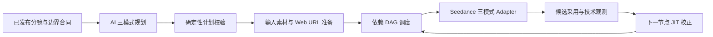

# 视频生成三模式与 AI 自动路由工具层整改 PRD

> 版本：v1.0  
> 状态：Proposed  
> 日期：2026-08-04  
> 所属层级：视频生产工具层  
> 适用范围：已发布分镜合同 → AI 生成模式计划 → 输入素材准备 → 依赖调度 → Seedance 任务 → 候选采用 → 相邻镜技术 QA  
> 上游输入规范：`PRD/全链路叙事连续性与视频衔接泛化整改PRD.md`  
> 规范边界：本文档不负责导演、编剧、剧情补写、镜头叙事结构设计或观众认知导演；只负责把已发布的逐镜合同可靠地转换为视频生成任务

---

## 0. 执行结论

当前视频割裂不能通过“把所有镜头改成串行”解决，也不能通过“同场景/打斗关键词映射模式”解决。正确整改是：

1. 工具层实现三套真实、互不混淆的供应商输入合同：
   - `REFERENCE_IMAGE_MODE`；
   - `FIRST_LAST_FRAME_MODE`；
   - `VIDEO_INPUT_MODE`。
2. 第一镜固定使用参考图模式；第 2 镜起由 AI 读取整集已发布分镜合同、上一镜与当前镜详细脚本、相邻镜边界关系、资产版本和供应商能力，产出版本化 `EpisodeVideoGenerationPlan`。
3. 取消无条件全并行，改为依赖 DAG：真正依赖上一镜实际视频/尾帧的节点等待，无依赖节点继续安全并行。
4. AI 负责理解语义关系，确定性校验器负责检查第一镜规则、能力支持、素材角色互斥、依赖无环、资产可访问、幂等和预算，不允许 AI 直接绕过工具合同提交付费任务。
5. `VIDEO_INPUT_MODE` 必须区分“参考视频”和“真续写”。当前实测已经证明接口支持 Web URL 参考视频，但尚未证明能可靠无缝承接上一镜，因此首轮只开放运动/运镜/节奏/音频参考；真续写需要单独语义准入。
6. 任何模式失败都必须显式记录 planned/actual mode 与降级原因，禁止执行层静默改回参考图。
7. 工具层只消费上游已发布合同。如果输入分镜矛盾、缺少边界状态或超出供应商能力，返回结构化 blocker；不得自行改写剧情或插镜。



---

## 1. 文档职责边界

### 1.1 本工具层拥有的职责

- 三种视频生成模式的类型、输入角色和供应商 payload；
- AI 模式规划器及结构化输出；
- 供应商能力探针与版本化能力快照；
- 本地媒体转供应商可访问 Web URL；
- 首尾帧、上一镜视频等输入素材的依赖解析；
- 有依赖串行、无依赖并行的 DAG 调度；
- 任务幂等、断点恢复、stale、取消、重试和有限回退；
- planned mode、actual mode、输入 revision、供应商任务和时延成本的审计；
- 与模式合同有关的技术 QA。

### 1.2 本工具层不拥有的职责

- 不判断章节是否缺剧情；
- 不重写剧本、分镜、人物动机或观众认知目标；
- 不为“打斗、对白、揭示、新道具”等剧情类别维护生成模式模板；
- 不为了适配供应商私自合并、拆分、插入或调换镜头；
- 不把生成失败解释为剧情缺失；
- 不用转场掩盖上游状态矛盾；
- 不把普通参考视频能力宣传为无缝视频续写。

### 1.3 上下游合同

工具层只读取已发布、同一 checkpoint 的：

```text
Episode + ShotTask[]
BoundaryContract[]
previous/current shot scripts
planned_state_in / planned_state_out
action phase and edit relation
character / scene / prop asset revisions
duration / ratio / audio contract
quality / cost / latency policy
```

若合同缺字段或互相矛盾，返回：

```json
{
  "status": "BLOCKED_UPSTREAM_CONTRACT",
  "shot_id": "SH-*",
  "missing_or_conflicting_fields": [],
  "evidence": [],
  "required_owner": "storyboard | asset | provider_capability"
}
```

工具层不对上游字段做语义补写。

---

## 2. 当前实现事实与问题

### 2.1 当前代码事实

截至本 PRD 编写时：

- `app/video_modes.py` 的 `VideoGenerationMode` 只允许 `REFERENCE_IMAGE_MODE`；
- `app/media_exec/enqueue.py` 在决定结果不是参考图时会拒绝，并只对部分 `action_continuation` 任务建立上一镜依赖；
- `app/media_exec/run_job.py` 多处把任务 `meta.mode` 强制写回 `REFERENCE_IMAGE_MODE`，并移除首尾帧路径；
- `app/hiagent.py::create_video_task` 只声明图片输入角色 `first_frame/last_frame/reference_image`，没有视频输入角色；
- 当前连续动作链会等待上一镜完成、抽取本地尾帧，但最终仍把尾帧作为普通 `reference_image`，没有使用强 `first_frame` 合同；
- 生成台和集级生成 API 没有版本化的 AI 模式计划，也无法展示 planned/actual mode 与降级原因；
- 当前并发设置允许大量镜头同时提交，镜头间只有局部特例依赖，并非通用依赖图。

因此，当前体验不是单纯“并发导致割裂”，而是：输入模式被锁死、素材角色被弱化、依赖关系只做局部特判、实际结果没有驱动后续计划校正。

### 2.2 时延事实

截至 2026-08-04，本地库有 228 个成功视频任务，任务端到端平均约 11.5 分钟；现有 11 集平均约 13.9 镜。若机械全串行，理论均值约 160 分钟（约 2.7 小时），加上关键帧、QA 和重试后可能达到数小时。

本次 Web URL 视频输入探针单个 5 秒任务耗时约 12.1 分钟。因此整改目标不是“串行化全部镜头”，而是缩短依赖 DAG 的关键路径。

---

## 3. Seedance 2.0 视频输入 API 实测

### 3.1 测试素材

- 用户指定文件：下载目录 `episode-6-final.mp4`；
- 原文件约 67.4 秒、29 MB、720×1280、H.264 + AAC；
- 为降低费用，只取前 5 秒进行能力探针；
- 因接口要求 Web URL，最终复用了该片段对应的项目第 6 集第 1 镜供应商源 URL；
- 本地片段与供应商源片段抽样对比 `SSIM All=0.956929`，属于同一素材的高相似来源。

### 3.2 实测结果

| 探针 | 结果 | 结论 |
|---|---|---|
| `video_url` + `role=reference_video` + data URL | 异步失败 | 任务创建后报 `InvalidParameter: reference_video must be provided as a web url` |
| 相同角色 + 供应商 Web URL | 成功 | task `d9onqu475l2qfvl8sig0`：`queued → running → succeeded` |
| 服务端任务耗时 | 约 726 秒 | 视频输入不会缩短单镜生成耗时 |
| 输出 | 5.062 秒、720×1280、H.264 + AAC | 当前通道确实支持参考视频输入 |
| `return_last_frame=true` | 未返回 `last_frame_url` | 下一镜仍需本地抽帧或独立尾帧服务 |
| 输入尾帧与输出首帧 | `SSIM All=0.521741` | 人物、服装、场景和画风保持，但朝向/姿态跳变；未达到真续写准入 |

当前能力快照必须如实记录：

```text
supports_reference_video = true
reference_video_requires_web_url = true
supports_true_video_continuation = unverified
supports_return_last_frame = false
```

官方能力页描述多模态图片/视频/音频参考与视频续写能力；方舟接口文档也给出 `return_last_frame` 用法。但生产能力以当前项目的供应商、网关、模型、区域和接口版本的异步实测为准：

- [Seedance 2.0 官方能力页](https://www.volcengine.com/activity/seedance2)
- [方舟创建视频生成任务接口](https://api.volcengine.com/api-docs/view?action=CreateContentsGenerationsTasks&serviceCode=ark&version=2024-01-01)

---

## 4. 三种视频生产方式

### 4.1 `REFERENCE_IMAGE_MODE`

输入：人物、场景、道具、风格或剧情关键帧等参考图。

适合：

- 第一镜；
- 新时间域或新空间；
- 同场景但有意换机位、反打、反应、插入特写；
- 当前镜头应重新构图，不应继承上一镜完整像素和运动；
- 上一镜只提供状态证据，不是当前视频的强起点。

工具合同：

```json
{
  "mode": "REFERENCE_IMAGE_MODE",
  "image_inputs": [
    {"role": "reference_image", "asset_revision_id": "asset_rev_*"}
  ],
  "video_input": null,
  "depends_on_shot_id": null
}
```

注意：同场景并不排除参考图模式。影视剪辑中的反打、反应和插入特写通常需要重构图；强行沿用上一镜尾帧反而会把有意切镜误做成动作续接。

### 4.2 `FIRST_LAST_FRAME_MODE`

输入：起始关键帧和结束关键帧。

适合：

- 当前视频必须从确定状态 A 演进到确定状态 B；
- 姿态、道具交接、空间落点或效果落点必须可验证；
- 不需要继承上一镜完整的运动轨迹；
- 起止状态比中间自由度更重要。

工具合同：

```json
{
  "mode": "FIRST_LAST_FRAME_MODE",
  "image_inputs": [
    {"role": "first_frame", "boundary_asset_revision_id": "ba_*"},
    {"role": "last_frame", "boundary_asset_revision_id": "ba_*"}
  ],
  "video_input": null,
  "depends_on_shot_id": "SH-*"
}
```

首帧是否依赖上一镜由素材来源决定：

- 来自上一镜采用视频真实尾帧：等待上一镜采用；
- 来自上游已发布的静态起始关键帧：无需等待上一镜视频；
- 起止帧互相矛盾或身份/场景 QA 未通过：禁止提交视频任务。

若供应商不允许参考图与首尾帧混用，人物、场景和道具一致性必须前移到关键帧生成及关键帧 QA，不能在视频 payload 中偷偷加入互斥角色。

### 4.3 `VIDEO_INPUT_MODE`

输入：上一镜已采用视频或经过合同允许裁剪的视频片段。

必须附加 `video_input_intent`：

```text
CONTINUE_PREVIOUS_TAKE
MOTION_REFERENCE
CAMERA_REFERENCE
RHYTHM_REFERENCE
AUDIO_REFERENCE
```

工具合同：

```json
{
  "mode": "VIDEO_INPUT_MODE",
  "video_input": {
    "role": "reference_video",
    "intent": "MOTION_REFERENCE",
    "source_video_revision_id": "video_rev_*",
    "published_media_id": "pm_*"
  },
  "image_inputs": [],
  "depends_on_shot_id": "SH-*"
}
```

只有 `CONTINUE_PREVIOUS_TAKE` 声称连续承接上一镜。当前实测只准入其余参考意图；真续写继续保持 `unverified`。

打斗不自动等于视频输入：

- 同一未完成动作或连续运镜跨镜，才可能需要 `CONTINUE_PREVIOUS_TAKE`；
- 多机位打斗、结果到反应、插入细节属于有意剪切，通常应使用参考图或首尾帧；
- 只想参考动作力度、速度和镜头语言时使用 `MOTION_REFERENCE/CAMERA_REFERENCE`，不得继承剧情状态语义。

### 4.4 三种模式不是互相兜底的质量等级

三种模式是不同输入合同，不是“高级/中级/低级”质量层级：

- 参考图不是低配兜底；有意切镜时它往往最正确；
- 首尾帧不是所有同场景剧情的默认；它约束的是确定起止状态；
- 视频输入不是所有复杂动作的默认；它约束的是运动/视频参考意图；
- 模式选择错误时，增加提示词或重试次数通常无法弥补合同错误。

---

## 5. AI 自动模式规划

### 5.1 规划时机

1. 分镜 checkpoint 发布后，付费视频生成前，生成整集计划；
2. 第一镜由校验器固定为参考图；
3. 第 2 镜至末镜由 AI 一次规划，避免每个 worker 各自解释分镜；
4. 上一镜采用后，只对消费其实际视频/尾帧的下一节点执行 JIT reconcile；
5. 上游分镜或资产 revision 变化时，生成新计划 revision，旧计划保持可审计但不得继续提交。

### 5.2 AI 输入

AI 获取：

- 本集全部已发布分镜的结构化摘要；
- 上一镜和当前镜完整逐镜脚本；
- 必要的下一镜保留事件摘要；
- 相邻镜 `BoundaryContract`；
- 当前镜 `planned_state_in/out`、动作阶段、时空和剪辑关系；
- 人物、场景、道具的资产 revision；
- 当前供应商能力快照；
- 集级成本、时延和质量策略。

AI 可以读取整集理解上下文，但输出只能引用已发布 ID，不能重新生成剧情内容或创建新镜头。

### 5.3 通用判断维度

```text
temporal_relation       same_moment | elapsed | jump | new_domain
spatial_relation        same_space | adjacent_space | new_space | unknown
edit_relation           continuous_take | match_cut | angle_cut | reaction_cut |
                        reverse_angle | insert_cut | montage | scene_cut
action_relation         continues_same_action | starts_new_action |
                        shows_result | observes_result | no_action
state_dependency        none | start_only | start_and_end | full_trajectory
motion_dependency       none | pose | trajectory | camera | rhythm | audio
continuity_risk         identity | prop | spatial | pose | action | camera | audio
```

这些枚举描述关系，不枚举剧情。禁止新增角色名、场景名、动作词或题材词白名单。

### 5.4 决策原则

1. 第一镜：`REFERENCE_IMAGE_MODE`；
2. 新时间域、新地点或有意重新构图：`REFERENCE_IMAGE_MODE`；
3. 同一连续时空且同一未完成动作/运镜需要继承完整轨迹：只有真续写能力验证后才选 `VIDEO_INPUT_MODE + CONTINUE_PREVIOUS_TAKE`；
4. 起始和结束状态都必须固定，但无需继承完整轨迹：`FIRST_LAST_FRAME_MODE`；
5. 同场景反打、反应、插入特写或新动作：默认重新构图，不因场景相同自动选择首尾帧/视频输入；
6. 复杂运动只提升 `MOTION_REFERENCE` 的候选权重，不直接决定模式；
7. 证据不足时输出 `unknown_dimensions` 和低置信度，由项目策略决定阻断或显式降级；
8. 供应商能力不支持的模式不得出现在有效计划中。

### 5.5 模式计划 Schema

```json
{
  "episode_video_plan_id": "evp_*",
  "plan_revision": 1,
  "source_storyboard_revision_id": "storyboard_rev_*",
  "shot_id": "SH-*",
  "mode": "REFERENCE_IMAGE_MODE | FIRST_LAST_FRAME_MODE | VIDEO_INPUT_MODE",
  "video_input_intent": null,
  "depends_on_shot_id": null,
  "relations": {
    "temporal": "same_moment",
    "spatial": "same_space",
    "edit": "reaction_cut",
    "action": "observes_result"
  },
  "state_dependency": "start_only",
  "motion_dependency": "none",
  "required_assets": [],
  "reason_codes": [],
  "confidence": 0.0,
  "unknown_dimensions": [],
  "fallback_order": [],
  "estimated_latency_ms": 0,
  "estimated_cost": 0.0,
  "critical_path_group": null,
  "capability_snapshot_id": "cap_*",
  "input_revision_fingerprints": {}
}
```

允许的 `reason_codes` 示例：

```text
FIRST_SHOT_NO_PREDECESSOR
SCENE_DOMAIN_CHANGED
INTENTIONAL_RECOMPOSITION
EXACT_START_END_STATE_REQUIRED
CONTINUOUS_ACTION_TRAJECTORY_REQUIRED
CAMERA_MOTION_REFERENCE_REQUIRED
PROVIDER_CAPABILITY_UNVERIFIED
INPUT_CONTRACT_INCOMPLETE
```

reason code 只描述通用关系，不得包含剧情实体。

### 5.6 确定性计划校验

AI 计划必须通过：

- 第一镜模式不变量；
- 所有 shot ID、revision、asset ID 引用存在且属于当前集；
- `depends_on_shot_id` 指向合法上游并且整图无环；
- 模式所需输入角色齐全；
- 互斥输入角色没有混用；
- `VIDEO_INPUT_MODE` 引用已采用视频，不引用临时候选或整集拼接成片；
- 当前能力快照支持计划模式和媒体格式；
- 输入 URL 在预计任务读取窗口内可访问；
- fallback 有限、无循环、成本和尝试次数有界；
- 幂等键包含全部影响输出的 revision。

任何一项失败，计划不得进入队列；执行层不能自行选择参考图补空。

---

## 6. 供应商能力与媒体发布

### 6.1 版本化能力快照

不能使用模型名白名单推断能力。按供应商、模型、区域、网关和接口版本保存：

```text
supports_reference_image
supports_first_frame
supports_last_frame
supports_first_last_pair
supports_reference_video
supports_true_video_continuation
supports_return_last_frame
supports_data_url_by_media_type
requires_web_url_by_media_type
mutually_exclusive_input_roles
duration_limits
size_limits
format_limits
probe_time
probe_task_id
probe_result
```

静态文档只产生“待验证候选能力”。异步任务最终成功才确认技术支持；真续写还必须通过语义边界回归。

### 6.2 探针规则

- 使用最短、最小、无敏感信息的受控素材；
- 创建 HTTP 200 不算通过，必须轮询到终态；
- 保存经过脱敏的 payload 结构、任务 ID、错误码、耗时和输出元数据；
- 能力变化生成新 snapshot，不修改历史任务快照；
- 探针失败只关闭对应能力，不把整个供应商写入黑/白名单；
- 技术成功与语义成功分开记录。

### 6.3 `ProviderMediaPublicationService`

参考视频必须是 Web URL，新增统一发布服务：

1. 若上游供应商源 URL 仍有效且授权允许，优先复用；
2. 否则把项目内视频上传到自有对象存储；
3. 生成覆盖排队和生成窗口的签名 URL；
4. 保存 `sha256`、源 revision、MIME、时长、尺寸、URL 到期时间；
5. 提交前做可访问性与范围读取检查；
6. 到期但任务未提交时重新签名，不改变媒体内容指纹；
7. 禁止上传匿名第三方公共文件站绕过限制。

---

## 7. 输入素材与依赖图

### 7.1 素材角色

```text
identity_reference
scene_reference
prop_reference
style_reference
first_frame
last_frame
previous_adopted_video
motion_reference_video
camera_reference_video
audio_reference_video
```

每个素材包含来源、revision、hash、生成/抽取方式、QA 状态和消费节点。

### 7.2 就绪条件

| 模式 | 就绪条件 |
|---|---|
| `REFERENCE_IMAGE_MODE` | 必需参考图 revision 已存在并通过相应 QA |
| `FIRST_LAST_FRAME_MODE` | 首帧、尾帧及帧间合同校验通过；若首帧来自上一镜实际尾帧，则上一镜已采用 |
| `VIDEO_INPUT_MODE` | 上一镜采用视频存在、Web URL 可访问、对应视频意图已被能力快照准入 |

### 7.3 安全并行 DAG

调度不是按镜号全串行，也不是整集全并行：

- 没有动态上游素材依赖的节点可以立即并行；
- 需要上一镜真实尾帧/视频的节点等待采用结果；
- 同一上游可以解锁多个后代；
- 项目、集、供应商、模式和成本预算共同限流；
- 长连续链只在上游分镜已经声明合法切镜处打断依赖，工具层不得为了速度创造切镜。

示例：镜 2 延续镜 1，镜 3 是独立参考图镜头，镜 4 依赖镜 2。镜 1 和镜 3 可以并行；镜 2 等镜 1；镜 4 等镜 2。

### 7.4 幂等键

```text
shot_revision
plan_revision
generation_mode
video_input_intent
prompt_revision
input_asset_fingerprints
upstream_adopted_video_revision
provider_capability_snapshot_id
provider_model
```

切换模式、上游采用版本或能力快照后必须生成新幂等键，不能复用旧候选。

---

## 8. 两阶段执行与实际结果校正

### 8.1 Plan phase

付费生成前：

1. 生成整集模式计划；
2. 校验依赖、能力和输入；
3. 计算关键路径、预计成本与时延；
4. 生成可执行 DAG；
5. 原子发布 plan revision。

### 8.2 JIT reconcile

上一镜采用后：

1. 提取真实首尾帧、时长、音轨和技术元数据；
2. 若下一镜需要真实尾帧/视频，绑定实际 adopted revision；
3. 实际状态与输入合同相符，执行原计划；
4. 只需重新抽帧/签名 URL 时，不调用 AI 重规划；
5. 实际结果使原计划输入失效时，只重规划消费该素材的后代子图；
6. 上游 adopted revision 变化时，使用旧 revision 的下游节点全部 stale；
7. 已经在供应商运行且无法取消的 stale 任务可回收结果，但不得自动采用。

JIT 阶段只校正工具输入，不改写分镜语义。

---

## 9. 模式失败与有限回退

| 失败 | 通用处置 |
|---|---|
| 分镜/边界合同缺字段 | 返回上游 blocker，不猜测剧情 |
| 参考视频 data URL | 转 Web URL 发布服务，不重复提交相同非法 payload |
| Web URL 不可达或 TTL 不足 | 重新发布/签名并校验 |
| 普通参考视频可用但真续写未验证 | 真续写计划阻断；仅允许已准入参考意图 |
| 上一镜视频未采用 | 保持 `waiting_dependency`，不使用临时候选偷跑 |
| 首尾帧缺失或互相矛盾 | 回到边界素材准备，不提交视频任务 |
| 供应商不支持计划模式 | 生成显式降级计划 revision，或阻断；禁止执行层静默改模式 |
| 上游 adopted revision 变化 | 失效消费旧素材的后代 |
| 供应商异步失败 | 记录终态错误，有限重试后执行计划内 fallback |
| 超出成本/时延预算 | 停止新付费尝试，输出 best-effort/blocked，不篡改质量事实 |

每个计划节点必须有：

```text
fallback_order
max_attempts
max_cost
timeout
degraded_from_mode
degraded_to_mode
degraded_reason
```

fallback 不能形成循环，也不能因“默认参考图”而失去审计信息。

---

## 10. 技术 QA 与模式准入

### 10.1 通用技术 QA

- 输出文件可下载、可解码；
- 时长、尺寸、比例、编码和音轨满足合同；
- 输入素材 revision 与任务审计一致；
- adopted video 可本地抽取稳定首尾帧；
- 供应商 task ID、耗时、成本、错误与输出 URL 已持久化；
- 任务终态而非创建响应决定成功/失败。

### 10.2 模式特定 QA

`REFERENCE_IMAGE_MODE`：

- 所有必需参考资产真实进入 payload；
- 不包含 first/last/video 等互斥角色；
- reference selection 与计划 revision 一致。

`FIRST_LAST_FRAME_MODE`：

- 输出首部与 first frame 状态匹配；
- 输出尾部与 last frame 状态匹配；
- 首尾帧身份、场景、尺寸、比例一致；
- 上一镜尾帧来源可追溯到 adopted revision。

`VIDEO_INPUT_MODE`：

- 视频 URL 被供应商成功读取；
- 技术成功与语义参考成功分别计分；
- `CONTINUE_PREVIOUS_TAKE` 额外检查边界姿态、运动方向、相机运动、身份、场景、道具和音频相位；
- 单帧 SSIM 只能作为证据之一，不能单独证明或否定运动续写。

### 10.3 真续写语义准入

建立与内容无关的边界关系测试集，覆盖：

- 人物位移与姿态延续；
- 道具交互未完成动作；
- 连续相机运动；
- 多主体相对位置；
- 有声动作和环境声延续；
- 不同题材、画风、人物和虚构动作。

比较参考图、首尾帧、视频输入三组结果。只有视频输入在连续动作轨迹、身份/空间保持和人工盲评上稳定优于基线，且成功率、成本、时延符合项目阈值，才能把 `supports_true_video_continuation` 改为 `true`。

---

## 11. 数据模型与 API

### 11.1 建议数据表/Artifact

```text
episode_video_generation_plans
shot_video_generation_plans
video_boundary_assets
provider_video_capability_snapshots
provider_media_publications
video_generation_attempts
video_mode_qa_results
video_plan_dependencies
```

`shot_video_generation_plans` 至少可查询：

```text
planned_mode
actual_mode
video_input_intent
depends_on_shot_id
plan_revision
source_storyboard_revision_id
capability_snapshot_id
required_asset_ids
input_fingerprints
fallback_order
degraded_reason
estimated / actual latency and cost
```

计划不能只塞在 `shot_versions.image_inputs` 或任务 `meta` 中。

### 11.2 API

```text
POST /episodes/{id}/video-generation-plan
GET  /episodes/{id}/video-generation-plan
POST /episodes/{id}/video-generation-plan/validate
POST /episodes/{id}/video-generation-plan/reconcile
POST /episodes/{id}/video-generation-plan/{plan_id}/execute
GET  /video-capabilities/{provider}/{model}
POST /video-capabilities/{provider}/{model}/probe
POST /provider-media-publications
GET  /jobs/{id}/video-mode-audit
```

集级生成必须先引用有效计划。单镜重做也必须执行局部 replan，并确定性失效消费其边界素材的后代。

---

## 12. 生成台与监控台

默认全自动，不要求用户逐镜选模式。

点击“生成本集视频”后：

1. 校验分镜与资产 revision；
2. AI 生成整集模式计划；
3. 展示模式分布、关键路径、预计时长/成本和 blocker；
4. 无 blocker 时自动执行；
5. 每镜展示 `planned_mode → actual_mode`、输入素材、等待依赖、fallback、stale 和降级原因；
6. 人工覆盖只作为调试/运营能力，覆盖后生成新 plan revision，不能直接改正在运行的任务 meta。

监控台状态至少包括：

```text
planning
blocked_contract
waiting_asset
waiting_dependency
ready
submitting
provider_running
qa
succeeded
failed
stale
degraded
```

---

## 13. 代码改造落点

| 模块 | 改造要求 |
|---|---|
| `app/video_modes.py` | 增加三种模式、计划 Schema、模式校验；移除仅参考图 Literal 和静默归一 |
| `app/hiagent.py` | 支持 reference image、first/last frame、reference video 三种 payload；保留角色互斥和能力校验 |
| `app/capabilities/inputs.py` | 从静态声明升级为版本化、经异步探针验证的能力快照 |
| `app/media_exec/enqueue.py` | 从计划构建 DAG；移除仅对 `action_continuation` 的特例依赖 |
| `app/media_exec/run_job.py` | 执行 planned mode；移除强制写回参考图；采用后触发工具层 reconcile |
| `app/media_exec/scheduler.py` | 按依赖就绪与资源预算调度安全并行，支持 stale、恢复和幂等 |
| `app/media_exec/reference_store.py` | 扩展为边界资产与参考视频 revision 存储，保留 hash、来源与消费关系 |
| `app/domain/video_ops.py` | 集级生成先建计划；单镜重做复用相同计划协议 |
| `app/stages.py` | 增加模式特定技术 QA 和真续写语义准入证据 |
| `frontend/src/api.ts` | 增加计划、能力、依赖、actual mode 与降级原因类型/API |
| `frontend/src/pages/WallPage.tsx` | 默认 AI 计划与可审计人工覆盖，不把手选模式作为主流程 |
| `frontend/src/pages/MonitorPage.tsx` | 展示 DAG、关键路径、等待原因、能力快照和模式审计 |
| 数据迁移 | 新增计划、能力、媒体发布、依赖和模式 QA 的版本化存储 |

---

## 14. 与既有文档的关系

本 PRD 是三模式视频生产工具层的唯一规范。它消费但不修改导演/编剧文档定义的分镜语义。

| 文档 | 继续有效 | 与本文冲突时 |
|---|---|---|
| `PRD/全链路叙事连续性与视频衔接泛化整改PRD.md` | 剧情事实、动作所有权、分镜、边界和质量语义 | 上游语义以该文档为准；本文不得反向改写 |
| `PRD/剧本分镜与Seedance视频连续性整改方案.md` | 分镜状态字段与提示词连续性目标 | 固定参考图模式由本文三模式计划替代 |
| `PRD/人物多视角资产与关键帧一致性QA改造方案.md` | 多视角资产和关键帧 QA | 禁止首尾帧模式的旧限制由本文能力快照与输入合同替代 |
| `PRD/视频生成流水线调度与阶段可视化整改方案.md` | 调度状态、限流、恢复和可视化 | 无条件并行由本文依赖 DAG 替代 |

禁止在旧模块各写一层兼容补丁；迁移通过统一计划协议完成。

---

## 15. 禁止白名单与泛化验收

### 15.1 禁止

- `if scene_changed: reference_image` 作为唯一判断；
- `if fight: video_input`；
- `if same_scene: first_last_frame`；
- 按角色名、场景名、镜号、剧集编号或题材特判；
- 用动作词表直接决定模式；
- 供应商/模型名到能力的永久硬编码；
- `continuity_mode -> generation_mode` 永久一对一映射；
- 任何异常都静默回退参考图；
- 创建 HTTP 200 就登记接口支持。

### 15.2 允许的通用协议

- 模式、输入角色、状态和错误有限枚举；
- 时空、动作阶段、剪辑、状态与运动依赖关系；
- DAG 无环、引用完整、素材角色互斥、时长格式等确定性不变量；
- 版本化供应商能力快照；
- 可配置并经回归校准的置信度、成本和时延阈值。

### 15.3 变形测试

对同一分镜关系执行：

- 人物/地点/道具重命名；
- 同义改写和语序调整；
- 题材替换；
- 常见动作替换为虚构动作；
- 镜号整体平移；
- 保持动作不变但将剪辑关系改为 angle cut；
- 保持场景名不变但改变时间域；
- 改变场景名但保持同一空间实体 ID。

只有真实关系变化时模式计划才应变化。

---

## 16. 测试方案

建议新增：

```text
tests/test_video_mode_planner.py
tests/test_video_mode_contracts.py
tests/test_video_mode_payloads.py
tests/test_video_dependency_dag.py
tests/test_video_plan_reconcile.py
tests/test_video_mode_idempotency.py
tests/test_provider_video_capabilities.py
tests/test_provider_media_publication.py
tests/test_reference_video_async_probe.py
tests/test_video_continuation_semantic_gate.py
tests/test_video_mode_api.py
tests/test_video_mode_ui_contract.py
```

必须覆盖：

1. 第一镜始终是参考图模式；
2. 第 2 镜起均有版本化 AI 计划；
3. 相同场景不自动等于首尾帧；
4. 打斗不自动等于视频输入；
5. 反打、反应和插入特写不会因同场景误继承上一镜视频；
6. 同一未完成动作只有真续写能力通过后才可规划 `CONTINUE_PREVIOUS_TAKE`；
7. 普通参考视频能力不会被误报为真续写；
8. data URL 在提交前被拒绝或转换，不再产生已知非法付费任务；
9. 创建成功、异步失败时能力探针仍判失败；
10. `return_last_frame` 缺失时稳定使用本地抽帧；
11. 首尾帧互斥输入、缺帧、尺寸不一致在提交前失败；
12. 无依赖节点可越过等待节点安全并行；
13. DAG 循环在计划发布前失败；
14. 上游 adopted revision 变化使消费旧素材的后代 stale；
15. stale 且不可取消的供应商结果不会自动采用；
16. 切换模式、素材 revision 或能力快照不会误命中旧幂等任务；
17. 降级始终有 from/to/reason，不静默参考图；
18. 重启后计划、依赖、provider task 和重试状态可恢复；
19. AI 输出非法 ID、非法模式或缺字段时不会进入执行器；
20. 人工覆盖生成新 plan revision 并失效正确后代范围。

---

## 17. 灰度上线

1. **Shadow plan**：只生成 AI 计划，不改变现有任务；统计模式分布和人工复核差异；
2. **Capability foundation**：上线三种 adapter、异步能力探针、Web URL 发布和审计，但生产仍走参考图；
3. **Reference + first/last**：启用两模式自动规划和依赖 DAG；
4. **Reference-video experiment**：只开放 `MOTION/CAMERA/RHYTHM/AUDIO_REFERENCE`；
5. **Continuation canary**：真续写语义回归通过后小流量开放；
6. **Full auto**：第一镜参考图，后续 AI 规划，JIT reconcile，确定性校验守门。

回滚按能力和模式关闭，不删除历史计划、任务与证据，也不恢复执行层静默强制参考图。

---

## 18. 观测指标

```text
planned_mode_distribution
actual_mode_distribution
mode_degradation_rate
mode_plan_validation_failure_rate
mode_plan_reconcile_rate
dependency_wait_duration
episode_critical_path_duration
safe_parallelism_ratio
provider_capability_probe_pass_rate
reference_video_technical_success_rate
reference_video_semantic_continuation_pass_rate
first_last_boundary_match_rate
stale_descendant_count
mode_retry_count
cost_per_final_candidate
latency_per_mode
```

指标按 provider/model/capability snapshot/plan revision 分组，不按剧情内容建白名单报表。

---

## 19. Definition of Done

- [ ] 原导演/编剧 PRD 不包含三模式工具实现细节；
- [ ] 第一镜固定参考图，第 2 镜起均有 AI 生成并经确定性校验的版本化模式计划；
- [ ] 三种模式均有独立输入合同、供应商 adapter、幂等键、技术 QA 和有限回退；
- [ ] `REFERENCE_IMAGE_MODE` 不再是执行异常的静默默认值；
- [ ] 视频参考能力与真续写能力分别探针、分别准入；
- [ ] 当前通道的视频 Web URL 要求已经进入媒体发布与提交前校验；
- [ ] `return_last_frame` 缺失时无需供应商字段也能稳定抽取尾帧；
- [ ] AI 只引用已发布分镜/资产 ID，不拥有剧情改写权；
- [ ] 模式选择不依赖场景名、打斗词、动作词表、镜号、剧集或题材特判；
- [ ] 调度器按真实素材依赖构建 DAG，有依赖串行、无依赖安全并行；
- [ ] planned/actual mode、输入 revision、能力快照、等待、stale 和降级原因可追溯；
- [ ] 上游 adopted revision 改变会失效所有消费旧边界素材的后代；
- [ ] API 创建成功但异步失败不会被登记为能力通过；
- [ ] data URL、互斥输入、缺失素材和不可达 URL 在付费提交前被拦截；
- [ ] 真续写没有通过多样本语义回归前，不进入全自动主流量；
- [ ] 全串行不作为连续性的默认实现，关键路径和安全并行均可观测；
- [ ] 同义改写、实体重命名、新题材、虚构动作和镜号变化的变形测试通过；
- [ ] 代码审查确认没有新增剧情白名单、供应商能力白名单或静默参考图补丁。
