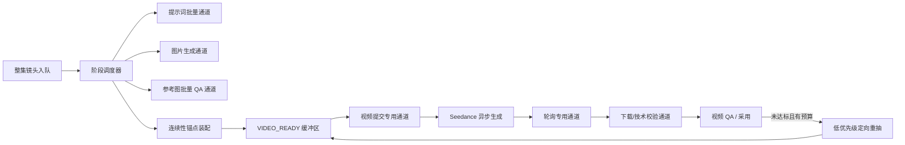

# 视频生成流水线调度与阶段可视化整改方案

> 状态：Proposed，待评审后实施  
> 版本：v1.0  
> 日期：2026-07-25  
> 适用项目：MJAgent2 / 案头助手  
> 关联文档：《剧本、分镜与 Seedance 视频连续性整改方案》  
> 核心目标：在不降低参考图数量、质量阈值、连续性约束和失败重试预算的前提下，通过分阶段调度、资源隔离、限在制品和真实状态投影，提高首个视频提交速度、整集吞吐与进度可理解性。

---

## 0. 执行结论

当前“一键生成所有视频”慢，不应通过简单减少参考图或关闭重试来换速度。现有链路的主要问题是：

1. **镜头级任务没有真正拆成独立阶段**。参考图准备、视频提交、供应商轮询、下载和视频 QA 仍由同一批主 worker 驱动；大量参考图任务可以让“已经具备视频输入的镜头”迟迟拿不到提交机会。
2. **缺少整集在制品上限**。`reference_prepared_backlog=8` 目前主要限制连续性阻塞镜头的推测性准备，不能阻止普通镜头把整集参考图全部跑起来。
3. **调度目标偏向“尽量多开工”，不是“尽快完工”**。6 个镜头 worker 会同时为多镜各自启动 4 张参考图，内部图片并发却只有 4，结果是图片请求在多镜之间轮转，很多镜头都做了一部分，但很久没有任何一镜完整进入视频提交。
4. **连续镜的参考图完成语义不完整**。连续镜可以提前准备静态参考图，但上一镜尾帧尚未产生时，不应被标记为“参考图已完成”；最终视频输入必须在尾帧加入并重新通过组一致性门禁后才能就绪。
5. **参考图提示词与 QA 的调用粒度过细**。默认 4 张参考图会触发 4 次文本提示词调用、最多 12 次图片生成与 12 次单图 VLM，再叠加组一致性检查和漂移重生。质量标准本身应保留，但相同判断可通过“批量生成合同 + 批量评估合同 + 缺项定向修复”减少重复调用。
6. **前端状态来自多套推断**。后端根据 `jobs.status`、是否有参考图、是否有 `provider_task_id`推测阶段；前端又根据 `versions.status` 和后端 `pipeline_status` 二次推断，导致“排队、准备参考图、等待上一镜、已提交视频、下载中”互相混淆。

本方案采用一套“**质量守恒、分阶段、限在制品流水线**”（Quality-Preserving Stage Pipeline，简称 QPSP）：

- 保留当前默认 4 张新生成参考图、单图 QA 阈值、最多 2 次额外重试和组一致性检查，P0 不改变质量参数。
- 把参考图、视频提交、视频轮询、下载/质检拆成独立执行通道；视频提交与轮询拥有不可被参考图借走的保留资源。
- 用高低水位控制“已完成参考图但尚未提交视频”的镜头数量，视频槽满后只准备有限缓冲，不再无边界跑完整集。
- 图片并发优先集中完成最接近可提交的一镜；该镜进入 QA 时，图片通道立即为下一镜工作，形成真正的流水线重叠。
- 连续镜采用“静态参考就绪 → 等待上一镜尾帧 → 最终输入组校验”三段式协议，既允许预取，也不牺牲连续性。
- 后端持久化唯一权威阶段；前端只展示阶段码、进度、阻塞原因和尝试次数，不再自行猜测。

---

## 1. 现状证据与问题边界

### 1.1 当前有效并发

当前数据库设置为：

| 资源 | 当前值 | 实际含义 |
|---|---:|---|
| `reference_pipeline_concurrency` | 6 | 同时执行镜头级参考图准备的主 worker 上限 |
| `image_request_concurrency` | 4 | Seedream 图片请求真实并发上限 |
| `vlm_request_concurrency` | 6 | 图片/视频 VLM 请求并发上限 |
| `video_submit_concurrency` | 4 | Seedance 创建任务并发上限 |
| `video_inflight_limit` | 8 | 全局已被供应商接单的视频上限 |
| `video_poll_concurrency` | 8 | 视频状态查询并发上限 |
| `download_concurrency` | 3 | 视频下载并发上限 |
| `episode_video_inflight_limit` | 8 | 单集供应商在途视频上限 |
| `reference_prepared_backlog` | 8 | 当前只部分约束推测性参考图准备，不是整集总缓冲上限 |

`.env` 中的旧 `MEDIA_REQUEST_CONCURRENCY=10` 不再是图片通道的主配置；新链路优先读取数据库中的 `image_request_concurrency=4`。监制房必须明确展示“当前生效值”，不能让兼容字段造成并发已经升到 10 的误解。

### 1.2 2026-07-25 实测样本

在 12:24–13:10 的一段整集生成记录中，系统产生：

| 调用 | 数量 | 平均单次延迟 | 累计供应商工作时间 |
|---|---:|---:|---:|
| 参考图提示词文本调用 | 104 | 约 11.5 秒 | 约 1,194 秒 |
| Seedream 图生图 | 278 | 约 37.8 秒 | 约 10,496 秒 |
| VLM 质检 | 317 | 约 19.6 秒 | 约 6,201 秒 |
| Seedance 视频创建 | 1 | 约 1.4 秒 | 约 1 秒 |

在图片并发为 4 时，仅图片调用的理论墙钟下限约为：

```text
278 × 37.8 ÷ 4 ≈ 2,627 秒 ≈ 43.8 分钟
```

这与样本窗口基本一致，说明主瓶颈不是视频创建接口，而是参考图链路产生的请求量，以及已有视频槽满后仍继续扩大参考图在制品。

### 1.3 本方案解决的问题

- 保持成片质量约束的情况下，让第一批完整镜头更快进入 Seedance。
- 参考图生成不能阻塞已经就绪镜头的视频提交、轮询、下载和 QA。
- 视频在途槽满时，只保持有界参考图缓冲，停止无收益扩张。
- 连续镜可以提前做不会依赖上一镜尾帧的工作，但不得提前宣称最终就绪。
- 任意镜头在前端都能准确回答“现在做什么、完成多少、为什么等待、下一步是什么”。
- 进程重启后从具体阶段和参考图槽位恢复，不整镜重复跑已经完成的图片。

### 1.4 明确不做

- P0 不降低默认参考图目标数 4。
- P0 不降低参考图单图 QA 阈值 0.75 和质量地板 0.4。
- P0 不减少单图最多 2 次额外重试，也不关闭组一致性检查。
- 不以取消人物定妆照、场景锚点或上一镜尾帧换速度。
- 不引入 Redis、Celery、Kafka、微服务或新的第三套任务账本。
- 不用无法验证的 ETA 冒充精确完成时间。

---

## 2. 设计原则

### 2.1 质量守恒

调度优化只改变“何时做、谁先做、哪些调用可以合并”，不能静默改变：

- 参考素材角色覆盖；
- 静态场景锚点；
- 动作关键帧覆盖；
- `action_continuation` 的上一镜尾帧；
- 单图质量门禁；
- 组一致性门禁；
- 失败重试上限；
- 视频 QA 与自动重抽门禁。

任何减少模型调用的优化都必须证明“判断合同等价”，并通过同模型、同分镜、同质量参数的 A/B 非劣化测试后才能默认开启。

### 2.2 完成优先于开工

在图片并发只有 4 时，不再允许 6 个镜头各自展开 4 张图片并互相轮转。调度器应优先把一个镜头推进到 `VIDEO_READY`，再推进下一镜。目标从“活跃镜头数最大”改为“单位时间内视频就绪镜头数最大”。

### 2.3 控制面隔离

参考图生成、视频提交、视频轮询、下载和最终 QA 使用独立队列、独立 worker 和独立并发门。参考图请求已经发出后不强行取消，但新参考图请求不能占用视频控制通道的保留令牌。

### 2.4 有界预取

允许利用 Seedance 异步生成时间提前准备后续镜头，但只准备到设定水位。预取是为了隐藏延迟，不是为了提前把整集成本全部烧完。

### 2.5 单一状态真相

`jobs` 是执行状态权威，`shot_versions` 是视频结果，`reference_sets/reference_assets` 是参考图结果，`workflow_runs/run_events` 只做审计。前端不得再从多个版本状态反推执行阶段。

---

## 3. 目标架构



### 3.1 五类调度队列

按优先级从高到低：

1. `Q_FINALIZE`：已完成供应商任务的轮询、下载、技术校验和视频 QA。
2. `Q_VIDEO_READY`：参考图和连续性输入已完整、等待 Seedance 槽位的首轮镜头。
3. `Q_REFERENCE_CRITICAL`：位于连续动作关键路径上、完成后能解锁多个后继镜头的参考图任务。
4. `Q_REFERENCE_NORMAL`：普通首轮镜头的参考图任务。
5. `Q_RETAKE`：视频 QA 重抽、人工重生和非关键修复任务。

硬规则：只要存在可用视频槽且 `Q_VIDEO_READY` 非空，调度器必须先提交视频；不得先启动新的参考图请求。

### 3.2 独立资源通道

| 通道 | 执行内容 | 是否可被参考图占用 |
|---|---|---|
| `video_control` | create / poll / 状态持久化 | 否 |
| `video_download` | 下载、ffprobe、技术门禁 | 否 |
| `reference_prompt` | 一镜多槽位提示词合同 | 仅参考图使用 |
| `reference_image` | Seedream 图片生成与定向重生 | 仅参考图使用 |
| `reference_qa` | 单图质量 + 组一致性 | 仅参考图使用 |
| `video_qa` | 视频抽帧与成片 QA | 与参考图 VLM 分配保留配额，不能被参考图 QA 全占 |

如果供应商账号存在跨模型共享限流，再增加一个轻量 `provider_tenant_budget`：至少保留 2 个令牌给视频 create/poll；参考图只能借用空闲令牌，并在 `Q_VIDEO_READY` 非空或未来 2 秒内有到期 poll 时停止借用。已开始的图片请求不抢占，新的图片请求延迟发出。

---

## 4. 核心调度算法

### 4.1 高低水位背压

新增真实生效配置：

| 配置 | 建议默认值 | 含义 |
|---|---:|---|
| `video_ready_low_watermark` | 2 | 就绪镜头少于此值时，补充参考图生产 |
| `video_ready_high_watermark` | 6 | 就绪镜头达到此值后，暂停启动新的普通参考图镜头 |
| `reference_shot_cohort_limit` | 1 | 同时占用图片通道的镜头批次数；默认集中完成 1 镜 |
| `video_qa_reserved_concurrency` | 2 | 专门保留给视频 QA 的 VLM 槽 |
| `video_control_reserved_concurrency` | 2 | 专门保留给视频 create/poll 的共享供应商令牌 |

水位统计只计算真正满足以下条件的镜头：

```text
reference_static_ready
AND continuity_anchor_ready（非连续镜恒为 true）
AND reference_group_gate_passed
AND video_input_manifest_frozen
AND 尚未提交 Seedance
```

调度规则：

- 有可用视频槽：立即从 `Q_VIDEO_READY` 提交，随后再决定是否补参考图。
- 视频槽已满且就绪缓冲达到高水位：暂停新的普通参考图镜头，只完成已经进入图片/VLM阶段的镜头。
- 视频槽已满但就绪缓冲低于低水位：继续生产关键路径镜头和少量普通镜头，补到高水位。
- 自动重抽不能挤占首轮覆盖；首轮未完成时，重抽最多使用当前视频在途槽的 25%，沿用现有策略。
- 跨集或跨项目同时生成时，在相同优先级内按 episode 做 deficit round-robin，避免一个长集独占全部资源。

### 4.2 镜头批次（cohort）流水

当前图片并发为 4、每镜目标新图为 4，因此默认一次集中完成一个镜头的四个参考图槽位：

```text
时刻 T0：镜头 A 一次生成 4 个提示词合同
时刻 T1：4 个图片槽全部服务镜头 A
时刻 T2：镜头 A 进入批量 QA；图片槽立即服务镜头 B
时刻 T3：A 通过门禁进入 VIDEO_READY；B 进入批量 QA；图片槽服务 C
时刻 T4：视频通道提交 A，同时参考图通道继续 B/C
```

这不是把全链路改成串行。它只把同一稀缺资源上的工作集中完成；提示词、图片、VLM、视频供应商生成和下载仍在不同通道异步重叠。

若图片并发提高到 8，可把 `reference_shot_cohort_limit` 提高到 2；计算方式为：

```text
cohort_limit = max(1, floor(image_request_concurrency / target_generated_refs_per_shot))
```

重试调度采用“接近完成优先”：只差 1 个合格槽位的镜头，高于尚未开始的新镜头；同镜头失败槽位定向重试，不重跑已经通过的槽位。

### 4.3 关键路径优先

`action_continuation` 会形成串行链。调度器在整集入队时计算每个镜头的 `continuity_chain_remaining`：当前镜头之后还有多少个依赖其尾帧的镜头。

同等条件下优先级为：

```text
首轮镜头
> 能解锁连续链的前驱镜头
> 已完成大多数参考图槽位的镜头
> 普通首轮镜头
> 自动重抽
```

建议评分只用于同一优先级队列内部排序，不取代硬优先级：

```text
score =
  1000 × first_pass
  + 100 × continuity_chain_remaining
  + 20 × completed_reference_slots
  + min(wait_age_minutes, 30)
  - 300 × auto_retake
```

年龄项防止普通镜头永久饥饿。

### 4.4 连续镜两段式参考图协议

连续镜参考图状态必须拆开：

1. `STATIC_PREPARING`：生成角色、场景、道具、动作参考；允许在上一镜视频完成前预取。
2. `STATIC_READY_WAITING_CONTINUITY`：静态参考图已完成，但上一镜尾帧未就绪；前端显示“参考图已备齐，等待镜 X 尾帧”，不得显示“等待视频槽”。
3. `CONTINUITY_ASSEMBLING`：上一镜尾帧到达，复制/引用尾帧，生成最终输入 manifest。
4. `REFERENCE_GROUP_QA`：用上一镜尾帧作为强锚点执行最终组一致性检查；仅定向重生漂移项。
5. `VIDEO_READY`：最终输入冻结，可提交 Seedance。

禁止在缺少强制尾帧时写入 `reference_generation_complete=true`。静态预取完成只能写 `reference_static_ready=true`。

连续镜最终输入指纹必须包含：

```text
shot_contract_hash
+ static_reference_set_hash
+ previous_tail_frame_hash
+ reference_group_qa_version
+ prompt_compiler_version
```

尾帧变化后，旧 `VIDEO_READY` 必须失效，但不需要重做与尾帧无关且仍有效的静态参考图。

### 4.5 调度循环伪代码

```python
def schedule_tick():
    enqueue_due_polls_and_finalize_first()

    free_slots = effective_video_inflight_slots()
    while free_slots > 0 and Q_VIDEO_READY:
        submit_video(Q_VIDEO_READY.pop_first_pass_critical())
        free_slots -= 1

    ready_buffer = count_true_video_ready_not_submitted()
    if ready_buffer >= HIGH_WATERMARK:
        finish_started_reference_work_only()
        return

    demand = HIGH_WATERMARK - ready_buffer
    cohorts = min(reference_cohort_capacity(), demand)
    start_or_resume_reference_cohorts(
        cohorts,
        order=[Q_REFERENCE_CRITICAL, Q_REFERENCE_NORMAL, Q_RETAKE],
    )
```

调度器必须是 work-conserving：高优先级通道没有任务时，低优先级任务可以使用空闲的专属资源；但不能借用视频控制保留资源，也不能突破高水位。

---

## 5. 不降质量的模型调用优化

以下优化不在 P0 直接改变默认行为。它们必须逐项灰度，并用第 9 节的非劣化标准验收。

### 5.1 一镜一次参考图提示词合同

把当前“每张图一次文本调用”改为“一镜一次、返回 4 个明确槽位”的结构化合同：

```json
{
  "slots": [
    {"slot": "identity_action", "type": "character", "prompt": "..."},
    {"slot": "environment", "type": "scene", "prompt": "..."},
    {"slot": "action_key", "type": "plot_key_frame", "prompt": "..."},
    {"slot": "emotion_composition", "type": "plot_key_frame", "prompt": "..."}
  ]
}
```

确定性校验必须检查：

- 恰好覆盖计划槽位；
- 每槽包含当前镜头动作、角色、场景和画风约束；
- 四个构图/角色任务不是近重复文本；
- 不泄漏下一镜剧情；
- 连续镜提示词不伪造尚未存在的上一镜尾帧内容。

只有缺失、重复或违规的槽位单独修复，不重写已经通过的槽位。这样保留四张图的差异化意图，同时把正常路径 4 次文本调用降为 1 次。

### 5.2 单次多图质量与一致性评估

将当前“四次单图 VLM + 一次组一致性 VLM”合并成一次多图结构化评估：

```json
{
  "items": [
    {
      "slot": "action_key",
      "technical_quality": 0.86,
      "prompt_alignment": 0.82,
      "identity_consistency": 0.91,
      "scene_consistency": 0.88,
      "hard_failures": [],
      "repair_instruction": null
    }
  ],
  "group_consistency": 0.87
}
```

要求：

- 单图质量阈值和组一致性阈值保持不变；
- 每张图仍有独立分数、硬失败和修复建议；
- JSON 缺项、图片映射不确定或置信度不足时，只对异常图片回退到单图 VLM；
- 批量评估失败不得把整组默认判为通过。

目标不是少检查，而是一次请求完成相同检查，减少重复上传相同锚点、模型排队和网络开销。

### 5.3 槽位级检查点与定向重试

每个参考图槽位独立持久化：

- `planned`
- `prompt_ready`
- `generating`
- `qa_pending`
- `passed`
- `retry_waiting`
- `rejected`

服务重启、租约丢失或组检查失败后，只恢复未通过槽位。禁止因为整镜暂时没有最终 `assets` 就重新执行全部 4 个槽位。

漂移重生也必须复用原槽位、原锚点和已有 QA 修复指令，不创建无法归属的新图片序号。

### 5.4 以角色覆盖代替盲目堆图（P2 实验项）

后续可以把“固定生成 4 张”升级成“满足 4 类质量角色”，但不能在没有 A/B 证据时直接减少数量：

- 身份锚点；
- 场景锚点；
- 当前动作关键帧；
- 连续性/情绪/构图补充锚点。

如果定妆照、场景库和上一镜尾帧已经覆盖其中三类，系统可以实验只新生成缺失角色；反之仍生成 4 张。该策略必须以首轮视频采用率、人物一致性和动作符合度非劣化为准，而不是以调用数下降为准。

---

## 6. 唯一权威状态机

### 6.1 状态模型

执行状态分成三层，禁止混用：

- `pipeline_status`：宏观生命周期，值为 `queued/running/waiting/succeeded/failed/cancelled/paused`。
- `pipeline_stage`：当前真实工作阶段，使用下表稳定枚举。
- `reason_code/reason_text`：为什么排队、阻塞或失败。

| `pipeline_stage` | 中文展示 | 完成条件 |
|---|---|---|
| `job_queued` | 已入队 | 调度器完成准入 |
| `reference_prompt` | 编写参考图提示词 | 所有计划槽位 prompt 通过合同校验 |
| `reference_generate` | 生成参考图 | 计划槽位均有候选或明确失败 |
| `reference_qa` | 参考图质量检查 | 每槽都有 QA 结论 |
| `reference_consistency` | 参考图一致性检查 | 组门禁通过或转人工 |
| `waiting_continuity_anchor` | 等待上一镜尾帧 | 指定上一镜产生技术合格尾帧 |
| `continuity_assembling` | 装配连续性参考 | 尾帧加入且最终输入指纹生成 |
| `video_ready` | 视频输入已就绪 | 输入 manifest 冻结 |
| `waiting_video_slot` | 等待视频槽位 | 在途配额可用 |
| `video_submitting` | 正在提交 Seedance | 获得供应商 task id 并持久化 |
| `video_generating` | Seedance 生成中 | 供应商返回成功或失败终态 |
| `video_downloading` | 下载视频 | 文件原子落盘 |
| `video_technical_check` | 视频技术校验 | 格式、时长、可解码性通过 |
| `video_qa` | 视频内容质检 | VLM/声音/连续性评估完成 |
| `auto_retake_queued` | 自动重抽排队 | 重抽版本被提交或达到上限 |
| `waiting_human` | 等待人工处理 | 用户采用、重生或终止 |
| `candidate_ready` | 候选待采用 | 有技术合格候选 |
| `adopted` | 已采用 | 当前版本被采用且未过期 |
| `failed` | 生成失败 | 已记录公开错误码和原始错误引用 |
| `cancelled` | 已停止 | 本地任务停止且不可取消的上游状态已说明 |
| `paused_budget` | 预算暂停 | 预算恢复或人工终止 |

### 6.2 必须持久化的字段

在现有 `jobs` 上增加或等价持久化：

```text
pipeline_stage
stage_status
stage_started_at
stage_updated_at
stage_progress_json
reason_code
reason_text
scheduler_lane
priority_class
ready_at
state_revision
```

参考图槽位进度进入 `reference_sets/reference_assets`，不能继续只依赖 `shot_versions.image_inputs` 内的大 JSON 猜测。建议为参考图集增加计划、静态就绪、连续性就绪和组门禁状态；为参考图资产增加 `slot_key/attempt_no/generation_status/qa_status/input_fingerprint`。

状态更新、阶段事件记录和相关资产检查点必须在同一 SQLite 事务中提交。`workflow_runs/run_events`记录迁移审计，但不成为第二执行真相。

### 6.3 状态转换规则

- `reference_generate → video_submitting` 非法，必须经过参考图 QA、组一致性和 `video_ready`。
- 连续镜缺少上一镜尾帧时，只能停在 `waiting_continuity_anchor`，不得进入 `video_ready`。
- 已有 `provider_task_id` 时只能是 `video_generating` 或后续阶段，不能显示“准备参考图”。
- `video_generating` 表示任务已经被供应商接收，不等同于本地 worker 正在占槽。
- `video_downloading/video_technical_check/video_qa` 必须分别标记，不能都归为“下载中”。
- 自动重抽必须显示 `attempt/limit`，并保留上一版候选，不把整镜重新标成“首次生成中”。
- 阻塞和失败分开：有自动解除条件的是 `waiting`，需要人工动作的是 `waiting_human`，不可恢复错误才是 `failed`。

---

## 7. 前端阶段展示整改

### 7.1 前端不再推断阶段

删除或收敛以下二次推断：

- 用 `versions.some(queued/running/waiting_provider)` 判断镜头“生成中”；
- 用“有参考图/有 task id”猜当前阶段；
- 把 `blocked` 一律显示成“待人工”；
- 根据最新版本失败覆盖仍然有效的已采用版本；
- 用固定 P50 生成看似精确的完成时间。

活动任务的展示必须只读取后端 `shot.pipeline`。版本列表仅用于播放、比较、采用和错误详情。

### 7.2 镜头卡信息结构

每个镜头卡固定展示：

```text
主状态：生成参考图 2/4
子状态：动作关键帧第 2/3 次尝试 · VLM 待检
等待原因：—
队列：参考图关键路径队列第 1 位
耗时：本阶段 01:42
下一步：参考图一致性检查
```

典型文案必须明确区分：

- “编写 4 张参考图提示词”
- “生成参考图 2/4”
- “参考图质检 3/4”
- “参考图已备齐，等待镜 10 尾帧”
- “视频输入已就绪，等待上游槽位（第 2 位）”
- “Seedance 已接单，生成 03:18”
- “视频已返回，正在下载”
- “视频内容质检中”
- “首轮 QA 未通过，自动重抽 1/2”
- “已有候选，等待人工采用”

### 7.3 整集顶部摘要

顶部不再只显示笼统的“准备参考图/上游生成/排队”，改为：

```text
19 镜 · 已采用 3 · 视频生成中 8 · 视频就绪待槽 4
参考图制作 2 · 等连续性 1 · 视频质检 1 · 待人工 0 · 失败 0
```

点击任一计数可过滤镜头轨道。连续链应显示依赖关系，例如“镜 12 等待镜 11 尾帧”。

### 7.4 API 合同

建议镜头状态响应：

```json
{
  "pipeline_status": "waiting",
  "pipeline_stage": "waiting_video_slot",
  "stage_progress": {"current": 4, "total": 4, "unit": "reference_slots"},
  "attempt": 1,
  "attempt_limit": 3,
  "queue_position": 2,
  "scheduler_lane": "video_ready_first_pass",
  "blocked_by_shot_id": null,
  "reason_code": "EPISODE_VIDEO_INFLIGHT_FULL",
  "reason_text": "本集 8 个上游视频槽已满",
  "stage_started_at": 1784960000.0,
  "stage_elapsed_s": 83,
  "provider_elapsed_s": null,
  "next_stage": "video_submitting",
  "state_revision": 17
}
```

前端按稳定枚举映射中文文案；`reason_text`只补充细节。未知枚举显示“未知阶段（原始码）”并上报，禁止静默归为“生成中”。

---

## 8. 工程落点与实施顺序

### P0-1：建立真实阶段状态（先做）

涉及：

- `app/media_pipeline/stages.py`
- `app/media_pipeline/status.py`
- `app/media_exec/run_job.py`
- `app/media_exec/enqueue.py`
- `app/db.py`
- `frontend/src/shotStatus.ts`
- `frontend/src/pages/WallPage.tsx`

要求：

- 增加稳定阶段枚举和持久化字段；
- 每个阶段入口/出口显式写状态；
- 前端移除执行阶段二次推断；
- 保留旧字段只做迁移兼容，状态投影不得读取巨型 `image_inputs`。

### P0-2：拆分执行通道与硬优先级

涉及：

- 把当前主 `_queue` 拆为 reference、video-ready、finalize/QA 通道；现有 poll queue 保留并提高到最高优先级。
- `ensure_workers`分别维护各通道 worker，不再用一个数字同时代表参考图和视频提交。
- 修复热更新时 worker 数只跟随 `video_submit_concurrency`、启动时却取 `max(video_submit, reference)` 的不一致。
- Seedance create/poll 持有专用令牌，参考图不参与竞争。

### P0-3：整集背压与 cohort 调度

- 把 `reference_prepared_backlog`升级为真正的整集 `VIDEO_READY` 高水位约束，或用新键替代并迁移旧键。
- 图片通道按镜头 cohort 分配；同镜头已完成槽位越多，优先级越高。
- 视频槽空闲时 `Q_VIDEO_READY` 必须抢先提交。
- 首轮镜头优先于自动重抽。

### P0-4：连续镜两段式准备

- 静态参考图和连续性尾帧分别持久化就绪状态。
- 尾帧到达后执行最终输入装配与组门禁。
- 缺强锚点的连续镜不得进入视频就绪队列。

### P1-1：批量提示词合同

- 一镜一次返回全部槽位；
- 确定性校验差异性与完整性；
- 缺槽单独修复；
- 与现行逐图提示词做 A/B 后灰度。

### P1-2：批量参考图 QA

- 一次多图返回逐图质量和组一致性；
- 低置信/缺项回退单图 QA；
- 阈值与硬失败规则保持不变；
- 记录评估器版本，允许快速回滚。

### P1-3：槽位级恢复与缓存

- 已通过槽位不重复生成；
- 进程重启只恢复未完成槽位；
- 输入指纹一致时复用静态参考图；
- 尾帧变化只失效连续性装配和受影响槽位。

### P2：质量角色自适应（实验项）

只有 P0/P1 稳定并完成金样对比后，才评估“有效参考角色覆盖”是否可以替代固定新图数。该阶段不得以节省调用为唯一成功标准。

---

## 9. 验收指标

### 9.1 质量非劣化硬门槛

同一批分镜、同一模型版本、同一随机策略和相同质量阈值，对比现行调度：

| 指标 | 验收要求 |
|---|---:|
| 参考图计划角色覆盖率 | 100%，不得下降 |
| `action_continuation` 尾帧注入率 | 100% |
| 非连续镜误用上一镜尾帧 | 0% |
| 参考图平均 QA 分 | 下降不超过 0.02 |
| 参考图组一致性平均分 | 下降不超过 0.02 |
| 视频人物一致性平均分 | 下降不超过 0.02 |
| 视频动作符合度 | 下降不超过 0.02 |
| 首轮视频人工可采用率 | 下降不超过 3 个百分点 |
| 因缺少连续性锚点提交的视频 | 0 个 |

任何质量硬门槛失败，批量提示词或批量 QA 优化不得转为默认路径；调度隔离和状态可视化可以独立上线。

### 9.2 性能与调度指标

| 指标 | 目标 |
|---|---:|
| `Q_VIDEO_READY` 有任务且有槽位时，提交等待 P95 | ≤ 2 秒 |
| 到期视频 poll 调度抖动 P95 | ≤ 2 秒 |
| 相比现行方案，首个视频提交时间 | 降低 ≥ 50% |
| 相比现行方案，整集首轮视频全部提交时间 | 降低 ≥ 35% |
| 图片并发平均利用率 | ≥ 80%，且无跨镜无限扩张 |
| 已就绪未提交镜头数 | 不超过高水位 + 正在提交数 |
| 首轮未覆盖时自动重抽在途占比 | ≤ 25% |
| 服务重启后重复生成已通过参考槽位 | 0 次 |

### 9.3 状态准确性指标

| 指标 | 目标 |
|---|---:|
| 前端阶段与 `jobs.pipeline_stage` 一致率 | 100% |
| 有供应商 task id 却显示“准备参考图” | 0 次 |
| 等上一镜尾帧却显示“等待视频槽” | 0 次 |
| 阻塞任务缺少 reason code/text | 0 次 |
| 活跃任务状态刷新延迟 | ≤ 3 秒 |
| 未知阶段被静默映射为“生成中” | 0 次 |

---

## 10. 测试方案

### 10.1 调度确定性测试

- 参考图队列有 100 个任务、`Q_VIDEO_READY` 有 1 个任务且视频有空槽：必须先提交视频。
- 视频在途满 8、就绪缓冲达到 6：不得启动第 7 个普通参考图镜头。
- 高水位未满且图片通道空闲：必须启动关键路径参考图任务。
- 同镜头 3/4 槽完成与新镜头 0/4 同时排队：优先完成 3/4 镜头。
- 首轮未覆盖时，自动重抽不得超过 25% 视频在途槽。
- 多集同时运行时，普通镜头最终都能获得资源，不发生饥饿。

### 10.2 连续性测试

- 上一镜未完成：后继镜可到 `STATIC_READY_WAITING_CONTINUITY`，不可进入 `VIDEO_READY`。
- 上一镜尾帧产生：后继镜自动装配尾帧、重跑最终组门禁并进入就绪。
- 上一镜尾帧变更：后继镜最终输入指纹变化，旧就绪状态失效；静态已通过槽位仍保留。
- 非 `action_continuation` 镜头不等待尾帧。

### 10.3 故障与恢复测试

- 第 3 张图片生成期间重启：恢复后只继续未完成槽位。
- 批量 QA 返回缺少第 2 张结论：只对第 2 张回退单图 QA。
- Seedance create 成功、本地提交前崩溃：沿用稳定幂等键恢复，不重复付费。
- poll 429：轮询通道退避，参考图通道不能阻止后续到期 poll。
- 视频下载失败：状态显示下载重试，不回退成“Seedance 生成中”。
- VLM 失败：视频候选保留，明确显示“视频质检未完成”，不得伪装通过。

### 10.4 前端状态合同测试

- 对每个 `pipeline_stage` 做快照测试，验证标题、进度、原因和颜色。
- `blocked/waiting_human/failed` 三者分别渲染。
- 已采用版本存在且新版本运行时，同时显示“当前采用版可交付”和“新版本处于具体阶段”。
- 状态 revision 倒退时忽略旧响应，避免轮询乱序让阶段回跳。

### 10.5 质量金样测试

至少选取：

- 单人静态对白镜头；
- 双人动作镜头；
- 多角色复杂构图；
- 同场景切镜；
- 连续动作 4～6 镜链；
- 场景切换镜头。

旧调度与新调度各生成不少于 3 组候选，保留参考图、提示词、QA 原始结果、视频结果和人工盲评。只有满足第 9.1 节才允许启用调用合并优化。

---

## 11. 观测与监制房

监制房增加以下真实指标：

- 各阶段队列深度；
- `VIDEO_READY` 缓冲当前值/高低水位；
- 图片、参考图 VLM、视频 QA VLM、视频 create/poll 的当前占用/硬上限；
- 每阶段 P50/P95，不再只显示模型单次延迟；
- 每镜参考图槽位通过率、平均尝试次数；
- 因视频槽满而暂停的参考图任务数；
- 调度到提交延迟；
- 连续性等待链和关键路径长度；
- 成功视频供应商总生成时长。当前成功 poll 未完整记录，必须补齐，否则无法区分本地排队慢与 Seedance 本身慢。

保留最近 30 天明细，但聚合指标按日持久化；大体积请求/响应不得重复保存 base64。数据库维护增加受控 checkpoint/VACUUM 流程，但不得在活跃生成期间执行。

---

## 12. 灰度、回滚与完成定义

### 12.1 灰度开关

只增加一个真实接线的调度策略开关：

```text
media_scheduler_policy = legacy | stage_aware
```

批量提示词和批量 QA 作为调度策略内部、可独立关闭的实验能力；每个开关都必须有生产读取分支、监制房当前值和回归测试，禁止新增假开关。

### 12.2 回滚

- 阶段状态字段为向前兼容扩展，回滚调度策略不删除数据。
- 参考图槽位资产与旧 `image_inputs` 保持一段时间双读、单写新结构；迁移完成后再删除旧推断。
- 批量 QA 出现质量回退时，可立即退回单图 QA，已生成图片和分数保留。
- 回滚不得把已经提交的供应商任务重复提交。

### 12.3 Definition of Done

- P0 的阶段状态、资源隔离、背压、cohort 调度、连续镜两段式准备和前端展示全部落地。
- 第 9.1 节质量门槛全部通过。
- 第 9.2 节关键性能指标达到目标或提供可解释的供应商瓶颈证据。
- 全量后端测试、前端测试、TypeScript 构建和真实一集端到端运行通过。
- 监制房能明确回答每镜当前阶段、阻塞原因、队列位置和真实耗时。
- 不再出现“参考图仍大量生成，但已有完整输入的镜头不能及时提交视频”的情况。

---

## 13. 本期优先级结论

本次整改必须按以下顺序执行：

1. **先修状态真相与连续镜完成语义**，防止错误阶段和缺尾帧提交。
2. **再做视频控制通道隔离与 `VIDEO_READY` 抢占提交**，直接消除参考图对视频提交的本地干扰。
3. **再做高低水位和 cohort 调度**，缩短首个视频提交时间并限制无收益在制品。
4. **最后灰度批量提示词与批量 QA**，在质量非劣化前提下降低模型调用次数。
5. 固定参考图数量自适应只进入 P2 实验，不作为本轮提速前提。

该顺序保证即使 P1 的模型调用合并尚未通过质量验证，P0 也已经能在完全保留现有质量预算的情况下显著改善流水线速度、资源互不干扰和前端可理解性。
