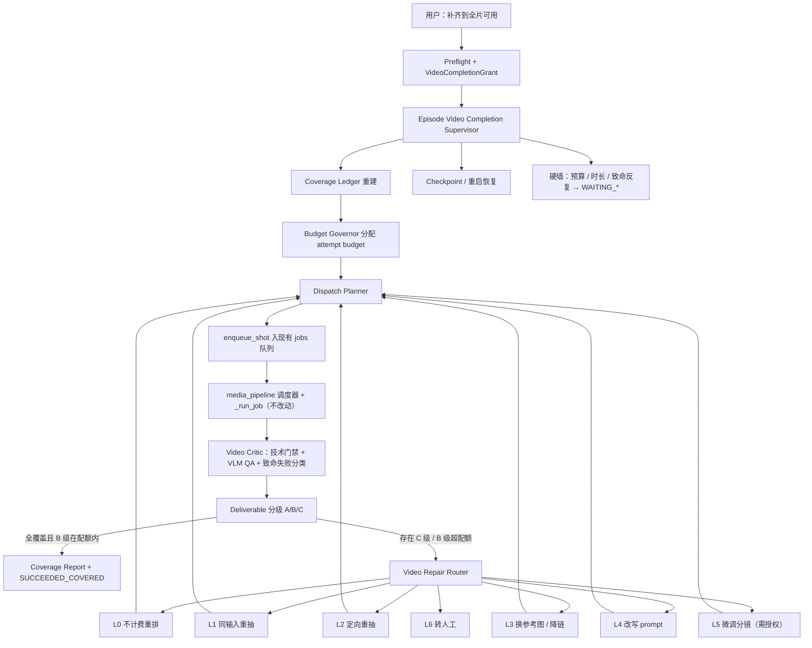

# 评审墙全片视频 Supervisor AgentLoop 与全覆盖补齐方案

> 状态：Proposed
> 日期：2026-07-25
> 目标：在评审墙点击一次，自动生成并持续补齐，直到本集**每个分镜都有一个可用视频**
> 借鉴方案：[分镜全集 Supervisor AgentLoop 与自动确认方案](./分镜全集Supervisor-AgentLoop与自动确认方案.md)
> 关联方案：[视频生成流水线调度与阶段可视化整改方案](./视频生成流水线调度与阶段可视化整改方案.md)、[剧本分镜与Seedance视频连续性整改方案](./剧本分镜与Seedance视频连续性整改方案.md)

## 1. 结论

把评审墙的"一键生成所有视频"从**一次性批量入队**改造成集级、持久化、可恢复的 **Episode Video Completion Supervisor**。

唯一成功条件：

```text
本集全部分镜的可用视频覆盖率 = 100%
AND 兜底采纳（B 级）镜数 ≤ 授权配额
AND 覆盖报告 Artifact 已生成
```

### 1.1 与分镜 Supervisor 的关键差异

分镜 Supervisor 可以直接借鉴的是**思想层面**（集级目标、Issue 路由、修复层级升级、checkpoint 恢复、有界内循环 + repair epoch 外循环、前置一次性授权），但视频链路有三条硬约束决定了实现形态必须不同：

| 维度 | 分镜 Supervisor | 视频 Supervisor |
|---|---|---|
| 成本 | 文本 ≈ 免费，放宽重试次数无代价 | ¥0.8/秒，**次数不能作为放宽维度** |
| 执行拓扑 | 串行（后镜依赖已验证前缀） | 并发（inflight cap + 车道 + 水位），已有成熟调度器 |
| 失效边界 | 线性 `invalidation_frontier`（前缀） | **连续性链段**，级联可爆炸 |
| 兜底 | 无"降级通过" | 已有 `force_best` 兜底采纳路径 |
| 终点 | 自动确认（写 Gate） | **不替代人工采用**，只保证"有可播放且已给出采纳建议的候选" |

因此本方案的核心架构决定是：

> **Supervisor 是协调者（reconciler），不是执行者。**
> 它不接管 `_run_job`，不改动 `media_pipeline` 的车道、水位、inflight cap 和预算预留。它只做四件事：维护覆盖台账、把失败翻译成 Issue、选择修复策略并通过 `enqueue_shot(...)` 重新入队、在硬墙处暂停并请求授权。

这样改动面最小，且并发/恢复/成本控制能力全部复用现有设施。

### 1.2 "上限放宽给 AgentLoop 自己定义"的落地方式

用户可放宽的上限**不是重试次数**，而是两个可授权的资源上限：

```text
budget_cap_cny      本次补齐授权的集级硬预算（默认 150，可调）
wall_clock_cap_s    本次补齐授权的总时长墙（默认 4h）
```

在这两个上限之内，**每镜重试几次、用哪种修复策略、是否级联重做下游、是否兜底采纳，全部由 Supervisor 自主决定**。现有的静态常量（`auto_retake_limit()=2`、`technical_resubmit_limit()=2`、`VIDEO_JOB_MAX_RETRIES=3`）从"硬上限"降级为"起始默认值"。

只有以下情况暂停，不视为失败：

- 用户主动取消或转人工；
- 预算或时长墙用尽（进入 `WAITING_AUTHORIZATION`，用户可一键抬额续跑）；
- 分镜被外部修改，原授权指纹失效；
- Provider 长时间不可用（`PAUSED_EXTERNAL`，按退避自动唤醒）；
- 需要修改分镜才能解决，但用户未授权 `allow_storyboard_edit`；
- 内容安全反复拒绝，分镜层无法安全解决。

---

## 2. 当前问题

### 2.1 `generate_episode` 只是"入队 N 个 job"，没有集级目标主体

`app/domain/video_ops.py:380-450` 的完整职责是：校验集状态 → 选镜 → `_ensure_shot_mode_plan` → 顺序 `worker.enqueue_shot` → 返回 `{"enqueued": [...]}`。

调用返回后，**系统里不存在任何持续负责"本集是否全部有视频"的主体**。全部镜失败也是 HTTP 200。

集状态回收逻辑更明确地承认了这一点（`app/media_exec/enqueue.py:26-45`）：

```26:31:app/media_exec/enqueue.py
def reconcile_episode_generation_status(episode_id: str) -> bool:
    """视频队列已无活动任务时，把剧集从假"生成中"恢复为"已确认"。

    单镜失败或预算暂停不应让整集永久处于运行态；真正完成并合成后仍由交付流程置为 done。
    """
```

即：只要队列空了就回到 `confirmed`，**不区分"全部成功"还是"全部失败"**。

### 2.2 入队失败会静默漏镜（最严重）

`enqueue_shot` 有多条抛异常路径，且都发生在写 `jobs` 之前：

```342:344:app/media_exec/enqueue.py
    preflight_errors = preflight_seedance_gates(shot, prev=prev_shot, prompt_text=None)
    if preflight_errors:
        raise CompileError("；".join(preflight_errors))
```

批量入口捕获后仅塞进响应体：

```445:448:app/domain/video_ops.py
        except Exception as exc:  # noqa: BLE001
            public = errors.record_and_format(exc, action="enqueue_shot",
                                              context={"shot_id": s["row"]["id"], "episode_id": episode_id})
            results.append({"shot_id": s["row"]["id"], "error": public})
```

后果链：DB 里没有这镜的 `jobs` 行 → `episode_pipeline_statuses` 的 `failed` 计数不包含它（`app/media_pipeline/status.py:320-321` 依赖 job 或 stage）→ `pipeline_summary` 看起来正常 → 前端 `shotVideoState` 判定为 `idle` → **用户以为在跑，实际这镜从头到尾没进队，且没有任何地方记录它为什么没进**。

这是"所有分镜都能有可用视频"目标下最容易被忽略的漏洞，必须优先修。

### 2.3 失败是终态，不回流

现有终态失败路径全部止于 job/version 的 `failed`，之后无人接管：

| 失败点 | 代码位置 | 现状 |
|---|---|---|
| provider 瞬时错误 | `run_job.py:373-413` | `retry_count` 达 `VIDEO_JOB_MAX_RETRIES=3` 后永久失败 |
| provider 任务失败 | `run_job.py:1143-1166` | 非可修复即 `ProviderError` → failed |
| provider 超时 | `run_job.py:1134-1138` | 超 `VIDEO_PROVIDER_MAX_WAIT=6h` 报错 |
| 下载失败 | `run_job.py:1171` | 异常 → failed |
| **技术校验失败** | `run_job.py:1194-1195` | `raise ProviderError("视频文件技术校验失败…")` → failed，**不自动重提新版本** |
| 参考图生成失败 | `run_job.py:743-780` | 最多 2 次后 failed |
| 连续性等待 | `run_job.py:930-962` | 转 `waiting_human`，永久等人工 |
| 预算不足 | `enqueue.py:449-456` | `paused_budget`，需人工点 resume |

注意 `technical_resubmit_limit()` 定义于 `app/media_pipeline/retry_policy.py:37-38`，但**全库无任何调用点**。也就是说技术校验失败连一次自动重提都没有。

### 2.4 重试上限是静态常量，与集级目标无关

```29:42:app/media_pipeline/retry_policy.py
def auto_retake_limit() -> int:
    """质量 QA 自动重抽：连续失败 2 次后停止烧钱转人工（PRD §14.3）。"""
    try:
        return max(1, int(get_setting("video_auto_retake_limit") or 2))
    except (TypeError, ValueError):
        return 2


def technical_resubmit_limit() -> int:
    return 2


def job_transient_max_retries() -> int:
    return int(config.VIDEO_JOB_MAX_RETRIES)
```

这些是"每镜每类"的全局静态上限。它们不知道：本集还有几镜没覆盖、预算还剩多少、这镜是不是连续性链头（失败会拖死下游）、上两次重抽有没有质量提升。结果是**该多试的镜试太少，该早停的镜白烧钱**。

### 2.5 视频失败未 Issue 化，无法路由和升级

视频侧的失败信息散落在三种非结构化形态：

- `jobs.error` / `shot_versions.error`：自由文本；
- `qa_json.issues`：模型输出的中文短句列表；
- `classify_video_hard_failures()`（`app/continuity.py:817-862`）：返回字符串码 `story_repeat / future_leak / wrong_dialogue / text_error / character_duplicate / state_mismatch / needs_crop`。

好底子确实存在——技术校验已经产出标准 `Issue`（`app/evidence/media.py:15-90`，含 `FILE_MISSING`、`VIDEO_CONTAINER_INVALID`、`VIDEO_DURATION_CONTRACT`、`VIDEO_PROBE_UNAVAILABLE`），`retry_patch_for_failure()`（`app/continuity.py:865+`）已经给出按失败类型的定向修正建议。

但这些没有汇入 `app/harness/types.py` 的 `Issue` 体系，因此拿不到 `severity` 分级、`fingerprint` 去重、stall 检测和 `repair_router` 的层级升级能力。

### 2.6 修复手段单一

现有唯一的自动修复是"同参考图定向重抽"（`run_job.py:1316-1332`）：

```1324:1331:app/media_exec/run_job.py
                enqueue_shot(
                    job["shot_id"],
                    extra_negative=extra_neg[:8],
                    critique=critique[:6] or None,
                    reroll=True,
                    after_shot_id=job["after_shot_id"],
                    auto_retake_count=decision.attempt,
                )
```

缺失的修复手段：换参考图、降链（去掉 `first_frame` 依赖改纯参考图）、改写 prompt（安全软化/专名泛化仅在 provider 报错时触发，QA 失败时不会）、微调分镜（时长/拆镜）。

### 2.7 "可用视频"没有统一定义

当前并存四套标准：

- `technical.passed`（硬门禁，`evidence/media.py:86-90`）；
- QA ≥ `auto_retake_threshold` 且无 `hard_failures`（自动采用标准，`evidence/media.py:322-324`）；
- `force_best` 兜底采纳（重抽名额用尽时采纳技术合格最高分，**即使 QA 不过**，`evidence/media.py:326-345`）；
- `shots.adopted_version_id` 非空（前端"已采用"）。

后果：`force_best` 兜底后前端显示"已采用"（`shotStatus.ts` 的 `adopted` 分支），与 A 级全绿视觉上完全一致。用户无法区分"真的好"和"没钱重抽了先凑上"。

### 2.8 无集级 run、checkpoint、pause/resume

每次 `enqueue_shot` 创建的是**镜级** run（`workflow_type="video_generation"`, `scope_type="shot"`，`app/orchestration/media_runs.py:13-48`）。不存在 episode 级 run。因此：

- 无法 pause/resume/cancel 整个"全片生成"这件事（评审墙只有单镜"停止任务"）；
- 服务重启后 `recover_all` 只能恢复**已存在的 job**，无法恢复"目标"——2.2 中漏掉的镜永远不会被补上；
- 没有权威的进度/剩余工作/修复层级视图，只有 `pipeline_summary` 的计数快照。

### 2.9 `video_stale` 是死字段

`app/domain/storyboard_ops.py:1034` 与 `:1066` 均硬编码：

```1034:1034:app/domain/storyboard_ops.py
        s["video_stale"] = False
```

前端 `shotStatus.ts:37-112` 的 `stale` 分支因此永不触发。分镜改动后旧视频不会被标记失效，Supervisor 也就无从判断"这镜虽然有视频，但对应的是旧分镜"。

---

## 3. 产品目标

### 3.1 P0

1. 评审墙一次点击后无人值守完成"生成 → 诊断 → 定向修复 → 补齐 → 兜底 → 覆盖报告"。
2. 定义并实现统一的**可用视频（Deliverable）三级判定**；覆盖率是唯一进度真相。
3. 入队失败必须 Issue 化并留在覆盖台账里，**禁止静默漏镜**。
4. 视频失败统一翻译为标准 `Issue`，经 Video Repair Router 映射为 L0–L6 修复策略。
5. 每镜重试次数由 Supervisor 在授权预算内动态分配，替代静态 `auto_retake_limit`。
6. 集级 checkpoint 持久化，服务重启后恢复"目标"而非仅恢复 job。
7. 硬预算与时长墙绝不静默突破；用尽即 `WAITING_AUTHORIZATION`，用户可一键抬额续跑。
8. 连续性链级联重做有明确深度上限，不因一镜返工引发全集重烧。
9. 现有"快速生成"行为保持兼容，补齐模式必须由用户显式选择。

### 3.2 P1

1. 评审墙显示 Supervisor 阶段、覆盖率 A/B/C 分色、预算消耗条、当前修复层级、每镜问题清单。
2. pause / resume / cancel / retry_now / handoff_to_human（复用 `run.control`）。
3. B 级兜底镜在评审墙显式标黄并展示 `fallback_reason`，与 A 级视觉区分。
4. 修复 `video_stale`：分镜变更后标记对应镜视频失效并纳入覆盖差集。
5. 覆盖报告 Artifact + 指标看板。

### 3.3 P2（本次不实现，登记防复发）

1. 跨集/整本批量补齐的全局预算编排；
2. 自动裁切修复 `needs_crop`（ffmpeg 后处理）；
3. 视频超分/插帧等画质增强兜底；
4. 基于历史成功率的 per-shot 成本预测模型；
5. 自动通过交付审批（`delivery.review` 仍必须人工）。

### 3.4 非目标

- 不替代人工采用决策：Supervisor 只保证"有可播放候选 + 已给出采纳建议"，人工仍可改判；
- 不自动拼接成片、不自动创建交付包；
- 不允许在未授权情况下修改分镜、剧本或人物谱；
- 不以无限次重抽实现"直到成功"（预算和时长是硬墙）；
- 不绕过 `media_scheduler.reserve_budget` 的预算预留；
- 不接管 `_run_job` 的执行，不重写 `media_pipeline` 调度器；
- 不把 B 级兜底视频当作 A 级上报。

---

## 4. 可用视频（Deliverable）定义

这是整个方案的地基。没有它，"所有分镜都有可用的视频"无法判定。

### 4.1 三级判定

```python
def grade_shot_video(shot_id) -> Literal["A", "B", "C"]:
    """基于技术门禁 + QA + 致命失败清单的确定性判定，不调用模型。"""
```

| 等级 | 条件 | 含义 |
|---|---|---|
| **A** | `technical.passed` 且 `hard_failures` 为空 且 `qa.overall >= threshold` 且 非 `qa_recovered` | 全绿，可直接交付 |
| **B** | `technical.passed` 且 无**致命** `hard_failures` 且（`qa.overall < threshold` 或 有非致命 `hard_failures` 或 `qa_recovered`） | 可播放、可交付但有瑕疵；须带 `fallback_reason` |
| **C** | 无 `technical.passed` 的成功版本，或 存在致命 `hard_failures` | 未覆盖 |

### 4.2 致命失败清单（不允许降级为 B）

从 `classify_video_hard_failures()` 的返回码中划分：

| 失败码 | 分类 | 理由 |
|---|---|---:|
| `character_duplicate` | **致命** | 人物分身/复制，人眼一看即废，不可交付 |
| `text_error` | **致命** | 画面乱码/水印/错字，不可交付 |
| `state_mismatch` | 非致命 | 首尾状态衔接不佳，观感可接受 |
| `story_repeat` | 非致命 | 与上镜动作重复，可通过剪辑缓解 |
| `future_leak` | 非致命 | 抢演下一镜，可通过剪辑缓解 |
| `wrong_dialogue` | 非致命 | 口型/台词不符，本项目 P0 无 TTS 对轨要求 |
| `needs_crop` | 非致命 | 构图需裁切，P2 可后处理 |

该清单以 `settings` 项 `video_fatal_failure_types` 暴露，允许调整，默认值为 `character_duplicate,text_error`。

### 4.3 覆盖完成条件

```text
所有镜 grade ∈ {A, B}
AND count(grade == "B") <= grant.max_fallback_shots
AND 无镜处于 chain_stale
```

`max_fallback_shots` 默认 `ceil(shots_total * 0.2)`，由授权指定。**超出配额时不算完成**，Supervisor 会挑 B 级中分数最低的继续修复，而不是直接宣布成功。

### 4.4 与现有代码的衔接

- A/B 判定复用 `evidence/media.py` 的 `technical_validation_json` + `qa_json` + `classify_video_hard_failures`，不新增模型调用；
- B 级采纳仍走 `select_best_video_candidate(shot_id, force_best=True)`，但必须由 Supervisor 显式决定，**不再由 `_maybe_auto_qa` 的返回值隐式触发**（现状 `run_job.py:1186`）；
- `select_best_video_candidate` 的 `fallback` 返回字段与 `adoption_reason` 已具备记录能力，只需在 API 层透出 `grade` 与 `fallback_reason`。

---

## 5. 用户模式与授权

### 5.1 两种模式

评审墙主按钮改为分裂按钮，两种模式行为明确区分：

| 模式 | 行为 | 兼容性 | 结束态 |
|---|---|---|---|
| 快速生成全部 | 一次性入队全部待办镜，不做补齐 | **与现状完全一致** | `{"enqueued": [...]}` |
| 补齐到全片可用 | 启动 Supervisor 持续补齐到 100% 覆盖 | 新增 | `SUCCEEDED_COVERED` / `WAITING_*` |

默认仍为"快速生成全部"。用户必须主动选择补齐模式。

### 5.2 一次性前置授权

选择补齐模式时，启动前展示：

- 剧集名称、集号、镜头总数；
- 当前分镜 Artifact 版本（绑定后被改动即失效）；
- 当前覆盖情况：A 级 / B 级 / 未覆盖 各多少镜；
- **预估补齐成本区间**（按未覆盖镜数 × 单镜均价 × 预期重试系数）；
- 授权预算上限、时长墙、B 级配额；
- 是否授权 Supervisor 微调分镜（默认关闭）；
- 明示：本任务不会自动拼接成片、不会自动创建交付包、不替代人工采用。

用户点击启动即签发一次性 `VideoCompletionGrant`：

```python
class VideoCompletionGrant(BaseModel):
    grant_id: str
    episode_id: str
    project_id: str
    storyboard_artifact_id: str          # 绑定分镜版本，改动即失效
    permission: Literal["video.complete_episode"]
    budget_cap_cny: float                # 授权硬预算（默认 150）
    wall_clock_cap_s: float              # 授权时长墙（默认 4h）
    allow_fallback_adopt: bool = True    # 是否允许 B 级兜底采纳
    max_fallback_shots: int              # B 级配额
    allow_storyboard_edit: bool = False  # 是否授权 L5 微调分镜
    issued_by: str
    issued_at: float
    expires_at: float
    consumed_at: float | None = None
    revoked_at: float | None = None
```

授权允许 Supervisor 在预算与时长范围内产生**任意数量**的视频版本、任意次重抽、任意修复策略组合。它不授权：

- 超出 `budget_cap_cny` 继续付费；
- 修改剧本或人物谱；
- 在 `allow_storyboard_edit=False` 时修改分镜；
- 拼接成片或创建交付包；
- 覆盖人工已采用（`gate_decisions` 有 `video_adoption` 记录）的镜；
- 补齐其他剧集。

### 5.3 授权失效

以下情况授权失效并进入 `WAITING_AUTHORIZATION`：

- `storyboard_artifact_id` 改变（分镜被重新确认或人工编辑）；
- 已消耗预算达到 `budget_cap_cny`；
- 已运行时长达到 `wall_clock_cap_s`；
- 用户撤销或取消；
- 授权过期。

Supervisor 自己产生的视频版本、参考图版本、`adopted_version_id` 变化**不使授权失效**。

进入 `WAITING_AUTHORIZATION` 时，UI 提供"追加预算并继续"，签发新 grant 后从 checkpoint 续跑，历史 Issue fingerprint 全部保留（不重置 stall 计数）。

### 5.4 复用现有授权设施

- 启动命令 `video.complete_episode` 走现有 `capabilities` 预检与 `approval_token` 流程（`app/capabilities/policy.py:80-132`）；
- grant 存储复用 `app/completion_grant.py` 的模式（同表或新增 `completion_grants` 行，`kind` 字段区分 storyboard/video）；
- token 只存哈希，不存明文。

---

## 6. 总体架构



### 6.1 分层职责

**Episode Video Completion Supervisor**

- 维护最终目标（100% 覆盖）与运行状态；
- 每 tick 重建 Coverage Ledger；
- 把 job/version/QA 的失败翻译为标准 `Issue`；
- 调用 Repair Router 选择策略并落地为 `enqueue_shot` 调用；
- 分配每镜 attempt budget；
- 决定 B 级兜底采纳时机；
- 持久化 checkpoint；
- 在硬墙处暂停并请求授权。

Supervisor **不**创建 provider 任务、不轮询、不下载、不改动调度器。

**Coverage Ledger**

集级覆盖台账，Supervisor 的唯一真相来源。每 tick 从 `shots` / `shot_versions` / `jobs` / `artifacts` 派生，并合并 checkpoint 中持久化的 attempt 与 Issue 历史。

**Budget Governor**

三层预算护栏 + 动态 attempt 分配（§9）。

**Video Critic**

确定性为主、模型为辅：

- 确定性：`validate_video_file`（文件/容器/时长合同）、`classify_video_hard_failures`、连续性链锚状态、分镜时长合同；
- 模型：`stages.qa_shot` 的 VLM QA，只能产出 warning 或结构化修复建议，**不能覆盖确定性硬门禁**。

**Video Repair Router**

把 Issue 映射为确定性的修复层级与策略，避免让模型自由决定是否重烧全片。

---

## 7. Supervisor 状态机

```text
CREATED
  → PREFLIGHT
  → PLANNING_COVERAGE
  → DISPATCHING
  → OBSERVING
  → EVALUATING
  → REPAIRING
  → FINALIZING
  → SUCCEEDED_COVERED

任意活动状态可转：
  → WAITING_RETRY
  → PAUSED_EXTERNAL          Provider 长时间不可用
  → PAUSED_BUDGET            集预算预留失败（复用现有 job 级语义）
  → WAITING_AUTHORIZATION    预算/时长墙用尽、分镜变更、需 L5 授权
  → WAITING_HUMAN            致命失败反复、repair epoch 用尽
  → CANCELLED
```

`OBSERVING` 与 `EVALUATING` 是稳态：有活动 job 时停在 `OBSERVING`，job 收敛后进 `EVALUATING` 重新分级。

### 7.1 成功状态只有一个

`SUCCEEDED_COVERED`。

**不得再出现"入队完成即返回成功"这类伪成功。** 存在 C 级镜或 B 级超配额时，run 必须停在 `REPAIRING` 或某个 `WAITING_*`，而不是标记完成。

### 7.2 暂停不是失败

预算用尽、时长墙、Provider 故障、服务重启、授权失效全部进入可恢复状态，业务目标不标记为失败。恢复后从最近 checkpoint 续跑。

---

## 8. Coverage Ledger

### 8.1 结构

```json
{
  "episode_id": "ep_x",
  "shots_total": 11,
  "grades": {"A": 8, "B": 1, "C": 2},
  "coverage_rate": 0.818,
  "fallback_quota": 3,
  "entries": [
    {
      "shot_no": 9,
      "shot_id": "shot_x",
      "grade": "C",
      "adopted_version_id": null,
      "best_version_id": "ver_y",
      "best_qa_overall": 0.42,
      "qa_gain_last_2": 0.01,
      "attempts_paid": 3,
      "attempts_budgeted": 5,
      "cost_spent_cny": 8.4,
      "last_issue_codes": ["VIDEO_QA_STATE_MISMATCH"],
      "issue_fingerprint_counts": {"VIDEO_QA_STATE_MISMATCH:shot_x::": 2},
      "repair_level": "L2",
      "chain_head_shot_no": 7,
      "chain_position": 2,
      "blocked_by_shot_no": 8,
      "chain_stale": false,
      "active_job_id": null,
      "human_adopted": false
    }
  ]
}
```

### 8.2 派生规则

| 字段 | 来源 |
|---|---|
| `grade` | §4.1 判定，输入为 `shot_versions.technical_validation_json` + `qa_json` |
| `attempts_paid` | 该镜 `shot_versions` 中产生过 provider 任务的版本数 |
| `cost_spent_cny` | `SUM(shot_versions.cost_cny)` for shot |
| `active_job_id` | `jobs` 中该镜 status ∈ `ACTIVE_JOB_STATUSES` 的最新行 |
| `chain_head_shot_no` / `chain_position` | 由 `continuity_mode` / `uses_previous_tail_frame` 沿 `shot_no` 回溯 |
| `blocked_by_shot_no` | `jobs.after_shot_id` 且 stage 为 `STAGE_WAITING_CONTINUITY` |
| `human_adopted` | 存在 `gate_decisions.gate_key='video_adoption'` 记录 |
| `issue_fingerprint_counts` | checkpoint 持久化，跨 tick 与跨 run 累计 |

### 8.3 不可触碰的镜

以下镜 Supervisor 一律跳过，不重抽、不覆盖：

- `human_adopted = true`（人工已明确采用）；
- 该镜有活动 job（`active_job_id` 非空）——避免重复付费；
- 该镜 `grade == "A"` 且非 `chain_stale`。

---

## 9. Budget Governor：把静态上限换成动态分配

这是"上限放宽给 AgentLoop 自己定义"的具体机制。

### 9.1 三层预算护栏

| 层 | 名称 | 默认 | 语义 |
|---|---|---|---|
| L1 | `grant.budget_cap_cny` | 150 | **硬墙**。达到即 `WAITING_AUTHORIZATION`，绝不静默超支 |
| L2 | 首轮软预算 | L1 × 0.65 | 首轮生成最多花 65%，**保留 35% 给补齐** |
| L3 | 单镜上限 | `L1 / shots_total × 3.0` | 防单镜黑洞 |

L2 的存在理由：现状最常见的失败形态是首轮把 `episode_cost_limit_cny=100` 烧到只剩零头，然后剩下 2 镜没钱重抽，只能 `force_best` 兜底或彻底没成片。

L1 仍通过 `media_scheduler.reserve_budget` 落地（`app/orchestration/media_scheduler.py:17-73`），即把 `budget_limit_cny` 从 `get_setting("episode_cost_limit_cny")` 改为**优先读 grant 的 `budget_cap_cny`**。L2/L3 由 Supervisor 在入队前自行判断，不改动预留逻辑。

### 9.2 每镜 attempt budget 动态分配

```python
def attempts_for(entry, ledger, ctx) -> int:
    est = est_cost_per_attempt(entry)                    # duration_s × 0.8 + 图片成本
    remaining = ctx.budget_cap_cny - ledger.cost_spent   # 剩余授权预算
    uncovered = max(1, ledger.count_uncovered())
    affordable = int(remaining / (uncovered * est))      # 公平份额

    base = MIN_ATTEMPTS_PER_SHOT                          # 2
    if entry.chain_position == 0 and entry.chain_len > 1:
        base += 1                                         # 链头失败拖死下游，优先给
    if entry.grade == "C":
        base += 1                                         # C 级比 B 级更急
    if entry.is_stalled():
        base += 0                                         # stalled 不加次数，改升层级

    return clamp(min(base + affordable, MAX_ATTEMPTS_PER_SHOT),
                 lo=MIN_ATTEMPTS_PER_SHOT, hi=MAX_ATTEMPTS_PER_SHOT)
```

`MAX_ATTEMPTS_PER_SHOT` 默认 6，是**技术熔断上限而非产品上限**——与项目 PRD §4.4 "只有技术熔断上限，不设产品上限"的原则一致。真正约束是预算和时长。

### 9.3 边际收益早停

即使 attempt budget 还有余额，满足任一条件即停止**同层级**重试并升级：

- 同一 Issue fingerprint 连续 2 次出现（`STALL_ROUNDS = 2`，与 `AgentLoopPolicy` 一致）；
- 最近 2 次 `qa.overall` 增益 < `MIN_QA_GAIN = 0.03`（与 `AgentLoopPolicy.min_quality_gain` 一致）；
- 出现致命 `hard_failures` 且已换过参考图（说明不是参考图问题）。

避免"预算充足就无脑烧钱"。

### 9.4 不计费重试不占 attempt budget

L0 层修复（provider 瞬时错误、下载失败、槽位满、连续性等待）**不产生新的 provider 任务**，因此不占 attempt budget，仅受时长墙约束。现有 `_schedule_job_retry`（`run_job.py:373-413`）的 `VIDEO_JOB_MAX_RETRIES=3` 由 Supervisor 在 L0 层重排时重置，等价于放宽为"时长墙内不限次"。

---

## 10. Video Issue 编码

### 10.1 标准 Issue 表

全部使用 `app/harness/types.py` 的 `Issue`，`subject` 统一为 `shot_id`，`evidence` 至少包含 `shot_no`、`version_id`、`job_id`。

| code | severity | 来源 | 首选层级 |
|---|---|---|---|
| `VIDEO_PREFLIGHT_BLOCKED` | blocker | `preflight_seedance_gates` / `CompileError`（`enqueue.py:342,360`） | L5 |
| `VIDEO_HARNESS_DISABLED` | blocker | 项目灰度隔离（`enqueue.py:288`） | L6 |
| `VIDEO_PROVIDER_TRANSIENT` | warning | 429 / 5xx / timeout（`hiagent.py:167-177`） | L0 |
| `VIDEO_PROVIDER_UNAVAILABLE` | blocker | 连续瞬时错误超阈值 | `PAUSED_EXTERNAL` |
| `VIDEO_PROVIDER_SAFETY` | blocker | Seedance 内容安全（`run_job.py:535-563`） | L4 |
| `VIDEO_PROVIDER_COPYRIGHT` | blocker | 版权限制（`run_job.py:1145-1153`） | L4 |
| `VIDEO_PROVIDER_TIMEOUT` | blocker | 超 `VIDEO_PROVIDER_MAX_WAIT` | L1 |
| `VIDEO_DOWNLOAD_FAILED` | blocker | 下载异常（`run_job.py:1171`） | L0 |
| `VIDEO_FILE_INVALID` | blocker | `FILE_MISSING` / `FILE_EMPTY` / `VIDEO_CONTAINER_INVALID` | L1 |
| `VIDEO_DURATION_CONTRACT` | blocker | `VIDEO_DURATION_CONTRACT`（`evidence/media.py:68-72`） | L1 |
| `VIDEO_PROBE_UNAVAILABLE` | warning | 缺 ffprobe（`evidence/media.py:80-85`） | L0 记录 |
| `VIDEO_QA_CHARACTER_DUPLICATE` | blocker | `character_duplicate`（致命） | L2 |
| `VIDEO_QA_TEXT_ARTIFACT` | blocker | `text_error`（致命） | L2 |
| `VIDEO_QA_STATE_MISMATCH` | blocker | `state_mismatch` | L2 |
| `VIDEO_QA_STORY_REPEAT` | blocker | `story_repeat` | L2 |
| `VIDEO_QA_FUTURE_LEAK` | blocker | `future_leak` | L2 |
| `VIDEO_QA_WRONG_DIALOGUE` | warning | `wrong_dialogue` | L2 |
| `VIDEO_QA_NEEDS_CROP` | warning | `needs_crop` | L2 |
| `VIDEO_QA_LOW_SCORE` | warning | QA < 阈值但无具体失败项 | L1 |
| `VIDEO_QA_UNAVAILABLE` | warning | `qa_recovered` / VLM 失败 | L0 记录 |
| `VIDEO_REFERENCE_UNAVAILABLE` | blocker | 参考图生成失败（`run_job.py:743-780`） | L3 |
| `VIDEO_CHAIN_ANCHOR_BLOCKED` | blocker | 等上镜尾帧超时（`run_job.py:930-962`） | L3 |
| `VIDEO_BUDGET_EXHAUSTED` | blocker | 预算墙 | `WAITING_AUTHORIZATION` |
| `VIDEO_WALL_CLOCK_EXCEEDED` | blocker | 时长墙 | `WAITING_AUTHORIZATION` |
| `VIDEO_STORYBOARD_CHANGED` | blocker | 分镜 Artifact 变更 | `WAITING_AUTHORIZATION` |

### 10.2 翻译层位置

新增 `app/video_issues.py`，提供纯函数（不写数据库）：

```python
def issues_from_job_failure(job, version) -> list[Issue]: ...
def issues_from_qa(qa: dict, technical: dict, *, shot_id, version_id) -> list[Issue]: ...
def issues_from_enqueue_error(exc: Exception, *, shot_id, shot_no) -> list[Issue]: ...
def is_fatal(issue: Issue) -> bool: ...
```

`fingerprint` 直接复用 `Issue.fingerprint`（`harness/types.py:25-34`），`evidence.path` 填 `shot_no`，`evidence.rule_id` 填失败码，从而拿到稳定去重。

---

## 11. Video Repair Router

新增 `app/video_repair_router.py`，形态对齐 `app/repair_router.py`（返回 Pydantic `VideoRepairPlan`，纯函数，无副作用，可单测）。

### 11.1 修复层级

从最小改动到最大改动逐级升级：

| 层级 | 策略 | 付费 | 典型问题 | 落地手段 |
|---|---|:---:|---|---|
| L0 | `requeue_no_charge` | 否 | provider 瞬时、下载失败、槽位满、连续性等待、缺 ffprobe | 重置 `retry_count` 并重排现有 job |
| L1 | `retake_same_input` | 是 | 文件损坏、时长不符、QA 低分无具体项、provider 超时 | `enqueue_shot(reroll=True)` |
| L2 | `retake_directed` | 是 | 具体 QA 硬失败 | `enqueue_shot(reroll=True, extra_negative=…, critique=…)`，负向词与提示由 `retry_patch_for_failure()` 提供 |
| L3 | `rebuild_reference` 或 `degrade_chain` | 是 | L2 两次无进展、角色分身、参考图不可用、链锚阻塞 | 清该镜参考图目录后重建；或去掉 `after_shot_id` 改纯参考图模式 |
| L4 | `rewrite_prompt` | 是 | 内容安全、版权、future_leak | `sanitize_seedance_prompt(aggressive=True)` / 专名泛化 / 收窄 `state_out` 后 `prompt_override` |
| L5 | `amend_storyboard` | 是 | `VIDEO_PREFLIGHT_BLOCKED`、时长合同反复不符 | 需 `allow_storyboard_edit`；仅允许调 `duration_s`、删不可渲染细节、拆镜 |
| L6 | `handoff_human` | 否 | 上述耗尽、致命失败反复、硬墙 | 保留全部候选与 Issue，转人工队列 |

### 11.2 L3 的两个分支

同为 L3，按 Issue 选择：

- `rebuild_reference`：`VIDEO_QA_CHARACTER_DUPLICATE`、`VIDEO_REFERENCE_UNAVAILABLE`、`VIDEO_QA_STATE_MISMATCH`（链头镜）——问题在参考素材；
- `degrade_chain`：`VIDEO_CHAIN_ANCHOR_BLOCKED`、`VIDEO_QA_STORY_REPEAT`、`VIDEO_QA_STATE_MISMATCH`（链中镜）——问题在首帧依赖。

`degrade_chain` 是本方案最重要的兜底手段：**切断 `first_frame` 依赖，改为纯参考图模式**。代价是该镜与上镜的画面衔接变弱，但能把"永久卡在等上镜尾帧"和"重演上镜动作"这两类死锁直接消掉。它必须记录 `continuity_degraded=true`，在评审墙提示衔接可能变弱，并使该镜最高只能评为 B 级。

### 11.3 L5 的严格边界

`amend_storyboard` 是唯一会写回 `shots` 表的策略，因此约束最严：

- 必须 `grant.allow_storyboard_edit = True`，否则直接 `WAITING_AUTHORIZATION`；
- 只允许三类改动：调整 `duration_s`（在 5–10s 整数内）、删除 `action_desc` 中不可渲染的细节、把一镜拆成两镜；
- **禁止**改动 `dialogues`、`narration`、`characters`、`key_lines`——这些是分镜 Supervisor 的主线合同，视频层无权动；
- 改动后必须重跑分镜确定性校验（`app/validators.py`），失败则回滚并转 L6；
- 改动后写新 `storyboard_artifact`，并**主动刷新 grant 的 `storyboard_artifact_id`**（Supervisor 自己的改动不使授权失效，外部改动仍失效）；
- 拆镜会改变 `shot_no`，必须同步重建受影响的连续性链与 Coverage Ledger。

### 11.4 Chain Invalidation：连续性链失效边界

分镜 Supervisor 用线性 `invalidation_frontier`；视频这里是**链段**，且必须防级联爆炸。

链定义：`shot_no` 连续且 `uses_previous_tail_frame(continuity_mode)` 为 true 的最长区间。

镜 N 重做成功后，下游 N+1..M（同链）是否需要重做：

```python
def should_cascade(n_entry, downstream_entry, ctx) -> bool:
    if downstream_entry.human_adopted:
        return False
    if downstream_entry.grade == "A" and not state_drift_significant(n_entry):
        return False                      # 下游已达标且尾状态无显著漂移 → 不动
    if downstream_entry.chain_position - n_entry.chain_position > MAX_CHAIN_CASCADE_DEPTH:
        return False                      # 超过深度 → 改 degrade_chain 切断依赖
    return True
```

`state_drift_significant` 比较镜 N 新采用版本的 `qa.observed_state_out` 与原 `state_out`；无显著差异则**不级联**。

`MAX_CHAIN_CASCADE_DEPTH = 3`。超过深度的下游镜一律 `degrade_chain`，把链切断而不是继续重烧。

这条规则直接决定了"追求 100% 覆盖"会不会烧爆预算。必须有单测覆盖。

### 11.5 升级与降级

- 同一 fingerprint 连续 2 次 → 升一级（复用 `repair_router.upgrade_level` 的写法）；
- 升到 L5 但未授权 → `WAITING_AUTHORIZATION`；
- 升到 L6 → `WAITING_HUMAN`；
- **修复成功后不降级**：该镜 `repair_level` 保留在 checkpoint，续跑时不从 L0 重来（避免重复走已知无效的低层级）。

---

## 12. 主循环

Supervisor 是**周期性 reconciler**，不是顺序执行循环。这是与分镜 Supervisor 最大的实现差异——因为视频是并发的。

```python
async def run_video_completion_supervisor(ctx) -> VideoSupervisorCheckpoint:
    while True:
        action = video_control.consume_control(ctx.episode_id)   # pause / handoff
        if action:
            return pause_for_control(ctx, action)

        if not assert_storyboard_version(ctx):                   # 分镜被改
            return wait_authorization(ctx, "VIDEO_STORYBOARD_CHANGED")

        ledger = rebuild_coverage_ledger(ctx)
        checkpoint(ctx, ledger)

        if ledger.covered_within_quota():
            return finalize_covered(ctx, ledger)                 # 生成覆盖报告

        if ctx.budget_exhausted():
            return wait_authorization(ctx, "VIDEO_BUDGET_EXHAUSTED")
        if ctx.wall_clock_exceeded():
            return wait_authorization(ctx, "VIDEO_WALL_CLOCK_EXCEEDED")
        if ctx.repair_epoch > MAX_REPAIR_EPOCHS:
            return handoff_human(ctx, ledger, "repair_epochs_exhausted")

        progressed = False
        for entry in ledger.actionable():        # 未覆盖 且 无活动 job 且 非人工采用
            if entry.never_attempted:
                progressed |= dispatch_first_attempt(entry, ctx)
                continue

            issues = collect_issues(entry)       # 从 job/version/qa 翻译
            plan = video_repair_router.route(
                issues,
                entry=entry,
                budget=ctx.budget_view(),
                fingerprint_counts=entry.issue_fingerprint_counts,
                current_level=entry.repair_level,
            )
            if plan.pause_state:
                return pause(ctx, plan)
            if entry.attempts_paid >= entry.attempts_budgeted and plan.is_paid:
                continue                          # 该镜配额用尽，留给兜底阶段
            progressed |= apply_repair_plan(plan, entry, ctx)

        # attempt 配额用尽但技术合格 → B 级兜底采纳
        if ctx.grant.allow_fallback_adopt:
            for entry in ledger.exhausted_but_technically_ok():
                adopt_fallback(entry, ctx)        # select_best_video_candidate(force_best=True)
                progressed = True

        if not progressed and not ledger.has_active_jobs():
            ctx.repair_epoch += 1                 # 一轮无任何进展 → 计入 epoch

        await sleep(ctx.next_tick_interval(progressed))   # 10s → 无进展时指数放宽到 60s
```

### 12.1 关键要求

**入队失败必须 Issue 化。** 这是补 §2.2 漏洞的核心：

```python
def dispatch(entry, ctx, **kwargs) -> bool:
    try:
        result = worker.enqueue_shot(entry.shot_id, **kwargs)
    except CompileError as exc:
        record_issue(entry, issues_from_enqueue_error(exc, shot_id=entry.shot_id,
                                                     shot_no=entry.shot_no))
        return False                              # 进 Ledger，绝不静默丢弃
    except ValueError as exc:
        record_issue(entry, issues_from_enqueue_error(exc, ...))
        return False
    if result.get("paused_budget"):
        record_issue(entry, budget_issue(entry))
        return False
    return not result.get("reused")               # 幂等复用不算进展
```

**幂等复用不算进展。** `enqueue_shot` 返回 `{"reused": True}` 时说明没有新任务产生，不能计为进展，否则 Supervisor 会以为在推进而实际空转。

**所有付费入队都走 `enqueue_shot`。** 不绕过 `media_scheduler.reserve_budget`，不绕过车道调度。

**tick 退避。** `SUPERVISOR_TICK_INTERVAL_S = 10.0`，连续无进展时 ×1.5 放宽至上限 60s，避免空转打满 DB。

### 12.2 与现有快速模式共存

`video.generate_episode`（快速模式）保持现状不变。补齐模式是新命令 `video.complete_episode`。

约束：同一 episode 同时只能有一个 active Supervisor run（`episodes.active_video_run_id` + 幂等键）。快速模式在 Supervisor 运行期间被拒绝（409），避免两个主体同时入队重复付费。

---

## 13. Checkpoint 与恢复

### 13.1 Artifact

新增类型 `video_supervisor_checkpoint`，`scope_type="episode"`，写法完全对齐 `app/storyboard_supervisor.py:95-125`。

```json
{
  "episode_id": "ep_x",
  "run_id": "run_x",
  "goal": "complete_episode_video",
  "phase": "REPAIRING",
  "repair_epoch": 2,
  "tick_no": 47,
  "started_at": 1770000000.0,
  "grant_id": "grant_x",
  "storyboard_artifact_id": "art_storyboard_v3",
  "budget": {
    "cap_cny": 150.0,
    "spent_cny": 62.4,
    "first_pass_soft_cap_cny": 97.5,
    "per_shot_cap_cny": 40.9
  },
  "coverage": {"A": 8, "B": 1, "C": 2, "total": 11, "fallback_quota": 3},
  "shot_state": {
    "9": {
      "grade": "C",
      "attempts_paid": 3,
      "attempts_budgeted": 5,
      "repair_level": "L2",
      "issue_fingerprint_counts": {"VIDEO_QA_STATE_MISMATCH:shot_x:9:state_mismatch": 2},
      "qa_history": [0.38, 0.41, 0.42],
      "continuity_degraded": false
    }
  },
  "last_plan": {
    "shot_no": 9,
    "level": "L3",
    "strategy": "rebuild_reference",
    "reason": "L2 定向重抽两轮 QA 无增益"
  },
  "outcome": null
}
```

### 13.2 写入时机

- 每个 tick 开始（重建 Ledger 后）；
- 每次 Repair Plan 确定后；
- 每次 B 级兜底采纳后；
- 进入任一 `WAITING/PAUSED` 状态前；
- `FINALIZING` 前后。

### 13.3 恢复原则

服务重启后 `recover_video_completion_runs()`（对齐 `recover_storyboard_tasks`，`storyboard_ops.py:402-445`）：

1. 校验 grant 有效且 `storyboard_artifact_id` 未变；
2. **先重建 Coverage Ledger，再决策**——不信任 checkpoint 里的 grade（job 可能在重启期间已完成）；
3. 合并 checkpoint 的 `attempts_paid` / `issue_fingerprint_counts` / `repair_level` / `qa_history`（这些无法从 DB 派生）；
4. 跳过已有活动 job 的镜（`recover_all` 会续跑它们），**不重复入队**；
5. `spent_cny` 从 `shot_versions.cost_cny` 重新求和，不信 checkpoint 缓存值（防重启期间的成本漂移）；
6. 用户取消的 run 永不自动恢复；
7. `WAITING_AUTHORIZATION` 的 run 不自动恢复，等用户抬额。

---

## 14. 防死循环与熔断

"直到全部可用"表示目标持久存在，不表示单进程无限高速循环。

### 14.1 每镜内层有界

- attempt budget（§9.2），上限 `MAX_ATTEMPTS_PER_SHOT = 6`；
- 同 fingerprint 连续 2 次 → 升级层级，不加同层级重试；
- QA 增益连续 2 次 < 0.03 → 升级；
- 致命失败在换过参考图后仍出现 → 直接 L6。

### 14.2 集级外层有界

`MAX_REPAIR_EPOCHS = 8`（高于分镜的 6，因为视频镜数多、并发收敛慢）。一个 epoch = 一轮"全部 actionable 镜都处理过且无任何进展"。

epoch 用尽后：

- Provider/基础设施原因 → `PAUSED_EXTERNAL`，按退避自动唤醒；
- 预算/时长原因 → `WAITING_AUTHORIZATION`；
- 业务原因 → `WAITING_HUMAN`；
- **不得标记为"已完成但有未覆盖镜"**；
- 用户可点击"继续补齐"开启新激活周期，保留全部历史与 fingerprint 计数。

### 14.3 三道硬墙

| 墙 | 触发 | 结果 |
|---|---|---|
| 预算 | `spent_cny >= budget_cap_cny` | `WAITING_AUTHORIZATION`，可抬额续跑 |
| 时长 | `now - started_at >= wall_clock_cap_s` | `WAITING_AUTHORIZATION` |
| 致命反复 | 同镜致命 `hard_failures` 出现 ≥3 次 | 该镜转 L6，其余镜继续 |

### 14.4 空转防护

- tick 退避 10s → 60s；
- 无 actionable 镜且有活动 job 时，Supervisor 停在 `OBSERVING`，不做任何 DB 写入除心跳；
- 单次 tick 的 Ledger 重建必须是固定次数的轻量查询（对齐 `episode_pipeline_statuses` 的写法，`status.py:193-336`），禁止 N+1。

---

## 15. API 与能力目录

### 15.1 新增命令

```python
class VideoCompleteEpisodeInput(StandardCommandInput):
    episode_id: str
    mode: Literal["fresh", "resume"] = "fresh"
    budget_cap_cny: float | None = None          # None → 默认 150
    wall_clock_cap_s: float | None = None        # None → 默认 4h
    allow_fallback_adopt: bool = True
    max_fallback_shots: int | None = None        # None → ceil(total × 0.2)
    allow_storyboard_edit: bool = False
    completion_grant_id: str | None = None
```

Capability 登记（对齐 `catalog.py:624-637` 的写法）：

```python
_cmd(
    "video.complete_episode",
    title="补齐全片视频",
    description="集级 Supervisor：持续生成与修复，直到每个分镜都有可用视频",
    input_model=I.VideoCompleteEpisodeInput,
    risk=RiskLevel.R2_MATERIAL,
    confirmation=ConfirmationPolicy.ALWAYS,
    idempotency=IdempotencyPolicy.REQUIRED,
    scopes={"manju:generation-media"},
    side_effect="creates_paid_video_completion_run",
    handler=h_video.complete_episode,
    rest_routes=("POST /api/episodes/{episode_id}/video-completion",),
    tags=("video", "supervisor"),
)
```

`allow_storyboard_edit=True` 时按 **R3** 预检（因为会写回 `shots`），并在确认弹窗中单独列出该影响。

### 15.2 REST

```http
POST /api/episodes/{episode_id}/video-completion
```

```json
{
  "mode": "fresh",
  "budget_cap_cny": 150,
  "wall_clock_cap_s": 14400,
  "allow_fallback_adopt": true,
  "max_fallback_shots": 3,
  "allow_storyboard_edit": false,
  "approval_token": "...",
  "idempotency_key": "..."
}
```

返回：

```json
{
  "status": "accepted",
  "run_id": "run_x",
  "goal": "complete_episode_video",
  "resource_uri": "manju://runs/run_x"
}
```

只读进度：

```http
GET /api/episodes/{episode_id}/video-completion
```

返回最新 checkpoint 的公开投影（phase、coverage、budget、per-shot grade 与 issue codes、last_plan）。

### 15.3 预检

新增 `preflight` 分支（对齐 `preflight.py:206-252`）：

- 前置：`storyboard_confirmed`、`has_shots`；
- `estimated_cost_cny` = 未覆盖镜数 × 单镜均价 × 预期重试系数 1.6；
- `affected`：列出将被重做的镜号（含链级联预估）；
- `state_fingerprint` 必须包含 `storyboard_artifact_id` 与当前 coverage 快照，确保确认弹窗展示的数字与实际执行一致。

### 15.4 控制命令

复用 `run.control`（`catalog.py:826-844`），语义映射：

- `pause`：在下一个 tick 边界暂停，保留 checkpoint 与活动 job；
- `resume`：从 checkpoint 续跑；
- `cancel`：撤销 grant，停止新增入队，**已入队 job 不强杀**（provider 侧可能已计费），已有候选全部保留；
- `retry_now`：跳过当前 tick 退避；
- `handoff_to_human`：停止自动修复，保留全部候选与 Issue 清单。

pause/handoff 的实现直接复用 `app/storyboard_control.py:29-95` 的模式，新增 `episodes.video_control_json` 列。

---

## 16. 数据模型

优先复用现有表，新增最小字段。

### `episodes`

```text
active_video_run_id      TEXT NULL
video_completion_mode    TEXT NOT NULL DEFAULT 'quick'   -- quick | complete
video_control_json       TEXT NULL                       -- pause/handoff 请求
```

### `workflow_runs`

新 `workflow_type = "episode_video_completion"`，`scope_type = "episode"`。

`policy_snapshot_json`：

```json
{
  "supervisor": "video_completion",
  "budget_cap_cny": 150.0,
  "wall_clock_cap_s": 14400,
  "first_pass_budget_fraction": 0.65,
  "min_attempts_per_shot": 2,
  "max_attempts_per_shot": 6,
  "max_repair_epochs": 8,
  "max_chain_cascade_depth": 3,
  "allow_fallback_adopt": true,
  "max_fallback_shots": 3,
  "allow_storyboard_edit": false,
  "fatal_failure_types": ["character_duplicate", "text_error"]
}
```

### Artifact 类型

- `video_supervisor_checkpoint`（新）；
- `video_coverage_report`（新，完成时生成）；
- `shot_video`（复用现状）。

### `shot_versions.image_inputs`（JSON，不加列）

新增键：

```json
{
  "supervisor_run_id": "run_x",
  "supervisor_repair_level": "L3",
  "supervisor_strategy": "rebuild_reference",
  "supervisor_issue_codes": ["VIDEO_QA_CHARACTER_DUPLICATE"],
  "continuity_degraded": false
}
```

### 授权存储

复用 `app/completion_grant.py` 的表与流程，新增 `kind` 区分 `storyboard` / `video`。token 只存哈希。

### 修复 `video_stale`（P1）

`app/domain/storyboard_ops.py:1034` 与 `:1066` 的硬编码 `False` 改为真实计算：比较 `shots.storyboard_artifact_id` 与该镜采用版本的 `parent_artifact_ids`，不一致即 `stale`。Supervisor 把 `stale` 镜纳入覆盖差集。

---

## 17. UI

### 17.1 启动入口

评审墙主按钮改为分裂按钮：

```text
[一键生成所有视频 ▾]
  - 快速生成全部（不自动补齐）
  - 补齐到全片可用（Supervisor）
```

选择补齐模式后显示一次影响说明与授权表单（预算上限、时长墙、B 级配额、是否授权微调分镜）。

### 17.2 运行面板

新增 `frontend/src/components/VideoSupervisorPanel.tsx`，参照 `SupervisorPanel.tsx` 的结构。展示：

- 当前阶段（派发 / 观察 / 评估 / 修复 / 收尾）；
- 覆盖率进度条，三色分段：A 级绿、B 级黄、未覆盖灰；
- 预算条：已花 / 首轮软预算 / 授权上限；
- 当前 repair epoch 与正在执行的策略；
- 未覆盖镜清单（镜号 + Issue code + 修复层级 + 已用/已分配 attempt）；
- 授权状态与"追加预算并继续"按钮；
- 暂停 / 取消 / 转人工。

示例：

```text
第 1 集 · 补齐到全片可用
状态：正在修复（第 2 个修复周期）
覆盖：A 级 8 / B 级 1 / 未覆盖 2（共 11 镜）
预算：¥62.4 / ¥150（首轮软预算 ¥97.5）
第 9 镜：角色分身（VIDEO_QA_CHARACTER_DUPLICATE）→ L3 换参考图，已用 3/5 次
第 10 镜：等第 9 镜尾帧 → 将降链切断依赖
```

### 17.3 每镜状态展示

`frontend/src/shotStatus.ts` 的 `ShotVideoState` 新增 `grade` 字段，并区分：

- A 级：绿色"已采用"；
- B 级：**黄色"已采用（兜底）"** + hover 展示 `fallback_reason`；
- `continuity_degraded`：附加"衔接已降级"角标。

现状的 `adopted` 分支对 A/B 不做区分，必须改。

### 17.4 完成状态

```text
✓ 全部 11 镜均有可用视频
✓ A 级 10 镜 · B 级 1 镜（在授权配额 3 内）
✓ 覆盖报告已生成
本次消耗 ¥78.6 / 授权 ¥150
尚未拼接成片，尚未创建交付包
```

未完成时禁止显示对钩，必须显式列出未覆盖镜与原因。

---

## 18. 并发与一致性

1. 同一 episode 同时只能有一个 active Supervisor run（`active_video_run_id` + 幂等键）；
2. Supervisor 运行期间，快速模式 `video.generate_episode` 返回 409；
3. 单镜 `video.generate_shot` 允许并行（用户手动干预优先），Supervisor 通过 `active_job_id` 检测并跳过该镜；
4. 人工采用（`gate_decisions`）后该镜对 Supervisor 只读；
5. 人工在运行期间编辑分镜 → `storyboard_artifact_id` 变化 → `WAITING_AUTHORIZATION`，不静默覆盖；
6. B 级兜底采纳与人工采用竞争时，人工优先（写 `gate_decisions` 即锁定）；
7. `spent_cny` 每 tick 从 `shot_versions.cost_cny` 重算，不用内存累加值；
8. 链级联重做用事务标记下游 `chain_stale`，避免半更新状态；
9. 服务重启后只恢复未被新 run 接管的 run；
10. 用户取消的 run 永不自动恢复。

---

## 19. 可观测性

### 19.1 事件

新增 `run_events` 类型：

```text
VIDEO_SUPERVISOR_STARTED
VIDEO_SUPERVISOR_CHECKPOINT
VIDEO_COVERAGE_EVALUATED
VIDEO_SHOT_DISPATCHED
VIDEO_SHOT_GRADED
VIDEO_REPAIR_PLAN_SELECTED
VIDEO_CHAIN_INVALIDATED
VIDEO_CHAIN_DEGRADED
VIDEO_FALLBACK_ADOPTED
VIDEO_STORYBOARD_AMENDED
VIDEO_BUDGET_WALL_REACHED
VIDEO_SUPERVISOR_PAUSED
VIDEO_SUPERVISOR_HANDOFF
VIDEO_COVERAGE_COMPLETED
```

每个 Repair Plan 记录：Issue codes、fingerprint、层级、策略、目标镜、级联镜清单、预估成本、执行前后 QA 分。

### 19.2 指标

| 指标 | 目标 |
|---|---:|
| 补齐模式最终覆盖率 | 100%（有效分镜输入） |
| A 级占比 | ≥ 85% |
| B 级兜底占比 | ≤ 15% |
| 静默漏镜（无 job 无 Issue 的镜） | **0** |
| 单集补齐成本 | ≤ 授权上限，中位数 ≤ ¥90 |
| 无进展重复修复占比 | 0 |
| 链级联重做镜数 / 触发次数 | ≤ 3 |
| 服务重启后可恢复率 | 100% |
| 重复付费任务（同镜同输入并发） | 0 |
| 人工介入率 | ≤ 10% |

### 19.3 覆盖报告 Artifact

完成时生成 `video_coverage_report`，内容：每镜 grade、采用版本、QA 分、修复历史、成本、是否降链、`fallback_reason`。这是评审墙人工复核的入口，也是 golden 回归的对比基准。

---

## 20. 冻结项

按项目开发规则，本方案实施前冻结以下内容，实施期间不得擅自变更。

### 20.1 常量

```python
SUPERVISOR_TICK_INTERVAL_S       = 10.0     # 无进展时 ×1.5 放宽，上限 60.0
SUPERVISOR_TICK_MAX_INTERVAL_S   = 60.0
MAX_REPAIR_EPOCHS                = 8
MIN_ATTEMPTS_PER_SHOT            = 2
MAX_ATTEMPTS_PER_SHOT            = 6
STALL_ROUNDS                     = 2        # 与 AgentLoopPolicy 一致
MIN_QA_GAIN                      = 0.03     # 与 AgentLoopPolicy 一致
FIRST_PASS_BUDGET_FRACTION       = 0.65
SHOT_BUDGET_MULTIPLIER           = 3.0
DEFAULT_BUDGET_CAP_CNY           = 150.0
DEFAULT_WALL_CLOCK_CAP_S         = 4 * 3600
MAX_CHAIN_CASCADE_DEPTH          = 3
DEFAULT_FALLBACK_QUOTA_FRACTION  = 0.2
FATAL_FAILURE_TYPES              = ("character_duplicate", "text_error")
CHECKPOINT_ARTIFACT_TYPE         = "video_supervisor_checkpoint"
REPORT_ARTIFACT_TYPE             = "video_coverage_report"
```

### 20.2 模块边界

| 模块 | 允许改动 |
|---|---|
| `app/video_supervisor.py`（新） | 主循环、Ledger、Budget Governor、checkpoint |
| `app/video_issues.py`（新） | 失败 → Issue 纯翻译，无副作用 |
| `app/video_repair_router.py`（新） | Issue → Plan 纯路由，无副作用 |
| `app/video_control.py`（新） | pause/handoff，照抄 `storyboard_control.py` |
| `app/domain/video_ops.py` | 新增 `complete_episode` 入口；`generate_episode` **不改行为** |
| `app/media_exec/enqueue.py` | 仅 `budget_limit` 改为优先读 grant；`image_inputs` 增 supervisor 元信息 |
| `app/media_exec/run_job.py` | 仅移除 `_maybe_auto_qa` 隐式触发 `force_best`（补齐模式下改由 Supervisor 决定） |
| `app/evidence/media.py` | 新增 `grade_shot_video()` 纯函数 |
| `app/media_pipeline/*` | **不改**调度器、车道、水位、inflight cap |
| `app/capabilities/*` | 新增命令、输入模型、预检分支 |
| `frontend/` | 分裂按钮、`VideoSupervisorPanel`、`shotStatus` 增 grade |

### 20.3 依赖

不引入任何新的第三方依赖。全部基于现有 FastAPI / Pydantic / SQLite / asyncio。

### 20.4 本次不实现

§3.3 的 P2 全部、跨集批量补齐、自动裁切、画质增强、自动交付审批、TTS/字幕相关。

---

## 21. 验收标准

### 21.1 正常完成

- 选择"补齐到全片可用"后无需再次点击；
- 结束时本集每个分镜都有 `adopted_version_id` 且 grade ∈ {A, B}；
- B 级镜数 ≤ 授权配额，且每个 B 级都有 `fallback_reason`；
- 生成 `video_coverage_report`；
- run 最终为 `SUCCEEDED_COVERED`；
- 不自动拼接成片、不创建交付包。

### 21.2 不再静默漏镜

- 注入一镜 `preflight_seedance_gates` 失败：该镜必须出现在 Ledger 中，带 `VIDEO_PREFLIGHT_BLOCKED`，并按授权走 L5 或 L6；
- 该镜绝不出现在 UI 上显示为 `idle` 而无任何原因说明；
- 全集任意时刻：`shots_total == A + B + C`，且每个 C 级镜都有至少一个 Issue code。

### 21.3 自动修复

- QA `state_mismatch` 两轮定向重抽无增益后自动升级到换参考图；
- `character_duplicate` 换参考图后仍出现 → 转人工，不无限烧钱；
- 链中镜等上镜尾帧超时 → 自动降链并成功出片，标记 `continuity_degraded`；
- 内容安全被拒 → 自动软化 prompt 重提，两次仍拒 → 转人工；
- 技术校验失败 → 自动新建版本重提（补 `technical_resubmit_limit` 从未被调用的现状）；
- 授权 `allow_storyboard_edit` 时，时长合同反复不符可自动调 `duration_s` 并重跑分镜校验。

### 21.4 预算与时长

- 消耗达到 `budget_cap_cny` 时立即停止新增付费入队，进 `WAITING_AUTHORIZATION`；
- 任何情况下 `spent_cny` 不超过 `budget_cap_cny`（允许单个在途任务的误差，不允许连续超支）；
- 首轮消耗不超过 `budget_cap_cny × 0.65`；
- 单镜消耗不超过 `per_shot_cap_cny`；
- 追加预算后从 checkpoint 续跑，fingerprint 计数不重置。

### 21.5 链级联受控

- 单镜返工触发的级联重做镜数 ≤ `MAX_CHAIN_CASCADE_DEPTH`；
- 下游已达 A 级且尾状态无显著漂移时不级联；
- 超深度的下游镜改为降链而非重烧。

### 21.6 Checkpoint 与恢复

- 每 tick 有 checkpoint；
- 在任意阶段重启后能恢复目标并继续补齐；
- 重启不重复入队已有活动 job 的镜；
- 重启后 `spent_cny` 与 DB 求和一致。

### 21.7 安全与授权

- 未选择补齐模式时不启动 Supervisor；
- grant 失效后不再产生付费任务；
- 分镜被外部修改时进入 `WAITING_AUTHORIZATION`；
- 未授权时绝不修改 `shots`；
- 人工已采用的镜不被覆盖；
- 取消后不再自动唤醒。

### 21.8 防死循环

- 同一 Issue fingerprint 不在同一层级重复超过 2 次；
- QA 无增益必须升级层级；
- Provider 故障走退避，不高频空转；
- 无 actionable 镜时 tick 退避到 60s。

---

## 22. 测试计划

### 22.1 单元测试

1. `grade_shot_video` 对 A/B/C 三级及致命失败清单的判定；
2. `issues_from_qa` / `issues_from_job_failure` / `issues_from_enqueue_error` 的 code 与 severity 映射；
3. `video_repair_router.route` 对每类 Issue 返回正确层级与策略；
4. 同 fingerprint 两次后升级层级；
5. QA 增益 < 0.03 两次后升级；
6. `attempts_for` 在不同剩余预算/未覆盖镜数下的分配；
7. 首轮软预算不被突破；
8. 单镜上限不被突破；
9. `should_cascade` 的四个分支（人工采用、A 级无漂移、超深度、正常级联）；
10. grant 只能用于指定 episode；
11. 分镜 Artifact 改变后 grant 失效；
12. 未授权时 L5 直接转 `WAITING_AUTHORIZATION`；
13. `reused=True` 不计为进展；
14. B 级超配额时不判定完成。

### 22.2 集成测试

1. 11 镜全部首轮成功 → 全 A 级 → `SUCCEEDED_COVERED`；
2. 第 4 镜注入 provider 瞬时错误 3 次 → L0 不计费重排 → 最终成功且不占 attempt budget；
3. 第 9 镜注入 `state_mismatch` → L2 两轮无增益 → L3 换参考图 → 成功；
4. 第 9 镜注入 `character_duplicate` 持续 → 换参考图后仍失败 → 转人工，其余镜正常完成；
5. 第 6 镜 `preflight_seedance_gates` 失败 → 出现在 Ledger 且带 `VIDEO_PREFLIGHT_BLOCKED`（**回归 §2.2 漏洞**）；
6. 第 7 镜技术校验失败 → 自动新建版本重提 → 成功；
7. 第 10 镜等第 9 镜尾帧超时 → 降链 → 成功且标记 `continuity_degraded`；
8. 内容安全拒绝两次 → 转人工；
9. 预算在第 8 镜用尽 → `WAITING_AUTHORIZATION` → 追加预算 → 续跑至全覆盖；
10. attempt budget 用尽但技术合格 → B 级兜底采纳，带 `fallback_reason`；
11. B 级数量超配额 → 继续修复最低分 B 级，不判定完成；
12. 第 5 镜返工后 `observed_state_out` 显著漂移 → 级联重做 6、7 镜，不动 8 镜之后；
13. 服务在第 6 镜生成中重启 → 恢复目标，不重复入队；
14. 服务在 `FINALIZING` 重启 → 不重复生成覆盖报告；
15. 用户运行中手动生成第 3 镜 → Supervisor 跳过该镜，不重复付费；
16. 用户运行中编辑分镜 → `WAITING_AUTHORIZATION`；
17. 用户取消 → 停止新增入队，已有候选保留，不自动恢复；
18. Supervisor 运行期间调用快速模式 → 409。

### 22.3 成本回归（必须有）

由于目标是"所有镜都有视频"，**最大风险是烧钱失控**。必须有一组用 mock provider 的成本回归：

- 全失败场景：11 镜全部持续 QA 不过 → 总消耗必须 ≤ `budget_cap_cny`；
- 链级联最坏场景：第 1 镜反复返工 → 级联镜数 ≤ 3，总消耗 ≤ 上限；
- 抖动场景：一半镜首轮过、一半需 3 次 → 记录实际成本并作为 golden 基线。

### 22.4 Golden Case

固定《陨落的天才》第 1 集作为首个 golden：

- 首轮后存在 2 镜未覆盖；
- 一镜走定向重抽成功、一镜走换参考图成功；
- 最终 100% 覆盖，A 级 ≥ 9 镜；
- 总消耗记录留档，后续任何策略改动必须先过成本回归再合入。

---

## 23. 实施顺序

### P0-0：地基（先做，否则 Supervisor 只会自动重复现有误判）

1. `grade_shot_video` 三级判定 + 致命失败清单；
2. `app/video_issues.py` 失败 → 标准 Issue 翻译；
3. **修复入队失败静默漏镜**：`generate_episode` 与未来 Supervisor 均把入队异常落成持久化 Issue；
4. 覆盖率只读 API（`GET /api/episodes/{id}/video-completion` 的 coverage 部分先可用）。

这一步单独可验证、单独有价值：即使 Supervisor 还没上，用户也能立刻看到"哪几镜没视频、为什么"。

### P0-1：Supervisor 骨架

1. `app/video_supervisor.py`：状态机、Coverage Ledger、checkpoint Artifact；
2. reconcile tick 主循环，首轮派发 + 观察；
3. 集级 `workflow_runs` 与事件；
4. run 不再以"入队完成"结束。

### P0-2：Repair Router 与 Budget Governor

1. `app/video_repair_router.py` L0–L4（L5 延后）；
2. attempt budget 动态分配 + 三层预算护栏；
3. stall 与边际收益升级；
4. B 级兜底采纳由 Supervisor 显式决定，移除 `_maybe_auto_qa` 的隐式 `force_best`。

### P0-3：链失效与降链

1. 链识别与 `should_cascade`；
2. `degrade_chain` 策略与 `continuity_degraded` 标记；
3. 级联深度上限。

### P0-4：授权

1. `VideoCompletionGrant` 签发/校验/消费/撤销；
2. `video.complete_episode` 命令 + 预检 + `approval_token`；
3. 预算上限从 grant 读取；
4. 追加预算续跑。

### P1：UI、L5、恢复与监控

1. 分裂按钮 + 授权表单；
2. `VideoSupervisorPanel` + A/B 分色 + 预算条；
3. L5 微调分镜（需授权）；
4. `video_stale` 真实计算；
5. `recover_video_completion_runs`；
6. pause/resume/cancel/handoff；
7. 覆盖报告、指标、golden 与成本回归报表。

---

## 24. 涉及模块

| 模块 | 改造重点 |
|---|---|
| `app/video_supervisor.py`（新） | 状态机、Coverage Ledger、Budget Governor、checkpoint、恢复 |
| `app/video_issues.py`（新） | 失败 → 标准 Issue 纯翻译 |
| `app/video_repair_router.py`（新） | Issue → L0–L6 Plan、链失效边界 |
| `app/video_control.py`（新） | pause / handoff，照抄 `storyboard_control.py` |
| `app/domain/video_ops.py` | 新增 `complete_episode`；`generate_episode` 保持兼容 |
| `app/evidence/media.py` | `grade_shot_video`；`select_best_video_candidate` 透出 grade 与 fallback_reason |
| `app/media_exec/enqueue.py` | `budget_limit` 优先读 grant；入队异常可被上层 Issue 化；supervisor 元信息 |
| `app/media_exec/run_job.py` | 移除 `_maybe_auto_qa` 隐式 `force_best`（补齐模式下） |
| `app/continuity.py` | 复用 `classify_video_hard_failures` / `retry_patch_for_failure`；补致命分类 |
| `app/orchestration/` | 集级 run、事件、`run.control` 接线、恢复 |
| `app/capabilities/` | `video.complete_episode`、输入模型、R2/R3 预检、grant |
| `app/completion_grant.py` | 增 `kind` 支持 video grant |
| `app/domain/storyboard_ops.py` | `video_stale` 真实计算 |
| `frontend/src/pages/WallPage.tsx` | 分裂按钮、授权表单、面板接线 |
| `frontend/src/components/VideoSupervisorPanel.tsx`（新） | 运行面板 |
| `frontend/src/shotStatus.ts` | 新增 grade，A/B 视觉区分，降链角标 |
| `tests/` | Router、Budget、级联、恢复、成本回归、golden E2E |

---

## 25. 完成定义

本方案完成必须同时满足：

1. 评审墙"补齐到全片可用"由集级 Video Supervisor 驱动，且 Supervisor 不接管 job 执行；
2. 存在统一的可用视频三级判定，覆盖率是唯一进度真相；
3. 任何入队失败都进入覆盖台账并带 Issue，**零静默漏镜**；
4. 视频失败统一 Issue 化，经 Repair Router 映射为确定性修复层级；
5. 每镜重试次数由 Supervisor 在授权预算内动态决定，静态 `auto_retake_limit` 不再是硬上限；
6. 预算与时长是唯一硬墙，且绝不静默突破；
7. 连续性链级联重做深度受控，可降链切断依赖；
8. 服务重启后从 checkpoint 恢复目标而非仅恢复 job；
9. B 级兜底视频在 UI 与报告中与 A 级明确区分；
10. 不自动拼接成片、不创建交付包、不替代人工采用；
11. 全部单元、集成、恢复、**成本回归**与 golden E2E 通过；
12. 快速生成模式行为保持兼容。
